# 使用 Tensorflow 和 Pytorch 计算骰子值的两阶段方法

> 原文：<https://towardsdatascience.com/a-two-stage-stage-approach-to-counting-dice-values-with-tensorflow-and-pytorch-e5620e5fa0a3?source=collection_archive---------18----------------------->

在之前的博客中，我讨论了如何在 Tensorflow 中使用大约 400 张带注释的图像作为训练数据来构建 12 类骰子检测器。该模型的目标是检测 6、8、10 或 12 面骰子的骰子面的存在，然后确定面值。一旦完成，我就可以在屏幕上得到骰子的总价值。

这个模型在这项任务中表现不错，但有一个问题，要么不能识别骰子的面孔，要么对它检测到的面值进行了错误分类。在上一篇文章的最后，我提到了解决这个问题的另一种方法，即构建第一级对象检测器，专门检测骰子的正面，然后构建第二级 CNN，利用第一个模型的输出来确定数字。虽然这增加了培训和实现管道的复杂性，但我认为它可以提高整体性能。

我对潜在性能改进的推理是基于使用一个适合所有人的通用模型的优势，而不是将问题分解成更小的部分并构建专门针对特定任务的模型。在这种情况下，第一级对象检测器可以学习一般地识别骰子面，而不是单独地识别每种类型的骰子。这意味着从不同的角度看到骰子会有更多的机会，因为根据方向的不同，识别 8 面和 10 面骰子的正面会产生类似的问题。然后，在第二阶段，我可以应用大量的旋转和翻转来增加数据，这比我在之前构建的通用对象检测模型中能够增加的数据要多得多，以帮助它更好地识别骰子值，而不管方向如何。

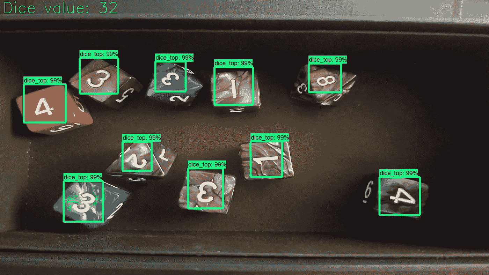

New object detection model has a single class “dice_top” the boxes get passed to a backend ResNet model for classification.

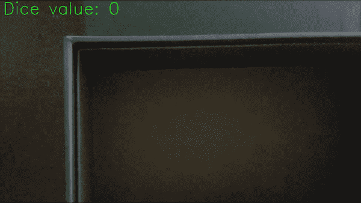

gif of the same video from the previous blog rerun here. Two stage pipeline also gets a value of 20

> Y 你可以在这里 找到 github [**上的代码。脚本需要用作 tensorflow 对象检测库的一部分，我在不同的点修改了检测脚本以进行数据准备。这些是我用来给图片和视频做最后标记的，就像在帖子里看到的那样。**](https://github.com/sugi-chan/2-stage-dice-pipeline)

# 训练新的物体检测器

对于这个项目，我使用了我在以前的博客中使用的相同的数据集。对于对象检测模型，我只使用了 200 张图像，其中我调整了所有的边界框，使其标签为“dice_top ”,而不是数字 1-12。我是通过用 Labelimg 快速浏览 XML 并手动调整标签来做到这一点的。最初，我试图在从 XML 生成的 csv 中自动调整标签，但是在训练时遇到了奇怪的模型行为，所以我恢复了手动方法。

对于单个类，模型只需要运行一个小时左右，我就可以在一个很好的阈值停止它，而不是以前的模型需要 6 个小时左右。

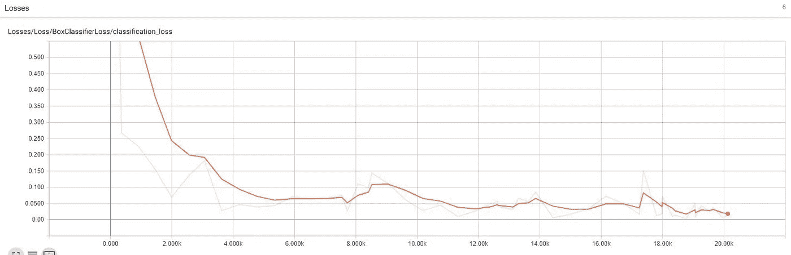

在这个阶段，我能够评估新的对象检测模型与其前身相比表现如何。很快出现的情况是，它正在检测第一个模型漏掉的骰子。下面左边的图像是第一个模型的输出，而右边的图像是由新的单类检测器处理的同一图像。左边的 6 在新型号中被检测到，但在第一个型号中被忽略。

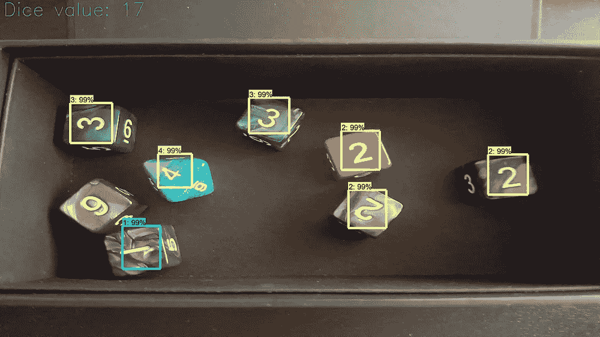

以下图片对中的类似故事。靠近顶部的 d8 未被第一个模型检测到，但被第二个模型检测到。

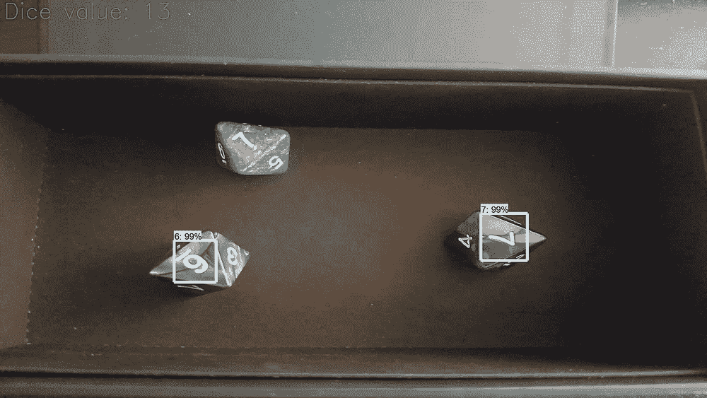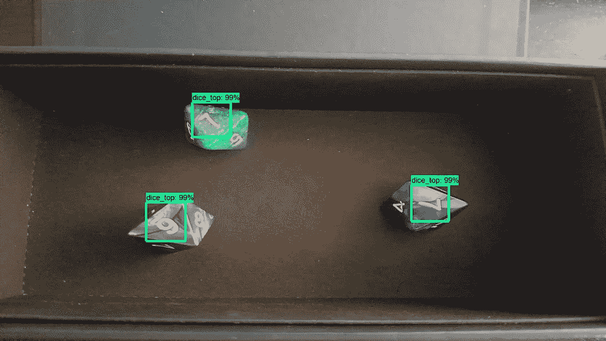

此外，两种模型都显示了 10 面骰子的弱点。在这种情况下，两个模型在检测角落中的蓝色 10 面骰子方面表现不佳，并且在这种情况下，第一个模型更彻底地失败了。

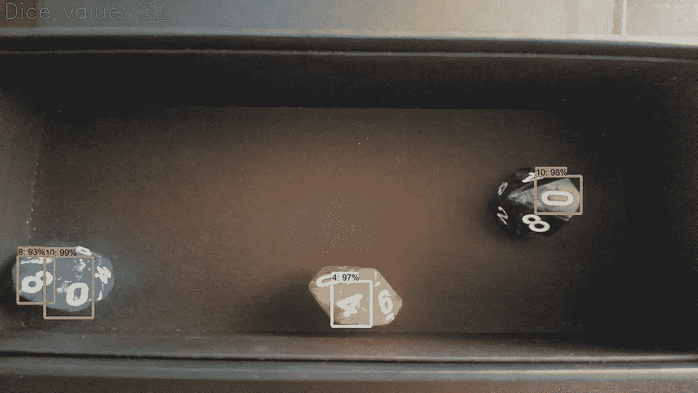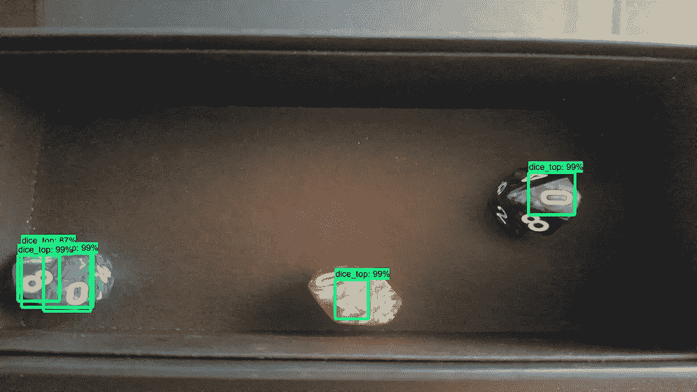

因此，虽然第一个模型在未能识别蓝色 10 面骰子的顶部方面做得更好，但我认为值得注意的是，新的单类检测器在一半的数据上进行训练，但在检测骰子方面比其前身做得更好。

既然新的骰子检测器已经就位，我就可以开始构建价值分类的第二阶段模型了。

# 为后端模型准备数据

更有趣的数据准备工作是为后端 CNN 获取数据。我知道我需要训练一个模型来识别骰子表面的数字，而不管它们的方向如何，所以我认为以随机垂直和水平翻转以及随机旋转的形式增加大量数据的 CNN 会有所帮助。我决定使用 Pytorch 后端模型，因为它提供了一个很好的简单管道来训练和部署它的模型(我也运行了太多的 Keras 模型，喜欢这种变化)。使用 Pytorch 的另一个原因是我喜欢使用 Pytorch，并且在我的其他博客中有关于这类问题的很好的代码基础。

因此，要将骰子顶端的图像放入我想要的文件夹结构中，我有几个选项。

1.  手工裁剪每一类的几百张图片:显然很慢，而且不是最佳的。对我来说太多体力劳动了。
2.  使用新的骰子顶端模型裁剪出所有的骰子顶端，然后将它们分类到文件夹中。这也需要做一些整理工作。在这一点上，我想你们都知道我要说什么。
3.  使用我之前训练的 12 个类别对象检测器，根据预测的类别将图像分类到 12 个文件夹中，然后查看数据集以找到错误分类。

我选择了第三种方法，因为它对我来说需要较少的机械工作，而且我发现这是解决过去其他问题的一个聪明的方法。

为此，我所要做的就是修改我用来将边界框输出到图像上的脚本，以提供框坐标，这样我就可以对图像数组进行切片，只裁剪出图像中的骰子顶部。然后使用从边界框中预测的类别，我将图像分类到不同的文件夹中。这让我可以在几分钟内生成 2500 张左右的裁剪图像，而不是手工裁剪 2500 张图像所需要的时间…

接下来是打扫卫生。下面是 6s 文件夹的截图，其中有一些 9 隐藏在组合中。对于这些骰子，9 和 6 通常在底部附近标有线或点，对于没有标记的骰子，这意味着它是 6。

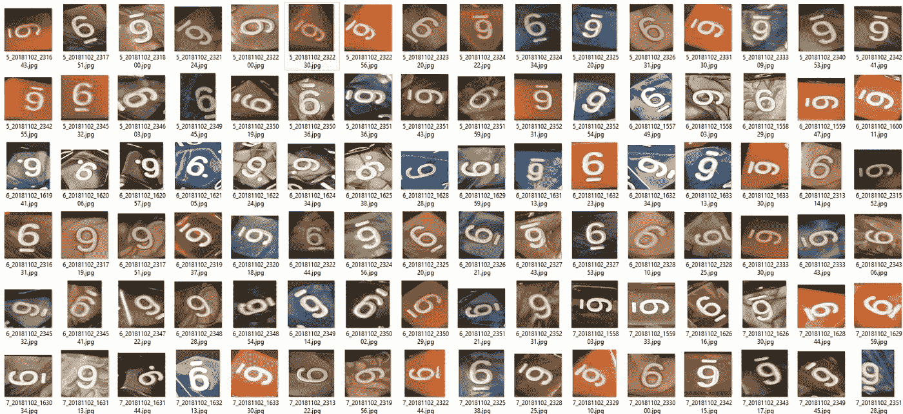

另一个有趣的类别是观察 1s 和 7s。

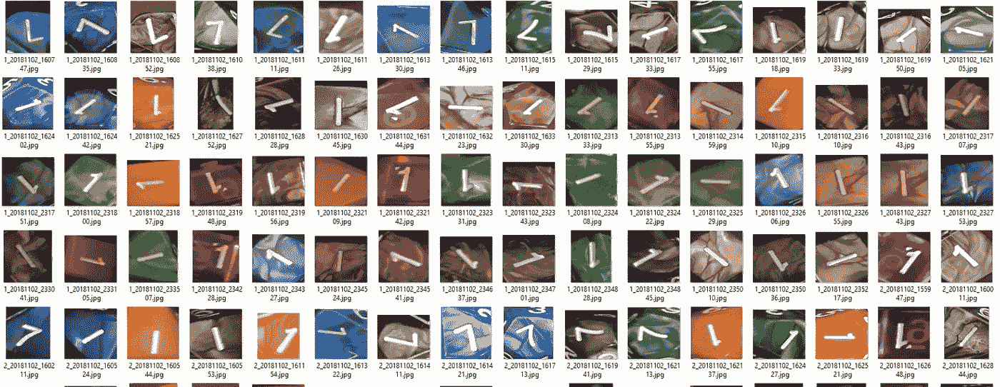

这也让我对我的 12 类对象检测模型产生的分类错误有了一个很好的感觉。根据不同的角度，你会看到 5s 被标记为 2s 或 6s，11s 或 12s 被标记为 10s、2s 或 1s，因为该型号很少接触这些数字。

一旦数据集被分类到 12 个文件夹中，我就准备扔几个 CNN 进去看看有什么效果。

# 训练 Pytorch CNN

有了数据集并按类分解到文件夹中，使用标准数据集和数据加载器函数来利用 pytorch CNN 管道就非常简单了。这里需要注意的一点是，我制作了一个包含 120 张图片的验证集(每个类 10 张)。我做了一个平衡的验证集，尽管值 1-6 有很大的不平衡，因为它们出现在所有的骰子上，而值 11 和 12 只出现在 d12s 上，所以它们出现得最少。

我发现，使用预先训练的 ResNet 模型效果相当好，我只是允许在几个时期内对权重进行微调。大约 15 个时期后，我用 ResNet 50 获得了 95%的验证集准确度，并发现将其增加到 ResNet 101 会将其准确度增加到 97%。我最终坚持使用 ResNet 101，因为目前模型的占地面积不是我的一个大问题。

# 把它们放在一起

现在我有了这两部分，我所要做的就是把它们放在一个管道中。第一阶段模型将检测骰子面并将这些骰子面馈送给第二模型用于分类。然后，基于后端模型的分类，我能够在屏幕上添加骰子值并显示它们。

这相对简单，需要初始化 Pytorch 模型，并添加额外的函数来预处理图像，将结果映射到它们的标签，并将结果相加。唯一恼人的部分是，我目前没有多 gpu 机器可用，当其中一些模型基于 Tensorflow 时，与多个模型一起工作会变得很烦人。

对于其他项目，我在同一个 GPU 上使用了多个基于 Pytorch 的大型模型，就像我的 [Fate Grand Order 机器人](/project-pendragon-an-ai-bot-for-fate-grand-order-23f51b6e3268)一样。然而，我发现 Tensorflow 倾向于将所有可用的 GPU 资源分配给自己。因此，为了运行多个模型，我基本上是在任意给定的点上处理哪个是活动的，但是对于这个用例，我只是分配 Pytorch CNN 在我的 CPU 上运行。这减慢了评估的速度，但暂时是一个快速的解决方法。下一个技术购买可能是建立一个 GPU 集群，使这样的事情不那么烦人。

It gets the correct 20, but It shows some fluttering to thinking the 6 is a 9 which is a problem I found with the backend classifier that I will discuss more below.

# 比较这两种方法

当考虑这两种方法时，我认为主要的权衡是速度和准确性之间的权衡。

我可以在单个 GPU 上运行的第一种单一模型方法的评估速度比我的 GPU + CPU 方法快得多。然而，在两个 GPU 上运行第二个管道可能会最小化这种差异。

现在有趣的是，看看两者之间的表现。为此，我从训练集和验证集中拿出了 25 个例子，我想你可以称之为测试集，并对它们运行两个模型。为此，我只是看他们是否得到了正确的骰子总值，如果没有，我会记录他们犯的错误类型。

**第一个模型得到了 25 个完全正确中的 8 个(32%)** ，而**两级管道得到了 25 个完全正确中的 16 个(64%)** 。所以我写这篇博客的总体假设似乎是正确的，尽管两者都还有改进的空间。

第一个模型产生的错误通常是没有检测到某些骰子，或者是我上面提到的对某些数字的错误分类。常见的有 6s vs 9s，1s vs 7s，以及若干个 8s vs 3s vs 6s。下图中有 3 个骰子未被检测到，3 被归类为 6。

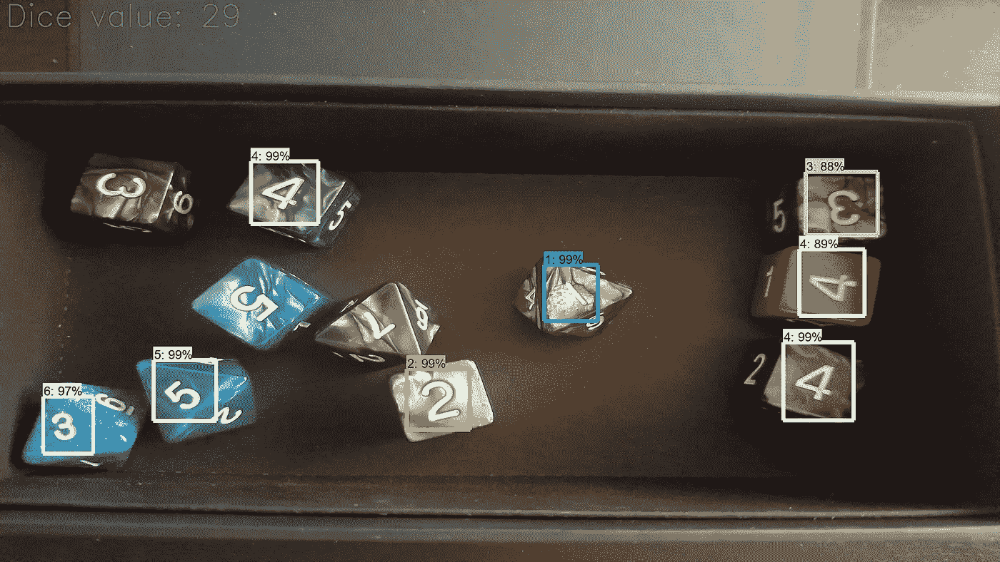

Image from the first single object detection model

两阶段流水线通过识别丢失的 3 个骰子并正确地对值为 41 的所有骰子面进行分类而胜过第一模型。

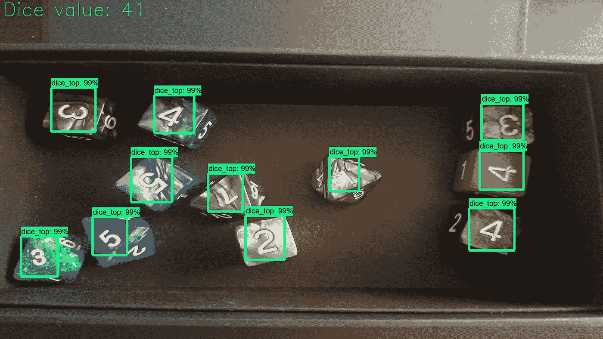

然而，第二个模型仍然有问题，在我看到的 25 个案例中，它的问题是没有正确检测 10 面骰子上的面孔(这两个模型都做得很差)，然后将 6 误分类为 9。要解决这个问题，我必须检查以确保我在数据集的 6 和 9 文件夹中没有任何问题，然后如果这不能解决问题，那么用更多的 9 和 6 的图像增加数据。在这两种机制之间，我认为这将有助于解决许多问题。对于错误识别 10 面骰子上的面，我认为为该特定骰子添加更多数据将是有用的。

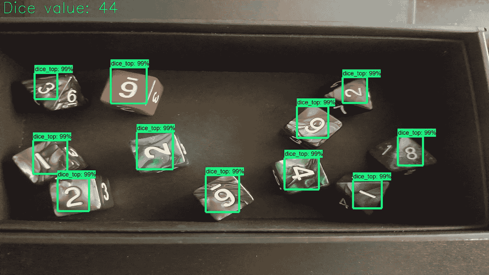

True value should be 41, but is off by 3\. I think it comes down to the 6 sided die that does not have a marking on it. The fact that this is an issue makes me think I have some of those dice examples in both the 6 and 9 folders which poisons the training data.

# 最后的想法

因此，在这篇文章中，我展示了我将如何建立两个阶段的管道，我以前在我的第一篇骰子计数文章中提到过。此外，我很高兴地报告说，两阶段管道确实优于我的第一个模型，在检测骰子面和分类方面做得更好。对我来说，这是另一个构建良好的专门化模型执行通用方法的例子。为了更直观地了解这种方法的工作原理，我想到了我的武术背景。这可以用李小龙的一句话来概括。

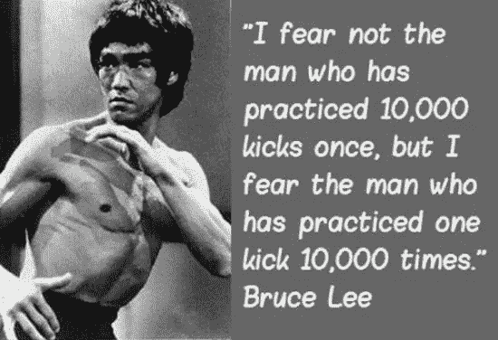

> 我的个人版本是当我的第一位剑术大师告诉我，我应该“**练习一种技术 1000 次才能理解它，10000 次才能掌握它**”。

神经网络是相似的，因为它们通常采用成千上万的例子，以便收敛到一个好的解决方案，并学习识别特定的类别。因此，精简他们必须优化的东西可以让他们更好地优化特定的问题，并了解其来龙去脉。从技术角度来说，对于我的 12 类检测器，它可能只看到一个特定的骰子/骰子面几十次，并且必须学会基于这几个例子来定位和分类它。然而，单一类别检测器看到它的单一类别 2500 次。然后，第二阶段模型可能只看到每个类几十到几百次，但是它显著地增加了数据，从而极大地增加了它所拥有的有效训练数据的量。这使得它在分类时比基本的对象检测模型获得更多的经验。

这种额外的专门化增加了训练更多模型并在流水线中实现它们的复杂性。在这种情况下，两级流水线需要 2 个 GPU 来平稳运行，而不是单个模型只需要 1 个 GPU。从技术上来说，我可以试着不使用 tensor flow……因为在使用 Pytorch 之前，我已经一次运行了 3-4 个大型 ResNets。这种速度与精度权衡的价值在于，对于一个特定的任务，你需要什么样的精度与速度。

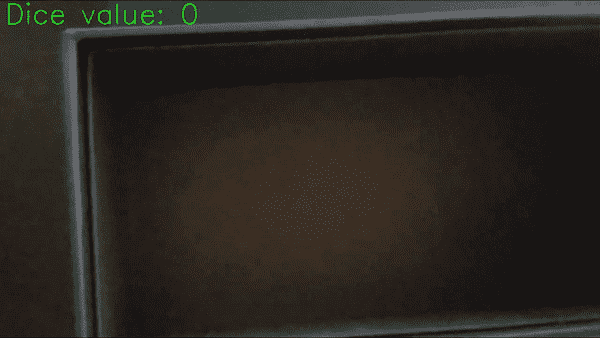

I had an extra gif, so here is some more dice rolling!

> Y 你可以在 github [这里](https://github.com/sugi-chan/2-stage-dice-pipeline)找到代码