# 教育人类和机器的统一工具

> 原文：<https://towardsdatascience.com/a-unified-tool-for-the-education-of-humans-and-machines-63bd7d271e6f?source=collection_archive---------4----------------------->

这篇文章是关于让机器学习工具更容易使用。

但是，这并不是为了让外行观众看不懂，也不是为了给玩具问题创造玩具界面。

尽管人类和机器学习者之间存在许多差异，但每个人在机器学习的最关键方面都有丰富的经验——我们知道从经验中学习意味着什么。

事实上，我们如此沉浸在这个过程中，以至于在教别人的过程中，最大的挑战是记住我们自己是如何开始学习一些东西的。

这种元认知能力是一种珍贵且来之不易的技能，与教育工作者的工作尤其相关，但也是每个人日常与他人互动的关键组成部分。

[http://bit.ly/2FK4uHR](http://bit.ly/2FK4uHR)

当我们教我们的孩子骑自行车时，我们并不背诵精确的程序。我们演示，当他们接近动作时我们观察，然后我们将孩子的注意力引向任务中被忽略的方面。

机器学习工具应该帮助我们准确地为机器做这些事情，这样它们就可以反过来帮助我们执行太复杂而无法用传统代码表达的任务。

帮助我们提高这些元认知能力的工具不仅能帮助我们建造更有用的机器，还能帮助我们更好地了解自己，更有效地与世界打交道。

因此，当我说“可访问”时，我的意思是机器学习工具应该能够作为每个人通过经验学习和教学的先天能力的延伸。

机器学习是每个人的工具。

然而，就目前的形式而言，这一点显然并不明显。

目前，机器学习的探索需要编程技能、机器学习技术和基础数学的工作知识，甚至一些 DevOps 技能。综合来看，这些要求构成了很高的准入门槛。

第一代机器学习工具专注于帮助专业从业者在高粒度级别管理高性能管道。这些工具已经将机器学习的概念需求抽象到传统的编程结构中，尽管传统代码的演绎思维和机器学习系统的归纳思维之间存在固有的不一致。

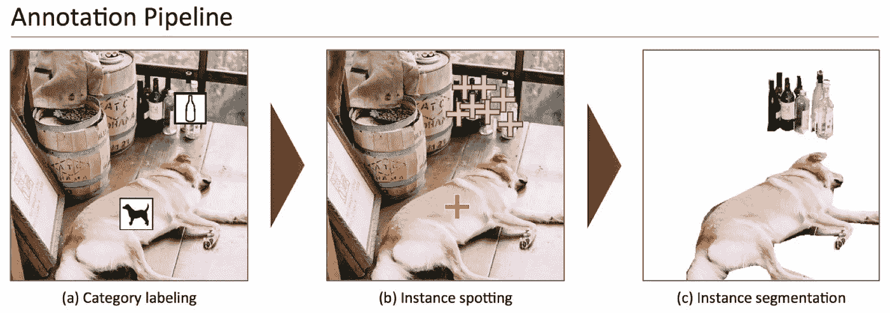

[http://bit.ly/2B0utc5](http://bit.ly/2B0utc5)

这些工具没有强调课程设计的技巧，也没有强调通过提炼和提出最有意义的元素来管理学习者对复杂概念的体验的过程。

在我的教学工作中，我发现学生的编程和数学背景往往不是他们如何利用机器学习进行应用创造性工作的最佳预测因素。在许多情况下，最吸引人的项目来自最清晰的作者和最细心的设计师。

这是因为让机器学习项目成功的很多因素都与学生对学习问题的表达有关——如何通过特定的数据呈现来展示特定的概念。

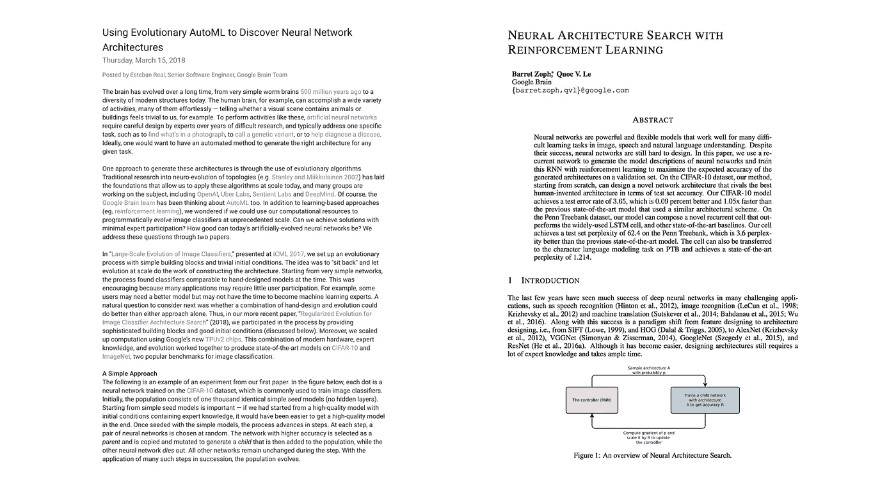

[http://bit.ly/2FSx72D](http://bit.ly/2FSx72D) and [http://bit.ly/2jDpcya](http://bit.ly/2jDpcya)

随着用于自动化架构和超参数搜索的机器学习算法和机制变得更加健壮，当前机器学习工作所必需的一些技能将变得不那么重要，而清楚地阐明学习问题的技能将变得更加重要。

理想情况下，下一代机器学习工具不仅可以帮助新手熟悉这些解决问题的机制。它还将帮助专家通过专门围绕机器学习思维设计的工具更有效地探索机器学习概念。

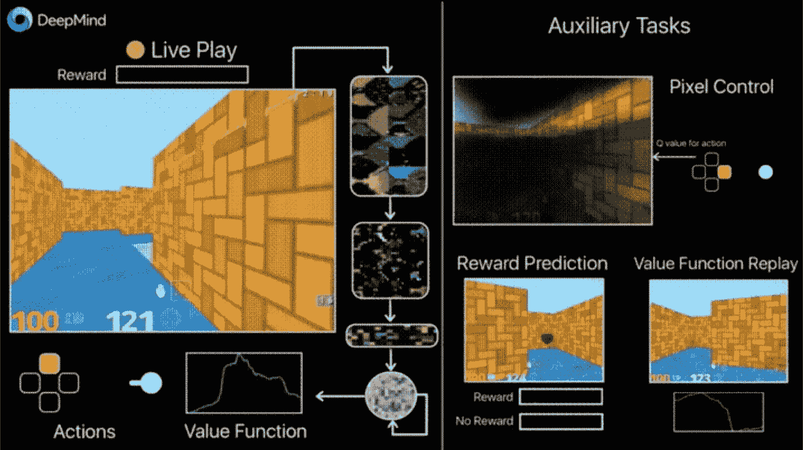

[http://bit.ly/2g9Yv2A](http://bit.ly/2g9Yv2A)

传统上，编程语言被视为不同于交互式开发环境(ide)和在编写软件过程中起作用的其他工具。

这些描绘已经是计算中前图形时代的过时痕迹。

但是，在机器学习时代，它们将很快成为软件开发人员工作的严重障碍。

在 DeepMind、OpenAI、微软和其他公司为训练强化学习系统建立模拟环境的努力中，已经可以看到对更全面的编程环境的需求。

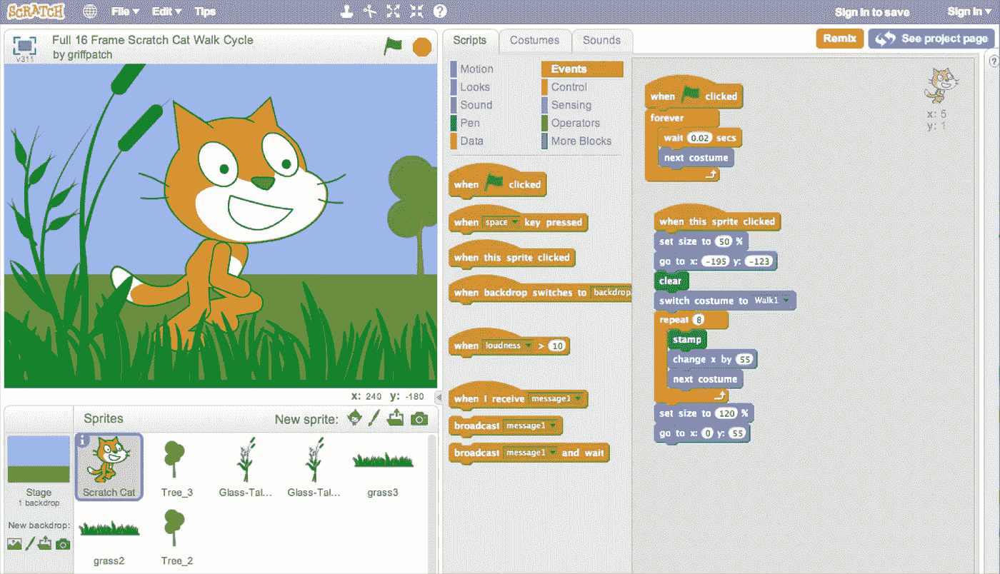

[http://bit.ly/2Ip32t8](http://bit.ly/2Ip32t8)

Jupyter notebooks、Matlab、Mathematica、Swift、Processing、Scratch 和 web 开发工具通过将编程从纯文本编辑器的局限转移到寻求适应软件开发的交互式和多媒体方面的更具凝聚力的环境中，帮助模糊了这些区别。

然而，还有很长的路要走。

明确地说，这不仅仅是让编程界面更容易被人类用户接受的问题，尽管这本身就是一个有价值的目标。

更广泛的必要性来自于这样一个事实，即机器学习正在迫使计算机程序走出黑暗的地下室，进入视觉、听觉和物理世界。

更深层次的通信机制不应该被附加到现有的接口上，也不应该被归入辅助库。它们必须被带到我们工具的中心。

更进一步，我们应该把机器学习带来的范式转变作为一个机会，重新思考软件开发过程的许多方面。

## 箔纸

我想给你们看一个我正在做的项目，作为如何将这些原则引入下一代机器学习工具的例子。

下面提到的一些元素已经实现，其他元素在路线图中。但是，出于本文的目的，我想讨论整个愿景。

Foil 是一个组合的机器学习和创造性编码平台、工具包和 IDE。

它试图在一个平台上关闭编程、机器学习和设计工具之间的环路，提供从新手到专家的无缝路径。

Foil 设想了一种多层次的方法，在这种方法中，专家可以直接使用较低级别的功能，但也可以将它们组合在一起，为经验较少的用户形成较高级别的功能。

随着用户获得专业知识，他们可以检查包含这些高级功能的组件，并开始使用低级组件，以及创建和共享他们自己的高级组合。

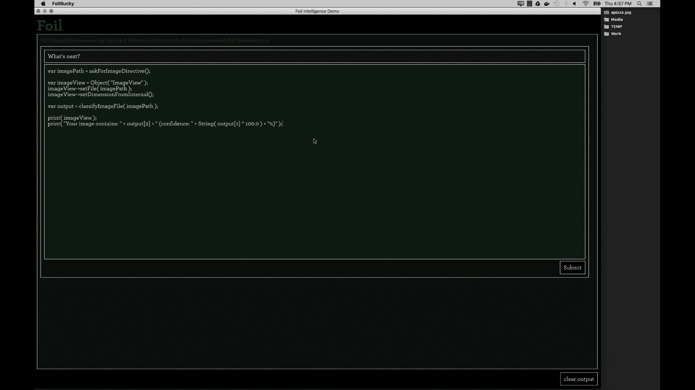

Foil 的专家模式大致相当于 Jupyter 笔记本等一些现有的机器学习开发环境，但努力在机器学习功能和一系列 GUI、scenegraph 和数据可视化功能之间提供更无缝的集成。

从工具制作的角度来看，这种模式是 Foil 自己的基于文本的编程语言提供的最细粒度功能与 Foil 在幕后利用的本机机器学习和创造性编码工具包之间的桥梁。它还创建了构建高级“中级”和“初级”模式工具的基础。

接下来，我想讨论如何通过构建机器学习模型和数据争论的构建块来实施这种多层方法。我还将介绍一个我称之为指令的概念，一种项目开发的对话式方法。最后，我将讨论这些组件如何与一组创造性的编码工具相关联。

## 机器学习构建模块

也许进入机器学习工作最令人生畏的事情是获得对某些数学运算在机械化归纳学习过程中所起作用的直觉的过程。

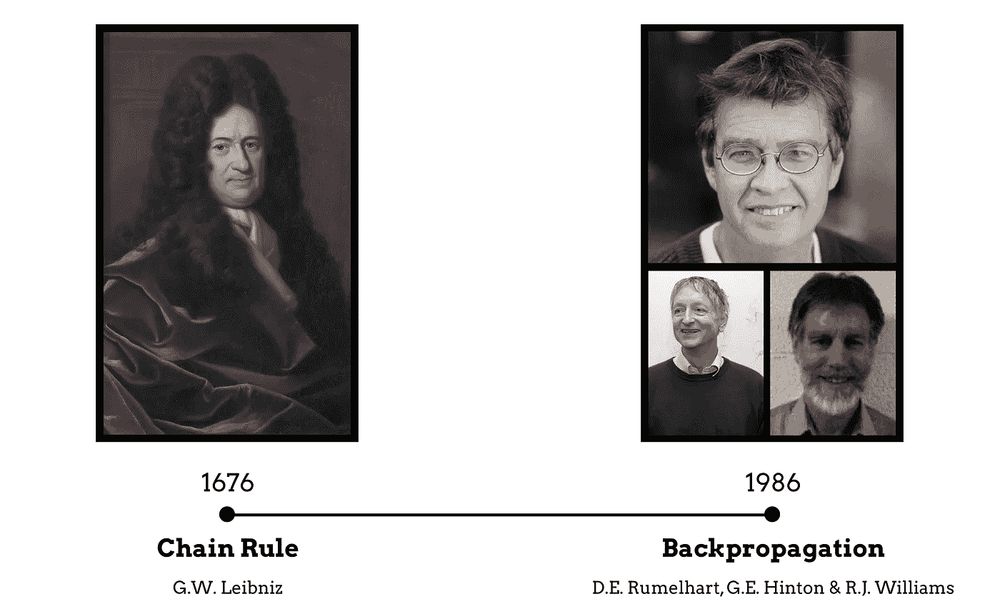

但是，我敢说，挑战不仅存在于数学门外汉。支持这种说法的一个证据是，从莱布尼茨第一次提到微积分中的链式法则到反向传播算法的出现，相隔了三百年。

也就是说，即使理解了底层的力学和数学工具，当应用于太复杂而不能心算的系统时，这些工具的特定应用并不总是显而易见地会产生有用的能力。

为了克服这一挑战，我们必须降低实验的门槛。

当然，没有引导的实验不太可能从零开始，研究出像现代神经架构这样复杂的结构。

相反，实验者可以从已知的机制出发，通过尝试将这些一般形式与最初激励实验者探索这一领域的项目想法联系起来，从而获得最大的成果。

当实验者试图学习的例子被专业实践者以模糊的方式编码时，这个过程就变得非常困难。

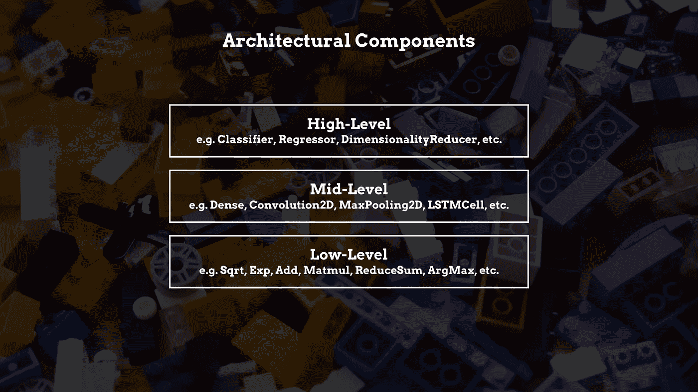

出于这个原因，我认为在呈现用于构建机器学习系统的架构组件时采用多层方法是很重要的。

为了帮助新手，该工具应该提供一组非常高级的构建模块，解决学习问题的基本类别。

在他或她的实验的早期阶段，用户不太可能需要更专门的构件。

因此，一个高级界面提供了对一系列可轻松定制的模板以及底层自动化的轻松访问，这将有助于用户理解该领域的问题解决方案，而不会妨碍他或她的早期探索。

该界面应提供构建模块及其组件属性的图形表示，以便在不需要外部参考资料的情况下促进实验，并使用户能够检查他们构建的系统的底层架构。

随着用户对机器学习的直觉和知识的增长，他们构思更新颖的架构和机制来处理现实世界问题的能力也将增长。

他们不应该被迫升级到一个完全不同的、更专业的工具。相反，该工具应该能够逐渐公开更高级的功能，并允许用户参与更细粒度的决策。

最终，高级用户会发现通过纯文本命令与工具交互是最方便的。在这里，用户也不应该被迫升级到一个完全不同的开发环境。

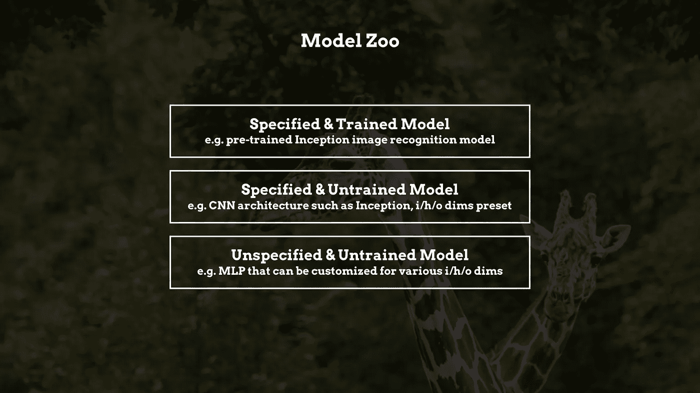

作为这些构件的扩展，该工具应该提供一个广泛的模型动物园和基础设施，使用户能够轻松地共享他们的模型。

Foil 设想了模型动物园中的三种模型。

指定和训练的模型可以从货架上取下，直接用于执行特定的机器学习任务，如图像识别。这些模型还应该附带简化迁移学习过程的挂钩。

其他模型将提供预先指定的架构，但未经培训，以便用户可以轻松地将它们与自己的数据集相结合。

最后，一组未指定和未训练的模型将提供一组通用的机器学习架构，可以在对他们的自定义数据集进行训练之前，根据用户自己的需求进行定制。

为了促进这一过程，该工具应该为本地或云中的培训模型提供无缝的工作流，而不需要丰富的 DevOps 知识。

## 数据操作构建模块

鉴于数据在构建机器学习系统中的首要地位，开发工具应该提供一组健壮的构建块，以促进数据的加载和操作。

虽然数组操作是计算机科学家执行的最常见的任务之一，但它往往是新手程序员最大的挫折之一。

即使对于经验丰富的开发人员来说，理解用于对复杂数据进行切片的特定代码也是耗时且乏味的。

取决于用户想要从数据中学习什么，或者她想要通过数据执行什么任务，如何分割数据和使用什么神经架构的问题是相互关联的考虑因素。

因此，数据操作组件与工具的架构构建块紧密结合是非常重要的。

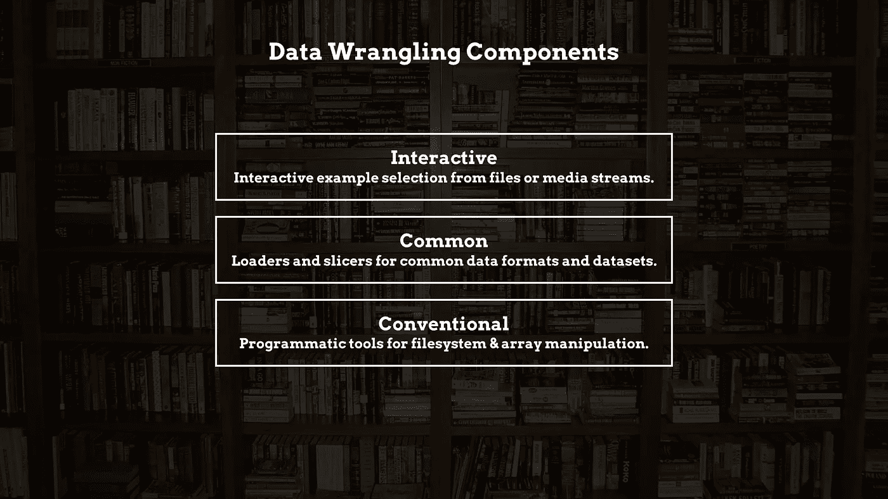

在最高级别，该工具应该提供从一组文件或媒体流中选择示例的交互机制。

它应该为构建块提供图形界面，直观地展示传入数据将如何切片。

在稍低的层次上，该工具应该为一系列媒体格式以及常见的开源数据集提供数据加载器和常见的切片器类型。

在最低级别，该工具还应该为有经验的开发人员提供传统的机制，以编程方式访问文件系统和操作数值数组。

与架构组件非常相似，该工具应该为与其他用户共享定制数据集、切片器和加载器提供基础设施。

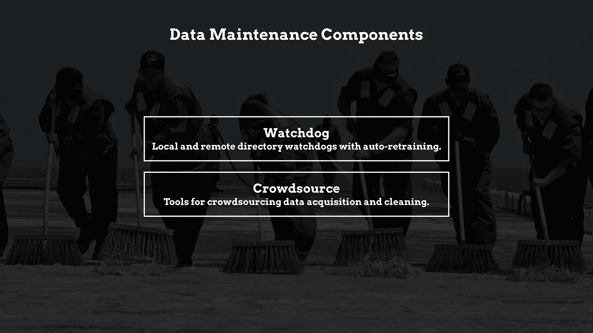

为了支持数据集维护，该工具应该提供一组可定制的监视器，自动检查文件目录或远程存储库的更新，并在更新发生时执行模型的自动重新训练。

最后，该工具应该在开发环境中提供流线型的机制，用于请求众包数据获取和清理。

## 指令

在传统的编程环境中，开发人员从几乎空白的状态开始，并且必须构想一组相互关联的抽象，以解决期望的编程行为的各种组件。

这种媒介的开放性是一件奇妙的事情。但是它要求开发人员自己决定每个组件之间的关系以及整体关系。

指令提供了一种机制，可以帮助开发人员在不强加任何特定抽象的情况下构建他们的思维。

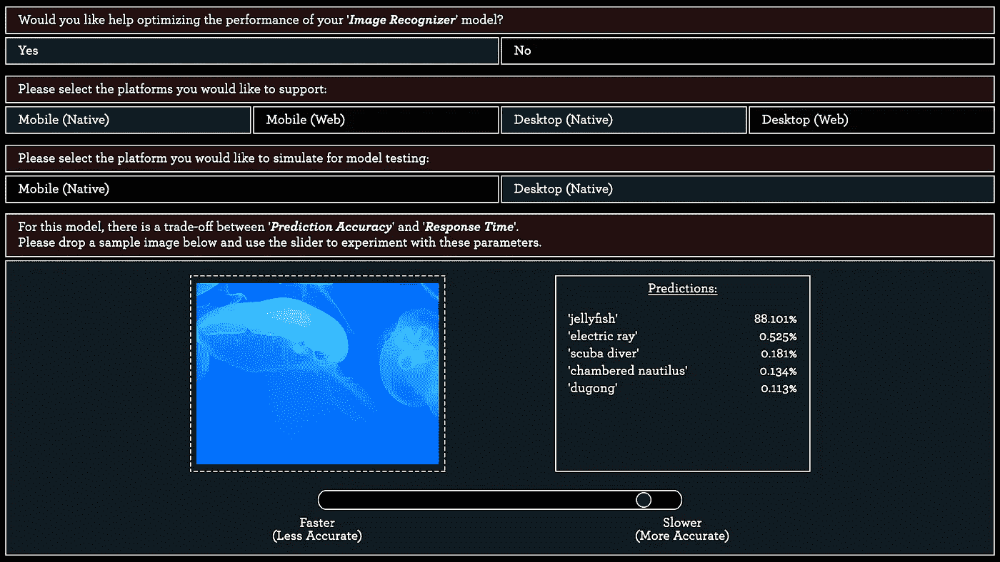

从最基本的意义上来说，指令由一组小部件组成，这些小部件用于请求多媒体输入并向用户呈现多媒体输出。

指令的作者使用这些小部件组成一种决策树或引导过程，通过该过程，用户可以以最适合手头任务的方式对每个决策点做出响应。视觉信息可以视觉传达，文本信息可以文本传达。

当用户需要特定的数值时，可以呈现滑块，使得用户可以在特定的范围内进行实验，并看到其效果立即应用于上下文中。

Directives Zoo 不是提供一个预先确定的心智模型，而是为开发人员提供一系列针对各种组件问题的可能抽象。

或者，开发人员可以编写自己的指令。这个创建多模态决策树的过程推动用户通过一组决策点清晰地、有目的地进行思考。一旦定义了这些决策点，解决方案就在路上了，就像制定一个问题通常是回答它的一半工作。

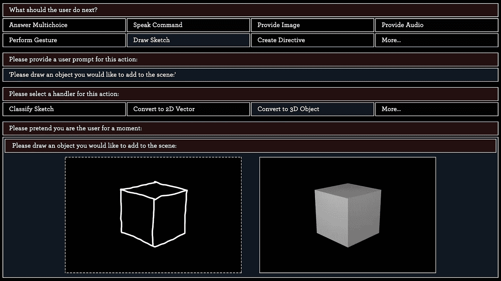

作为一种众包设计模式，指令可以用来促进软件开发过程。但是它们也可以在面向用户的应用程序中使用，以便于与经过训练的机器学习模型或应用程序的其他功能进行交互。

从这个意义上说，指令模糊了编写和使用软件行为之间的区别。在编写软件的上下文中，它们通过将过程分解成更小的任务，帮助开发人员创建更易于管理的对话式体验。在面向用户的上下文中，它们为我们将与智能应用程序进行的多模态交互提供了一种更自然的格式。

指令可以显式地写成代码，也可以使用提出诸如“用户下一步应该做什么？”之类问题的指令生成指令来创建多么 meta！

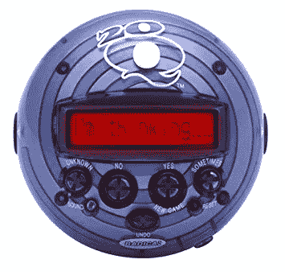

还可以配置一个指令来提供用户响应的底层数据收集，以便输入学习决策树，非常类似于游戏 20 问题的数字版本。

这个特性为开源软件的共享带来了新的价值。如果一个开发人员选择共享一个指令，那么每当其他人使用它时，她的软件就会得到改进。

## 创造性编码

机器学习最大的好处之一是，它使我们能够超越键盘和鼠标的限制，通过机器越来越强的理解图像、音频流、视频等内容的能力，以越来越自然和直观的方式与机器交流。

这些媒体形式对于机器学习模型的训练以及我们随后与训练好的模型的交互都至关重要。

然而，当代编程工具提供的帮助很少。

组织大型多媒体数据集的艰巨任务留给了外部工具——需要开发人员通过操作系统、传统设计工具和特定代码来导航这一过程。

开发人员通常还必须拼凑大量第三方库，以便可视化培训指标，并生成用户界面和应用程序前端体验的其他方面。

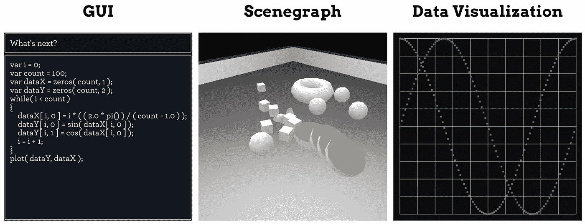

为了提供集成的开发和部署工作流，并促进现代机器学习增强应用程序的生产，该工具必须直接在 development studio 中提供完整的创造性编码框架，包括 GUI、scenegraph 和数据可视化组件。

这些创造性的编码工具旨在以三种不同的方式帮助开发人员。

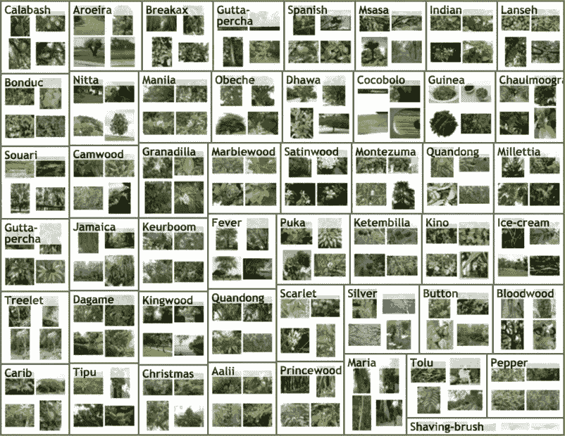

[http://bit.ly/2FPKNhV](http://bit.ly/2FPKNhV)

首先，通过提供用于操作和组织多媒体资产的图形界面、指令和编程挂钩，Foil 作为一种灵活的设计工具，用于在用于开发机器学习模型本身的相同环境中创建培训课程。

这一功能构成了 Foil 在促进“多媒体数据作为输入”方面的作用

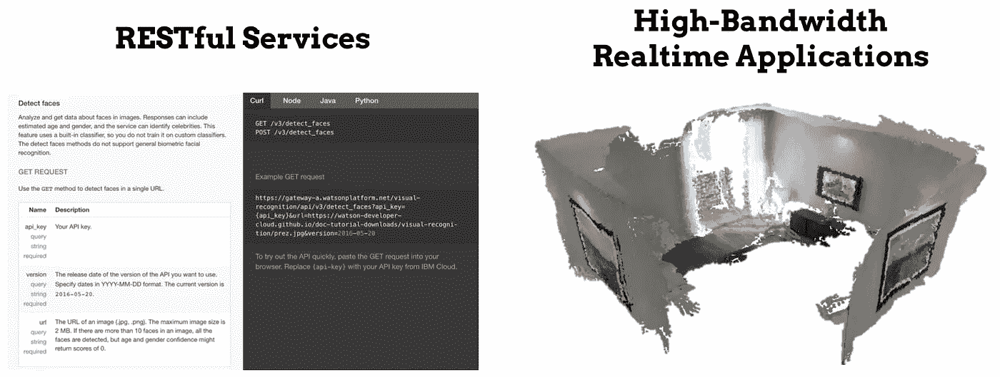

[http://bitly.com/2FIeFcG](http://bitly.com/2FIeFcG) and [http://bit.ly/2Isf1pJ](http://bit.ly/2Isf1pJ)

同样重要的是给予箔的作用，创造“多媒体输出”

创造性的编码框架使开发人员能够创建广泛的交互式、面向用户的应用程序，这些应用程序利用自定义或开源机器学习模型的智能行为。

对于一些机器学习应用程序来说，RESTful 服务和消息协议在独立系统之间搭建桥梁已经足够好了。

但是对于越来越多的高带宽应用，这种方法会产生技术瓶颈，阻碍创造性的探索。

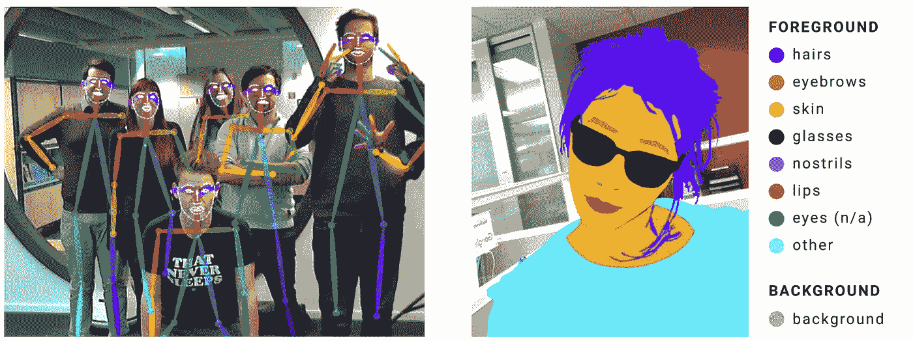

[http://bit.ly/2pevHbr](http://bit.ly/2pevHbr) and [http://bit.ly/2FCYHAx](http://bit.ly/2FCYHAx)

通过将一整套机器学习和前端开发工具集成到一个环境中，个人开发人员可以将目光投向广泛的高性能、支持机器学习的项目。

例如，姿势估计模型可用于提供对用户创建的游戏中的角色的类似 Kinect 的骨架控制，或者图像分割模型可用于用户创建的图像编辑工具中。

Photoshop and [http://bit.ly/2paTN7O](http://bit.ly/2paTN7O)

最后，为了完成循环，开发人员可以通过建立 scenegraph 侦听器和其他在运行时捕获用户或实体行为的实时观察器，使用多媒体输出来生成新的输入训练数据。

例如，可以从用户行为历史中挖掘常见的使用模式，以便软件可以建议可能的后续步骤。

在包括 3D 物理模拟的应用中，场景图节点的行为可以用作强化学习模型或机器人项目的训练数据。

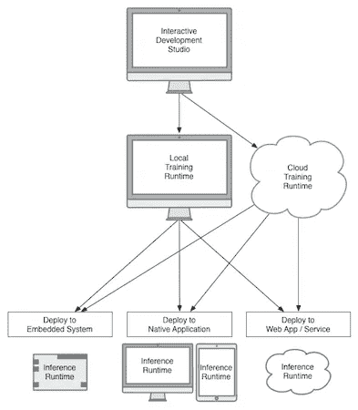

在箔环境中构建的应用程序应该可以轻松部署到桌面和移动系统、基于 web 或云的服务以及嵌入式物联网设备。

## 结论

当工具达到一定的成熟水平，使各种类型的用户能够开始通过计算机解决自己的需求时，最初的个人计算革命就开始了。

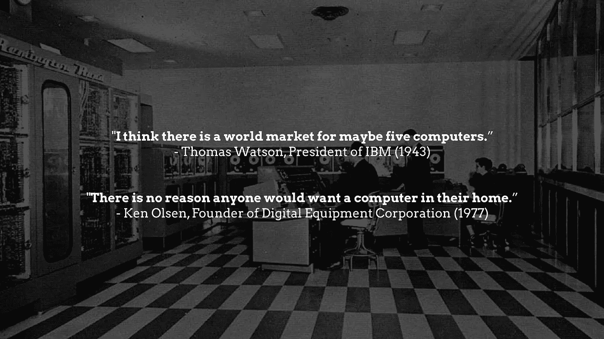

[http://bit.ly/2Iz6Gkl](http://bit.ly/2Iz6Gkl)

基于这个原因，我认为得出机器学习革命还没有真正开始的结论是合理的。

机器学习的真正前景在于工具，这些工具将使经验丰富的软件开发人员、小企业主和普通消费者能够看到机器学习可以帮助他们满足特定需求并帮助他们自己开发解决方案的方式。

就像之前的个人和移动电脑市场一样，这个市场将会非常巨大。

然而，这个市场还不存在，因为这些工具还没有进化到不言而喻的程度。

在不太遥远的未来，机器学习将帮助我们解决无数的问题，这些问题对于我们自己的生活来说太具体了，无法通过预先构建的服务的现成功能来解决。

它将帮助我们建立一个我们还无法想象的世界。

但是我们可以从想象这样的工具会是什么样子开始，以及我们如何使它们既有表现力又易于使用。

没有一种机制，没有一种方法或界面对每个用户或每个用例都是完美的。

也许唯一通用的解决方案是提供灵活性。在机器学习的时代，工具制造者的角色是一个翻译角色。该工具必须与人类和学习机器的经验性质相一致。

提供一些起点。鼓励实验。帮助人们构建他们的思维，让他们探索和遇到一些复杂的因素。当他们这样做时，提供一系列可能的解决方案。但最重要的是，要为他们提供基础设施，让他们能够开发自己的解决方案，并与他人分享。

让用户能够适应工具并被工具所适应——与工具一起成长。

如果你喜欢这篇文章，你可能也会喜欢我之前的相关文章，“在机器学习时代重新思考设计工具”

这篇文章基于我最近在 [Google PAIR UX 研讨会](https://sites.google.com/view/pair-ux-symposium-march-2018/)上的一次演讲。

如果你想关注我在机器学习、人工智能、设计工具和编程语言方面的工作，请在 Medium @ [Patrick 希伯伦](https://medium.com/u/1ef720d5fe5d?source=post_page-----63bd7d271e6f--------------------------------)或 Twitter @[Patrick 希伯伦](http://twitter.com/PatrickHebron)上关注我。我的[主页](https://www.patrickhebron.com)还包括其他几种联系方式。