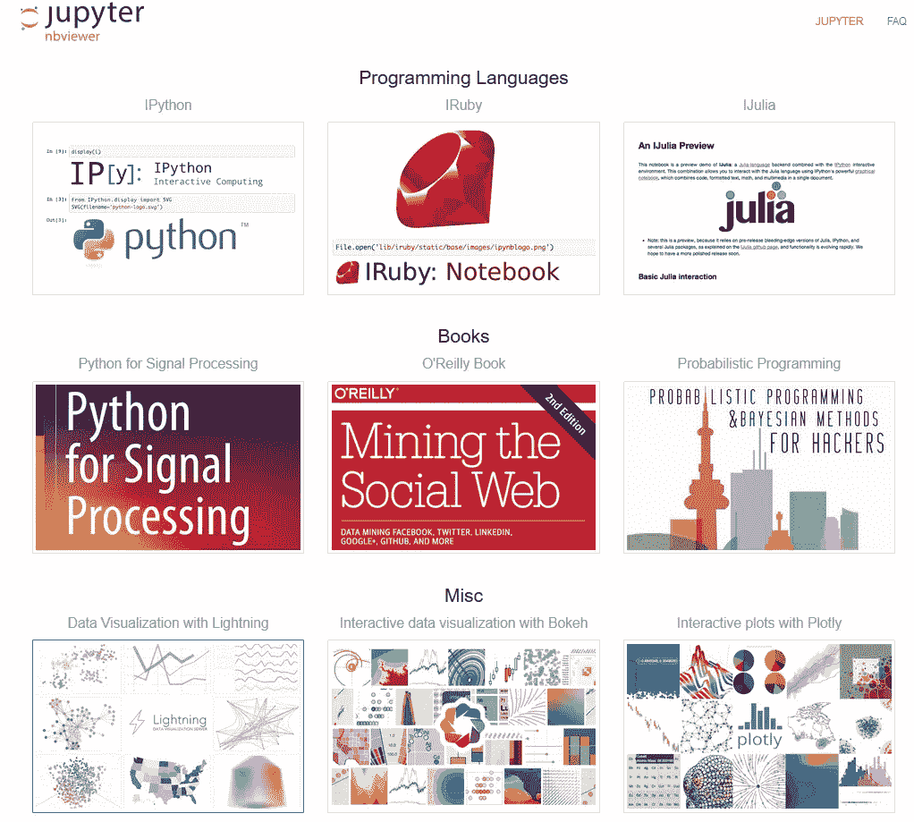
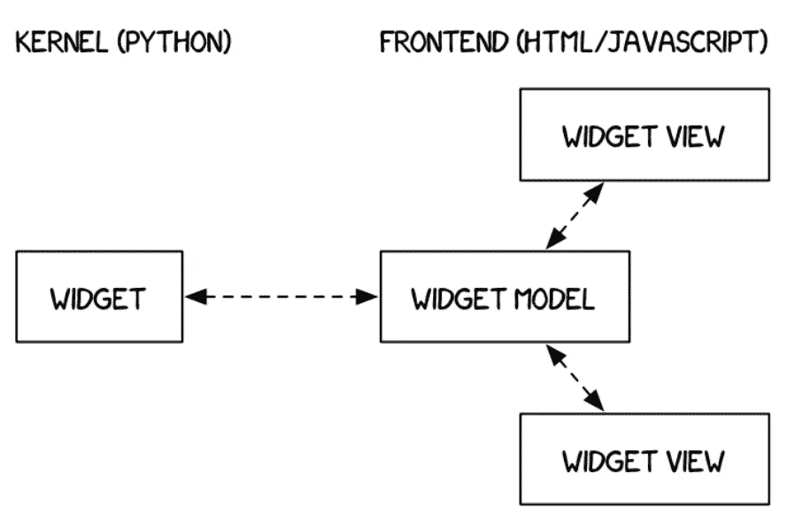
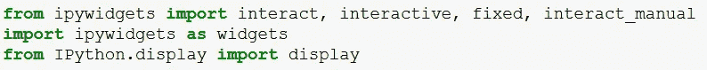
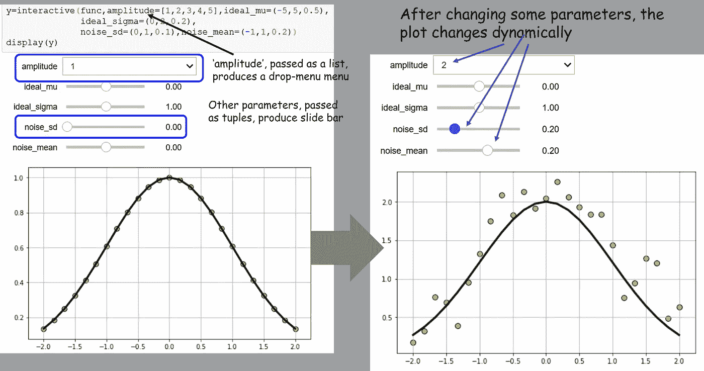
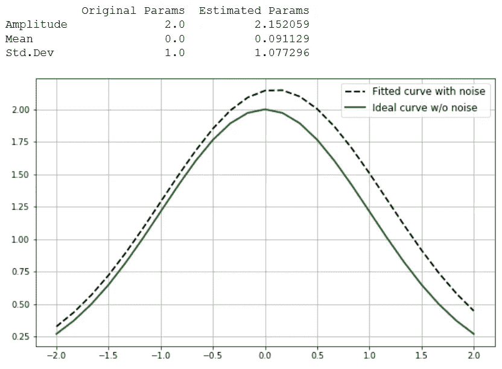

# Jupyter 笔记本上一个非常简单的交互控件演示

> 原文：<https://towardsdatascience.com/a-very-simple-demo-of-interactive-controls-on-jupyter-notebook-4429cf46aabd?source=collection_archive---------1----------------------->

## 当使用交互式小工具时，笔记本变得活跃起来。用户可以可视化和控制数据的变化。学习变成了一种身临其境的、有趣的体验。研究人员可以很容易地看到改变模型的输入如何影响结果。


Jupyter/IPython 项目对数据科学家如何快速测试和原型化他/她的想法并向同行和开源社区展示工作产生了最大程度的影响。这是一个非营利性的开源项目，诞生于 2014 年的 [IPython 项目](https://ipython.org)，该项目迅速发展，支持跨所有主要编程语言的交互式数据科学和科学计算。



Jupyter 允许数据科学家/分析师使用他/她选择的任何[领先编程范例(Python、C++、R、Julia、Ruby、Lua、Haskell 等等)](https://github.com/jupyter/jupyter/wiki/Jupyter-kernels)来处理复杂的数据集和测试模型。在其明显的简单性背后，Jupyter 提供了强大的渲染能力来生成漂亮的标记文本和清晰的图形，以使数据科学/机器学习项目充满活力。[下面是 Jupyter 笔记本](https://nbviewer.jupyter.org/github/tirthajyoti/StatsUsingPython/blob/master/Set_Algebra_with_Python.ipynb)上写的整个基础集合代数教程的例子。

然而，当用户可以交互地控制模型的参数并(几乎)实时地看到效果时，学习和实验数据就变得真正身临其境了。Jupyter 中大多数常见的渲染都是静态的。不过有一个[大功夫引入了名为***ipywidgets***](http://jupyter.org/widgets.html)的元素，在 Jupyter 笔记本上渲染出了有趣的交互控件。基于这些核心元素，一些 2D 和 3D 动态数据可视化项目(例如 [bqplot](https://github.com/bloomberg/bqplot) 、 [ipyleaflet](https://github.com/ellisonbg/ipyleaflet) )的规模和范围也在不断扩大。

在本文中，我将展示一个演示笔记本，其中包含一个最简单的交互式控件元素，以及如何将它集成到数据建模任务中，以动态可视化模型参数调整的影响。

idgets 是多事件的 python 对象，在浏览器中有一个表示，通常是像滑块、文本框等控件。，通过前端(HTML/Javascript)呈现通道。他们使用 Jupyter 的“comms”API，这是一种对称、异步、一次性的消息传递 API，允许程序员在前端和后端之间发送支持 JSON 的 blobs，并隐藏 web 服务器、ZMQ 和 web 套接字的复杂性。[下面详细讨论](https://ipywidgets.readthedocs.io/en/stable/examples/Widget%20Low%20Level.html)。



## 安装小组件

安装 ipywidgets 有两种选择。它们略有不同，所以请注意区别。基本上，如果您使用 pip，您还必须在笔记本中启用 ipywidget 扩展，以便在下次启动笔记本时呈现它。您可以在您使用的任何虚拟环境中启用它，以便该扩展不会影响任何其他环境。

```
pip install ipywidgets
jupyter nbextension enable --py widgetsnbextension
```

或者，您可以进行 Conda 安装(如果您使用 Anaconda)，它会自动启用。

```
conda install -c conda-forge ipywidgets
```

## 使用*交互*对象/控件

`interact`函数(`ipywidgets.interact`)自动创建用户界面(UI)控件，用于交互式地浏览代码和数据。这是开始使用 IPython 小部件的最简单的方法。



除了`interact`，IPython 还提供了另一个函数`interactive`，当您想要重用生成的小部件或者访问绑定到 UI 控件的数据时，这个函数非常有用。注意，与`interact`不同，函数的返回值不会自动显示，但是你可以用`IPython.display.display`在函数内部显示一个值。

## 一个简单曲线拟合练习的演示代码

锅炉板代码[可从我的 GitHub 库](https://github.com/tirthajyoti/Widgets)获得。请随意叉/下载并使用它。我们实际上是生成一个带有噪声的高斯数据，并借助交互式滑动条或下拉菜单控件来处理各种模型参数。在传递函数并使用 ipywidget.interactive()返回的对象呈现显示后，它看起来是这样的…



接下来，我们调用 Scipy 包中的[曲线拟合优化函数，并将理想的高斯分布函数拟合到数据中。该代码准确地描述了如何从 ipywidget 对象中提取数据并将其传递给优化器。您可以使用各种模型参数，并查看优化器拟合/估计的参数如何随着噪声参数的改变而与理想值有所不同，**只需向左或向右滑动控件**！](https://docs.scipy.org/doc/scipy/reference/generated/scipy.optimize.curve_fit.html)



## 摘要

我们讨论了关于 IPython 小部件或交互式控件的一些基础知识，以及为什么它们可以将枯燥的数据科学代码笔记本变成有趣的、生动的文档。我们还展示了一个简单的演示代码来说明统计模型拟合练习中的想法。在未来，我们希望展示一些更酷的小部件在机器学习模型调整或深度学习超参数优化中的应用。

*喜欢这篇文章吗？成为* [***中等会员***](https://medium.com/@tirthajyoti/membership) *继续* ***无限制学习*** *。如果你使用下面的链接，* ***，我会收到你的一部分会员费，而不会对你产生额外的费用*** *。*

[](https://medium.com/@tirthajyoti/membership) [## 通过我的推荐链接加入 Medium—Tirthajyoti Sarkar

### 作为一个媒体会员，你的会员费的一部分会给你阅读的作家，你可以完全接触到每一个故事…

medium.com](https://medium.com/@tirthajyoti/membership)