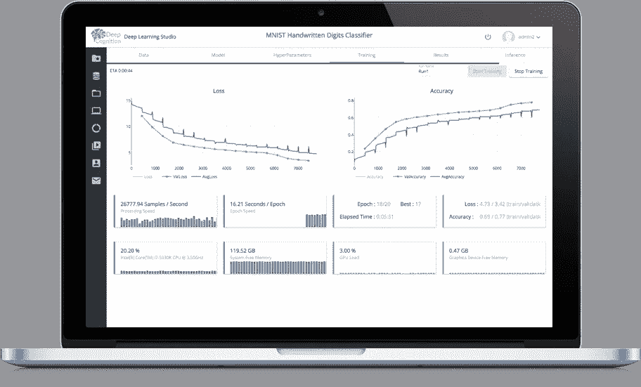
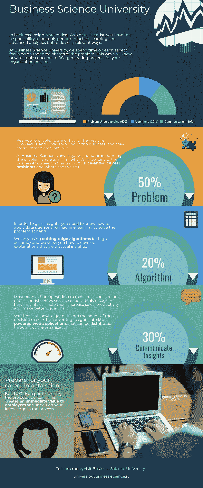

# 深度认知的视频漫游

> 原文：<https://towardsdatascience.com/a-video-walkthrough-of-deep-cognition-fd0ca59d2f76?source=collection_archive---------9----------------------->

## 大家好！在本文中，我将与您分享几个视频，带您了解 Deep Cognition 的平台和深度学习工作室。我们将运行简单的模型作为例子，最后会有一个最终的惊喜。

深度学习是一个令人惊叹的领域，它帮助我们创建伟大的解决方案，解决数据科学世界中的难题。我在过去谈论过深度学习，以及它如何在你的工作流程中帮助你，特别是在计算机视觉和 NLP 问题上。

你可以在这里查看其中的一些:

 [## 我的深度学习之旅

### 在这篇文章中，我将分享我如何研究深度学习并使用它来解决数据科学问题。这是一个…

towardsdatascience.com](/my-journey-into-deep-learning-c66e6ef2a317)  [## 深度学习的 Skejul 会议

### 厌倦了试图与某人见面，却找不到日期或时间？我也是。

towardsdatascience.com](/skejul-meetings-with-deep-learning-5efab285b111)  [## 深度学习的“怪异”介绍

### 有关于深度学习的惊人介绍、课程和博文。但这是一种不同的介绍。

towardsdatascience.com](/a-weird-introduction-to-deep-learning-7828803693b0) 

当你进入一个新的计算领域时，你应该学习的一件事是好的工具。工具让我们能够解决我们的问题，而不需要从一开始就花费数小时编写简单或复杂的代码。现在有几个深度学习的工具，在编码领域和视觉领域。

在过去，我曾谈论过 Deep Cognition，一家伟大的公司，和其他人一样，正在走上民主化人工智能和深度学习的道路。

通常我们做深度学习编程，学习新的 API，有些比其他的更难，有些真的很容易，比如 Keras，但是一个可视化的 API 来创建和部署深度学习解决方案怎么样？这是他们的承诺。

他们的平台， **Deep Learning Studio** 可作为云解决方案(【https://deepcognition.ai/cloud/】[)桌面解决方案(【http://deepcognition.ai/desktop/】](https://deepcognition.ai/cloud/))使用，软件将在您的机器或企业解决方案(私有云或内部解决方案)上运行。桌面版允许你使用自己的计算机与 GPU 和硬件。而且都是免费的！

在接下来的部分中，我将带您了解创建帐户、进入和启动云应用程序、获取数据、创建项目然后创建模型、使用他们的 AutoML 解决方案以及部署模型的过程。

如需书面指南，请访问 [Rajat](https://medium.com/u/499b9c4ef53c?source=post_page-----fd0ca59d2f76--------------------------------) 的博客:

 [## 深度学习工作室让深度学习变得简单——完整指南

### 没有编程的深度学习可能吗？

towardsdatascience.com](/deep-learning-made-easy-with-deep-learning-studio-complete-guide-a5c5ae58a771) 

我的是深度学习的简单介绍和一些信息:

 [## 深度认知让深度学习变得简单

### 在过去的一个月里，我有幸见到了 DeepCognition.ai 的创始人

becominghuman.ai](https://becominghuman.ai/deep-learning-made-easy-with-deep-cognition-403fbe445351) 

所以让我们开始吧！

# 创建帐户

在此输入:

 [## Register - DeepCognition.ai

### Deep Cognition 通过单点登录提供对云和桌面软件的免费访问。创建您的免费帐户…

deepcognition.ai](https://deepcognition.ai/register/) 

要关注视频:)。

# 启动云应用程序

# 深度学习工作室概述

# 创建项目

# 摄取数据

# 使用预先存在的数据

# 使用可视化 API 创建模型

# 使用 AutoML 创建模型

# 为您的模型获取最佳超参数

# 训练您的模型

# 部署您的模型

所以你可以看到，使用 Deep Learning Studio，可以在几分钟内建立深度学习模型，并在几秒钟内部署。这种能力将使许多开发人员能够处理复杂的问题，而不用担心编码、API 等问题。

现在是最后的惊喜！如果你来了，我想你会感兴趣的。如果你想成为一名数据科学家，我的朋友 Matthew Dancho 为你提供了一个非常棒的课程。[商业科学大学](https://university.business-science.io)将带您了解整个商业数据科学流程，利用数据科学解决问题，使用机器学习创建交互式应用，并在组织内分发解决方案。

是的，我有优惠券代码！点击下方使用！

 [## 商业数据科学(DS4B 201 / HR 201)

### 了解如何使用 H2O 自动机器学习和石灰黑盒模型解决现实世界中的员工流动问题…

大学.商业-科学. io](https://university.business-science.io/p/hr201-using-machine-learning-h2o-lime-to-predict-employee-turnover/?coupon_code=SAVE_15) 

那里有一个很棒的课程，折扣很大！

如果您有疑问，请随时联系我:)

感谢你阅读这篇文章。希望你在这里发现了一些有趣的东西:)

如果您有任何问题，请在 twitter 上添加我:

 [## 法维奥·巴斯克斯(@法维奥·巴斯克斯)|推特

### Favio Vázquez 的最新推文(@FavioVaz)。数据科学家。物理学家和计算工程师。我有一个…

twitter.com](https://twitter.com/FavioVaz) 

和 LinkedIn:

 [## Favio Vázquez —首席数据科学家— OXXO | LinkedIn

### 查看 Favio Vázquez 在世界上最大的职业社区 LinkedIn 上的个人资料。Favio 有 15 个工作职位列在…

linkedin.com](http://linkedin.com/in/faviovazquez/) 

那里见:)