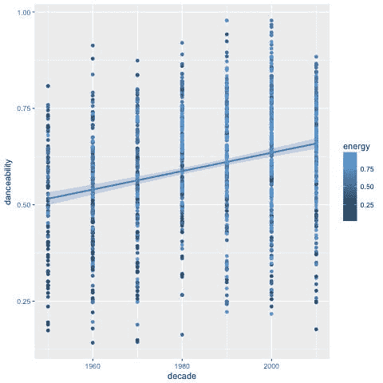
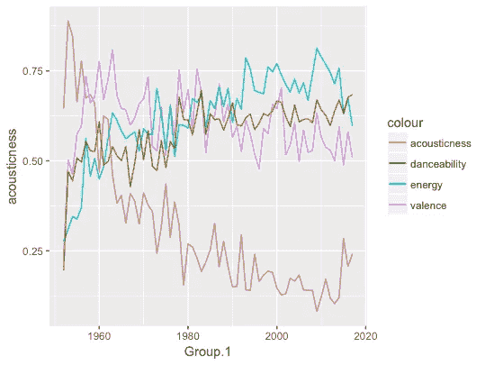

# 对英国数字 1 的直观分析:用数据弄脏自己

> 原文：<https://towardsdatascience.com/a-visual-analysis-of-uk-number-1s-getting-down-and-dirty-with-data-a663cee021c4?source=collection_archive---------16----------------------->

本文重点介绍第一个计时器尝试收集和分析数据的过程。这是我最后一年项目概述的第二部分:对英国数字 1s 的视觉分析。

**TL；DR:在数据清理上投入比你想象的更多的时间，即使这不一定是有趣的部分。**


# 数据采集

这个项目使用的数据集由每首排名第一的歌曲的列表组成，表示标题、艺术家、首次排名第一的日期、排名第一持续了多少周、这些周是否连续、Spotify 曲目 ID 和 Spotify 音频功能。

为了创建这个数据集，我用一个 Python 脚本列出了每首排名第一的歌曲，这个脚本抓取了官方排行榜的网页。收集的数据(曲目标题、艺术家、日期)然后被输出为一个 JSON 文件。

我选择使用 Python 和 BeautifulSoup，因为我在以前的个人项目中使用过它们，认为它们会很合适。不幸的是，网页上使用的标记不是很好。表格没有类来区分它们和页面上其他类型的表格，表格标题也没有正确标记。这使得它比预期的更复杂，但仍然比手动将数据复制到 JSON 文件中更容易(或者更有趣)。

然后，我需要获取 JSON 文件中每个音轨的 Spotify 属性。鉴于要检索的曲目数量，我知道需要一个自动化的解决方案。

Spotify API 文档提供了一个从终端运行 curl 请求的示例，但是要对每首曲目执行此操作，需要一个脚本来格式化曲目标题和艺术家姓名，然后运行该命令。没有更多使用 curl 的经验，我没有信心这么做，所以我考虑用 Ruby 写。我最初的尝试是使用在线转换器将 curl 命令转换成 Ruby，但这导致了多个问题和无效响应。经过进一步研究，我发现了[RSpotify](https://github.com/guilhermesad/rspotify)——Spotify API 的 Ruby 包装器。

使用 RSpotify 需要使用客户端和密钥连接到 Spotify API。要创建这些应用程序，需要在 Spotify 开发者门户上注册。然而，如果不危及帐户的安全，就无法将密钥提交给 GitHub。因此，创建了一个单独的文件来存储密钥(被 git 忽略’)，并将密钥导入到脚本中:

```
key = File.read(‘spotify_keys.json’)
data_hash = JSON.parse(file)
key = JSON.parse(key)RSpotify.authenticate(key[‘1’][‘client’], key[‘1’][‘secret’])
```

这意味着在线代码中没有键值的记录。

RSpotify 的`Track.search`功能允许搜索曲目标题和艺术家，并从 Spotify 检索歌曲 ID。假设第一个结果是最相关的，查询被限制为一个结果。曲目 ID 从查询结果中检索，并在 RSpotify GET 请求中用于检索歌曲的音频特性。这些随后被写出到一个 JSON 文件中，其中包含了音轨的详细信息。有一些曲目在查询 id 时没有返回结果，但可以使用 Google 找到。我添加了对这些歌曲的检查，以手动提供 id。然后，我随机选择了几首歌曲，以确保检索到了正确的数据。

然后，我开始分析我用 RStudio 收集的数据，找出任何有趣的模式和关系，以便在文章中强调。

**创建播放列表**

作为网络体验的一部分，用户可以[关注与文章相关的 Spotify 播放列表](https://open.spotify.com/user/rushlet/playlist/6DNZV1L405XpElhIAUHaKZ?si=dleGRLEBT_mcqTlN54Yjlg)。我通过编写一个节点脚本，利用 Spotify Web Api 节点库(包括一个可以轻松地将曲目添加到播放列表的功能)创建了这个节点。

由于要添加到播放列表中的歌曲数量，当脚本运行时，许多曲目都失败了。我将它调整为每隔几秒钟休眠一次，以免服务器过载，还输出了所有失败曲目的列表。然后脚本使用这个列表，向播放列表中添加更多的歌曲，并重新生成失败曲目的列表。

一旦创建了播放列表，我就可以看到与数据相对应的歌曲。很多歌曲都是不正确的。通过搜索“*标题艺术家*”，一些结果是以搜索标题命名的专辑中的曲目，而不是想要的曲目。其他的，如艾德·希兰的 *Perfect* 返回了一个封面，而不是已经到达第一名的版本(由艾德·希兰和碧昂斯而不是艾德·希兰)。此外，有超过 50 个卡拉 ok 版本的实例，而不是原始录音——这意味着他们的乐器评级将与实际曲目大相径庭。数据集需要重新创建。

**重新创建数据集**

我使用与播放列表生成器相同的 Spotify 库重写了 Node 中的数据收集脚本。当我进一步研究 Spotify API 时，我意识到你可以指定一个包含标题和艺术家的搜索。这给出了更准确的结果，但是大量的查询没有返回任何结果。其中一些是由于从官方图表网站上收集的数据中艺术家名字的拼写错误(例如，“Bobbie Gentry”被拼写成了“Bobby”)。我在发现这些问题时进行了修复，但很快意识到我应该在项目开始时花更多的时间清理数据。

许多丢失的数据是由于无法通过 Spotify API 获得曲目。例如，Slade 在 Spotify(英国)上只有 3 首歌曲，但他们有 6 首英国排名第一的歌曲。然而，当在谷歌上搜索“曲目、艺术家、spotify”(例如*“因为我爱你 Slade Spotify”*)时，会列出一个 Spotify 条目，但无法播放(我假设它在英国不可用)。这些在 URL 中有它们的关联 ID，这足以放入 API 并检索音频特性。结果，很多曲目被硬编码进了剧本。不是最好的解决方案，但它完成了工作。我很想现在就回去，看看是否能找到更好的解决方案。有 5 首歌曲根本不在 Spotify 的库中，这些已经被包括在整体数据中，但必须在网页的音频功能部分注明它们已被编辑。一旦数据集被重新创建，我使用 *Excel* 来检查重复的 id 或丢失的音频特征。

# **数据分析**

现在我有了所有的数据，分析可以开始了。数据科学行业使用的工具种类繁多，从 *Excel* 到 *SPSS* 。我决定用 RStudio 对数据进行基本分析。

在这个项目之前，我没有在编程环境中做过任何数据分析。当我第一次想到这个项目的想法时，我还在 BBC 新闻部实习，所以我向数据新闻团队寻求帮助，以便对如何进行数据分析有一个基本的了解。午餐时，他们在 R 给我开了一个简短的非正式研讨会，向我展示了如何创建散点图，并寻找变量之间的统计意义，以确定是否有潜在的故事。

在进行数据分析时，应该考虑询问数据或测试假设的问题。我最喜欢的一个问题是“最适合跳舞的十年是什么？”。为了回答这个问题，我使用 *ggplot2* 创建了一个散点图，显示了十年和可跳舞性之间的关系。如下所示:

```
#uses ggplot2 to draw scatterplot + regression line
plot <- ggplot(all_tracks, aes(x = decade, y = danceability)) + geom_point(aes(colour = energy)) + geom_smooth(method=’lm’,formula=y~x)
plot
```



散点图显示，最适合跳舞的节点集中在 2010 年代，这意味着这是最适合跳舞的十年。你也可以看到图表显示了可跳舞性和十年之间的正相关关系。然后使用线性模型函数来观察这是否具有统计学意义。

```
my.model <- lm(decade ~ danceability, data = all_tracks)
summary(my.model)Call:
lm(formula = decade ~ danceability, data = all_tracks)
Residuals:
 Min 1Q Median 3Q Max 
-41.517 -14.480 0.775 15.205 40.518 

Coefficients:
 Estimate Std. Error t value Pr(>|t|) 
(Intercept) 1963.302 1.969 996.96 <2e-16 ***
danceability 34.920 3.191 10.94 <2e-16 ***
 — -
Signif. codes: 0 ‘***’ 0.001 ‘**’ 0.01 ‘*’ 0.05 ‘.’ 0.1 ‘ ‘ 1

Residual standard error: 18.06 on 1317 degrees of freedom
Multiple R-squared: 0.08336, Adjusted R-squared: 0.08266 
F-statistic: 119.8 on 1 and 1317 DF, p-value: < 2.2e-16
```

可跳舞性和十年之间有很高的统计显著性，由非常接近 0 的 p 值(和旁边的三颗星)表示。这意味着十年对可跳舞性有积极的影响(所以平均来说，数字 1 随着时间的推移变得更适合跳舞)。

最初，我花时间调查关系是否具有统计学意义——这很有趣，但我对它的理解不足以在我的文章中进行讨论。我渴望了解更多关于数据分析的知识，但必须记住这主要是一个 web 开发项目，不要被数据消耗太多，不管我觉得它有多有趣。

随着更多的想法出现，我使用 StackOverflow 来确定如何询问数据。我的问题非常简单，比如如何根据特定变量对行进行分组并找出平均值，或者如何对某一列的结果进行排序。

当我不知道如何向谷歌表达我的问题时，我向 BBC 的一位数据记者朋友寻求帮助。一个例子是当我试图从数据集中识别独特的艺术家时。当艺术家合作时，数据中没有指示——艺术家甚至没有逗号分隔，这使得很难确定单个艺术家贡献了多少首歌曲。最后，我的解决方案是手动创建一个单个艺术家的列表，允许我识别每个艺术家出现的次数，给我他们贡献的曲目总数。最初，我试图用 R 来做这件事，但在多次尝试失败后，我意识到我可以只写一个节点脚本。虽然这要容易得多，但仍然需要几次尝试来完善剧本。最初，“ti”是最常见的 75 位艺术家，因为“TI”会出现在许多不同的词中。因此，我对它进行了改进，只对整个单词使用正则表达式。但是，结果仍然不完全准确，例如:

```
 ┌─────┬────────────────────┬────────────┬───────┐
         │ id  │ artist             │ weeks_at_1 │ count │
         ├─────┼────────────────────┼────────────┼───────┤
         │ 621 │ NICOLE             │      6     │   3   │
         │ 622 │ NICOLE KIDMAN      │      3     │   1   │
         │ 623 │ NICOLE SCHERZINGER │      1     │   1   │
         └─────┴────────────────────┴────────────┴───────┘
```

有一个艺人的名字叫妮可(她有一首单曲排名第一)，但她的曲目也包括其他两位女性的歌曲。尽管肯定有更好的解决方案，但我最终还是手动修复了这个和其他实例。

随着我继续分析，我发现了更多的数据清理问题——比如贾斯汀比伯的'*什么意思？*‘拼起来有没有 a’？’。我发现了 OpenRefine，我用它来验证数据，这有助于确定一些类似的问题。
如果我在项目开始时投入足够的时间和精力清理数据，独特艺术家的问题可能会更快得到解决。解决这些问题后，我对自己创建的数据集更有信心了。

总的来说，我真的很喜欢研究这些数据，并且绝对花了比我应该花的更多的时间来玩这些数据。这使得用于设计和测试的时间比我最初计划的要少，这也无助于我的数据在分析阶段结束时需要彻底检查。



An attempt to visualise some of the data gathered using ggplot in R.

[回到第一部分](https://medium.com/@rushlet/a-visual-analysis-of-uk-number-1s-2cf6ae2a1602)