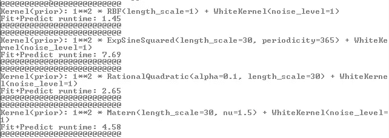
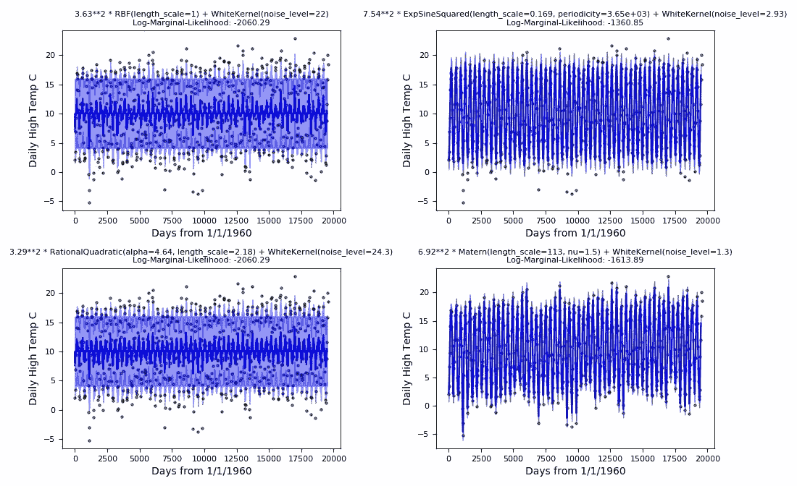

# 高斯过程回归核的直观比较

> 原文：<https://towardsdatascience.com/a-visual-comparison-of-gaussian-process-regression-kernels-8d47f2c9f63c?source=collection_archive---------2----------------------->

高斯过程回归是多元高斯分布的一种应用，它是一种强大的预测工具，用于高度非线性或不容易使用线性或多元回归建模的数据。高斯过程可以完全用#1 表示。平均值向量(由输入变量 x1、x2…xn 的数据定义)和#2。跨越(x1，x1)，(x1，x2)… (xi，xj)的协方差矩阵。

Sklearn 库的 GPR 工具优化了协方差函数或*内核*函数，以使数据符合高斯过程。在拟合模型时，可以使用几个不同的核函数，每个核函数都具有独特的属性和特征。可以使用单个核函数，也可以使用核函数的数学和或乘积——可能性几乎是无限的！基于数据属性选择合适的核函数是建模过程中的关键决策。

本文不会深入探讨内核选择的细微差别，甚至不会讨论如何评估 GPR 的适用性。相反，我将提供一个简单的高斯过程回归的直观比较，每个回归都使用 Sklearn“内核”库中的四个流行的内核函数来拟合每月的温度数据。

每月的温度数据，作为 Kaggle 的[气候变化:地球表面温度数据](https://www.kaggle.com/berkeleyearth/climate-change-earth-surface-temperature-data)图书馆的一部分，是免费提供的，已经被删减，只包括了比利时这个国家从 1960 年到 2013 年以摄氏度为单位的月平均温度。我用四种不同的内核函数来拟合这些数据:

径向基函数

指数正弦平方

有理二次曲线

马特恩

下面提供的代码集首先评估每个内核的 fit+predict 运行时:

这是四个内核的预测值，叠加在温度数据上。Exp-Sine-Squared & Matérn 核比 RBF 或有理二次核更容易获得温度数据的周期性:

对于任何希望修改这些代码并将其用于自己的数据的人来说，请注意 Sklearn 的 GPR 工具集并没有优化这些内核函数中的所有参数，例如 Matérn 内核中的参数 nu。即使对于优化的参数，用户也应该考虑用什么样的起始值来初始化每个内核函数是有意义的，并首先将其反映为该代码中先前内核定义的一部分。

正如我前面提到的，高斯过程回归不必受单个核函数的限制。这段代码可以用来简单地计算不同的内核函数组合，或者求和或者相乘(或者两者兼有！).探索愉快！

 [## Python_Projects/GPR_kernels.py

github.com](https://github.com/dasotelo/Python_Projects/blob/master/GPR_kernels.py)