# 神经网络的可视化介绍

> 原文：<https://towardsdatascience.com/a-visual-introduction-to-neural-networks-68586b0b733b?source=collection_archive---------1----------------------->

更新:我已经添加了一个视频解释来直观地介绍神经网络，这里:[https://www.youtube.com/watch?v=wgGezGnLTbY](https://www.youtube.com/watch?v=wgGezGnLTbY)

神经网络有多种风格和类型，是目前分类问题的最新技术。卷积神经网络、递归神经网络和最近的生成对抗神经网络也被证明是非常有用的。像逻辑回归、SVM、决策树等方法也用于分类。然而，从这些过渡到神经网络的世界通常充满了抽象。
写这篇博客的目的是简化这些抽象概念。通过使用实验和图表，神经网络的工作是通过这个职位描述。人们可以期待它回答的一些问题是:

> 1.logistic 回归能做什么？
> 2。什么是逻辑回归不能做的？
> 3。我们如何从逻辑回归过渡到神经网络？
> 4。用神经网络改变决策界限
> 5。激活和其他超参数的变化如何影响神经网络的收敛

请务必阅读标题，以便更好地理解。

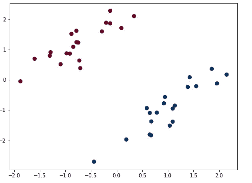

Sample classification problem to solve. We need a decision plane to separate red and blue points

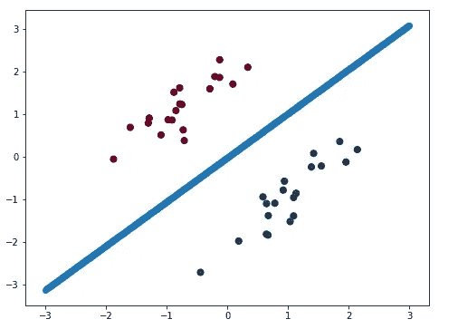

Logistic Regression can solve this problem and give the decision plane as shown. The code for the solution is available [here](https://github.com/mediumssharma23/avisualintroductiontonn/). Process of obtaining in the line is explained in the code

从上图中我们看到，逻辑回归可以根据颜色(红色和蓝色)对这些点进行分类。
我们来换个问题。下图中的问题是一个非线性问题，意味着我们不能在这种情况下使用一条线(一般为超平面)来简单地对点进行分类。我们还可以从下图中看到，逻辑回归无法解决这个问题，因为它试图用一条线将这些分开。

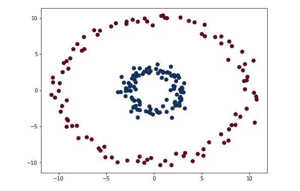

A non linear classification problem

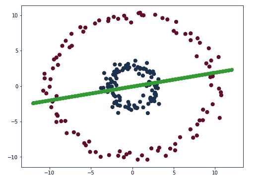

Logistic Regression unable to solve the problem

逻辑回归可以被视为单层神经网络(具有 1 个神经元)并且“sigmoid”作为激活函数。让我们看看一个以‘乙状结肠’为激活和一个神经元的神经网络能否解决这个问题。这是使用 Python 的 Scikit-learn 库的 MLPClassifier 完成的，实现可以在[这里](https://github.com/mediumssharma23/avisualintroductiontonn/)找到。
下面三幅图描绘了一个基于单个神经元的神经元试图解决的问题。

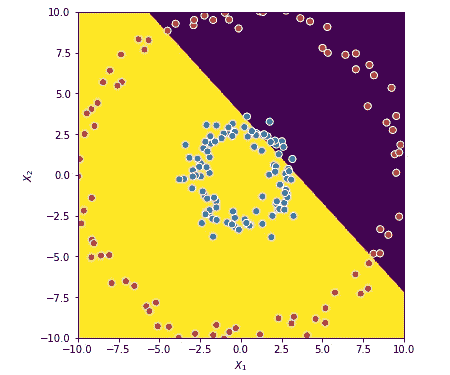

mlp = MLPClassifier(hidden_layer_sizes=(1),max_iter=500000,activation=’logistic’,learning_rate_init=0.01)

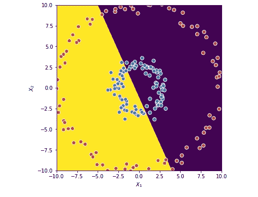

mlp = MLPClassifier(hidden_layer_sizes=(1),max_iter=500000,activation=’identity’,learning_rate_init=0.01)

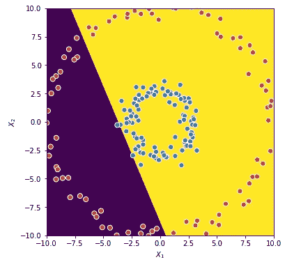

mlp = MLPClassifier(hidden_layer_sizes=(1),max_iter=500000,activation=’relu’,learning_rate_init=0.01)

我们观察到，基于单个神经元的神经网络如预期的那样给出了线性决策边界，而不管配置(激活函数、学习速率等)如何，该边界都不能解决非线性问题。让我们看看当我们使用两个神经元时会发生什么。

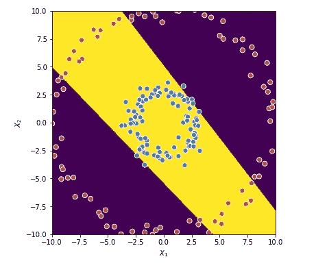

Non Linear problem with 1 layer and 2 neurons

我们观察到，现在我们得到了两个边界，并且分类的误差减少了(如通过正确类别中的点数来判断的)。可以解释为黄色区域的点为蓝色，其他区域为红色。该解仍然有一些误差，但是该解比单个神经元的情况具有更低的误差。我们还可以看到，每个神经元的两个决策边界在这里结合起来，以做出决策。让我们看看当我们将神经元的数量分别增加到 2、3、4、6、7 和 30 时会发生什么。(绘制决策边界的代码可以在[这里](https://github.com/mediumssharma23/avisualintroductiontonn/)找到)

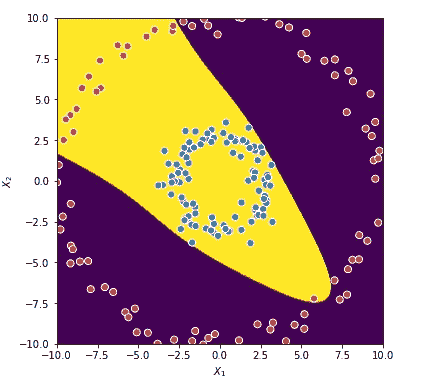

Decision plane with 3 neurons : lower error than previous case.

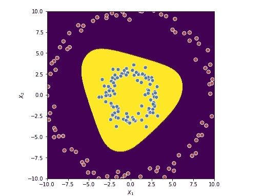

Decision plane with 6 neurons. Perfect classification with 100 % accuracy. Model now has learnt to combine 6 decisions to form a final decision. Points in yellow region are classified as blue and rest are classified as red

Decision plane with 8 neurons

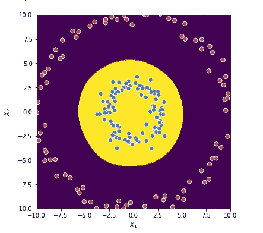

Decision plane with 30 neurons

我们观察到，随着神经元数量的增加，模型能够更准确地对这些点进行分类。决策边界是复杂的，因为它是各个决策边界的非线性组合(通过激活函数)。在抽象层次上，它可以被视为多个分类器以非线性方式组合来获取非线性决策平面。可以得出结论，当数据是非线性时，一层具有非线性激活函数的多个神经元可以对其进行分类。这个样本问题相当小。在更高维度和更复杂的问题的情况下，更复杂的架构可以发挥作用。
在上图中，使用了非线性激活函数，如“relu”。这是通过以非线性方式组合各种平面来引入“非线性”。让我们看看当我们使用线性激活函数时会发生什么

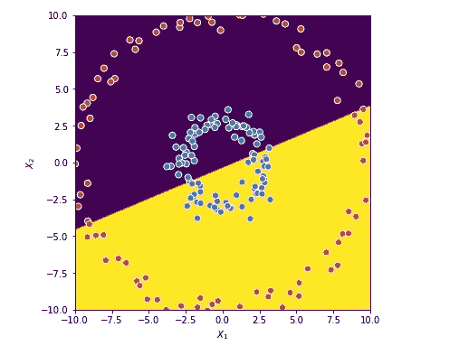

30 neurons with linear activation function

当使用另一个线性函数“Wx+b”组合时，线性激活函数最终再次给出线性决策平面。因此，神经网络必须具有非线性激活，否则增加层和神经元是没有意义的。
让我们看看一个模型如何收敛于一个 3 类分类问题和一层 6 个神经元。这里的 3 个类是深蓝色、浅蓝色和红色，找到的决策空间分别是黄色、蓝色和紫色。

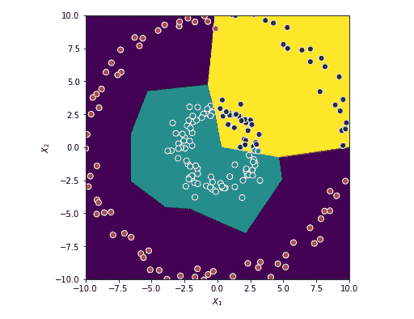

Decision boundary of a non linear 3-class classification problem

现在让我们通过另一个问题来了解更多关于神经网络的功能。

问题和结果是从 Tensorflow playground 模拟的，tensor flow playground 是一个非常好的可视化神经网络工作方式的工具。

 [## 张量流-神经网络游乐场

### 这是一种构建从数据中学习的计算机程序的技术。它非常松散地基于我们如何思考…

playground.tensorflow.org](http://playground.tensorflow.org) 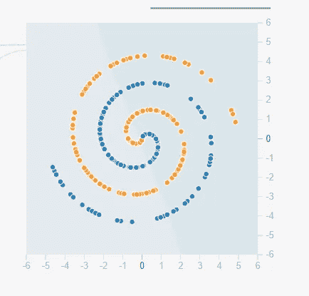

A more complex non linear problem. We need to classify blue and orange points

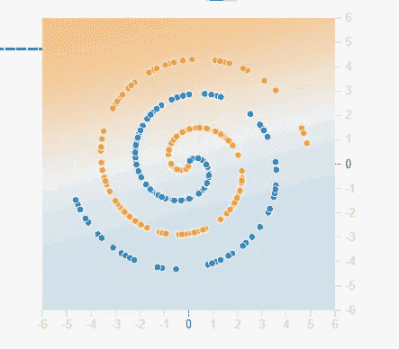

1 neuron. As expected, only a linear boundary is available and classification is poor

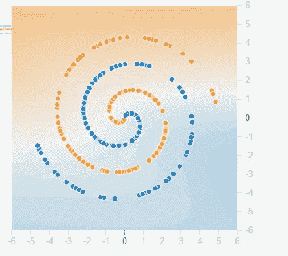

Using 3 neurons. Now the boundary is curved. Classification is somewhat better but far from perfect. Average loss of 0.473 noted. Classification is judged by establishing that blue points must have a blue backgroundand orange must have a orange background

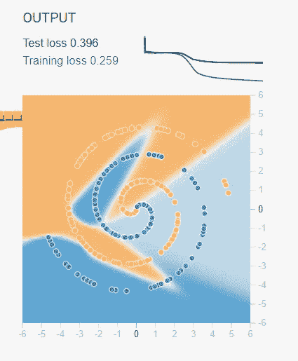

5 neurons used and test and train losses are 0.396 and 0.259\. So we get a better classification . Model was allowed to run epochs till 1 minute

Using 5 neurons, classification improves further

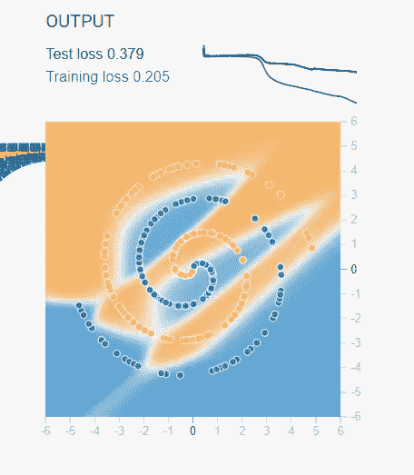

8 neurons. A better and faster classification. The losses obtained after 1 minute are depicted

现在让我们将上面的情况与我们有多个层的情况进行比较。

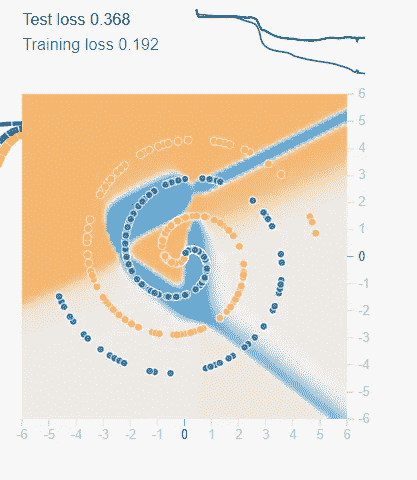

We observe by using a 3 layer net with 4, 4, 2 neurons in each layer, we get a better and faster classification

上面显示，这个问题可以通过简单地增加一层中的神经元来解决，但是当使用多层时，它解决得更快。多层还使模型能够形成更高级别的特征(输入第一级特征并在其上进行处理)。这种行为的一个很好的例子可以在 CNN 的图像分类中找到，其中起始层找到基本的形状，如直线、曲线等，但后面的层找到这些形状之上的属性，如脸、手等。让我们通过另一个实验了解更多。上图使用“sigmoid”作为激活函数。众所周知，sigmoid 有一个梯度消失的问题。这意味着随着更多的图层出现，计算更新权重所需的梯度逐渐趋于零。“Relu”通常被推荐作为处理这个问题的激活函数。让我们重复上面的数字，但是这次用一个“relu”来验证这个事实

Non linear problem decision boundary using 3 layers (4,4,2 neurons respectively) and ‘relu’ as activation

很明显，使用 relu 几乎完美地解决了这个问题，并且只需要一半的时间。损失接近于零。此外，使用具有 8 个 relu 的 1 个图层不会获得相同的结果，因为多个图层正在利用它提取的更高级别要素属性。

这种实验的代码可以在[这里](https://github.com/mediumssharma23/avisualintroductiontonn/)找到。

添加 gif 动画来展示决策边界如何收敛

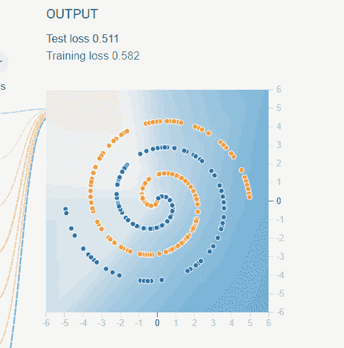

Animation depicting boundary formation with 3 layers and ‘relu’ activation

这个博客涵盖了神经网络的可视化方法。这是我第一次尝试写博客。请继续关注即将发布的与机器学习相关的其他主题和应用的帖子。如有任何问题/反馈，请随时联系我，shikharcic23@gmail.com 或

 [## Shikhar Sharma |职业简介| LinkedIn

### 查看 Shikhar Sharma 在全球最大的职业社区 LinkedIn 上的个人资料。Shikhar 有 9 份工作列在…

www.linkedin.com](https://www.linkedin.com/in/shikhar-sharma-b98078119/?ppe=1)