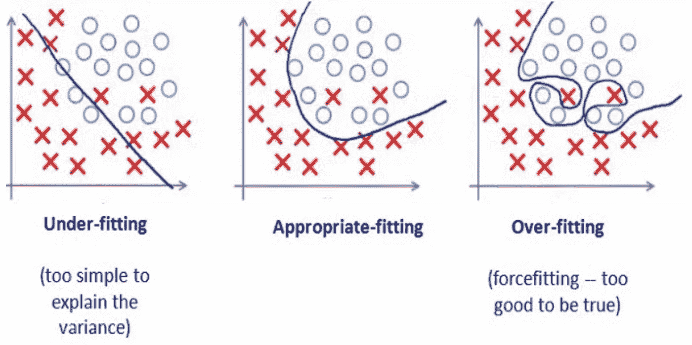
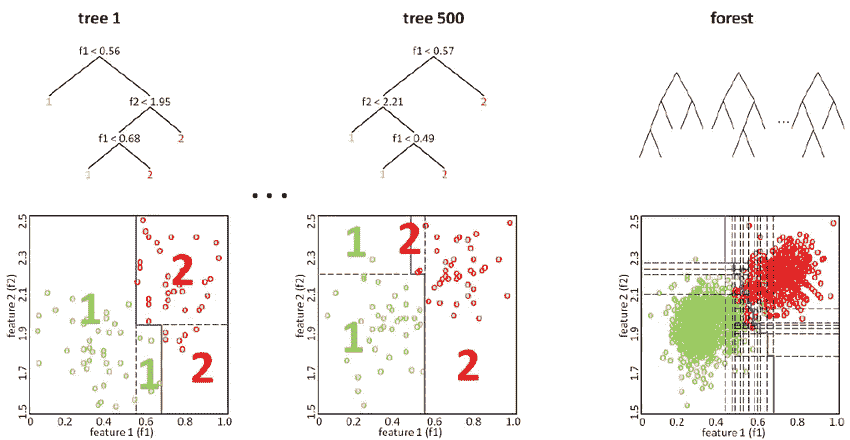
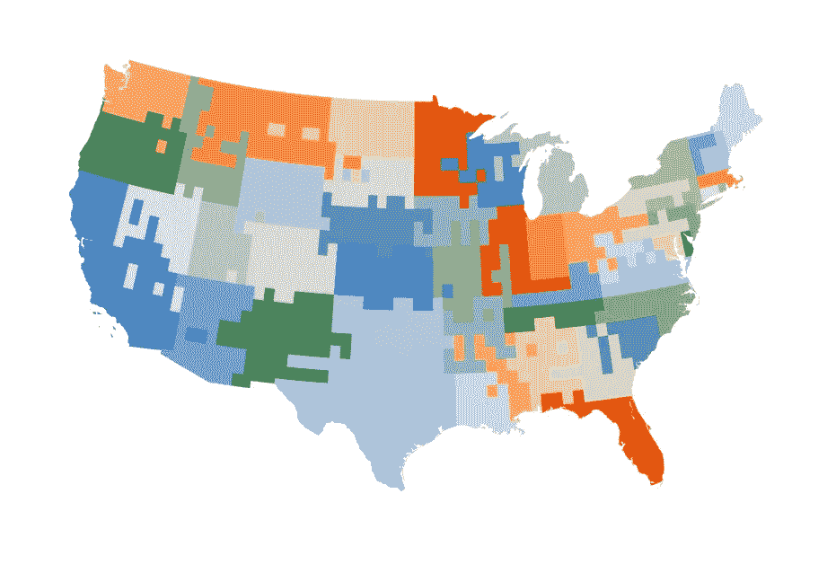
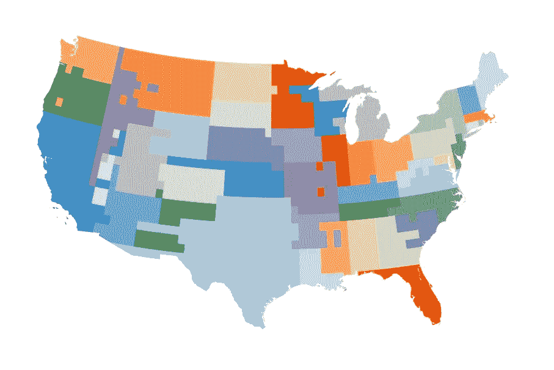
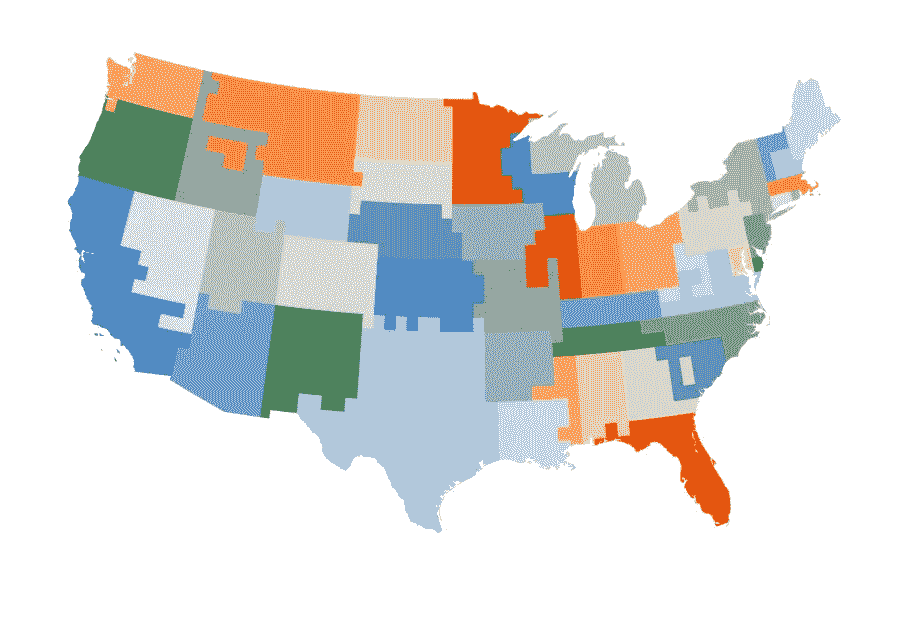
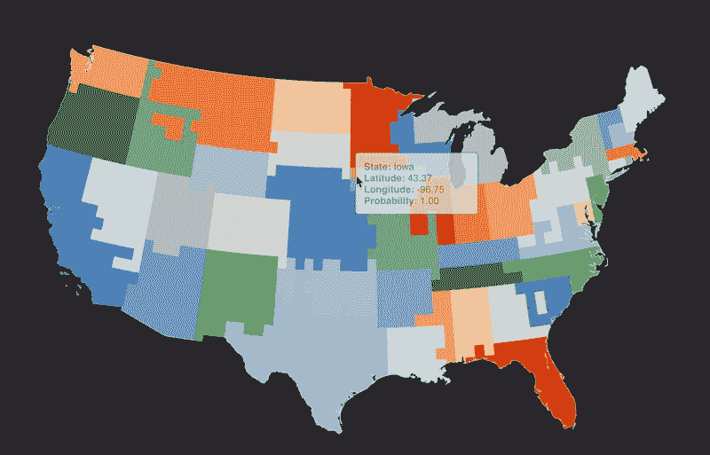

# 使用美国各州直观查看欠拟合和过拟合

> 原文：<https://towardsdatascience.com/a-visual-look-at-under-and-overfitting-using-u-s-states-7fd0d8ade053?source=collection_archive---------6----------------------->

下装和过装是什么样子，如何避免。

The decision surface of a Gradient Boosting Classifier predicting U.S. states from state border data in the form of latitude and longitude coordinates. The opacity of the voronoi cell corresponds to the predicted probability of that cell (prediction confidence).

# 为什么要避免过度拟合

在训练预测模型时，需要牢记许多注意事项-数据如何生成的基本假设、独立变量之间的相关性、用于训练的数据份额等等。要验证的假设和要考虑的点因问题而异，但是从一个建模练习到下一个建模练习，仍然有一些关键的考虑事项。其中一个考虑因素是偏差-方差权衡。本文通过说明与模型欠拟合和过拟合概念相关的权衡来解释偏差-方差，通过在地理坐标平面上绘制模型的决策表面来直观地显示。

当模型不够复杂，无法捕捉训练数据中存在的关系时，该模型就是有偏差的。相比之下，当模型捕获了训练数据中存在的太多信息时，它会有很高的方差，从而导致根据测试数据做出的预测之间有很大的差异。与以最小化偏差和方差的方式训练的模型相比，具有过高偏差或方差的模型将表现出增加的预测误差。优化这种权衡的一种方法是通过了解模型是欠拟合还是过拟合——在根据测试或维持数据评估模型后，我们将这些术语与模型的性能联系起来。

A visual representation of underfitting, appropriate-fitting, and overfitting. Source: [What is underfitting and overfitting in machine learning and how to deal with it](https://medium.com/greyatom/what-is-underfitting-and-overfitting-in-machine-learning-and-how-to-deal-with-it-6803a989c76).

欠拟合模型表现出很大的偏差。当拟合不足时，模型将无法捕捉训练数据中的重要关系，这些关系本可以用于进行预测。这种在建模过程中未能捕获相关信息的情况会导致较差的预测性能。当过度拟合模型时，模型在根据新的、看不见的数据预测输出时通常表现不佳。通常，由于模型过于复杂，未能验证维持数据的模型性能，或者在定型模型时未使用交叉验证，模型会过度拟合。类似于偏差-方差权衡，在训练预测模型时，最理想的是最小化欠拟合和过拟合，目标是找到两者之间的理想平衡。

本文通过根据美国人口普查局数据训练的模型绘制决策面，直观地说明了欠拟合和过拟合模型的影响，这些数据包含州边界的纬度和经度坐标以及相关的州标签(如加利福尼亚州、伊利诺伊州和田纳西州)。通过绘制适合该数据的模型的决策面，我们可以使用许多人熟悉的映射(48 个相邻的美国)直观地解释模型在欠拟合和过拟合情况下的行为。

# 数据

数据来自美国人口普查局。在其原始格式中，数据是一个单一的锁眼标记语言(KML)文件，其中包含美国各州边界的经度和纬度坐标。使用简单的 Python 脚本从 KML 文件中解析出必要的纬度、经度和标签(州)数据。

该数据集包含 11，192 个观察值。观察值的数量因州而异——加利福尼亚州有 467 个观察值，而罗德岛州只有 59 个(美国人口普查局不建议将这些数据用于任何严肃的地理空间或建模工作)。然而，数据足够丰富，可以使用探索性工具，并包含足够的信号，可以在给定一对纬度和经度坐标的情况下预测美国的州。然后，通过在地理坐标平面上绘制决策面，我们可以注意到欠拟合和过拟合模型之间的决策面差异。

请注意，我们只有美国每个州的边界坐标，而没有该数据在每个州边界内的坐标。这意味着我们的坐标和州标签在经纬度坐标平面上彼此靠近，因为它们可能共享一条边界(例如田纳西州和乔治亚州或爱达荷州和蒙大拿州)。这是基于树的模型应该能够利用的数据属性(树基于输入数据创建一系列分支)。对于除了边界坐标之外还包含每个州边界内的经纬度坐标的数据集，其他类型的模型会表现得更好。

# **欠拟合和过拟合以图形方式显示**

下面，这里使用了一个[随机森林分类器](http://scikit-learn.org/stable/modules/generated/sklearn.ensemble.RandomForestClassifier.html)来说明欠拟合、过拟合以及介于两者之间的模型的决策面。在这些图中，构建的 voronoi 单元包括几个经纬度坐标和相关的预测状态，我们只使用最可能的状态进行可视化，或者对该单元进行着色和着色。通过给单元着色和加阴影，我们可以直观地解释模型对单元的预测及其对该预测的信心。

一个随机森林分类器只是一个[决策树分类器](http://scikit-learn.org/stable/modules/generated/sklearn.tree.DecisionTreeClassifier.html)的集合。基于树的分类器创建一系列作为参数的分支。例如，如果经度大于 36，那么它必须是更北的一个州，或者与阿肯色州在同一经度上。这些分支参数可以一直追踪到它们的终点，从而得到一个预测值。决策树可以学习关于我们坐标平面的规则(例如，田纳西州位于 34 度纬度以上)，以用于预测给定坐标集的状态-决策树的架构非常适合于这种数据和问题。假设当提供一对经纬度坐标时，单个基于树的分类器在预测美国州时应该表现得相当好，那么随机森林分类器(决策树分类器的集合)应该提供比单个决策树分类器更好的泛化能力。

This graphic shows how the results from two decision trees are combined in a random forest model to produce a single decision surface with improved results over a single decision tree. Source: [Towards Digital Staining using Imaging Mass Spectrometry and Random Forests — Technical Report](https://www.researchgate.net/figure/The-Random-Forest-classifier-is-an-ensemble-of-decision-trees-where-the-single-trees-are_fig1_228540194)

当拟合不足时，模型无法捕捉训练数据中的许多重要关系，这些关系包含解释或预测能力。在这个 underfit 示例中，数据按照约定分为训练集和测试集，使用训练数据来拟合模型，同时使用测试集来绘制决策面。更具体地说，我们使用坐标数据测试集的外部边界来生成一个预测点网格——这个网格生成我们的决策面。为了对第一个示例中的模型进行欠拟合，可用的信息量受到随机森林分类器中的两个参数的限制，这两个参数是叶节点中的最小样本数和树的最大深度，分别设置为 50 和 3。

The decision surface of a Random Forest Classifier that is underfit. Note the large, broad expansions of certain states and total lack of other states that should be present in the predictions. This model is failing to capture enough information from the training data to make good predictions.

这里的结果远非令人鼓舞。绘制决策表面向我们表明，该模型在预测适当的美国州方面表现不佳——根据该模型，美国有 15 个州，与 48 个相邻州的真实数量相差甚远。一些国家扩张到其边界以外的地区，而另一些国家则远远小于其应有的规模。这个模型偏向于训练数据。

我们来说明相反的情况。假设我们使用 *all* 数据进行训练和测试，同时还使用 scikit-learn 的随机森林分类器中的默认参数设置进行训练。

The decision surface of a Random Forest Classifier that is overfit. Note the improved result over underfitting but the presence of rough, jagged borders. This model is failing to generalize to new data and has difficulty minimizing variance in its predictions along borders.

结果是一个决策表面表示过度拟合模型的模型-该模型似乎预测了每个州的大致区域，但未能很好地限制它们并符合它们的实际边界。该模型具有由过度拟合引起的高方差。当模型过度拟合时，它们无法归纳出新的、以前看不到的数据。在这个例子中，通过使用用于训练和测试的所有数据，该模型被故意过度拟合。此外，允许叶节点中的最小样本数小到 1，深度大到 100，会导致模型进一步过度拟合。最终的可视化结果是一个决策表面，它说明了一个过度拟合模型-高方差表现为在更复杂的区域(边界)中的不准确预测，尽管模型已经在训练中看到了数据的每个先前示例。

对于既不欠拟合也不过拟合的随机森林分类器，决策面看起来像什么？使用 scikit-learn 的 [GridSearchCV](http://scikit-learn.org/stable/modules/generated/sklearn.model_selection.GridSearchCV.html) ，可以使用精度、召回率和 F-score 等验证指标，通过交叉验证执行网格搜索来确定要使用的最佳参数。GridSearchCV 可以帮助识别给定模型和规范、数据和度量的理想参数值。使用召回作为验证度量，适合该数据的随机森林分类器的最佳总体值具有分别设置为 30 和 200 的参数 *min_samples_leaf* 和 *max_depth* 。

The decision surface of a Random Forest Classifier that is neither under nor overfit. This model does a better job at generalizing to new data than the overfit model (evident through improved border predictions), but captures more information than the underfit model.

上面的决策面是一个模型的结果，这个模型既不欠拟合也不过拟合(尽管还有相当大的改进空间)。该模型比欠拟合和过拟合模型更好地推广到新数据和预测状态边界，并在偏差和方差之间进行了理想的权衡。与欠拟合或过拟合模型相比，州边界更能代表其真实边界。

使用相同的参数，另一个基于树的模型的决策表面，一个[梯度增强的树分类器](http://scikit-learn.org/stable/modules/generated/sklearn.ensemble.GradientBoostingClassifier.html)，适合该数据，似乎显示出比随机森林分类器进一步的改进。

The decision surface of a Gradient Boosting Classifier using the same parameter values as our “best” Random Forest Classifier. Note on the Gradient Boosting Classifier’s improved ability to predict U.S. states using latitude and longitude coordinates.

梯度增强分类器比随机森林分类器产生更好的结果。通过对梯度增强分类器执行另一个具有交叉验证的网格搜索，或者检查其他方法(如解决类别不平衡或将经纬度坐标之外的其他信息合并到模型中),可以进一步改进此结果。

# 结论

理解偏差-方差权衡及其与欠拟合和过拟合的关系是任何监督建模问题的核心组成部分，这里显示的图只是探索这一概念的一种方式。

This animation shows how you can explore the decision surfaces shown in this article using the interactive visualization (linked below). Hover over voronoi cells to view classifications for U.S. state and the confidence in that classification (prediction).

您可以在这个[交互式可视化](https://vc1492a.github.io/us-state-under-over-fitting/)中进一步探索模型的决策面。与这个项目相关的代码可以在[这个 GitHub 库](https://github.com/vc1492a/us-state-under-over-fitting)中找到，并且可以毫不费力地翻译成新的建模问题。

感谢阅读！

*供稿人:* [*瓦伦蒂诺康斯坦蒂努*](https://github.com/vc1492a) *和* [*克里斯拉波特*](https://github.com/cdlaporte) *。*