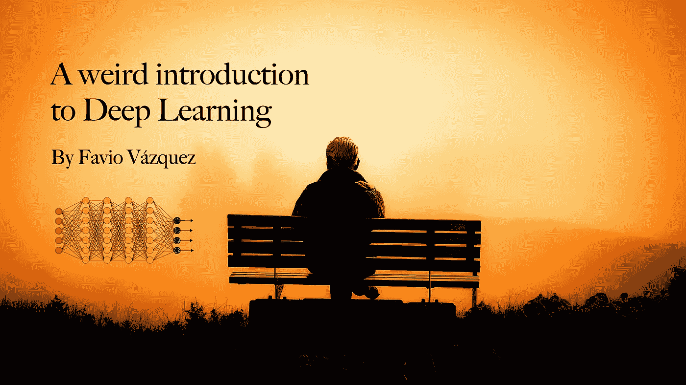
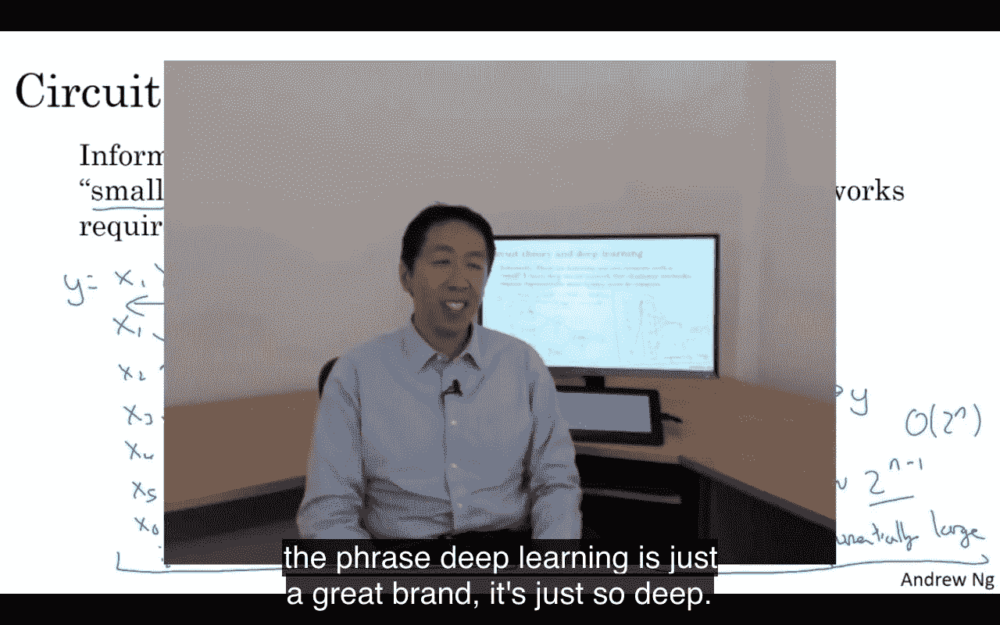
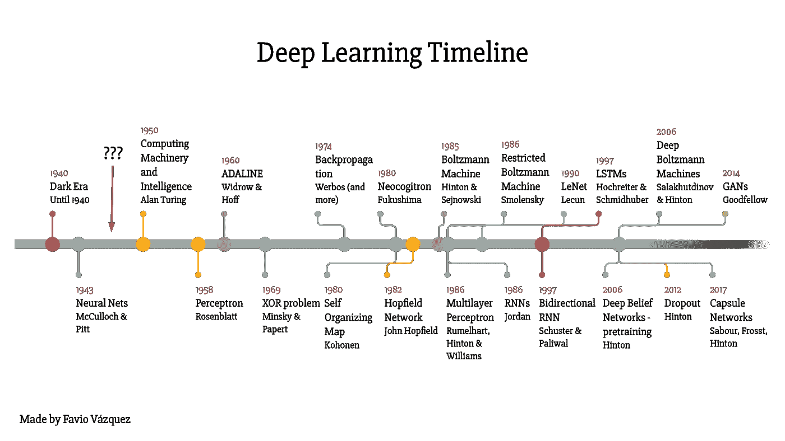
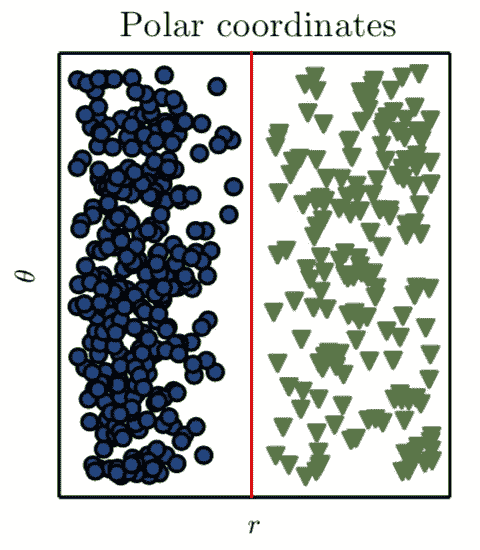
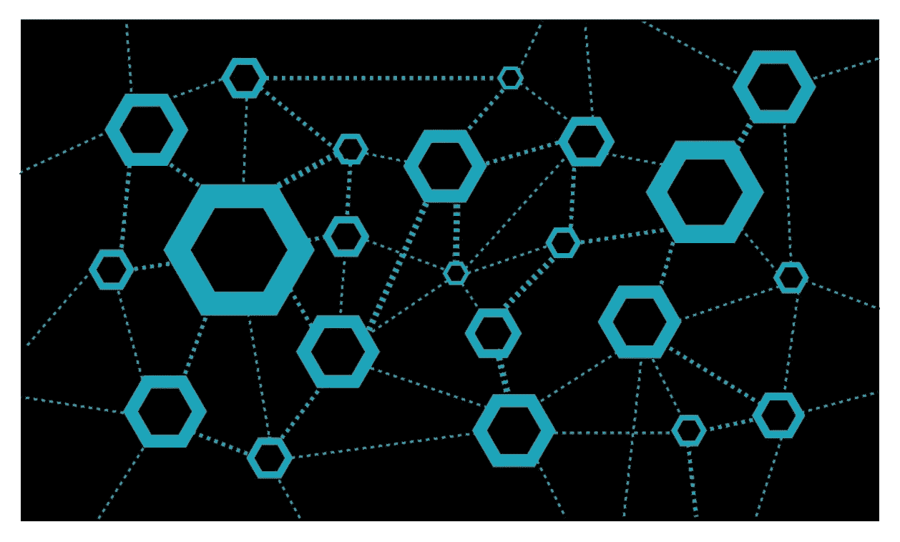
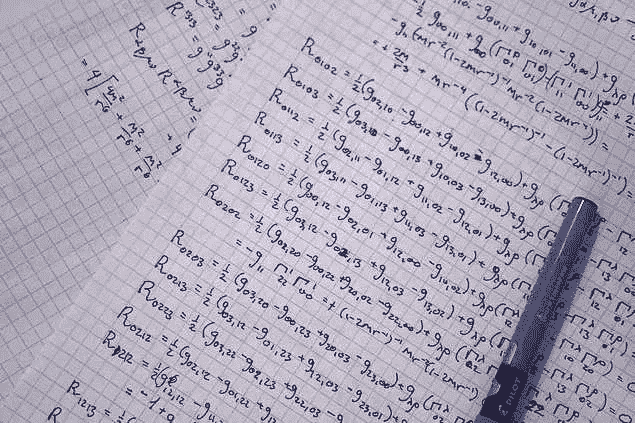

# 深度学习的“怪异”介绍

> 原文：<https://towardsdatascience.com/a-weird-introduction-to-deep-learning-7828803693b0?source=collection_archive---------3----------------------->

## 有关于深度学习的惊人介绍、课程和博文。但这是一种不同的介绍。西班牙语版[此处](https://medium.com/datos-y-ciencia/una-introducci%C3%B3n-extra%C3%B1a-al-deep-learning-3407e05e0483)。

有关于深度学习的惊人介绍、课程和博文。我将在参考资料部分列出其中一些，但这是一种不同的介绍。

但是为什么奇怪呢？也许是因为它不会遵循深度学习帖子的“正常”结构，在那里，你从数学开始，然后进入论文，实施，然后到应用程序。

这将更接近我之前关于[“我的深度学习之旅”](/my-journey-into-deep-learning-c66e6ef2a317)的帖子，我认为讲一个故事比只是到处扔信息和公式更有帮助。让我们开始吧。

**注意:这篇文章还有一个配套的网络研讨会。找到这里:**

 [## 网络研讨会- DeepCognition.ai

### 关于法维奥:物理学家和计算机工程师。拥有 UNAM 大学的物理学硕士学位。他在大…

deepcognition.ai](http://deepcognition.ai/resources/webinars/#intro-deep-learning) 

## 为什么我要做这个介绍？

有时候，把你的想法写下来是很重要的。我倾向于说很多话，并出席一些演示和会议，这是我用一点点知识为大家做贡献的方式。

深度学习(DL)对于数据科学、人工智能、技术和我们现在的生活来说是一个如此重要的领域，它值得所有人的关注。请不要说深度学习只是在一张神经网上加了一层，仅此而已，神奇！没有。我希望读完这篇文章后，你对 DL 有一个不同的看法。

## 深度学习时间线

我只是基于几篇论文和其他时间线创建了这个时间线，目的是让每个人都看到深度学习不仅仅是神经网络。理论上确实有了进步，软件和硬件也有了改进，这是我们走到今天所必需的。如果你想要的话，就给我发短信，我会发给你的。(文末找到我的联系人)。

## 深度学习有什么怪异之处？

深度学习已经存在很长时间了。那么，为什么它在过去的 5-7 年里变得如此重要？

正如我之前所说，直到 2000 年代末，我们仍然缺乏一种可靠的方法来训练非常深度的神经网络。如今，随着几项简单但重要的理论和算法改进的发展，硬件(主要是 GPU，现在是 TPU)的进步，以及数据的指数级生成和积累，DL 自然而然地适应了这一缺失点，以改变我们进行机器学习的方式。

深度学习也是一个活跃的研究领域，没有什么是固定或封闭的，我们仍在寻找最佳模型、**网络拓扑**、优化其超参数的最佳方法等等。就像其他活跃的科学领域一样，很难跟上研究的步伐，但这并不是不可能的。

关于拓扑和机器学习的补充说明(Hofer 等人的[具有拓扑签名的深度学习](https://arxiv.org/pdf/1707.04041.pdf)):

> 来自代数拓扑的方法最近才出现在机器学习社区中，最突出的是在术语拓扑数据分析(TDA)下。由于 TDA 使我们能够从数据中推断出相关的拓扑和几何信息，因此它可以为各种机器学习问题提供一种新颖且潜在有益的视角。

对我们来说幸运的是，有很多人通过像[吴恩达](https://www.deeplearning.ai) one 这样的课程、博客帖子等等来帮助理解和消化所有这些信息。

这对我来说很奇怪，或者说不常见，因为通常你必须等待一段时间(有时是几年)才能消化论文或研究期刊中的复杂信息。当然，大多数科学领域现在也很快从一篇论文变成一篇博客文章，告诉你你需要知道什么，但在我看来，DL 有不同的感觉。

## 深度学习和表征学习的突破

我们正在做一些非常令人兴奋的事情，该领域的大多数人都在说，深度学习论文中的最后一个想法(特别是神经网络或算法的新拓扑和配置，以改善它们的使用)是几十年来机器学习中最好的想法(记住，DL 是 ML 的一部分)。

到目前为止，我已经在这篇文章中多次使用了**学习**这个词。但是什么是学习呢？

在机器学习的上下文中，“学习”一词描述了一个自动搜索过程，以更好地表示您正在分析和研究的数据(请记住这一点，不是让计算机学习)。

对于这个领域来说，这是一个非常重要的词。别忘了这件事。什么是表示？这是一种**看数据的方式**。

让我给你举个例子，假设我告诉你，我要你画一条线，把这个图的蓝色圆圈和绿色三角形分开:

Ian Goodfellow et al. (Deep Learning, 2016)

> 这个例子来自 Ian Goodfellow 等人(2016)的深度学习的[书](http://www.deeplearningbook.org)。

所以，如果你想用一句台词，作者是这么说的:

> “…我们使用笛卡尔坐标表示一些数据，这是不可能的任务。”

如果我们记得线的概念，这是不可能的:

> 线是一个没有厚度的一维直线，向两个方向无限延伸。来自[沃尔夫拉姆数学世界](http://mathworld.wolfram.com/Line.html)。

那么案子输了吗？实际上不是。如果我们找到一种方法，用不同的方式表示这个数据，在某种程度上我们可以画一条直线来区分数据的类型。这是几百年前数学教给我们的东西。在这种情况下，我们需要的是一个坐标转换，所以我们可以用一种我们可以画这条线的方式来绘制或表示这些数据。如果我们看一下[极坐标变换](http://mathworld.wolfram.com/PolarCoordinates.html)，我们有解:

Ian Goodfellow et al. (Deep Learning, 2016)

就这样，现在我们可以画一条线:

因此，在这个简单的例子中，我们找到并选择了转换，以获得更好的手工表示。但是，如果我们创建一个系统，一个可以搜索不同表示(在这种情况下是坐标变化)的程序，然后找到一种方法来计算用这种新方法正确分类的类别的百分比，此时我们正在进行机器学习。

记住这一点非常重要，深度学习是使用不同类型的神经网络进行表示学习，并优化网络的超参数，以获得(学习)我们数据的最佳表示。

如果没有让我们达到深度学习当前状态的惊人突破，这是不可能的。这里我列举其中一些:

1.  **思路**:反向传播。

[**通过反向传播错误学习表征**](https://www.nature.com/articles/323533a0) 大卫·e·鲁梅尔哈特，杰弗里·e·辛顿&罗纳德·j·威廉姆斯。

Yann Lecun 的一个关于反向传播的理论框架。

2.**思路:**更好的初始化球网的参数。需要记住的是:初始化策略应该根据使用的激活函数来选择(下一步)。

 [## 深度网络的权重初始化-深度学习的实践方面

### 这个课程会教你让深度学习很好工作的“魔法”。而不是深度学习过程…

www.coursera.org](https://www.coursera.org/learn/deep-neural-network/lecture/RwqYe/weight-initialization-for-deep-networks)  [## 如何训练你的深度神经网络

### 为了有效地训练深度神经系统，深度学习中有一些特定的实践是非常值得推荐的。

rishy.github.io](http://rishy.github.io/ml/2017/01/05/how-to-train-your-dnn/)  [## 用于视觉识别的 CS231n 卷积神经网络

### 斯坦福 CS231n 课程材料和笔记:视觉识别的卷积神经网络。

cs231n.github.io](http://cs231n.github.io/neural-networks-2/#init) 

3.**思路:**更好的激活功能。这意味着，更快地逼近函数的更好方法导致更快的训练过程。

 [## 理解神经网络中的激活函数

### 最近，我的一个同事问了我几个类似“为什么我们有这么多激活功能？”，“为什么是…

medium.com](https://medium.com/the-theory-of-everything/understanding-activation-functions-in-neural-networks-9491262884e0)  [## 激活函数:神经网络

### Sigmoid，tanh，Softmax，ReLU，Leaky ReLU 解释！！！

towardsdatascience.com](/activation-functions-neural-networks-1cbd9f8d91d6) 

4.**想法:**退学。防止过度拟合的更好方法等等。

 [## 为了学得更好而学得更少——在(深度)机器学习中辍学

### 在这篇文章中，我将主要讨论神经网络中的辍学概念，特别是深度网络，然后是…

medium.com](https://medium.com/@amarbudhiraja/https-medium-com-amarbudhiraja-learning-less-to-learn-better-dropout-in-deep-machine-learning-74334da4bfc5) 

[辍学:防止神经网络过度拟合的简单方法](http://www.jmlr.org/papers/volume15/srivastava14a/srivastava14a.pdf?utm_content=buffer79b43&utm_medium=social&utm_source=twitter.com&utm_campaign=buffer)，斯里瓦斯塔瓦、辛顿等人的一篇伟大论文。

5.**思路:**卷积神经网络(CNN)。

[le Cun 等人将基于梯度的学习应用于文档识别](http://yann.lecun.com/exdb/publis/pdf/lecun-01a.pdf)

[用深度卷积神经网络进行 ImageNet 分类](https://papers.nips.cc/paper/4824-imagenet-classification-with-deep-convolutional-neural-networks.pdf)Krizhevsky 等人。

6.**思路:**剩余网(ResNets)。

 [## [1512.03385v1]图像识别的深度残差学习

### 摘要:越深的神经网络越难训练。我们提出了一个剩余学习框架，以减轻…

arxiv.org](https://arxiv.org/abs/1512.03385v1)  [## [1608.02908]剩余网络的剩余网络:多级剩余网络

### 摘要:具有数百甚至数千层的残差网络家族支配着主要的图像识别任务…

arxiv.org](https://arxiv.org/abs/1608.02908) 

7.**思路:**基于区域的 CNN。用于物体检测等。

 [## [1311.2524v5]用于精确对象检测和语义分割的丰富特征层次

### 摘要:在 PASCAL VOC 数据集上测量的目标检测性能，在过去几年中已经稳定下来…

arxiv.org](https://arxiv.org/abs/1311.2524v5)  [## [1703.06870]屏蔽 R-CNN

### 摘要:我们提出了一个概念上简单、灵活、通用的对象实例分割框架。我们的…

arxiv.org](https://arxiv.org/abs/1703.06870)  [## Facebook 研究/检测

### Detectron - FAIR 的对象检测研究平台，实现了 Mask R-CNN 和…

github.com](https://github.com/facebookresearch/Detectron) 

8.**思路:**递归神经网络(RNNs)和 LSTMs。

 [## 循环网络和 LSTMs 初学者指南

### 这篇文章的目的是给学习神经网络的学生一个关于神经网络功能的直觉

deeplearning4j.org](https://deeplearning4j.org/lstm.html)  [## 了解 LSTM 网络——colah 的博客

### 这些循环使得循环神经网络看起来有点神秘。然而，如果你想得更多一点，事实证明…

colah.github.io](http://colah.github.io/posts/2015-08-Understanding-LSTMs/)  [## 重复层- Keras 文档

### input_length:输入序列的长度，为常数时指定。如果您是…则此参数是必需的

keras.io](https://keras.io/layers/recurrent/) 

BTW:廖和 Poggio (2016)证明了 ResNets == RNNs，arXiv:1604.03640v1。

9.**想法:**生成对抗网络(GANs)。

 [## [1406.2661v1]生成性对抗网络

### 摘要:我们提出了一个新的框架，通过一个对抗的过程来估计生成模型，其中我们…

arxiv.org](https://arxiv.org/abs/1406.2661v1)  [## 纳舒里/甘斯-真棒-应用

### gans-awesome-applications -令人敬畏的 GAN 应用和演示的精选列表

github.com](https://github.com/nashory/gans-awesome-applications) 

**10。想法:**胶囊网络。

 [## 什么是 CapsNet 或胶囊网络？

### 什么是胶囊网？什么是胶囊？CapsNet 比卷积神经网络(CNN)好吗？这篇文章是…

hackernoon.com](https://hackernoon.com/what-is-a-capsnet-or-capsule-network-2bfbe48769cc)  [## 理解辛顿的胶囊网络。第一部分:直觉。

### 理解 Hinton 的胶囊网络系列的一部分:

medium.com](https://medium.com/ai%C2%B3-theory-practice-business/understanding-hintons-capsule-networks-part-i-intuition-b4b559d1159b)  [## 人工智能/胶囊网络

### capsule-networks——NIPS 2017 论文《胶囊间动态路由》的 PyTorch 实现。

github.com](https://github.com/gram-ai/capsule-networks) 

还有许多其他的，但我认为这些是真正重要的理论和算法突破，正在改变世界，并为 DL 革命提供了动力。

## 深度学习如何入门？

开始并不容易，但我会尽力指导你完成这个过程。查看这些资源，但是记住，这不仅仅是看视频和读论文，这是关于理解，编程，编码，失败，然后让它发生。

-1.学习 Python 和 R；)

0. [**吴恩达**](https://www.linkedin.com/in/andrewyng/) 和 [**Coursera**](https://www.linkedin.com/company/2453129/) (你知道，他不需要介绍):

 [## 深度学习| Coursera

### 来自 deeplearning.ai 的深度学习如果你想打入 ai，这个专精会帮你做到。深…

www.coursera.org](https://www.coursera.org/specializations/deep-learning) 

Siraj Raval :他太棒了。他有能力用一种有趣而简单的方式来解释难以理解的概念。在他的 YouTube 频道上关注他。特别是这个播放列表:

—智能的数学:

—深度学习简介:

3.[**Fran ois Chollet**](https://www.linkedin.com/in/fchollet/)的书:用 Python 进行深度学习(和 R):

 [## 使用 Python 进行深度学习

### 我见过的对深度学习最清晰的解释...阅读是一种乐趣。

www.manning.com](https://www.manning.com/books/deep-learning-with-python)  [## 用 R 进行深度学习

### 我见过的对深度学习最清晰的解释...阅读是一种乐趣。

www.manning.com](https://www.manning.com/books/deep-learning-with-r) 

3. [**IBM 认知类**](https://www.linkedin.com/school/3153548/?legacySchoolId=3153548) :

 [## 深度学习基础

### 关于这门课，上一堂速成课，学习内容是什么，以及如何学习更多。深度学习…

cognitiveclass.ai](https://cognitiveclass.ai/courses/introduction-deep-learning/)  [## 使用 TensorFlow 进行深度学习

### 这个深度学习用 TensorFlow 的课程重点是 TensorFlow。如果你是深度学习的新手…

cognitiveclass.ai](https://cognitiveclass.ai/courses/deep-learning-tensorflow/) 

5. [**DataCamp**](https://www.linkedin.com/company/3227175/) :

 [## Python 中的深度学习

### 深度学习是机器人等不同领域中最令人兴奋的能力背后的机器学习技术…

www.datacamp.com](https://www.datacamp.com/courses/deep-learning-in-python)  [## keras:R 中的深度学习

### 正如你现在所知道的，机器学习是计算机科学(CS)中的一个子领域。那么，深度学习是…

www.datacamp.com](https://www.datacamp.com/community/tutorials/keras-r-deep-learning) 

## 分布式深度学习

深度学习是数据科学家应该学习的最重要的工具和理论之一。我们非常幸运地看到了不起的人创造了专门用于 DL 任务的研究、软件、工具和硬件。

DL 的计算成本很高，尽管理论、软件和硬件都有所进步，但我们需要大数据和分布式机器学习的发展来提高性能和效率。伟大的人和公司正在为加入分布式框架(Spark)和 DL 库(TF 和 Keras)做出惊人的努力。

以下是一个概述:

1.  **:深度学习管道(即将合并为 Spark)**

 **[## 概述-深度学习管道 0.2.0 文档

### 深度学习管道 0.2.0 文档主页

databricks.github.io](https://databricks.github.io/spark-deep-learning/site/index.html)** 

**2.Elephas:与 Keras & PySpark 合作的分布式 DL:**

** [## maxpumperla/elevas

### elephas -使用 Keras & Spark 的分布式深度学习

github.com](https://github.com/maxpumperla/elephas) 

[**3。雅虎！Inc .**](https://www.linkedin.com/company/1288/):TensorFlowOnSpark:

 [## 雅虎/tensorflownspark

### TensorFlowOnSpark 将 TensorFlow 程序引入 Apache Spark 集群

github.com](https://github.com/yahoo/TensorFlowOnSpark) 

[**4。CERN**](https://www.linkedin.com/company/157302/) 分布式 Keras (Keras + Spark):

 [## cerndb/dist-keras

### dist-keras -分布式深度学习，重点是分布式训练，使用 keras 和 Apache Spark。

github.com](https://github.com/cerndb/dist-keras) 

[**5。Qubole**](https://www.linkedin.com/company/2531735/) (教程 Keras + Spark):

 [## 基于 Apache Spark | Qubole 的 Keras 分布式深度学习

### 深度学习已经被证明可以在不同的领域产生高效的机器学习模型。一些…

www.qubole.com](https://www.qubole.com/blog/distributed-deep-learning-keras-apache-spark/) 

[**6。英特尔公司**](https://www.linkedin.com/company/1053/):BigDL(Apache Spark 分布式深度学习库)

 [## 英特尔分析/BigDL

### BigDL:Apache Spark 的分布式深度学习库

github.com](https://github.com/intel-analytics/BigDL) 

7.张量流和星火上[T5【谷歌】T6](https://www.linkedin.com/company/1441/)云:

 [## 在 Google 云平台上使用 Apache Spark 和 tensor flow | Google Cloud 大数据和机器…

### Apache Spark 和 TensorFlow 都是开源项目，在企业领域产生了重大影响…

cloud.google.com](https://cloud.google.com/blog/big-data/2017/11/using-apache-spark-with-tensorflow-on-google-cloud-platform) 

## 通过深度学习完成任务

正如我之前说过的，这个领域最重要的时刻之一是 [TensorFlow](https://www.tensorflow.org) 的创建和开源。

TensorFlow 是一个使用数据流图进行数值计算的开源软件库。图中的节点表示数学运算，而图边表示它们之间通信的多维数据数组(**张量**)。

上图中你看到的是广义相对论中[黎曼张量的张量操作。](http://mathworld.wolfram.com/RiemannTensor.html)

**数学上定义的张量**，仅仅是在坐标变化下按照一定规则变换的数字或函数的数组。

但在机器学习和深度学习的范围内，张量是向量和矩阵向潜在的更高维度的推广。在内部，TensorFlow 将张量表示为基本数据类型的 n 维数组。

我们在 DL 中一直大量使用张量，但是你不需要成为它们的专家来使用它。你可能需要对它们有所了解，所以我在这里列出了一些好的资源:

 [## 深度学习 101:揭开张量之谜

### 张量和新的机器学习工具，如 TensorFlow，是这些天的热门话题，尤其是在寻找…

www.kdnuggets.com](https://www.kdnuggets.com/2017/06/deep-learning-demystifying-tensors.html)  [## 数学不好就学人工智能——P4——天象画报(有猫！)

### 如果你数学很差，欢迎来到学习人工智能的第四部分。如果您错过了第 1、2、3、5、6 和 7 部分，请务必检查它们…

hackernoon.com](https://hackernoon.com/learning-ai-if-you-suck-at-math-p4-tensors-illustrated-with-cats-27f0002c9b32) 

在你检查完这些之后，我之前提到的突破以及像 TensorFlow 或 Keras 这样的编程框架(关于 Keras 的更多信息，请访问[这里](https://becominghuman.ai/deep-learning-made-easy-with-deep-cognition-403fbe445351))，现在我想你已经知道你需要理解和使用深度学习了。

但是到目前为止，我们用 DL 取得了什么成就呢？仅举几个例子(摘自 Franç ois Chollet 关于 DL 的书):

*   接近人类水平的图像分类。
*   接近人类水平的语音识别。
*   接近人类水平的手写转录。
*   改进的机器翻译。
*   改进的文本到语音转换。
*   Google Now 或亚马逊 Alexa 等数字助手。
*   接近人类水平的自动驾驶。
*   谷歌、百度和必应使用的改进的广告定位。
*   改进的网络搜索结果。
*   回答自然语言问题。
*   超人去玩。

还有更多。以下是 DL 的 30 个伟大而有趣的应用:

 [## 深度学习的 30 个惊人应用

### 在过去的几年里，深度学习被应用于数百个问题，从计算机视觉到自然…

www.yaronhadad.com](http://www.yaronhadad.com/deep-learning-most-amazing-applications/) 

思考深度学习的未来(用于编程或构建应用程序)，我会重复我在其他帖子中说过的话。

我真的认为 GUI 和 AutoML 是用深度学习完成事情的不远的将来。不要误解我，我喜欢编码，但是我认为我们明年要写的代码数量会减少。

我们不能花这么多时间在世界范围内一遍又一遍地编写相同的东西，所以我认为这两个特性(GUI 和 AutoML)将帮助数据科学家提高生产率和解决更多的问题。

在简单的 GUI 中完成这些任务的最好的免费平台之一是 [Deep Cognition](http://deepcognition.ai) 。它们简单的拖放界面可以帮助你轻松设计深度学习模型。深度学习工作室可以自动为你的定制数据集设计深度学习模型，这要归功于他们先进的 **AutoML** 功能，几乎只需一次点击。

在这里，您可以了解更多关于它们的信息:

 [## 深度认知——今天就成为一个人工智能驱动的组织

### 无需编码即可设计、训练和部署深度学习模型。深度学习工作室简化并加速了…

deepcognition.ai](http://deepcognition.ai) 

看看价格:哦，这是免费的:)

我的意思是，现在这个领域的发展速度之快令人惊讶，我们可以用简单的图形用户界面来与我在这篇文章中谈到的所有困难而有趣的概念进行交互。

我喜欢这个平台的一点是，你仍然可以通过命令行或他们的笔记本进行编码，与 TensorFlow，Keras，Caffe，MXNet 等交互，而无需安装任何东西。您同时拥有笔记本和 CLI！

我向他们和他们对社会的贡献脱帽致敬。

你可以免费或花很少的钱尝试深度学习的其他有趣应用有(其中一些在私人测试版上):

 [## Skejul -简化未来...

### 如果是在未来，那就是在斯克尤尔...使用 Skejul 的上下文感知预测计算平台设置您的会议…

skejul.com](http://skejul.com)  [## 视觉障碍者的视觉人工智能|会说话的相机应用程序

### 一个免费的应用程序，讲述你周围的世界。专为低视力群体，这个研究项目利用…

www.microsoft.com](https://www.microsoft.com/en-us/seeing-ai/)  [## 对话流

### 对话式用户体验平台。

dialogflow.com](https://dialogflow.com) 

感谢阅读这篇关于深度学习的怪异介绍。我希望它能帮助你在这个神奇的领域开始，或者只是发现一些新的东西。

如果您有任何问题，请在 LinkedIn 上添加我，我们将在那里聊天:

 [## Favio Vázquez -数据科学家/工具经理 MX - BBVA 数据&分析| LinkedIn

### 查看 Favio Vázquez 在世界上最大的职业社区 LinkedIn 上的个人资料。Favio 有 12 个工作列在他们的…

www.linkedin.com](https://www.linkedin.com/in/faviovazquez/)**