# 对抗性自动编码器的向导指南:第 1 部分，自动编码器？

> 原文：<https://towardsdatascience.com/a-wizards-guide-to-adversarial-autoencoders-part-1-autoencoder-d9a5f8795af4?source=collection_archive---------2----------------------->

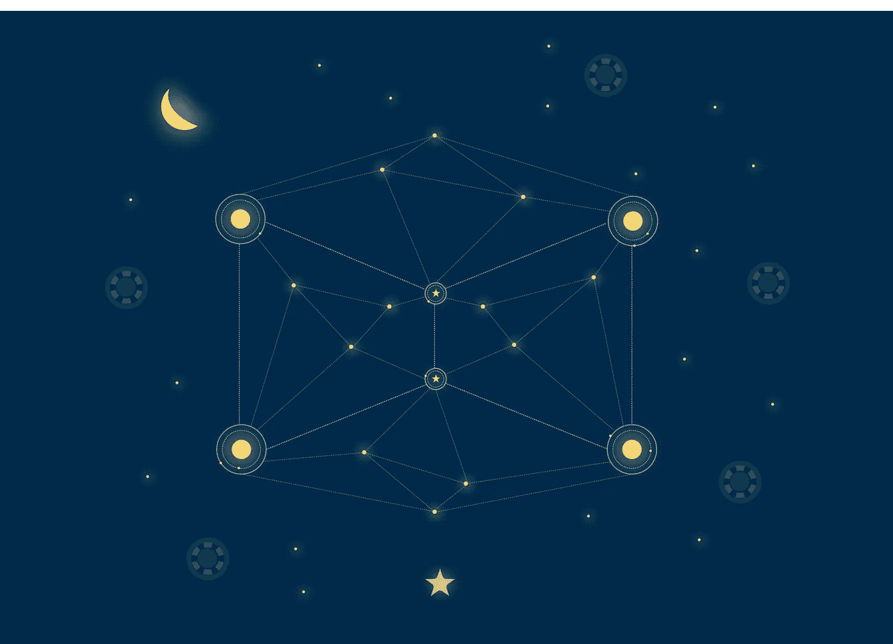

*“如果你知道如何使用 Tensorflow 编写代码来对 MNIST 数字进行分类，那么你就可以阅读这篇文章的其余部分，否则我强烈建议你浏览 Tensorflow 网站上的这篇文章*

> **“我们现在知道，我们不需要任何新的重大突破来实现真正的人工智能。**
> 
> **这是完全，完全，荒谬的错误。正如我在前面的陈述中所说的:大多数人类和动物的学习是无监督的学习。如果智能是一块蛋糕，无监督学习就是蛋糕，监督学习就是蛋糕上的糖衣，强化学习就是蛋糕上的樱桃。**
> 
> **我们知道如何做糖霜和樱桃，但是我们不知道如何做蛋糕。在我们能够想到真正的人工智能之前，我们需要解决无监督学习的问题。这只是我们知道的一个障碍。那些我们不知道的呢？"**

**这是在 alpha go[获胜](https://en.wikipedia.org/wiki/AlphaGo_versus_Lee_Sedol)后，脸书人工智能研究主任阎乐存(我知道，另一个是阎乐存)的一句话。**

**我们知道，卷积神经网络(CNN)或在某些情况下密集的全连接层(MLP——一些人喜欢称之为多层感知器)可以用来执行图像识别。但是，CNN(或 MLP)不能单独用于执行任务，如从图像中分离内容和风格，生成真实的图像(生成模型)，使用非常小的标签集对图像进行分类或执行数据压缩(如压缩文件)。**

**这些任务中的每一个都可能需要它自己的架构和训练算法。但是，如果我们能够只使用一个架构来实现上述所有任务，这不是很酷吗？一个对抗性的自动编码器(以半监督方式训练的编码器)可以使用一种架构完成所有这些任务。**

**我们将构建一个对抗性的自动编码器，它可以压缩数据(以有损的方式压缩 MNIST 数字)，分离数字的样式和内容(生成不同样式的数字)，使用标记数据的一个小子集对它们进行分类，以获得高分类精度(仅使用 1000 个标记数字，大约 95%！)并且最后还充当生成模型(以生成看起来真实的假数字)。**

**在我们进入对抗性自动编码器的理论和实现部分之前，让我们后退一步，讨论一下自动编码器，看看一个简单的 tensorflow 实现。**

**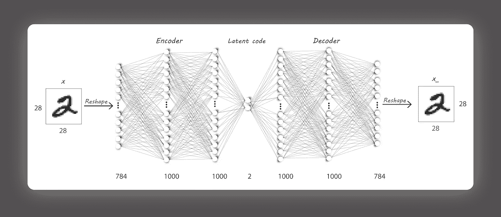**

**Autoencoder Architecture**

**自动编码器是一种神经网络，它被训练以产生与其输入非常相似的输出(因此它基本上试图将其输入复制到其输出)，并且由于它不需要任何目标(标签)，所以它可以以无人监督的方式进行训练。**

**它有两个部分:**

1.  *****编码器:*** 它接收一个输入 **x** (这可以是图像、文字嵌入、视频或音频数据)并产生一个输出 **h** (其中 **h** 通常具有比 **x** 更低的维度)。例如，编码器可以接收大小为 100 x 100 的图像 **x** ，并产生大小为 100 x 1(可以是任何大小)的输出 **h (** 也称为*潜在代码*)。在这种情况下，编码器只是压缩图像，这样它将占用更低的维度空间，这样我们现在可以看到 **h** (大小为 100 x 1)可以使用比直接存储图像 **x** 少 100 倍的内存来存储(这将导致一些数据丢失)。**

***我们来想一个像 WinRAR 这样的压缩软件(还在免费试用？)可用于压缩文件，以获得占用空间较少的 zip(或 rar，…)文件。自动编码器架构中的编码器执行类似的操作。***

**如果编码器由函数 **q、**表示，则**

**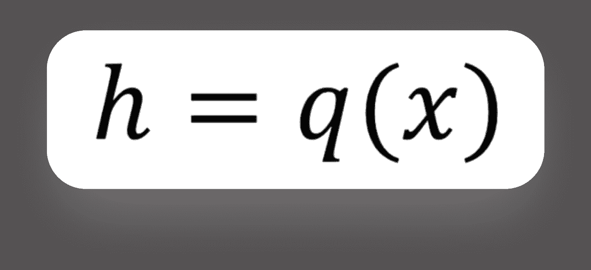**

**Encoder**

**2. ***解码器:*** 它接收编码器 **h** 的输出，并试图在其输出端重建输入。继续编码器示例， **h** 现在的大小为 100 x 1，解码器尝试使用 **h** 恢复原始的 100 x 100 图像。我们将训练解码器从 **h** 中获取尽可能多的信息，以重建 **x** 。**

***所以，解码器的操作类似于对 WinRAR 执行解压缩。***

**如果函数 **p** 代表我们的解码器，则重建图像 **x_** 为:**

**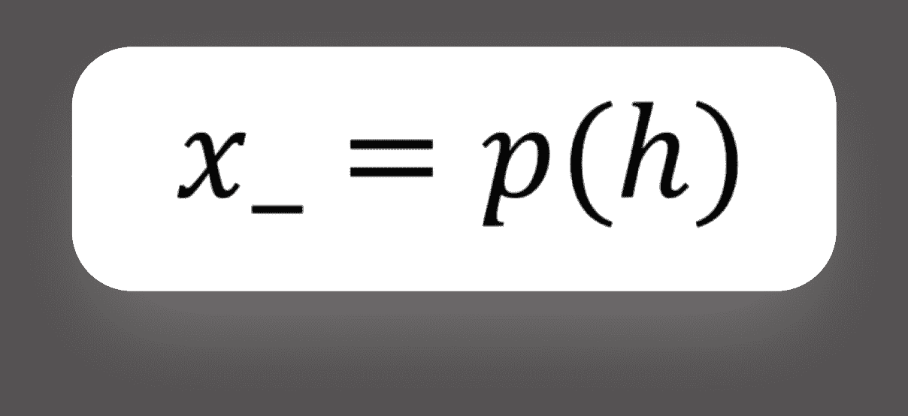**

**Decoder**

**只有当输入相关时(如来自同一域的图像)，降维才有效。如果我们每次训练自动编码器时都传递完全随机的输入，那么它就会失败。因此，最终，给定一个输入，自动编码器可以产生更低维度的输出(在编码器处)，非常类似于主成分分析( [PCA](https://en.wikipedia.org/wiki/Principal_component_analysis) )。由于我们在训练过程中不需要使用任何标签，这也是一个无人监管的模型。**

> **但是，除了降维，自动编码器还能用来做什么呢？**

*   **图像[去噪](http://www.jmlr.org/papers/volume11/vincent10a/vincent10a.pdf)其中可以使用有噪声的图像生成清晰无噪声的图像。**

**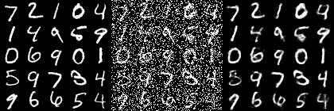**

**Denoising autoencoder example on handwritten digits. Source: [https://www.doc.ic.ac.uk/~js4416/163/website/autoencoders/denoising.html](https://www.doc.ic.ac.uk/~js4416/163/website/autoencoders/denoising.html)**

*   **[语义哈希](http://www.cv-foundation.org/openaccess/content_cvpr_2015/papers/Carreira-Perpinan_Hashing_With_Binary_2015_CVPR_paper.pdf)降维可以用来加快信息检索(我发现这很有趣！).**
*   **最近，以对抗方式训练的自动编码器可以用作生成模型(我们将在后面更深入地讨论)。**

**我将这篇文章分为四个部分:**

*   ****第 1 部分:**自动编码器？**

***我们将从使用 Tensorflow 实现一个简单的自动编码器开始，并减少 MNIST(你肯定知道这个数据集是关于什么的)数据集图像的维数。***

*   ****第二部分:**用对抗性的自动编码器探索潜在空间。**

***我们将使用对抗学习对潜在代码(编码器的输出)引入约束。***

*   ****第三部分:**风格与内容的解开。**

***在这里，我们将使用相同的书写风格生成不同的图像。***

*   ****第四部分:**用 1000 个标签给 MNIST 分类。**

***我们将训练一个 AAE 来对 MNIST 数字进行分类，仅使用 1000 个带标签的输入就能获得大约 95%的准确率(令人印象深刻啊？).***

**让我们从了解我们需要实现的网络架构开始第一部分。**

**如前所述，自动编码器(AE)由编码器和解码器两部分组成，让我们从一个简单的密集全连接编码器架构开始:**

**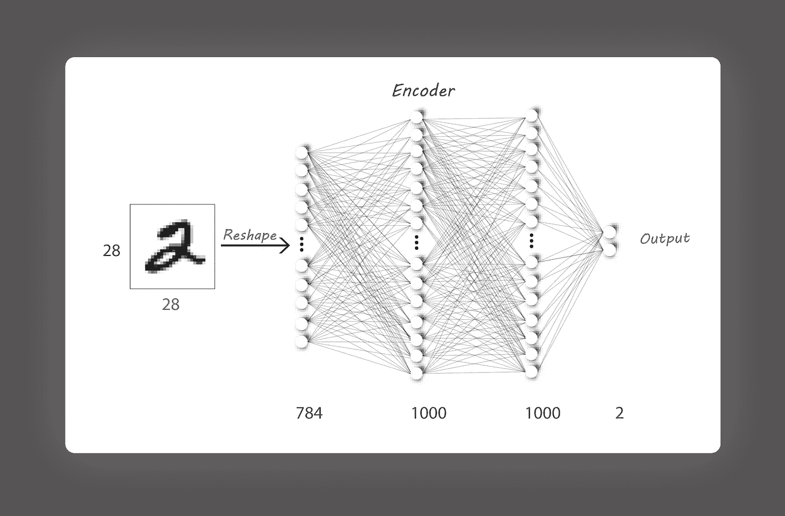**

**Encoder Architecture**

**它包括一个具有 784 个神经元的输入层(因为我们已经将图像展平为一维)，两组 1000 个 ReLU 激活的神经元形成隐藏层，一个由 2 个未激活的神经元组成的输出层提供潜在代码。**

**如果你只是想得到代码，请点击以下链接:**

** [## naresh 1318/Adversarial _ 自动编码器

### 在 GitHub 上创建一个帐户，为 Adversarial_Autoencoder 的开发做出贡献。

github.com](https://github.com/Naresh1318/Adversarial_Autoencoder) 

为了在 Tensorflow 中实现上述架构，我们将从一个`dense()`函数开始，该函数将帮助我们在给定输入`x`、输入处的神经元数量`n1`和输出处的神经元数量`n2`的情况下构建一个密集的全连接层。`name`参数用于设置`variable_scope`的名称。更多关于共享变量和使用变量作用域的内容可以在这里找到(我强烈推荐看一看)。

我使用了`tf.get_variable()`而不是`tf.Variable()`来创建权重和偏差变量，这样我们就可以在以后重用训练好的模型(单独使用编码器或解码器)来传递任何想要的值，并查看它们的输出。

接下来，我们将使用这个`dense()`函数来实现编码器架构。代码很简单，但是请注意，我们没有在输出中使用任何激活。

*   `reuse` 标志用于重用训练过的编码器架构。
*   这里`input_dim = 784, n_l1 = 1000, n_l2 = 1000, z_dim = 2`。

解码器以类似的方式实现，我们需要的架构是:

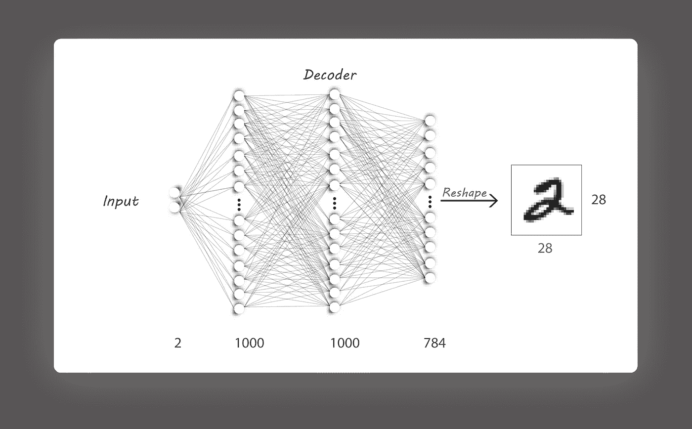

Decoder Architecture

我们将再次使用`dense()`函数来构建我们的解码器。然而，我对输出层使用了 sigmoid 激活，以确保输出值的范围在 0 和 1 之间(与我们的输入范围相同)。

*   `z_dim = 2, n_l2 = 1000, n_l1 = 1000, input_dim = 784`与编码器相同。

编码器输出可以像这样连接到解码器:

这就形成了与架构图所示完全相同的自动编码器架构。我们将通过占位符`x_input`(大小:batch_size，784)传递输入，将目标设置为与`x_input`相同，并将`decoder_output`与`x_input`进行比较。

使用的损失函数是均方误差(MSE ),其找到输入(`x_input`)和输出图像(`decoder_output`)中的像素之间的距离。我们称之为重建损失，因为我们的主要目的是在输出端重建输入。

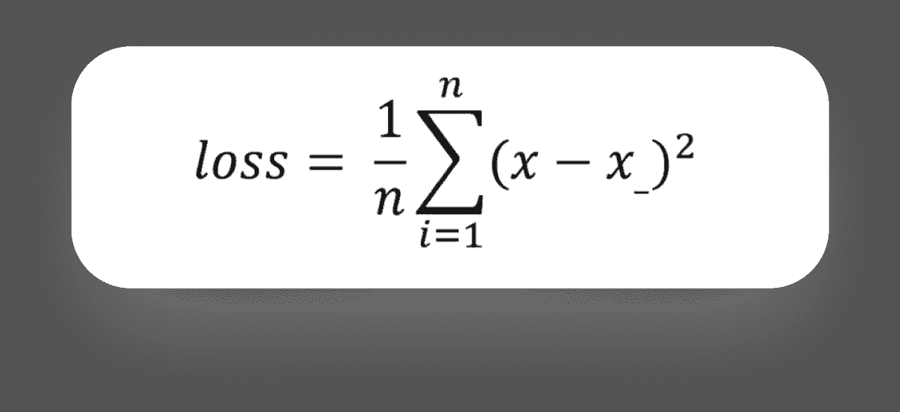

Mean Squared Error

这只不过是输入和输出之间的平方差的平均值。这可以很容易地在 Tensorflow 中实现，如下所示:

我用过的优化器是 AdamOptimizer(随意尝试新的，我还没有在别人身上试验过)，学习率为 0.01，beta1 为 0.9。它可在 Tensorflow 上直接获得，使用方法如下:

请注意，我们使用相同的损失函数通过编码器和解码器进行反向传播。(我可以使用`minimize()`方法下的`var_list`参数只改变编码器或解码器的权重。由于我没有提到任何，它默认为所有的可训练变量。)

最后，我们通过使用 100 的批量大小传入我们的 MNIST 图像并使用同样的 100 个图像作为目标来训练我们的模型。

github 上有完整的代码:

 [## naresh 1318/Adversarial _ 自动编码器

### 在 GitHub 上创建一个帐户，为 Adversarial_Autoencoder 的开发做出贡献。

github.com](https://github.com/Naresh1318/Adversarial_Autoencoder/blob/master/autoencoder.py) 

## **注意事项:**

*   `generate_image_grid()`函数通过向经过训练的解码器传递一组数字来生成图像网格(这就是`get_variable` 派上用场的地方)。
*   每次运行都会在以下位置生成所需的张量板文件:

`./Results/<model>/<time_stamp_and_parameters>/Tensorboard`

*   训练日志存储在:

`./Results/<model>/<time_stamp_and_parameters>/log/log.txt`文件。

*   将`train`标志设置为`True`以训练模型，或者将其设置为`False`以显示某些随机输入的解码器输出。

我已经训练了 200 个时期的模型，并显示了损失的变化和下面生成的图像:

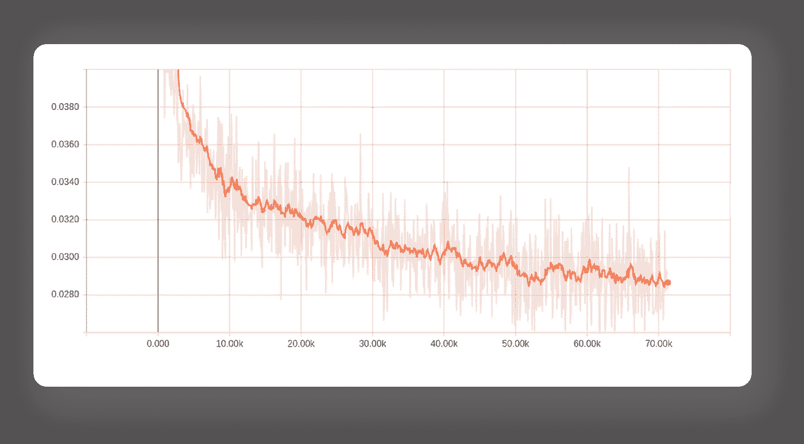

Variation of reconstruction loss

重建损失正在减少，这正是我们所希望的。

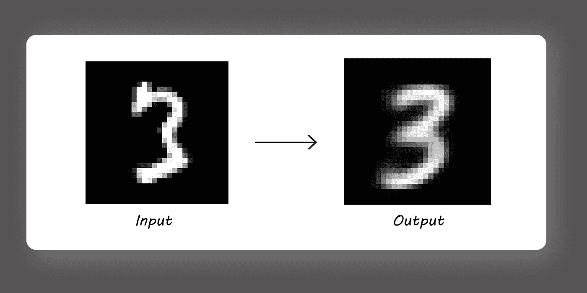

Generated Images

请注意，解码器是如何通过移除输入 3 顶部的线条等小的不规则性来概括输出 3 的。

现在，如果我们只考虑经过训练的解码器，并传入一些随机数(我已经传入 0，0，因为我们只有一个 2-D 潜在代码)作为输入，我们应该得到一些正确的数字？

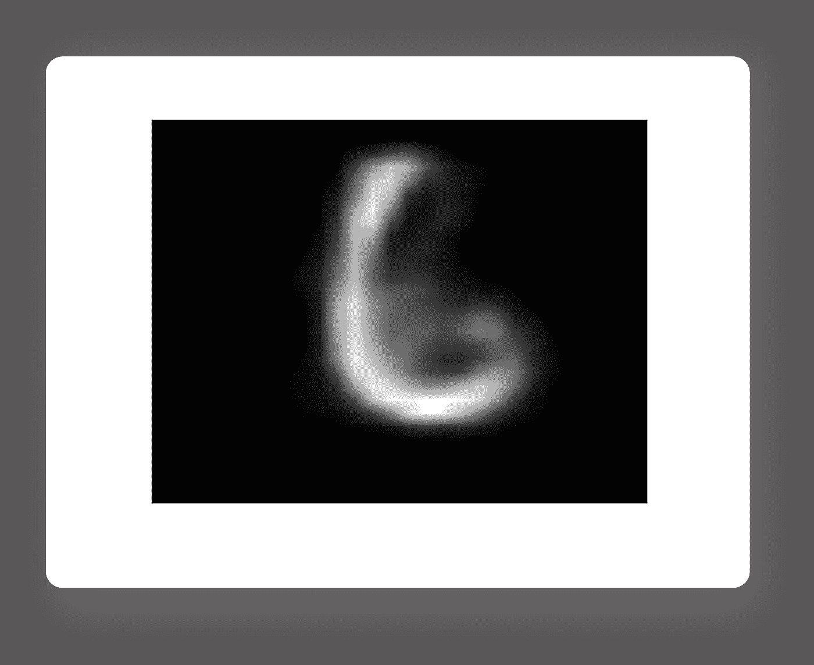

Decoder Output at (0, 0)

但这根本不能代表一个明确的数字(好吧，至少对我来说)。

其原因是因为编码器输出没有覆盖整个 2-D 潜在空间(在其输出分布中有很多间隙)。因此，如果我们在训练阶段输入编码器没有输入到解码器的值，我们会得到看起来很奇怪的输出图像。这可以通过在产生潜在代码时将编码器输出限制为具有随机分布(比如平均值为 0.0 且标准偏差为 2.0 的正态分布)来克服。这正是对抗性自动编码器所能做到的，我们将在第二部分中研究它的实现。

> **再看看封面图片！！**
> 
> **懂了吗？**

希望你喜欢这篇关于自动编码器的短文。我会公开鼓励任何批评或建议来改进我的工作。

如果你认为这个内容值得分享点击❤️，我喜欢它发送给我的通知！！

→第 2 部分:[用对抗性自动编码器探索潜在空间。](https://medium.com/towards-data-science/a-wizards-guide-to-adversarial-autoencoders-part-2-exploring-latent-space-with-adversarial-2d53a6f8a4f9)**