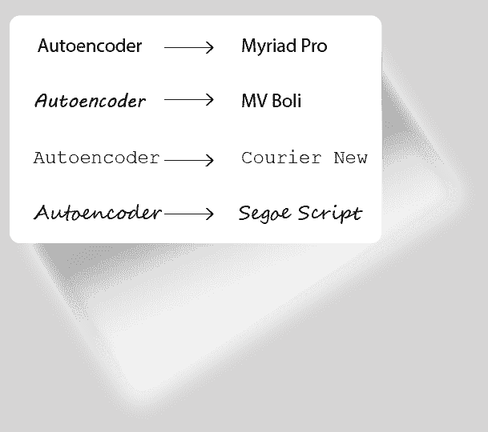
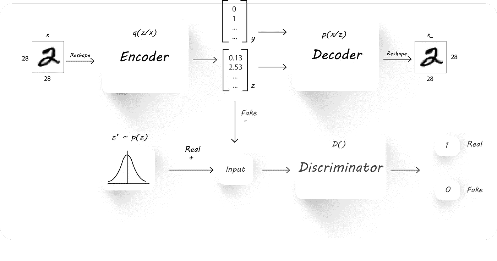
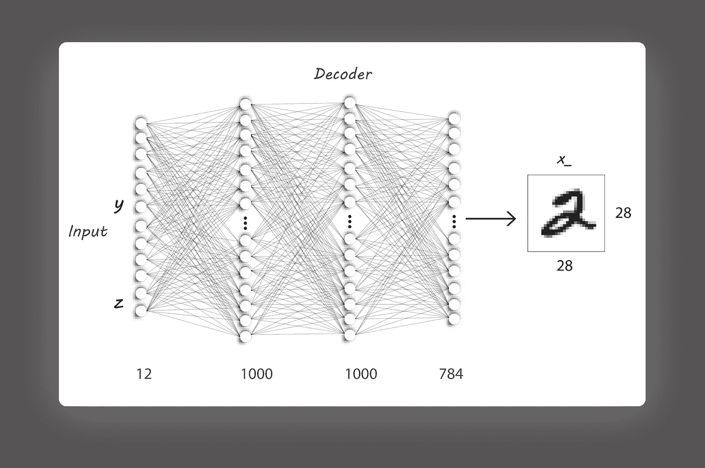
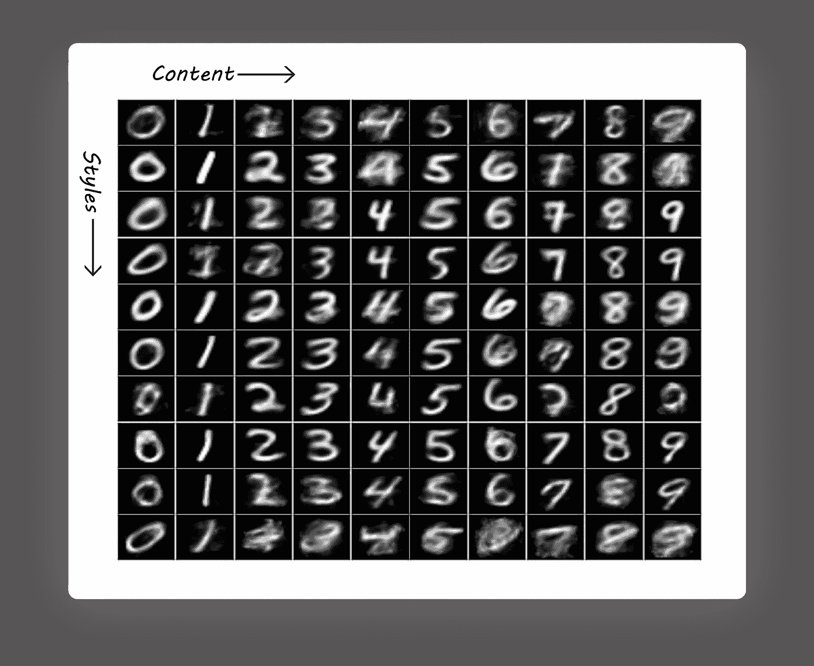
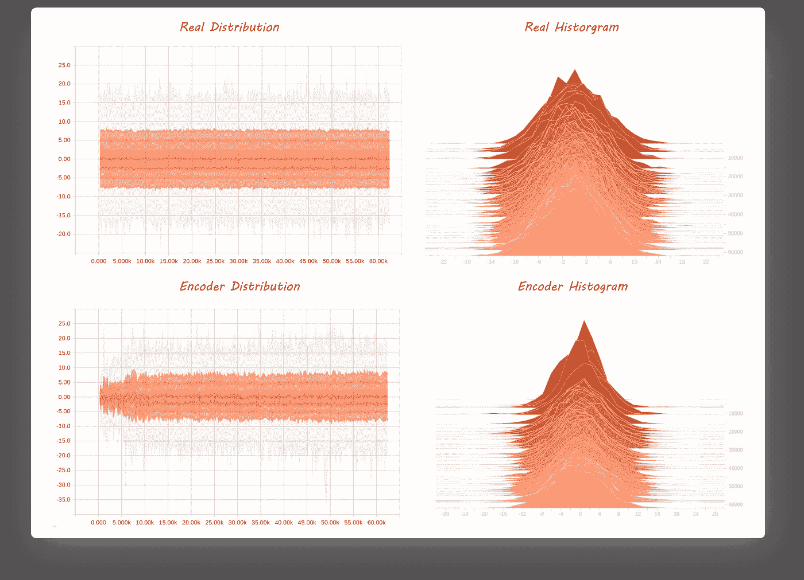

# 对抗性自动编码器的向导指南:第 3 部分，风格和内容的分离。

> 原文：<https://towardsdatascience.com/a-wizards-guide-to-adversarial-autoencoders-part-3-disentanglement-of-style-and-content-89262973a4d7?source=collection_archive---------2----------------------->

“如果你已经阅读了前两部分，你会觉得在实现这一部分时如鱼得水。”

←第二部分:[用对抗性的自动编码器探索潜在空间。](https://medium.com/towards-data-science/a-wizards-guide-to-adversarial-autoencoders-part-2-exploring-latent-space-with-adversarial-2d53a6f8a4f9)

第 1 部分和第 2 部分主要关注自动编码器和对抗性自动编码器的入门。我们从一个简单的 AE (vanilla one)开始，对其架构和训练算法进行了一些更改，最终得到了一个 AAE。这一部分延续了这一趋势，改变了 AAE 的建筑风格，同时在训练方式上做了小小的改变。

*我已经在我的 repo 中创建了所有的 python 文件，这样一个零件所需的每一个文件都可以通过一些小的修改从先前的文件中获得。我建议您阅读这篇文章的理论部分，并尝试修改第 2 部分的代码来实现第 3 部分。*

我们每个人都有自己独特的写作风格，无论是写信还是签名。我们书写某些字符的方式，我们经常用来造句的词语，甚至一个人在纸上施加的压力都是定义独特笔迹的特征。随着所有这些事情的发生，伪造笔迹会变得非常困难和昂贵。让我们尝试从 MNIST 数据集中学习写作风格，并使用它来输出具有相同风格的图像。我们将只关注写作风格，而不是句子的结构或作者的思维过程。

要清楚了解什么是风格和内容，请看下图:

Style and Content

每个文本都有相同的内容“自动编码器”，但风格不同。我们现在的任务是从图像中分离出风格(Myriad Pro，MV Boil，…)和内容。

理清各种特征在表征学习中非常重要(更多信息请点击[这里](http://www.cl.uni-heidelberg.de/courses/ws14/deepl/BengioETAL12.pdf))。

我们遇到的自动编码器和对抗性自动编码器都是以无监督的方式训练的(在训练期间没有使用任何标签)。使用来自图像的标签信息允许 AAE 专注于学习提取图像中的样式，而不考虑其内容。利用图像标签使它成为一个监督模型。

我们需要完成的架构与我们在第 2 部分中看到的非常相似。

AAE Architecture

这里，代替在解码器处直接使用潜在代码 ***z*** (编码器的输出)来恢复输入图像( ***x*** )，我们也传入图像标签( ***y*** )。现在，解码器的输入有两部分:

*   来自编码器的潜在代码**z**。
*   图像标签的一个热表示(姑且称之为 ***y*** )。

我们像往常一样训练 AAE，只是对重建阶段做了一点修改:

*   **重建阶段:**我们将输入图像传入编码器以获得潜在代码 ***z*** ，稍后，将潜在代码( ***z*** ，编码器的输出)和图像标签( ***y*** )组合以获得更大的列向量，然后将其馈送给我们的解码器。我们像往常一样训练 AE 以最小化重建损失。因为图像标签被馈送到解码器，所以编码器在训练期间学习图像的风格，并且解码器使用来自标签的内容信息和来自编码器的风格信息来重构输入图像。
*   **正规化阶段:**与我们在[第二部](https://medium.com/towards-data-science/a-wizards-guide-to-adversarial-autoencoders-part-2-exploring-latent-space-with-adversarial-2d53a6f8a4f9)中看到的完全相似。

现在，让我们只是添加图像标签到我们的 AAE，并检查结果。

由于我们需要一个热图像标签，解码器架构将具有更大数量的输入神经元[10 + *z_dim* ] (10 因为我们有十个类，并且 *z_dim* 是编码器输出的大小，例如， *z_dim* 可以是 2)。

Decoder Architecture

> 现在是时候停止阅读并修改第 2 部分的代码了。稍后回来看看代码和结果。

改进的解码器架构:

我们还需要在培训期间输入图像标签，这非常简单:

我刚刚在调用`mnist_train_next_batch()`函数时用`batch_y`替换了`_`，并将这些标签用作`y_input`占位符的输入。

我用以下参数训练了 AE:

注意，我使用了`z_dim=15`而不是`2`，不像之前的实现，因为结果在视觉上是令人愉悦的。

与第 2 部分类似，我将先前高斯分布的标准偏差保持为 5.0，平均值为 0。

为了生成具有相同风格但不同字符的图像，我们将传递一个随机输入作为 ***z*** ( *z_dim* 在这种情况下是 15)并将一个热向量 ***y*** 更改为所需的值。在这里，我为 ***z*** 传入了 10 个随机值，并将 ***y*** 改为表示从 0 到 9 的数字:

看看`generate_image_grid()`的实现。

Style and content Disentanglement

作为健全性检查，让我们看看编码器输出分布，检查它是否仍然是我们想要的:

> 是的，这就完成了第 3 部分！

我们将再次建立在这一部分的基础上，使用有限数量的标签对图像进行分类，同时仍然理清风格和内容。

我已经减少了这篇文章的阅读时间，只是为了检查它是否会影响媒体上的阅读率😜。如果你觉得内容精简的短文更好，或者你有不同的看法，请在下面留下评论。

感谢您的阅读，我一直在寻找改进工作的方法。您的反馈(好的或坏的)将对我有巨大的帮助。祝您愉快！