# 对抗性自动编码器向导:第 4 部分，使用 1000 个标签对 MNIST 进行分类。

> 原文：<https://towardsdatascience.com/a-wizards-guide-to-adversarial-autoencoders-part-4-classify-mnist-using-1000-labels-2ca08071f95?source=collection_archive---------2----------------------->

“我们将运用我们在前三部分学到的知识对 MNIST 进行分类。

*我知道这听起来不怎么酷，难道我们不应该做些更酷的事情吗？”*

和往常一样，如果你还没有读完之前的任何部分，或者想再看一遍，我可以帮你节省一些时间:

←第 1 部分: [Autoencoder？](https://medium.com/towards-data-science/a-wizards-guide-to-adversarial-autoencoders-part-1-autoencoder-d9a5f8795af4)

← Part 2: [用对抗性的自动编码器探索潜在空间。](https://medium.com/towards-data-science/a-wizards-guide-to-adversarial-autoencoders-part-2-exploring-latent-space-with-adversarial-2d53a6f8a4f9)

← Part 3: [风格与内容的解开。](https://medium.com/towards-data-science/a-wizards-guide-to-adversarial-autoencoders-part-3-disentanglement-of-style-and-content-89262973a4d7)

我们从一个自动编码器开始，将图像从一个较高的维度映射到一个较低的维度，通过以对抗的方式训练它来约束编码器输出所需的分布，最后从图像内容中分离出风格。最后，我们现在看一种使用 1000 个标记图像以半监督方式分类 MNIST 数字的方法。

还记得理解这个系列的前提条件吗？

是的，使用张量流对 MNIST 进行分类。

让我们测试一下，好吗？

但是，在此之前，让我告诉你(** ***剧透警告*** **)我们将使用编码器对 MNIST 数字进行分类，并作为稍后比较我们结果的参考，我们将构建一个与我们的编码器具有相同架构(不包括输出*神经元)的分类器(我称之为基本 NN 分类器)，并使用 1000 个标记图像以监督方式对其进行训练，并使用 10k 测试数据测试其准确性。*

*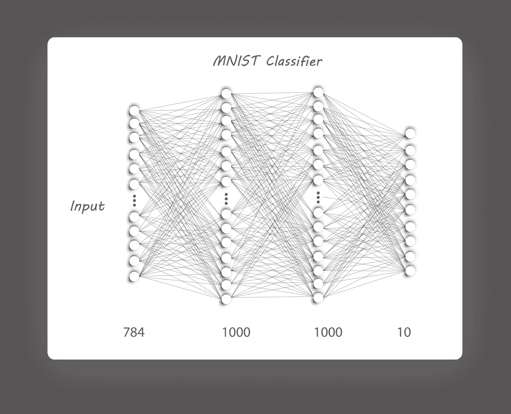*

*Basic NN Classifier*

*如果你已经到了这一步，你一定能够实现上述架构的专业人士，所以我将跳过它。但是，如果你被困在某个地方，看看下面的链接:*

* [## naresh 1318/Adversarial _ 自动编码器

### 对抗性自动编码器向导

github.com](https://github.com/Naresh1318/Adversarial_Autoencoder/blob/master/basic_nn_classifier.py) 

让我们看看用以下参数训练我们的基本 NN 分类器后的结果:

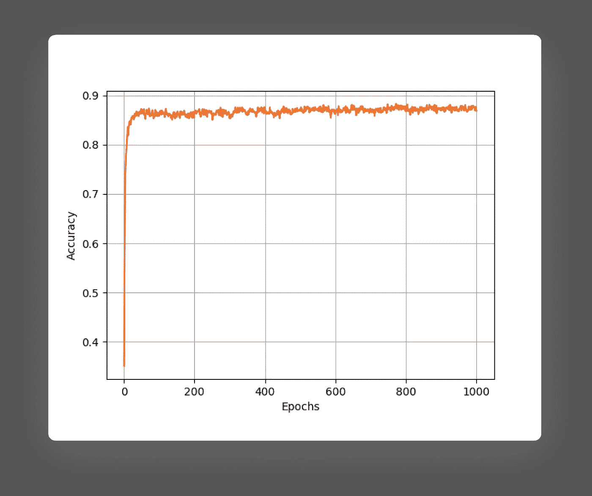

Accuracy variation

在大约 50 个时期之后，该模型似乎过拟合，因为测试精度已经饱和在 87%。请注意，该模型只显示了 1000 张标记图像，如果我们使用所有 50k 训练图像，我们可以获得更高的准确性。现在，我们的任务是使用同样的 1000 个标记图像来提高这种准确性。* 

> *但是，我们如何使用我们的 AAE 作为分类器呢？*

*我们将同时提高分类的准确性，减少维度，并且只使用一个单一的模型来理清风格和内容(是的，我又在吹牛了)。这需要对我们以前的架构(第 3 部分中的架构)进行一些修改:*

*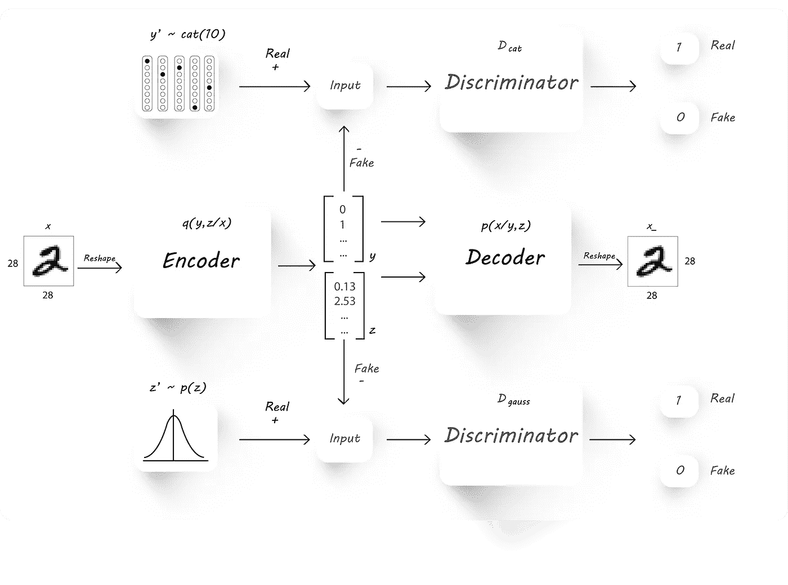*

*Semi-Supervised AAE Block Diagram*

*它类似于第 3 部分中的 AAE，但在顶部添加了另一个鉴别器( ***D_cat*** )并对编码器架构做了少量修改(它现在输出 ***y*** 和 ***z*** )。编码器的输出可以分为两部分，分类(***)y***)和潜码( ***z*** )。因为有 10 个标签，所以一个热向量( ***y*** )有 10 个值，并且像往常一样，*取决于用户期望的潜在代码(`z_dim`)的大小。**

**我们将需要在*上强加一个[分类分布](https://en.wikipedia.org/wiki/Categorical_distribution)(***cat(10)***)，因为我们只是想要 10 个可能的输出神经元中的一个为提供给它的每个图像触发。鉴别器 ***D_cat*** 就是为了做到这一点，它与我们的生成器(编码器)一起以对抗的方式进行训练，以迫使编码器在 ***y*** 处产生一个热向量(我们仍然不能将编码器用作分类器，因为这些热向量都是随机值，因为现在的主要目的是在编码器处强制进行分类分布)。***

**像往常一样，我们将教会编码器使用上图所示的鉴别器***_ gauss***在 ***z*** 处产生高斯(或任何其他分布)分布。**

**大部分神奇的事情发生在训练阶段，我们将看看编码器如何被用作分类器。**

**使用 SGD(随机梯度下降)分三个阶段同时训练两个敌对网络:**

*   *****重建阶段*** :**

**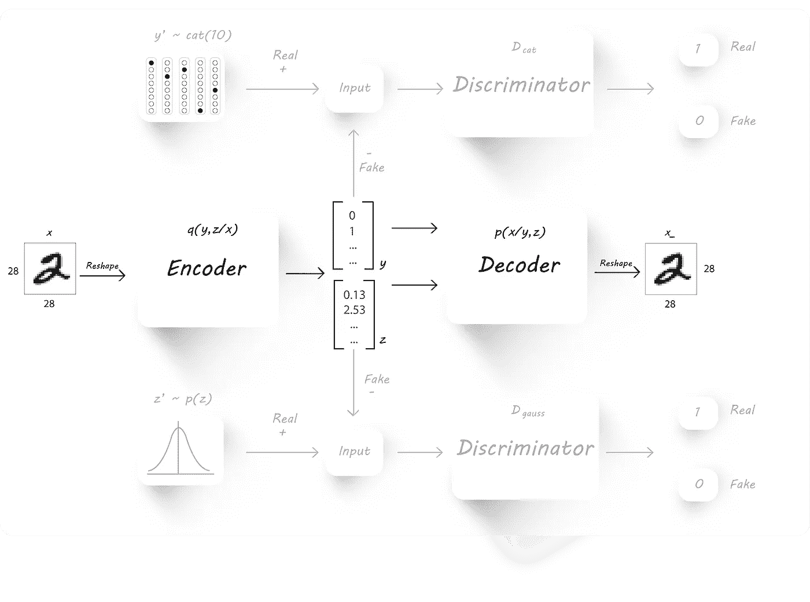**

**Reconstruction Phase**

**正如在第 2 部分和第 3 部分中看到的，我们关心的是减少重建损失，即输入和输出图像之间的均方误差。我们将仅通过编码器和解码器网络进行反向传播，以减少此阶段的重建损失。**

*   *****正规化阶段*** :**

**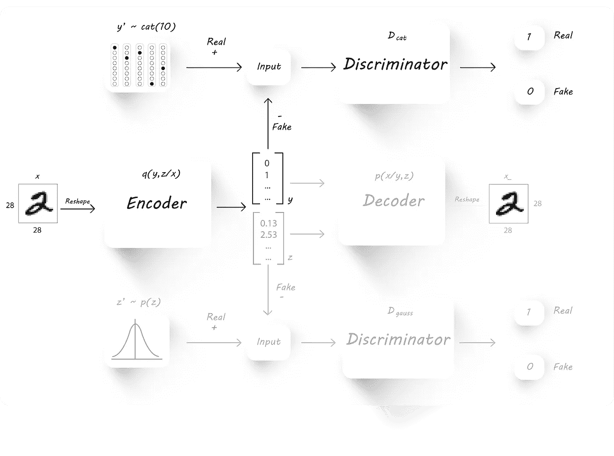**

**Step 1**

**在正则化阶段，编码器输出 ***y*** 应该被限制为只产生分类分布，这可以用类似于我们在第 2 部分中所做的方式来完成。我们将首先训练鉴别器 ***D_cat*** 来区分真实分类样本(***y’***)和从生成器(编码器) ***y*** 获得的样本。我们可以通过将一幅图像传递给编码器来实现这一点，该编码器从编码器中产生 ***y*** 和 ***z、****暂且不提 ***z*** (我们稍后会用到它)，从编码器中产生假的 ***y*** ，从分类中产生***y’***后来，鉴别器的权重是固定的(变得不可训练),目标设置为 1，编码器被训练来欺骗鉴别器。***

**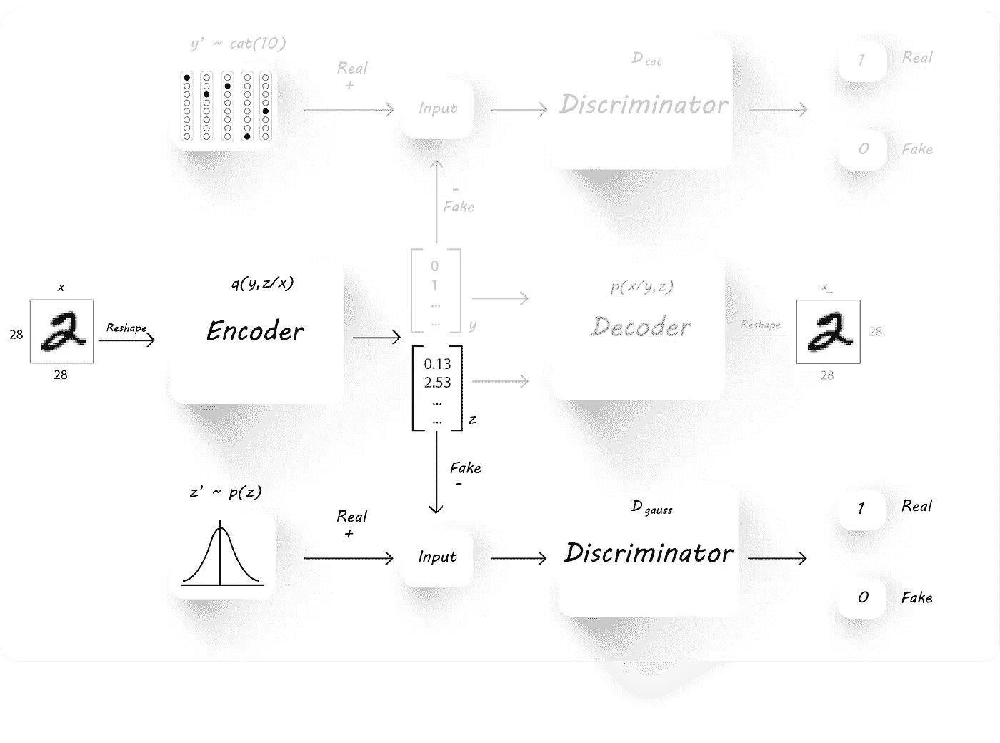**

**Step 2**

**类似地，为了在 ***z*** 上施加高斯分布，首先训练鉴别器 ***D_gauss*** ，然后是编码器，就像在第 2 部分中一样。**

*   **半监督分类阶段**

**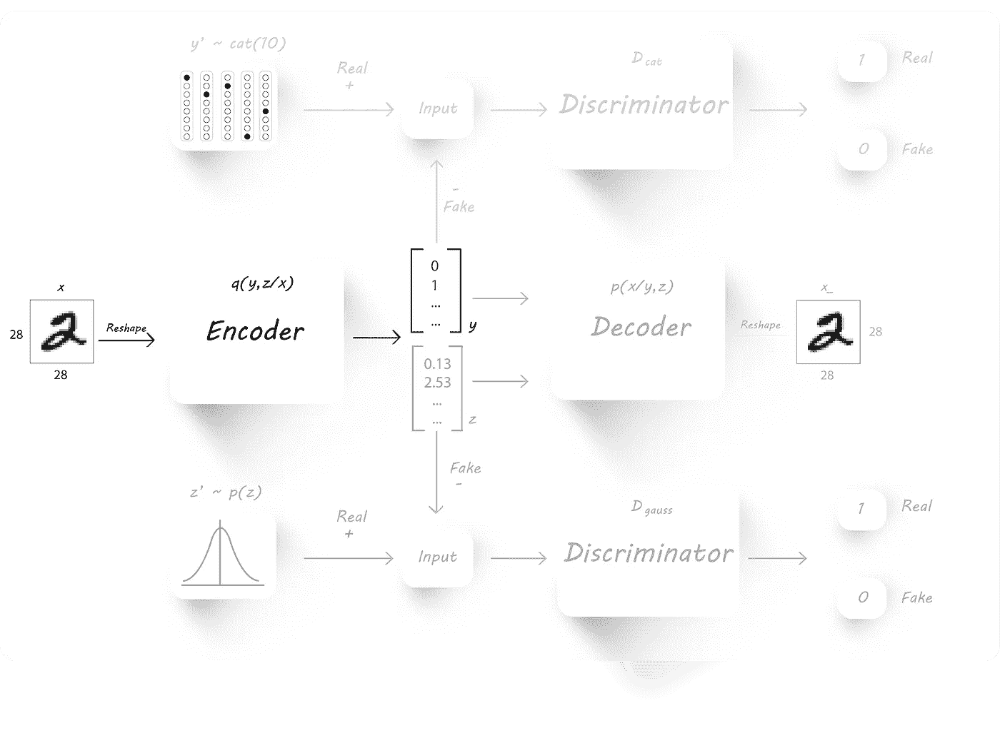**

**最后，我们将训练编码器通过传入一小批图像及其对应的一个热标签来对数字进行分类，以最小化交叉熵成本(同样，我们将忽略在 ***z*** 获得的任何内容)。在训练阶段，我们将只使用来自训练集的 1000 个标记图像，并使用所有 10k 测试集来了解我们的模型执行得有多好。**

> **我认为代码比文字更清楚，这也是为什么我总是试图包含代码片段的原因之一。**

**要使用第 3 部分的代码构建一个半监督的对抗性自动编码器，我们需要做 3 个主要的修改(是的，也有一些微妙的变化，我已经在注释部分解释过了)。首先，作为编码器架构:**

**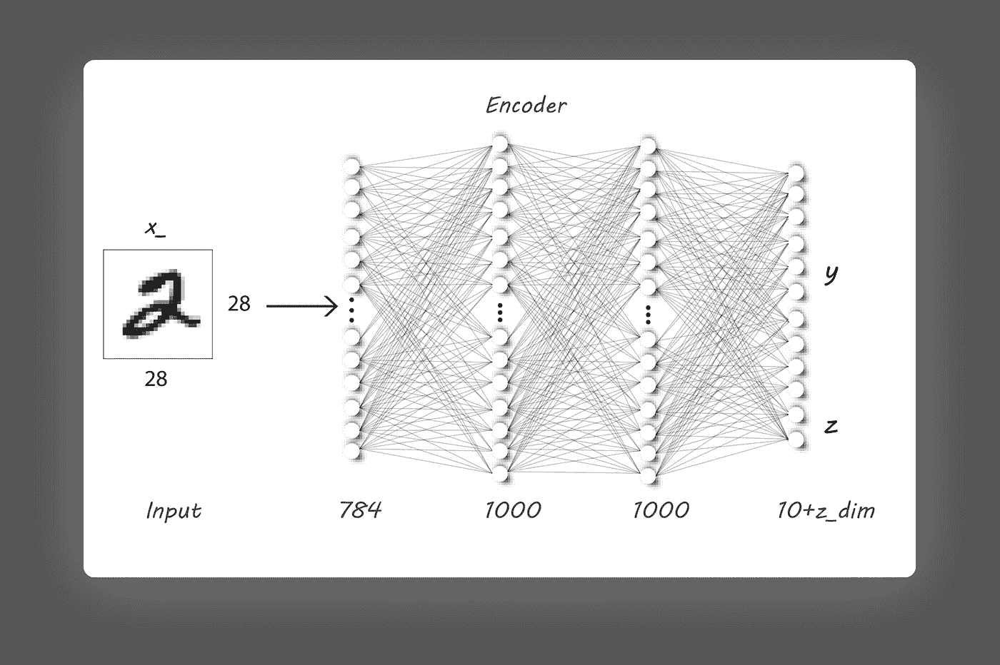**

**Encoder Architecture**

*****注*** :**

*   **`latent_variable`将是我们的`z`。**
*   **`cat_op`是分类输出`y`。**
*   **我已经使用了一个`if`语句来测试`supervised`标志。它所做的只是检查`supervised`标志是否为`False`(当我们将编码器输出直接连接为解码器输入时，就会出现这种情况)，并通过 softmax 函数传递逻辑值(从架构直接输出，不通过任何激活函数传递)，以在输出端获得正确的分类分布。但是，当标志为`True`时，逻辑将直接用于以受监督的方式训练编码器模型。我这样做是为了在半监督训练阶段使用 tensorflow 上直接提供的`softmax_cross_entropy_with_logits()`。**

**解码器架构与前一个相同:**

**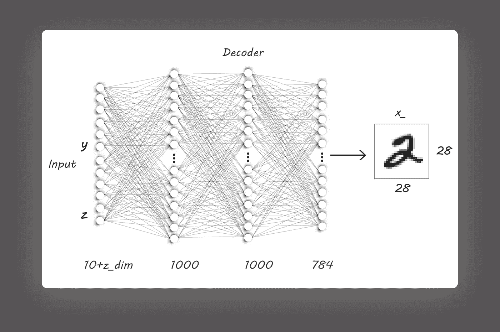**

**Decoder Architecture**

**两个鉴别器具有相同的架构，只有输入维度发生了变化，这是第二个主要变化。**

**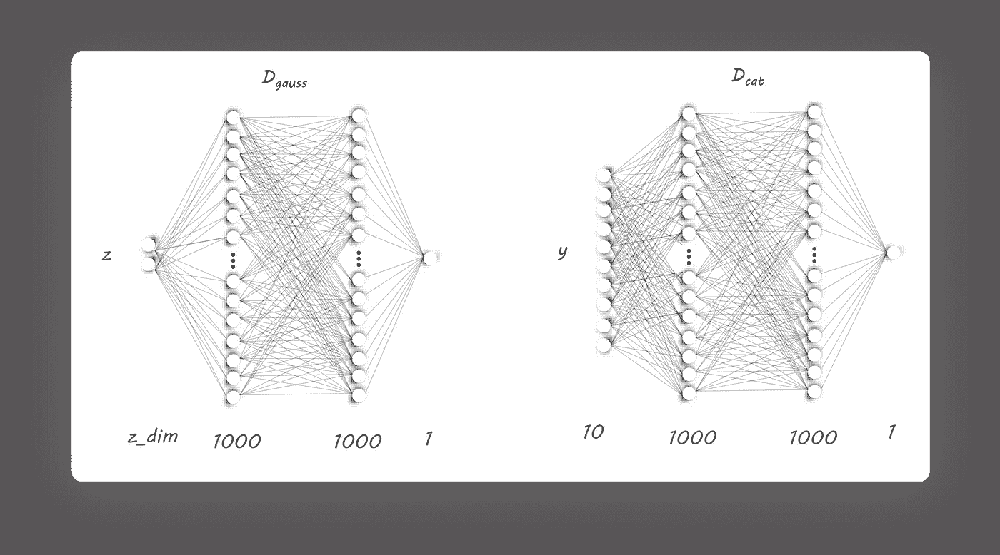**

**D_gauss and D_cat Architecture**

**最后，培训机制经历了一些变化，我在下面解释了这些变化:**

**我们将从构建 AE 的重建阶段开始:**

**随后是重建损失，因为它的优化器:**

**为了训练编码器和鉴别器架构，必须像第 2 部分和第 3 部分一样收集它们相应的权重:**

**首先涉及训练两个鉴别器( ***D_cat*** 和 ***D_gauss*** )的正则化阶段如下进行(我们仍然必须传递输入):**

**现在，为了训练生成器(编码器)输出在*处的分类分布和在 ***z*** 、处的高斯分布，我们将运行这些神奇的行:***

**为了训练编码器进行分类，我已经将输入图像传递给训练过的编码器(`reuse=True`)还要注意的是`supervised=True`，它不使用 softmax 函数，而是将密集层输出传递给损失函数:**

**使用`np.eye()`生成需要真实分类分布的训练阶段，下面的代码为给定的历元数训练模型，在每个历元保存它，将损失、直方图和输出图像写入 tensorboard，并将结果(损失和分类精度)存储在`./Results/Semi_Supervised/<folder_name>/log/log.txt`:**

**使用以下参数训练 1000 个时期后:**

**精度图如下:**

**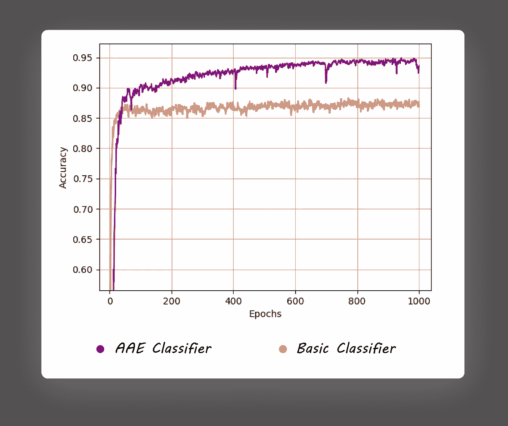**

**Accuracy Variations**

**我们甚至没有调优任何超参数就越过了 95%的准确率大关(我有点懒于这样做)。该模型使用在无监督训练阶段学习的特征来实现比其有监督的对应物更高的分类精度。这清楚地显示了无监督学习的应用潜力，我们可以在互联网上收集大量免费的未标记数据，并教会计算机从这些未标记图像中学习特征。**

**这是一个 AE 可以在无人监督的情况下学习的示例:**

**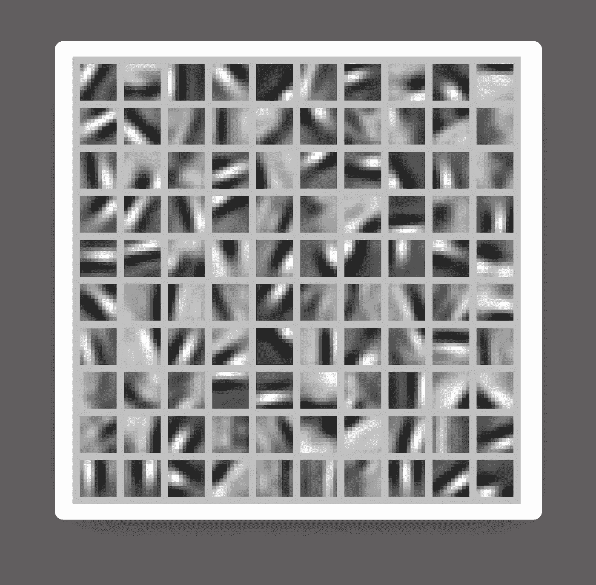**

**Visualizing the features learnt. Source: [http://ufldl.stanford.edu/tutorial/unsupervised/Autoencoders/](http://ufldl.stanford.edu/tutorial/unsupervised/Autoencoders/)**

**如果我们将编码器中每个输出神经元寻找的特征可视化，我们会得到类似于上图所示的可视化效果。一个输出神经元可能只有在输入端发现一个特定的边缘或轮廓时才会触发(关于这一点的更多信息可以在这里找到)。这些以非监督方式学习的特征可以在监督训练任务中使用，这正是我们在这一部分所做的。**

**作为一个健全的检查，让我们可视化输出分布和图像:**

**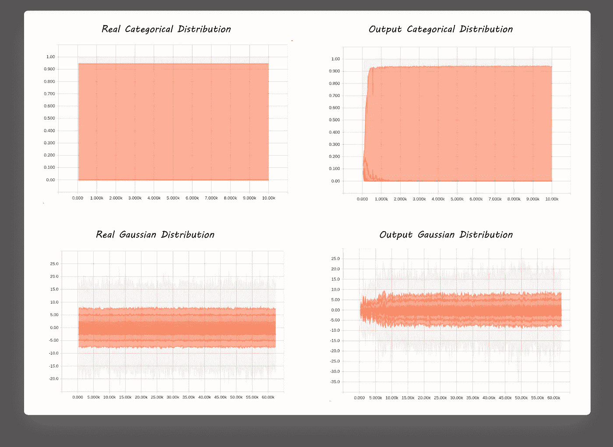**

**Distributions**

**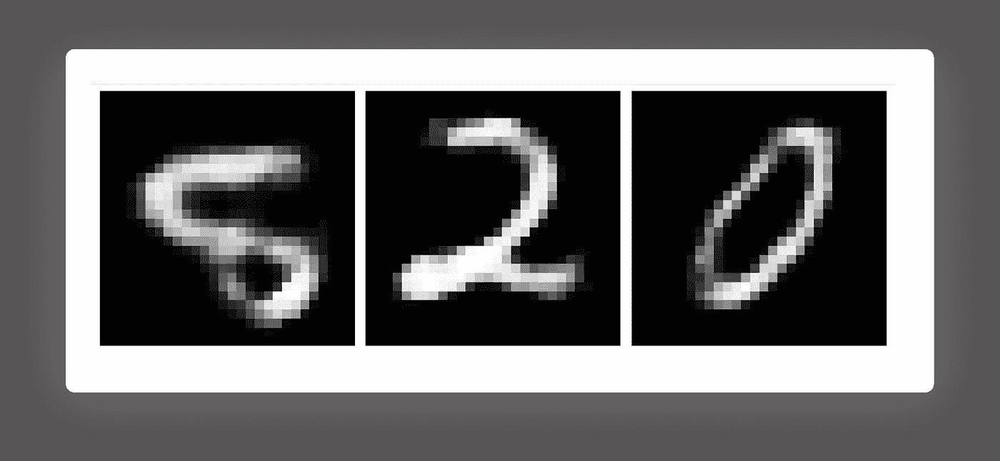**

**Images from the decoder**

**唷！，实际分布和输出分布相匹配，并且输出图像看起来像是从 MNIST 数据集获得的图像。**

**所以，是的，我们完成了最后一部分！**

> **感谢您的阅读！**

**我只是想让人们知道他们如何通过建立他们所知道的东西来实现东西，以及如何从一个简单的 AE 开始，我们可以在每一步做一些小的修改来创造一些有趣的东西。**

**我在暑假期间写了这个系列，以感受一个作家的经历，并欣赏他们通过什么来表达他们的思想或分享他们的知识，让世界了解。我相信只有当人们自己尝试做类似的事情时，他们才会开始钦佩别人的工作并真正理解它。**

**也就是说，如果你已经走了这么远，感谢你阅读我以前的帖子，并以一个👏。如果我犯了什么错误或者破坏了互联网，请让我知道。**