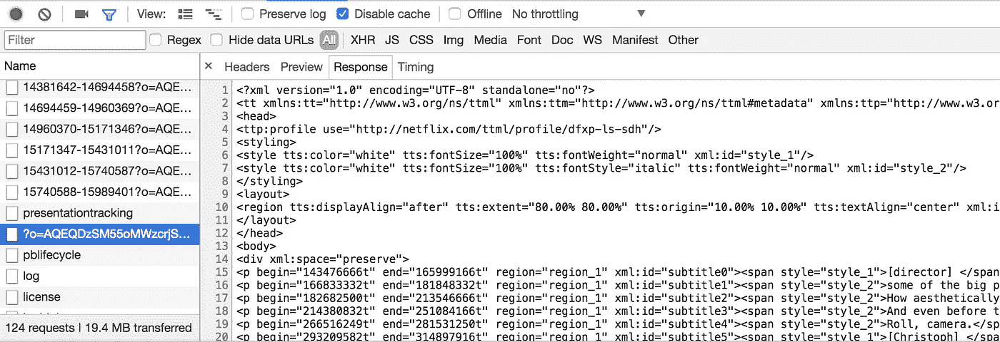
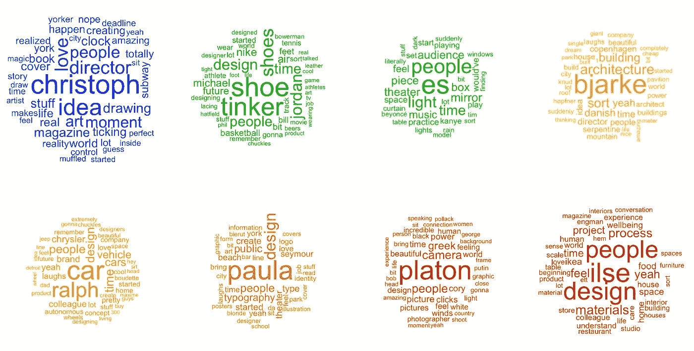

# 摘要中使用的单词云

> 原文：<https://towardsdatascience.com/a-word-cloud-of-words-used-in-abstract-1d07613770f?source=collection_archive---------9----------------------->

我真的很喜欢《抽象》——网飞的系列设计纪录片。这是那种让你不想被动消费和创造的内容。

我一直在 R 中玩文本分析，并决定应用我最近接触到的一些技术，创建一个包含节目中使用的所有单词的单词云。像所有数据科学项目一样，这个项目始于数据采集。网飞提供多种语言的字幕。每次你打开字幕或者改变语言，它都会下载。花了几分钟时间在 Chrome 中找到请求:



由于这部电视剧只有 8 集，我没有尝试自动下载每集的英文字幕，而是手动下载。

字幕以 TTML 格式提供。对于创建单词云，我只对文件中的文本内容感兴趣，对时间或字体数据不太感兴趣。因此，我没有尝试寻找一个专门的 TTML 处理库，而是编写了一个快速的 Python 脚本，将每个文件简单地视为另一个 XML 文件，并将每集的文本转储到一个制表符分隔的文件中:

```
episode script
1 [director] Part of this is I’m trying to figure out some of the...
2 [sea birds calling] [Tinker] I probably think about feet a lot ...
3 [Es] Over the last two decades of working, one of the things I'...
.
.
.
```

下一步是在 r 中读取这个文件。我使用了通用的`read.csv`,但它没有像预期的那样工作。

```
> d <- read.csv('~/proj/abstract.tsv', sep="\t")
> str(d)
'data.frame': 3 obs. of  2 variables:
 $ **episode: int  6 7 8**
 $ script : Factor w/ 3 levels "[Ilse] Some people think interior design is a look. In fact, It must be really fun buying furniture is somethin"| __truncated__,..: 2 3 1
```

数据框只有 3 行。它清楚地读取了整个文件，因为它从标题(剧集，剧本)中选择了列名，并得到了最后 3 行，但我很困惑为什么`read.csv`会跳过第 1-5 行。我试图将`as.is=T`参数传递给`read.csv`以防止它将字符串解释为因子，但这并不能阻止它跳过第 1–5 行。

```
'data.frame': 3 obs. of  2 variables:
 $ **episode: int  6 7 8**
 $ script : chr  "[Paula] I walk outside and I see typography everywhere. New York City is a city of signs. Sometimes things writ"| __truncated__ "[Platon] I'm not really a photographer at all. The camera is nothing more than a tool. Communication, simplicit"| __truncated__ "[Ilse] Some people think interior design is a look. In fact, It must be really fun buying furniture is somethin"| __truncated__
```

最终，我从`data.table`套餐中选择了`fread`,它非常管用:

```
> library(data.table)
> d <- fread('~/proj/abstract.tsv')
> str(d)
Classes ‘data.table’ and 'data.frame': 8 obs. of  2 variables:
 $ **episode: int  1 2 3 4 5 6 7 8**
 $ script : chr  "[director] Part of this is I'm trying to figure out some of the big picture things. How aesthetically to tell y"| __truncated__ "[sea birds calling] [Tinker] I probably think about feet a lot more than the average person. As a shoe designer"| __truncated__ "[Es] Over the last two decades of working, one of the things I've discovered is often things are made to fill v"| __truncated__ "[director] Is this going to be a slapstick comedy? Is it an action film? You know, let's have fun with it. -Yea"| __truncated__ ...
 - attr(*, ".internal.selfref")=<externalptr> 
```

下一步是将脚本分解成单词。`tidytext`包帮助我们做到了这一点(甚至更多):

```
> library(tidytext)
> words <- unnest_tokens(d, word, script)
> head(words)
   episode     word
1:       1 director
2:       1     part
3:       1       of
4:       1     this
5:       1       is
6:       1      i'm
```

让我们来数一数每个单词:

```
> library(dplyr)
> words %>% group_by(word) %>% summarise(count=n()) %>% arrange(desc(count))
# A tibble: 5,047 x 2
    word count
   <chr> <int>
 1   the  1863
 2   and  1262
 3     a  1217
 4    to  1170
 5     i  1135
 6    of   985
 7  that   878
 8    it   796
 9    in   681
10   you   681
# ... with 5,037 more rows
```

因此，正如您所料，我们在脚本中最常用的词大多是停用词。移除它们实际上非常简单:

```
> words <- words %>% **anti_join(stop_words)**
> words %>% group_by(word) %>% summarise(count=n()) %>% arrange(desc(count))
# A tibble: 4,496 x 2
      word count
     <chr> <int>
 1  people   157
 2  design   123
 3    time   110
 4   music   107
 5 playing    97
 6     car    66
 7    yeah    66
 8    feel    56
 9    idea    50
10   world    50
# ... with 4,486 more rows
```

现在引起我注意的是“音乐”这个词是第四个最常用的词。据我回忆，除了第三集有 Ev Devlin，这个系列没有太多关于音乐的内容。当我在文本编辑器中打开由 TTML 文件生成的标签限定的文件，并搜索“音乐”时，这个词出现频率如此之高的原因对我来说变得很清楚。字幕中提到了很多背景音乐，例如，我仅在第一集就发现了以下短语:

[电子音乐继续播放]，[电子音乐结束]，[不祥的音乐播放]，[平静的音乐播放]，[乐观的钢琴音乐播放]，[爵士音乐播放]，[电子音乐播放]，[电子音乐继续]，[编钟音乐播放]，[平静的音乐播放]，[平静的音乐继续]，[编钟音乐播放]，[乐观的音乐播放]，[器乐播放]

我使用正则表达式从脚本中删除这些短语，并重复上面的步骤来获得单词及其计数:

```
> d$script <- gsub('\\[(?:\\w+\\s){0,3}music(?:\\s\\w+){0,3}\\]', "", d$script, perl=T)
> words <- unnest_tokens(d, word, script)
> words <- words %>% anti_join(stop_words)
> words %>% group_by(word) %>% summarise(count=n()) %>% arrange(desc(count))
> words
# A tibble: 4,485 x 2
     word count
    <chr> <int>
 1 people   157
 2 design   123
 3   time   110
 4    car    66
 5   yeah    66
 6   feel    56
 7   idea    50
 8  world    50
 9  ralph    49
10   love    48
# ... with 4,475 more rows
```

好多了。一旦我们有了单词和它们的数量，制作单词云就很容易了:

```
> library(wordcloud)
> words %>% count(word) %>% with(wordcloud(word, n, max.words=50, min.freq=5, color='purple4', random.order=F))
```


每集制作一个单词云同样简单:

```
> par(mfrow=c(2,4))
> colors <- c("blue","green4","green","gold","orange","orange3","red","red3")
> for (i in 1:8) {
    words %>% filter(episode == i) %>% count(word) %>% with(wordcloud(word, n, max.words=50, min.freq=5,color=colors[i],random.order=F))
}
```



这里还可以做更多的事情——例如，请注意，在廷克·哈特菲尔德的单词 cloud 中，单词 shoe 和 shoes 重复出现——我们可以在绘制单词 cloud 之前通过单数化这些单词来解决这个问题。

如果你对用 R 分析文本感兴趣，我强烈推荐[用 R 进行文本挖掘:一种整洁的方法](http://tidytextmining.com)这本书。

**更新:**我发现了为什么`read.csv`跳过了前五行——文件中的大量引号与其默认的引用行为产生了不良影响。因此，如果您更愿意使用`read.csv`而不是`fread`，请将`quote`参数设置为空字符串:

```
d <- read.csv("~/proj/abstract.tsv", sep="\t", **quote=""**, as.is=T)
```