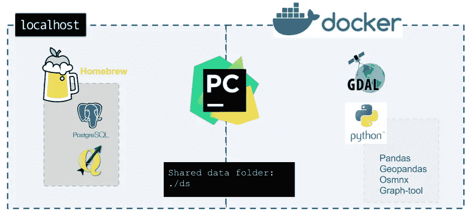
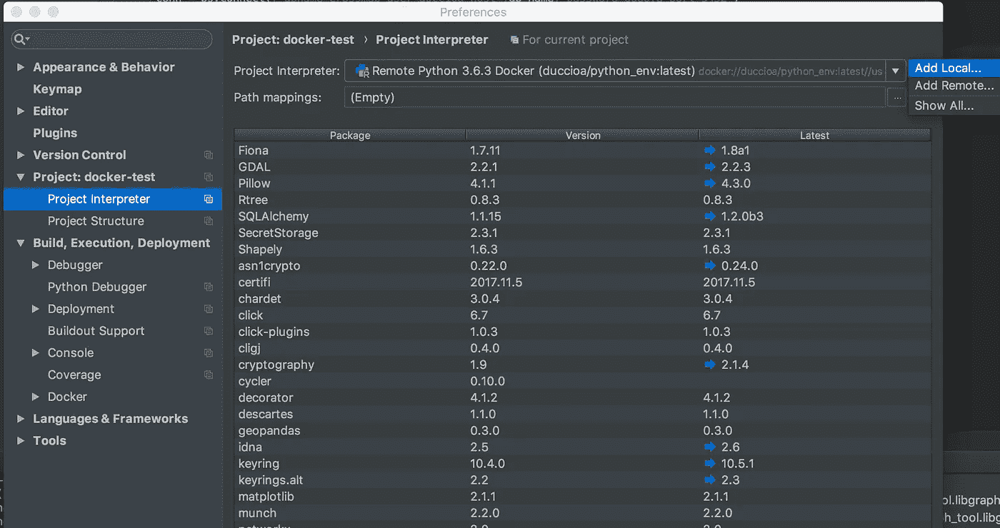
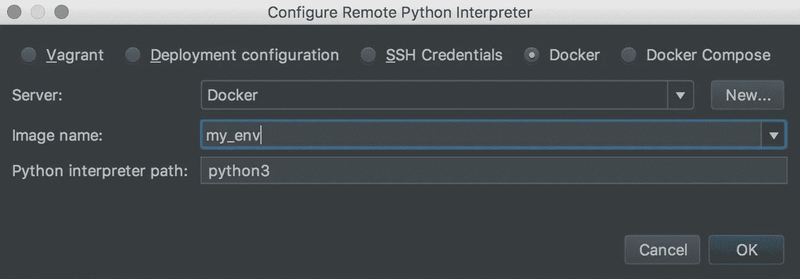
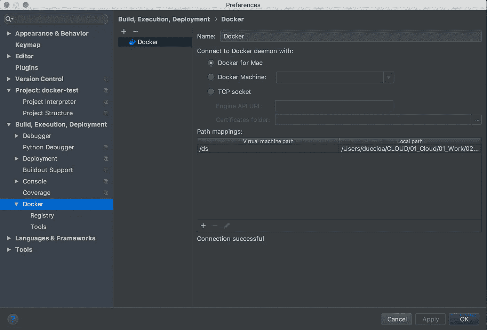

# 使用 Docker、Python 和 PostgreSQL 进行地理空间分析的工作环境

> 原文：<https://towardsdatascience.com/a-working-environment-for-geospatial-analysis-with-docker-python-and-postgresql-670c2be58e0a?source=collection_archive---------5----------------------->


这是我寻找一个存储、处理和可视化地理空间数据的工作环境的简短版本。它涉及到一个在本地运行的 [**PostgreSQL**](https://www.postgresql.org/) 服务器，一个带有 [**GDAL**](http://www.gdal.org/) 和带有 [**Python3**](https://www.google.it/url?sa=t&rct=j&q=&esrc=s&source=web&cd=1&cad=rja&uact=8&ved=0ahUKEwi-3f22yaLYAhWJzaQKHdK-DQUQFggnMAA&url=https%3A%2F%2Fwww.python.org%2F&usg=AOvVaw0QREvGsjwHKp2GtoYvs1JH) 用作解释器的[**py charm Professional**](https://www.qgis.org/en/site/)，一个本地安装的[**QGIS**](https://www.qgis.org/en/site/)**(非必需)。**

# ****目标****

**本文的重点是创建一个 Docker *映像*，它可以用作工作环境。它可以被认为是一种扩展的 Python 虚拟环境，我们在其中安装 Python、它的包以及作为操作系统一部分的其他库。**

****

**My work environment on a Mac OSX. On the local host, I installed PostgreSQL and QGIS with Homebrew. For GDAL, Python3 and all its packages, I use a Docker container. PyCharm links all these pieces together under one single umbrella.**

**在这种特殊情况下，我的目标是:**

*   **存储 PostgreSQL 数据库中的地理空间数据，并能够使用 Python 和 QGIS 进行查询；**
*   **使用 ogr2ogr 和其他 GDAL 功能，能够读取、转换和写入各种地理空间格式；**
*   **能够编写 Python 代码，并在 Python shell 中进行现场测试；**
*   **用`graph-tool`进行图形分析。**

# ****参考文献****

**在下面由 [Hamel Husain](https://medium.com/u/2f23c8eb1e49?source=post_page-----670c2be58e0a--------------------------------) 撰写的精彩文章中，可以找到关于 Docker 的良好指南，以及为什么在数据科学项目中使用 Docker 是一种良好的做法。**

**[](/how-docker-can-help-you-become-a-more-effective-data-scientist-7fc048ef91d5) [## Docker 如何帮助您成为更高效的数据科学家

### 在过去的 5 年里，我听到了很多关于码头集装箱的传言。似乎我所有的软件工程…

towardsdatascience.com](/how-docker-can-help-you-become-a-more-effective-data-scientist-7fc048ef91d5) 

我的部分解决方案基于他的教程，我建议你在继续之前先阅读它，尤其是如果你不熟悉 Docker 的话。

以 Python 包的形式出现，但更像是 C 库的 Python 包装器。在虚拟环境中安装是一件非常令人头疼的事情，而且几乎是不可能的。

编辑:`graph-tool`现在在`homebrew`上，这让生活变得更容易。如果想在虚拟环境中使用，一个办法是安装在系统的 Pyhton (2.7 或 3.5+)中，用`virtualenv --systam-site-packages`复制系统包，创建一个虚拟环境。

GDAL(地理空间数据抽象库)是一个栅格和矢量地理空间数据格式的翻译库。这是精通地理分析的工具箱中必不可少的元素。众所周知，设置起来很痛苦。

`homebrew`是 MacOS 的软件包管理器

鉴于这些前提，我想我会分享我的经验，把一切放在一起。你可以在我的 [Github repo](https://github.com/duccioa/geospatial_enviroment_with_docker) 里找到文件。

# **要求**

我假设你在安装了`[homebrew](https://brew.sh/)`和`[docker 17.09](https://docs.docker.com/engine/installation/)`的 Mac OSX 上。

你还应该了解 Docker(你可能不会在这里，否则……)，能够使用终端，并知道 Ubuntu 外壳和`apt-get`的螺母和螺栓。

一个不幸的注意:只有专业版的 PyCharm 可以远程虚拟环境，因此 **PyCharm 社区版(免费版)将无法与 Docker** 一起工作。

# **我们要做什么**

以下是本教程中的步骤:

*   `brew`安装 PostgreSQL 和 QGIS(实际上，QGIS 并不是严格必要的，它只是一个额外的好处)
*   创建一个 Ubuntu 17.10 Docker *镜像*(我将用斜体书写 Docker 领域特有的术语)，用 Python3 安装一些有用的包和 GDAL 库(这一步可以定制为包含任何相关的 Python 包)。
*   根据上面的*图片*打开一个交互式 Docker *容器*并手动安装`graph-tool`来更进一步。
*   将结果提交给 Docker *映像*。
*   设置 PyCharm Professional 使用 Docker *映像*作为解释器，并创建一个共享文件夹，以便能够从*映像*来回读取/写入数据。
*   用 Postgresql 连接 Python。

你可以在[这个](https://github.com/duccioa/geospatial_enviroment_with_docker) Github 仓库中找到本教程需要的一些文件。

有很多东西。让我们开始吧。

# **PostgreSQL 安装**

有了`homebrew`，PostgreSQL 的安装相当容易。从系统终端:

```
$ brew install postgresql
```

安装后，使用以下命令启动服务器:

```
$ brew services start postgresql
```

检查状态:

```
$ brew services list
```

停止服务器:

```
$ brew services stop postgresql
```

# **在 Docker 中创建一个 Python 环境**

第一步是创建一个 Docker *图像*。从 Mac OSX 终端创建一个新目录:

```
$ mkdir MyDockerImages
```

输入目录:

```
$ cd myDockerImages
```

创建一个名为 Dockerfile 的文件:

```
$ touch Dockerfile
```

将以下内容复制粘贴到`Dockerfile`(解释见评论):

请注意目录`/ds`的创建:稍后将使用它在 Docker *映像*和*主机*(您的本地计算机)之间共享数据。

有了这个 Docker 文件，我们现在可以构建一个 Docker *映像*:

```
$ docker build -t my_env -f ./Dockerfile ./
```

**安装**

安装`graph-tool`的详细说明可以在这里找到[。](https://git.skewed.de/count0/graph-tool/wikis/Installation-instructions#debian-ubuntu)

要安装的行`graph-tool`可能已经包含在 Dockerfile 文件中。但是由于在安装过程中可能会要求您从 bash shell 中输入一些信息，所以我没有找到比从通过交互运行 Docker *映像*创建的 bash 中手动安装它更好的方法。

关键步骤是:

*   添加一个. list 文件，链接到托管`graph-tool`的服务器，这样`apt-get`就知道在哪里寻找。
*   根据安装说明中提供的公钥验证软件包。
*   运行`apt-get update`并安装软件包。

使用选项`-it`交互运行容器:

```
$ docker run -it my_env
```

从容器内部看，Ubuntu bash 应该类似于:

```
root@539265d4463b
```

请注意`@`后面的数字，因为那是*容器*的 ID，我们将在几行中将其用作 CONTAINERID。在*容器*的 bash 中，键入:

Bash script for a Ubuntu Docker container to install graph-tool.

`graph-tool`现在已经安装好了，我们只需要提交对*映像*的更改，这样当我们关闭*容器*时它们就不会丢失:

```
$ docker commit -m "My note" -a "theAuthor" CONTAINERID my_env
```

# **用 PyCharm 连接一切**

我的工作流程是大量的试验和错误，我经常测试短代码行，检查数据或一些 Python 元素的类型。为此，我需要一个混合的代码编辑器和交互式外壳。PyCharm 除了提供一种构建项目和文件夹的方法，还提供了一种在两者之间来回跳转的简单方法。

我们将使用我们命名为“my_env”的 Docker 映像作为 PyCharm 2017 Professional 中的一个项目的解释器，以便我们可以使用我们刚刚安装的所有包和功能。[在这里](https://www.jetbrains.com/help/pycharm/docker.html)你可以找到这个话题的官方文档。

打开 PyCharm 并创建一个新项目。请注意，由于当前 PyCharm 的限制，此时您不能直接添加 Docker 图像作为解释器，如这里的[所解释的](https://intellij-support.jetbrains.com/hc/en-us/community/posts/115000636990-PyCharm-This-interpreter-type-does-not-support-remote-project-creation)。我们需要首先使用一个系统解释器，然后改变它。我们先用系统解释器打开项目，然后进入 py charm/Preferences/Project/Project Interpreter，选择“添加远程”。



选择“Docker ”,并在下图中输入缺少的信息。



最后一步是创建一个链接，在*主机*(您的计算机)和 Docker *映像*之间共享数据。这将允许我们读取/保存文件，如 csv、图像、图表等。从菜单“PyCharm/Preferences/Build，Execution，Deployment/”转到 Docker 并添加一个“路径映射”。



创建“路径映射”时，会要求您给出一个“虚拟机路径”，在我们的例子中是`/ds`(参见 Docker 文件，当我们创建 Docker *映像*时)，以及一个本地路径，这是您希望用来存储数据的项目数据文件夹。

# **将 Python 连接到 PostgreSQL**

为了从 Docker 镜像连接到*主机*上的服务器，我们将使用 Mac 特定的 DNS 名称`docker.for.mac.localhost`，如这里的[所解释的](https://stackoverflow.com/a/41562052/5276212)。其实在 Python 中把连接字符串中的' localhost '替换成' docker.for.mac.localhost '就够了。下面是一个使用`psycopg2`创建连接、运行简单查询并获取结果的例子:

PostgreSQL connection test in Python3.6.

# 奖励课程:QGIS 安装

对于 QGIS，我们首先需要将一些必需的包安装到系统 Python 中。从系统终端:

```
$ pip install psycopg2 requests future jinja2 pygments
```

如果要安装特定的支持，请检查软件包选项:

```
$ brew info qgis2
```

安装 QGIS 2.18(即将推出 3 版):

```
$ brew install qgis2
```

创建应用程序的符号链接，以便图标会出现在应用程序文件夹中:

```
$ ln -s /usr/local/Cellar/qgis2/2.18.14/QGIS.app /Applications
```

# 公开

我与 JetBrains 的 PyCharm 团队没有工作或任何联系，我实际上是一个付费用户。

# 请保持联系！

我很想听到你的评论，请联系: [Twitter](https://twitter.com/Luposky) ， [Github](https://gist.github.com/duccioa) ， [Linkedin](http://www.linkedin.com/in/duccio-aiazzi) 。**