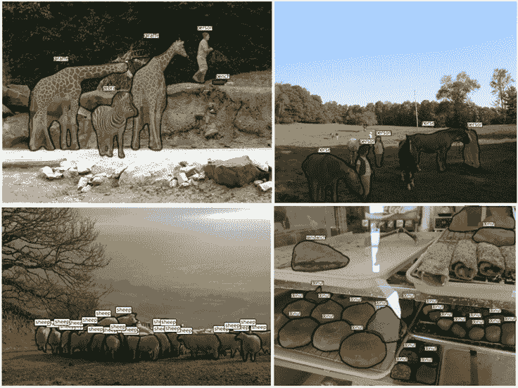
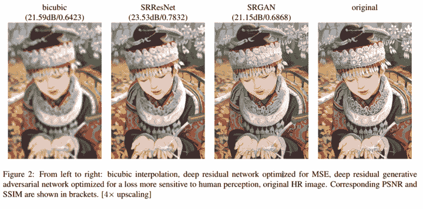
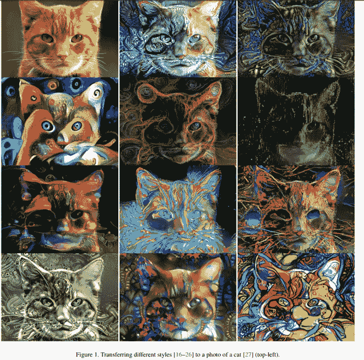
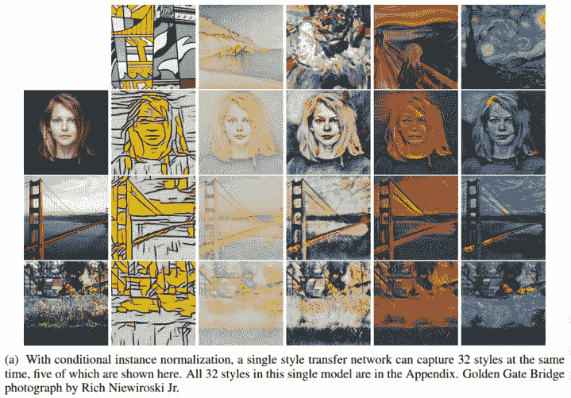
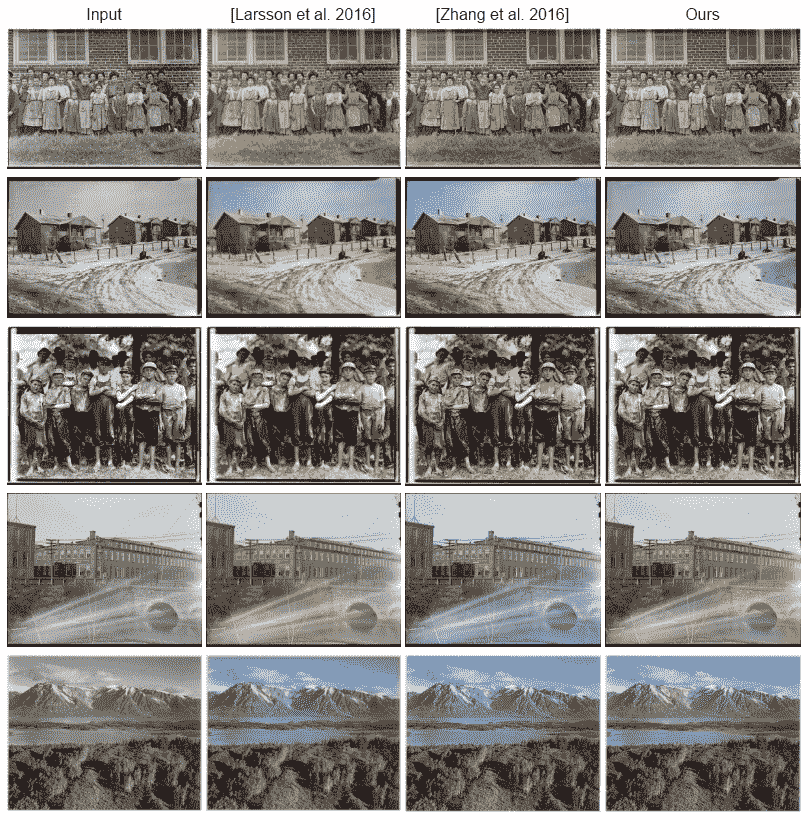
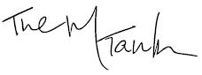

# 计算机视觉一年——第 2 部分，共 4 部分

> 原文：<https://towardsdatascience.com/a-year-in-computer-vision-part-2-of-4-893e18e12be0?source=collection_archive---------3----------------------->

## —第二部分:细分、超分辨率/色彩/风格转换、动作识别

> 下面这篇文章摘自我们的研究团队最近编辑的关于计算机视觉领域的出版物。第一和第二部分目前可以通过我们的网站获得，其余部分(第三和第四部分)将在不久的将来发布。

**未来几周将在我们的网站上免费提供完整的出版物，第 1-2 部分现在可以通过:**[*【www.themtank.org】*](http://www.themtank.org)获得

我们鼓励读者通过我们自己的网站来查看这篇文章，因为我们包括嵌入的内容和简单的导航功能，使报告尽可能地动态。我们的网站不会给团队带来任何收入，只是为了让读者尽可能地感受到这些材料的吸引力和直观性。我们竭诚欢迎对演示的任何反馈！

> 请关注、分享和支持我们的工作，无论你喜欢的渠道是什么(请尽情鼓掌！).如有任何问题或想了解对未来作品的潜在贡献，请随时联系编辑:info@themtank.com

# 分割

计算机视觉的核心是分割过程，它将整个图像分成像素组，然后对这些像素组进行标记和分类。此外，语义分割更进一步，试图从语义上理解图像中每个像素的作用，例如，它是猫、汽车还是其他类型的类别？实例分割通过对不同的类实例进行分割，例如用三种不同的颜色标记三只不同的狗，从而进一步发展了这一点。这是目前自动驾驶技术套件中采用的大量计算机视觉应用之一。

也许，细分领域的一些最佳改进来自 FAIR，他们从 2015 年开始继续建立他们的 DeepMask 工作[46]。DeepMask 在对象上生成粗糙的“遮罩”,作为分割的初始形式。2016 年，Fair 推出了 SharpMask[47]，它细化了 DeepMask 提供的‘masks’，纠正了细节的损失，改善了语义分割。除此之外，MultiPathNet[48]还识别每个掩膜所描绘的对象。

> "*要捕捉一般的物体形状，你必须对你正在看的东西有一个高层次的理解(深度蒙版)，但是要精确地放置边界，你需要回顾低层次的特征，一直到像素(清晰度蒙版)。*”—Piotr Dollar，2016。[49]

> **图 6:** 展示公平技术的应用

**Note**: The above pictures demonstrate the segmentation techniques employed by FAIR. These include the application of DeepMask, SharpMask and MultiPathNet techniques which are applied in that order. This process allows accurate segmentation and classification in a variety of scenes. **Source**: Dollar (2016)[50]

**视频传播网络**【51】试图创建一个简单的模型，通过整个视频序列以及一些附加信息来传播在第一帧分配的精确对象遮罩。

2016 年，研究人员致力于寻找替代网络配置，以解决上述规模和本地化问题。DeepLab[52]就是这样一个例子，它为语义图像分割任务取得了令人鼓舞的结果。Khoreva 等人(2016 年)[53]基于 Deeplab 的早期工作(大约 2015 年)，提出了一种弱监督训练方法，其结果与完全监督网络相当。

计算机视觉通过使用端到端网络进一步完善了有用信息的网络共享方法，减少了多个全方位分类子任务的计算需求。使用这种方法的两篇关键论文是:

*   **100 层提拉米苏**【54】**是一种全卷积 DenseNet，它以前馈方式将每一层与每一层连接起来。它还可以用更少的参数和训练/处理在多个基准数据集上实现 SOTA。**
*   ****全卷积实例感知语义分割**【55】**联合执行实例掩码预测和分类(两个子任务)。
    **COCO 分段挑战冠军** MSRA。37.3% AP。
    从 2015 年 COCO 挑战赛 MSRAVC 绝对跃升 9.1%。****

****虽然用于实时语义分割的 DNN 架构 ENet**【56】不属于这一类，但它确实证明了降低计算成本和为移动设备提供更多访问权限的商业价值。******

> *******我们的工作希望将尽可能多的这些进步与有形的公共应用联系起来。考虑到这一点，以下包含了 2016 年细分的一些最有趣的医疗保健应用；*******

*   ******[结肠镜图像腔内场景分割的基准](https://arxiv.org/abs/1612.00799)【57】******
*   ******[用于 MRI 皮质下分割的 3D 全卷积网络:一项大规模研究](https://arxiv.org/abs/1612.03925v1)【58】******
*   ******[使用去噪自动编码器的半监督学习用于脑部损伤检测和分割](https://arxiv.org/abs/1611.08664v3)【59】******
*   ******[三维超声图像分割综述](https://arxiv.org/abs/1611.09811)【60】******
*   ******[一种基于全卷积神经网络的结构化预测方法，用于视网膜血管分割](https://arxiv.org/abs/1611.02064)【61】******
*   ******[用于胶质母细胞瘤分割的三维卷积神经网络](https://arxiv.org/abs/1611.04534)【62】******

******我们最喜欢的准医学分割应用之一是**fusion net**[63]——一种用于连接组学[64]中图像分割的深度完全残差卷积神经网络，以 SOTA 电子显微镜(EM)分割方法为基准。******

****Semantic Segmentation applied to street views from a car****

# ****超高分辨率、风格转移和着色****

> ****并非所有的计算机视觉研究都是为了扩展机器的伪认知能力，通常，神经网络以及其他人工智能技术的虚构延展性有助于其他各种各样的新应用进入公共领域。去年在超分辨率、风格转换和色彩方面的进步占据了我们的空间。****

******超分辨率**指的是从低分辨率图像估计高分辨率图像的过程，也是预测不同放大倍数下的图像特征，这是人类大脑几乎可以毫不费力地做到的事情。最初，超分辨率是通过双三次插值和最近邻等简单技术实现的。就商业应用而言，克服源自源质量的低分辨率限制和实现“CSI Miami”风格的图像增强的愿望推动了该领域的研究。以下是今年的一些进展及其潜在影响:****

*   ******Neural Enhance**【65】是 Alex J. Champandard 的创意，结合了四篇不同研究论文的方法来实现其超分辨率方法。****

******实时视频超分辨率**在 2016 年也有两次值得注意的尝试；[66], [67]****

*   ******RAISR:** 谷歌的快速准确图像超分辨率[68]通过用低分辨率和高分辨率图像对训练过滤器，避免了神经网络方法的高成本内存和速度要求。RAISR 作为一个基于学习的框架，比竞争算法快两个数量级，并且与基于神经网络的方法相比，具有最小的内存需求。因此，超分辨率可扩展到个人设备。这里有个研究博客。[69]****

> ******图 7:** 超分辨率 SRGAN 示例****

********

******Note**: From left to right: bicubic interpolation (the objective worst performer for focus), Deep residual network optimised for MSE, deep residual generative adversarial network optimized for a loss more sensitive to human perception, original High Resolution (HR) image. Corresponding peak signal to noise ratio (PSNR) and structural similarity (SSIM) are shown in two brackets. [4 x upscaling] The reader may wish to zoom in on the middle two images (SRResNet and SRGAN) to see the difference between image smoothness vs more realistic fine details.
**Source**: Ledig et al. (2017) [70]****

****生成对抗网络(GANs)的使用代表了超分辨率的当前 SOTA:****

*   ******SRGAN** [71]使用经过训练的鉴别器网络来区分超分辨率和原始照片级逼真图像，在公共基准上从严重欠采样的图像中提供照片级逼真纹理。****

****从质量上来说，SRGAN 表现最好，尽管 SRResNet 在峰值信噪比(PSNR)度量方面表现最好，但 SRGAN 获得了更精细的纹理细节，并获得了最好的平均意见得分(MOS)。据我们所知，这是第一个能够推断出 4 倍放大因子的照片级自然图像的框架【72】所有之前的方法都无法在大的放大因子下恢复更精细的纹理细节。****

*   ******图像超分辨率的缓冲 MAP 推断**【73】提出了一种使用卷积神经网络计算最大后验概率(MAP)推断的方法。然而，他们的研究提出了三种优化方法，目前 GANs 在真实图像数据上的表现都明显更好。****

> ******图 8** :尼库林&诺瓦克风格转移****

********

******Note**: Transferring different styles to a photo of a cat (original top left).
**Source**: Nikulin & Novak (2016)****

****毫无疑问， **Style Transfer** 体现了神经网络的一种新用途，这种用途已经退入公共领域，特别是通过去年的 facebook 整合以及 Prisma [74]和 Artomatix [75]等公司。风格转移是一种更古老的技术，但在 2015 年随着艺术风格的神经算法的发表而转化为神经网络[76]。从那以后，风格转换的概念被 Nikulin 和 Novak [77]扩展，并应用于视频[78]，这是计算机视觉中的常见进展。****

> ******图 9** :风格转移的进一步示例****

********

******Note**: The top row (left to right) represent the artistic style which is transposed onto the original images which are displayed in the first column (Woman, Golden Gate Bridge and Meadow Environment). Using conditional instance normalisation a single style transfer network can capture 32 style simultaneously, five of which are displayed here. The full suite of images in available in the source paper’s appendix. This work will feature in the International Conference on Learning Representations (ICLR) 2017\.
**Source**: Dumoulin et al. (2017, p. 2) [79]****

****一旦形象化，风格转移作为一个主题是相当直观的；拿一幅图像，想象它具有不同图像的风格特征。例如，以著名绘画或艺术家的风格。今年脸书发布了 Caffe2Go，[80]他们的深度学习系统集成到移动设备中。谷歌还发布了一些有趣的作品，试图融合多种风格来产生完全独特的图像风格:研究博客[81]和全文[82]。****

****除了移动集成，风格转移在游戏资产的创建中也有应用。我们团队的成员最近看了 Artomatix 的创始人兼首席技术官 Eric Risser 的演示，他讨论了该技术在游戏内容生成方面的新颖应用(纹理突变等)。)并因此极大地减少了传统纹理艺术家的工作。****

******着色**是将单色图像转变为新的全彩色图像的过程。最初，这是由人们手工完成的，他们煞费苦心地选择颜色来代表每幅图像中的特定像素。2016 年，这一过程实现了自动化，同时保持了以人为中心的着色过程的真实感。虽然人类可能不能准确地表现给定场景的真实颜色，但是他们的真实世界知识允许以与图像和观看所述图像的另一个人一致的方式来应用颜色。****

****着色的过程很有趣，因为网络根据对物体位置、纹理和环境的理解为图像分配最可能的颜色，例如，它知道皮肤是粉红色的，天空是蓝色的。****

> ****在我们看来，今年最有影响力的三部作品如下:****

*   ****张等人发明了一种方法，能够在 32%的实验中成功愚弄人类。他们的方法堪比“着色图灵测试”[83]****
*   ****Larsson 等人[84]使用深度学习进行直方图估计，使他们的图像着色系统完全自动化。****
*   ****最后，Lizuka、Simo-Serra 和 Ishikawa [85]展示了一个同样基于 CNN 的着色模型。这项工作超过了现有的 SOTA，我们[团队]觉得这项工作在质量上也是最好的，似乎是最现实的。图 10 提供了比较，但是图像取自 Lizuka 等人的文章。****

> ******图 10** :着色研究对比****

********

******Note**: From top to bottom — column one contains the original monochrome image input which is subsequently colourised through various techniques. The remaining columns display the results generated by other prominent colourisation research in 2016\. When viewed from left to right, these are Larsson et al. [84] 2016 (column two), Zhang et al. [83] 2016 (Column three), and Lizuka, Simo-Serra and Ishikawa. [85] 2016, also referred to as “ours” by the authors (Column four). The quality difference in colourisation is most evident in row three (from the top) which depicts a group of young boys. We believe Lizuka et al.’s work to be qualitatively superior (Column four). **Source**: Lizuka et al. 2016 [86]****

*****此外，我们的架构可以处理任何分辨率的图像，不像大多数现有的基于 CNN 的方法。*****

****在一项测试中，为了了解他们的色彩有多自然，用户从他们的模型中随机抽取一张图片，并被问及“你觉得这张图片看起来自然吗？”****

****他们的方法达到了 92.6%，基线达到了大约 70%，地面真实(实际的彩色照片)在 97.7%的时间里被认为是自然的。****

# ****动作识别****

****动作识别的任务指的是给定视频帧内动作的分类，以及最近的算法，该算法可以预测动作发生前仅给定几帧的交互的可能结果。在这方面，我们看到最近的研究试图将上下文嵌入算法决策，类似于计算机视觉的其他领域。这一领域的一些重要论文包括:****

*   ******动作识别的长期时间卷积**【87】利用人类动作的时空结构，即特定的运动和持续时间，使用 CNN 变体正确识别动作。为了克服细胞神经网络对长期动作的次优时间建模，作者提出了一种具有长期时间卷积的神经网络(LTC-CNN)来提高动作识别的准确性。简而言之，LTCs 可以查看视频的更大部分来识别动作。他们的方法使用并扩展了 3D CNNs,“能够在更完整的时间尺度上表现动作”。****

****"*我们报告了两个具有挑战性的人体动作识别基准 UCF101 (92.7%)和 HMDB51 (67.2%)的最新结果。*”****

*   ******用于视频动作识别的时空残差网络** [88]将双流 CNN 的变体应用于动作识别任务，该网络结合了传统 CNN 方法和最近流行的残差网络(ResNets)的技术。双流方法的灵感来自视觉皮层功能的神经科学假设，即不同的路径识别物体的形状/颜色和运动。作者通过在两个 CNN 流之间注入剩余连接，结合了 ResNets 的分类优势。****

****"*每个流最初独立执行视频识别，对于最终分类，softmax 分数通过后期融合进行组合。迄今为止，这种方法是将深度学习应用于动作识别的最有效方法，尤其是在训练数据有限的情况下。在我们的工作中，我们直接将图像转换为 3D 架构，并显示出比双流基线有很大提高的性能。*”—在 UCF101 上为 94%，在 HMDB51 上为 70.6%。Feichtenhofer 等人对传统的改进密集轨迹(iDT)方法进行了改进，并通过使用这两种技术产生了更好的结果。****

*   ******从未标记的视频中预测视觉表示**【89】是一篇有趣的论文，尽管不是严格的动作分类。该计划预测的行动，很可能会发生给定一系列的视频帧前一秒钟的行动。该方法使用视觉表示，而不是逐像素分类，这意味着通过利用深度神经网络的特征学习属性，程序可以在没有标记数据的情况下运行[90]。****

****我们方法背后的关键思想是，我们可以训练深度网络来预测未来图像的视觉表现。视觉表示是一个有前途的预测目标，因为它们在比像素更高的语义级别上编码图像，但却是自动计算的。然后，我们将识别算法应用于我们预测的表示，以预测对象和动作。****

****Thumos 动作识别挑战赛的组织者发布了一篇论文，描述了过去几年中动作识别的一般方法。本文还概述了 2013 年至 2015 年的挑战、挑战的未来方向以及如何通过动作识别让计算机更全面地理解视频的想法。我们希望图莫斯行动认可挑战赛在(似乎)意外中断后于 2017 年回归。****

> ******跟随我们下期关于媒体的简介——第 3 部分，共 4 部分:走向对世界的 3D 理解。******
> 
> ****请随意将所有反馈和建议放在评论区，我们会尽快回复。或者，您可以通过以下方式直接联系我们:info@themtank.com****

****完整版本可在:[www.themtank.org/a-year-in-computer-vision](http://www.themtank.org/a-year-in-computer-vision)获得****

****非常感谢，****

****M 坦克****

********

## ****按出现顺序排列的参考文献****

****[46]皮涅罗、科洛波特和多勒。2015.学习分割候选对象。*【在线】arXiv: 1506.06204* 。可用:[**arXiv:1506.06204 v2**](https://arxiv.org/abs/1506.06204v2)****

****[47]皮涅罗等人，2016 年。学习细化对象段。*【在线】arXiv: 1603.08695* 。可用:[arXiv:1603.08695 v2](https://arxiv.org/abs/1603.08695v2)****

****[48] Zagoruyko，S. 2016 年。用于目标检测的多路径网络。*【在线】arXiv: 1604.02135v2\.* 可用:[**arXiv:1604.02135 v2**](https://arxiv.org/abs/1604.02135v2)****

****[49]美元，第 2016 页。学习分段。*【博客】交易会*。可用:[https://research.fb.com/learning-to-segment/](https://research.fb.com/learning-to-segment/)****

****[50]美元，第 2016 页。用 SharpMask 分割和细化图像。*【在线】脸书码*。可用:[https://code . Facebook . com/posts/561187904071636/segmented-and-refining-images-with-sharp mask/](https://code.facebook.com/posts/561187904071636/segmenting-and-refining-images-with-sharpmask/)****

****[51] Jampani 等人，2016 年。视频传播网络。*【在线】arXiv: 1612.05478* 。可用:[**arXiv:1612.05478 v2**](https://arxiv.org/abs/1612.05478v2)****

****[52]陈等，2016。DeepLab:使用深度卷积网络、阿特鲁卷积和全连接 CRF 的语义图像分割。*【在线】arXiv: 1606.00915* 。可用:[**arXiv:1606.00915 v1**](https://arxiv.org/abs/1606.00915v1)****

****[53] Khoreva 等人，2016 年。简单易行:弱监督实例和语义分割。*【在线】arXiv: 1603.07485v2\.* 可用:[**arXiv:1603.07485 v2**](https://arxiv.org/abs/1603.07485v2)****

****[54]杰古等人，2016 年。一百层提拉米苏:用于语义分割的全卷积 DenseNets。*【在线】arXiv: 1611.09326v2\.* 可用:[**arXiv:1611.09326 v2**](https://arxiv.org/abs/1611.09326v2)****

****[55]李等 2016。完全卷积的实例感知语义分割。*【在线】arXiv: 1611.07709v1* 。可用:[arXiv:1611.07709 v1](https://arxiv.org/abs/1611.07709v1)****

****[56] Paszke 等人，2016 年。ENet:一种用于实时语义分割的深度神经网络架构。*【在线】arXiv: 1606.02147v1* 。可用:[arXiv:1606.02147 v1](https://arxiv.org/abs/1606.02147v1)****

****[57]巴斯克斯等人，2016 年。结肠镜图像腔内场景分割的基准。*【在线】arXiv: 1612.00799* 。可用:[**arXiv:1612.00799 v1**](https://arxiv.org/abs/1612.00799v1)****

****[58] Dolz 等人，2016 年。MRI 皮质下分割的 3D 全卷积网络:一项大规模研究。*【在线】arXiv: 1612.03925* 。可用:[arXiv:1612.03925 v1](https://arxiv.org/abs/1612.03925v1)****

****[59]亚历克斯等人，2017 年。使用去噪自动编码器的半监督学习用于脑损伤检测和分割。*【在线】arXiv: 1611.08664* 。可用:[arXiv:1611.08664 v4](https://arxiv.org/abs/1611.08664v4)****

****[60]莫扎法里和李。2016.三维超声图像分割综述。*【在线】arXiv: 1611.09811* 。可用:[arXiv:1611.09811 v1](https://arxiv.org/abs/1611.09811v1)****

****61 达斯古普塔和辛格。2016.基于全卷积神经网络的视网膜血管分割结构化预测方法。*【在线】arXiv: 1611.02064* 。可用:[**arXiv:1611.02064 v2**](https://arxiv.org/abs/1611.02064v2)****

****[62]易等 2016。用于胶质母细胞瘤分割的三维卷积神经网络。*【在线】arXiv: 1611.04534* 。可用:[**arXiv:1611.04534 v1**](https://arxiv.org/abs/1611.04534v1)****

****[63]全等 2016。FusionNet:用于连接组学中图像分割的深度全残差卷积神经网络。*【在线】arXiv: 1612.05360* 。可用:[arXiv:1612.05360 v2](https://arxiv.org/abs/1612.05360v2)****

****[64]连接组学是指绘制生物神经系统内的所有连接，即神经元及其连接。****

****[65]尚标准，美国法学家委员会，2017 年。神经增强(2016 年 11 月 30 日最新提交)。*【在线】Github* 。可用:[https://github.com/alexjc/neural-enhance](https://github.com/alexjc/neural-enhance)【访问时间:2017 年 11 月 2 日】****

****[66] Caballero 等人，2016 年。基于时空网络和运动补偿的实时视频超分辨率。*【在线】arXiv: 1611.05250* 。可用:[arXiv:1611.05250 v1](https://arxiv.org/abs/1611.05250v1)****

****[67]石等，2016。使用有效的亚像素卷积神经网络的实时单幅图像和视频超分辨率。*【在线】arXiv: 1609.05158* 。可用:[**arXiv:1609.05158 v2**](https://arxiv.org/abs/1609.05158v2)****

****[68]罗马诺等人，2016 年。RAISR:快速准确的图像超分辨率。*【在线】arXiv: 1606.01299* 。可用:[arXiv:1606.01299 v3](https://arxiv.org/abs/1606.01299v3)****

****[69]米兰法尔，第 2016 页。增强！通过机器学习提高清晰图像。*【博客】谷歌研究博客*。可用:[https://research . Google blog . com/2016/11/enhance-raisr-sharp-images-with-machine . html](https://research.googleblog.com/2016/11/enhance-raisr-sharp-images-with-machine.html)【访问时间:20/03/2017】。****

****70 同上****

****[71]莱迪格等人，2017 年。使用生成对抗网络的照片级单幅图像超分辨率。*【在线】arXiv: 1609.04802* 。可用:[arXiv:1609.04802 v3](https://arxiv.org/abs/1609.04802v3)****

****72 同上****

****[73]s nderby 等人，2016 年。图像超分辨率的缓冲 MAP 推理。*【在线】arXiv: 1610.04490* 。可用:[**arXiv:1610.04490 v1**](https://arxiv.org/abs/1610.04490v1)****

****[74]普里斯马。2017.*【网址】Prisma* 。可用:[https://prisma-ai.com/](https://prisma-ai.com/)【访问时间:2017 年 01 月 04 日】。****

****75 arto matix。2017.*【网址】Artomatix* 。可用:【https://services.artomatix.com/ 【访问时间:2017 年 1 月 4 日】。****

****[76] Gatys 等人，2015 年。艺术风格的神经算法。*【在线】arXiv: 1508.06576* 。可用:[**arXiv:1508.06576 v2**](https://arxiv.org/abs/1508.06576v2)****

****[77]尼库林&诺瓦克。2016.探索艺术风格的神经算法。*【在线】arXiv: 1602.07188* 。可用:[arXiv:1602.07188 v2](https://arxiv.org/abs/1602.07188v2)****

****[78] Ruder 等人，2016 年。视频的艺术风格转换。*【在线】arXiv: 1604.08610* 。可用:[**arXiv:1604.08610 v2**](https://arxiv.org/abs/1604.08610v2)****

****79 同上****

****[80]贾和瓦杰达。2016.在您的手掌中交付实时人工智能。*【在线】脸书电码*。可用:[https://code . Facebook . com/posts/196146247499076/delivering-real-time-in-the-palm-of-your-hand/](https://code.facebook.com/posts/196146247499076/delivering-real-time-ai-in-the-palm-of-your-hand/)【访问时间:2017 年 1 月 20 日】。****

****[81] Dumoulin 等人，2016 年。增压风格转移。*【在线】谷歌研究博客*。可用:[https://research . Google blog . com/2016/10/supercing-style-transfer . html](https://research.googleblog.com/2016/10/supercharging-style-transfer.html)【访问时间:20/01/2017】。****

****[82] Dumoulin 等人，2017 年。艺术风格的学术表现。*【在线】arXiv: 1610.07629* 。可用:[**arXiv:1610.07629 V5**](https://arxiv.org/abs/1610.07629v5)****

****[83]张等，2016。彩色图像彩色化。*【在线】arXiv: 1603.08511* 。可用:[**arXiv:1603.08511 V5**](https://arxiv.org/abs/1603.08511v5)****

****[84] Larsson 等人，2016 年。自动着色的学习表示。*【在线】arXiv: 1603.06668* 。可用:[arXiv:1603.06668 v2](https://arxiv.org/abs/1603.06668v2)****

****[85] Lizuka，Simo-Serra 和 Ishikawa。2016.要有色彩！:用于具有同时分类的自动图像彩色化的全局和局部图像先验的联合端到端学习。*【在线】图形上的 ACM 事务(Proc。SIGGRAPH 的)，35(4):110* 。可用:【http://hi.cs.waseda.ac.jp/~iizuka/projects/colorization/en/ ****

****86 同上****

****[87] Varol 等人，2016 年。动作识别的长时卷积。*【在线】arXiv: 1604.04494* 。可用:[**arXiv:1604.04494 v1**](https://arxiv.org/abs/1604.04494v1)****

****[88] Feichtenhofer 等人，2016 年。用于视频动作识别的时空残差网络。*【在线】arXiv: 1611.02155* 。可用:[arXiv:1611.02155 v1](https://arxiv.org/abs/1611.02155v1)****

****[89] Vondrick 等人，2016 年。预测来自未标记视频的视觉表示。*【在线】arXiv: 1504.08023* 。可用:[**arXiv:1504.08023 v2**](https://arxiv.org/abs/1504.08023v2)****

****[90]康纳-西蒙斯，a .，戈登，R. 2016 年。教机器预测未来。*【在线】麻省理工新闻*。可用:[https://news . MIT . edu/2016/teaching-machines-to-predict-the-future-0621](https://news.mit.edu/2016/teaching-machines-to-predict-the-future-0621)【访问时间:03/02/2017】。****

****[91] Idrees 等人，2016 年。“野外”视频动作识别的 THUMOS 挑战赛。*【在线】arXiv: 1604.06182* 。可用:[arXiv:1604.06182 v1](https://arxiv.org/abs/1604.06182v1)****