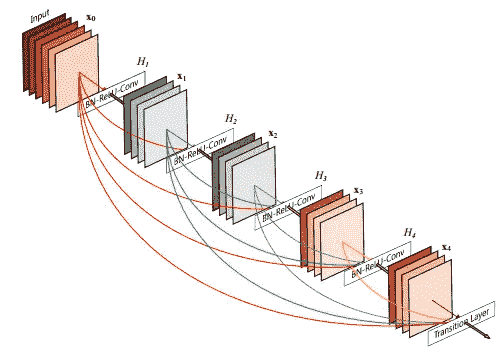
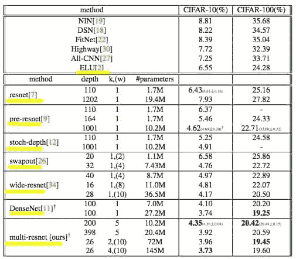
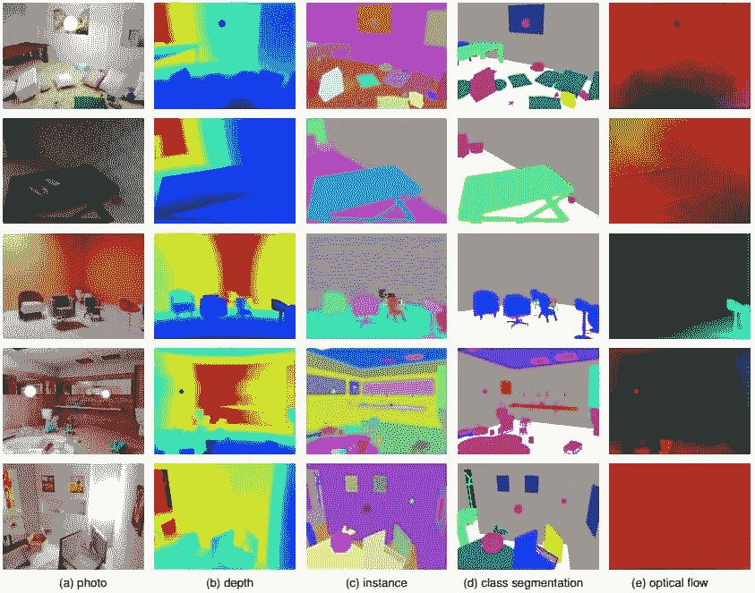
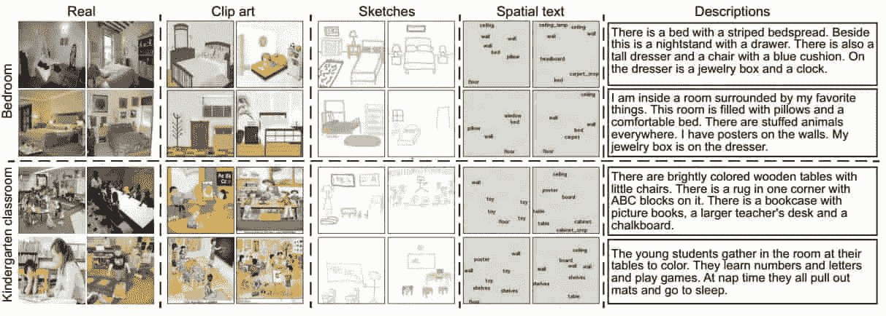
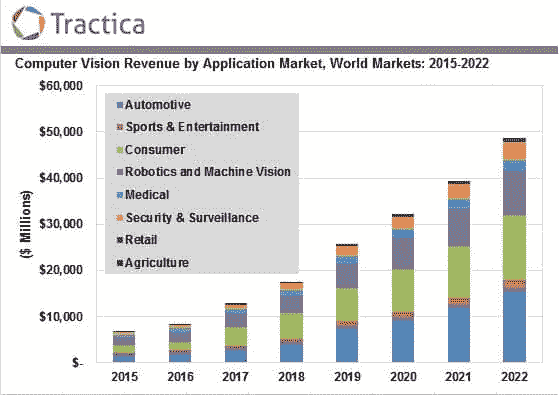

# 计算机视觉一年——第 4 部分，共 4 部分

> 原文：<https://towardsdatascience.com/a-year-in-computer-vision-part-4-of-4-515c61d41a00?source=collection_archive---------10----------------------->

## —第四部分:ConvNet 架构、数据集、不可分组的附加内容

> 下面这篇文章摘自我们的研究团队最近编辑的关于计算机视觉领域的出版物。所有零件现在都可以通过我们的网站以及媒体上的[第 1 部分](https://medium.com/@info_84181/a-year-in-computer-vision-part-1-of-4-eaeb040b6f46)、[第 2 部分](https://medium.com/@info_84181/a-year-in-computer-vision-part-2-of-4-893e18e12be0)和[第 3 部分](https://medium.com/@info_84181/a-year-in-computer-vision-part-3-of-4-861216d71607)获得。

**现在可以通过**[*www.themtank.org*](http://www.themtank.org)在我们的网站上免费获得完整的出版物

我们鼓励读者通过我们自己的网站查看这篇文章，因为我们包括嵌入的内容和简单的导航功能，使报告尽可能动态。我们的网站不会给团队带来任何收入，只是为了让读者尽可能地感受到这些材料的吸引力和直观性。我们竭诚欢迎对演示的任何反馈！

> 请关注、分享和支持我们的工作，无论你喜欢的渠道是什么(请尽情鼓掌！).如有任何问题或想了解对未来作品的潜在贡献，请随时联系编辑:info@themtank.com

# 第四部分:ConvNet 架构、数据集、不可分组的附加内容

# ConvNet 架构

ConvNet 架构最近在计算机视觉之外发现了许多新颖的应用，其中一些将在我们即将出版的出版物中介绍。然而，它们继续在计算机视觉中占据显著地位，架构的进步为本文中提到的许多应用和任务提供了速度、精度和训练方面的改进。

因此，ConvNet 架构对整个计算机视觉至关重要。以下是 2016 年一些值得注意的 ConvNet 架构，其中许多架构都是从 ResNets 最近的成功中获得灵感的。

*   **Inception-v4、Inception-ResNet 和剩余连接对学习的影响**【131】—呈现 Inception v4，这是一个新的 Inception 架构，从 2015 年底开始建立在 Inception v2 和 v3 的基础上。[132]该论文还提供了使用剩余连接来训练初始网络以及一些剩余-初始混合网络的分析。
*   **密集连接的卷积网络**【133】或“DenseNets”直接从 ResNets 的身份/跳跃连接中获得灵感。该方法将这一概念扩展到 ConvNets，使每一层以前馈方式连接到每一层，共享来自先前层的特征地图作为输入，从而创建密集网络。

DenseNets 有几个引人注目的优点:它们缓解了消失梯度问题，加强了特征传播，鼓励特征重用，并大大减少了参数的数量。[134]

**图 16**:dense net 架构示例

**Note**: A 5-layer dense block with a growth rate of *k = 4*. Each layer takes all preceding feature-maps as input. **Source**: Huang et al. (2016)[135]

在 CIFAR-10、CIFAR-100、SVHN 和 ImageNet 上对模型进行了评估；它在很多方面都达到了 SOTA。令人印象深刻的是，DenseNets 实现了这些结果，同时使用更少的内存和降低的计算要求。有多个实现(Keras，Tensorflow 等)[这里](https://github.com/liuzhuang13/DenseNet)。[136]

*   **FractalNet** **无残差超深度神经网络**【137】**—利用不同长度的交互子路径，没有直通或残差连接，而是使用滤波器和非线性变换来改变内部信号。**

***FractalNets 将多个平行层序列与不同数量的卷积块重复组合，以获得较大的标称深度，同时在网络中保持许多短路径*。[138]**

**该网络在 CIFAR 和 ImageNet 上实现了 SOTA 性能，同时展示了一些附加属性。例如，他们对残差在极深网络的成功中的作用提出了质疑，同时也提供了对通过各种子网深度获得的答案的本质的洞察。**

*   ****让我们保持简单:使用简单的架构来超越更深层次的架构**【139】专注于创建一个简化的母架构。该架构在“CIFAR10/100、MNIST 和 SVHN 等数据集上实现了 SOTA 结果，或与现有方法相当，只需简单或无需数据扩充”。我们认为他们的原话是对这一动机的最好描述:**

***在这项工作中，我们提出了一个非常简单的 13 层完全卷积网络架构，对新功能的依赖最小，其性能优于几乎所有更深层的架构，参数减少了 2 到 25 倍。我们的架构可以成为许多场景的非常好的候选，尤其是在嵌入式设备中的应用。”***

***“可以使用深度压缩等方法对其进行进一步压缩，从而大幅降低其内存消耗。我们有意尝试创建一个对最近提出的新功能依赖最小的母架构，以展示一个精心制作但简单的卷积架构的有效性，该架构随后可以通过文献中介绍的现有或新方法进行增强。*【140】**

**以下是一些补充 ConvNet 架构的附加技术:**

*   ****Swapout:学习深度架构的集合** [141]概括了丢弃和随机深度方法，以防止特定层和跨网络层的单元的共同适应。集成训练方法从包括“*丢失、随机深度和剩余架构*”的多个架构中采样。Swapout 在 CIFAR-10 和 CIFAR-100 上的表现优于相同网络结构的 ResNets，可以归类为一种正则化技术。**
*   ****SqueezeNet**【142】**认为，更小的 dnn 提供了各种好处，从更少的计算负担训练到更容易的信息传输和对存储或处理能力有限的设备的操作。SqueezeNet 是一个小型 DNN 架构，它实现了“AlexNet 级别的准确性，使用模型压缩技术显著降低了参数和内存需求，使其比 AlexNet 小 510 倍。”****

****传统上，校正线性单元(ReLU)是所有神经网络的主要激活函数。然而，这里有一些最近的选择:****

*   ******串接整流线性单元(CRelu)**【143】****
*   ******指数线性单位(ELUs)**【144】从 2015 年收盘****
*   ******参数指数线性单元(PELU)**【145】****

******向等方差转换******

****ConvNets 具有平移不变性，这意味着它们可以识别图像多个部分中的相同特征。然而，典型的 CNN 并不是旋转不变的——这意味着如果一个特征或整个图像被旋转，那么网络的性能就会受到影响。通常，ConvNets 通过数据扩充(例如，在训练期间有目的地以小的随机量旋转图像)来学习(某种程度上)处理旋转不变性。这意味着网络获得轻微的旋转不变属性，而无需将旋转不变性特别设计到网络中。这意味着旋转不变性在使用当前技术的网络中受到根本限制。这与人类有一个有趣的相似之处，人类通常在识别颠倒的字符方面表现更差，尽管机器没有理由遭受这种限制。****

****下面的论文解决了**旋转不变变换**。虽然每种方法都有新颖之处，但它们都通过更有效地使用参数来提高旋转不变性，从而最终实现全局旋转等变:****

*   ******谐波 CNN**【146】用‘圆谐波’代替常规 CNN 滤波器。****
*   ******分组等变卷积网络(G-CNNs)**【147】使用 G-卷积，这是一种新型层，与常规卷积层相比，*享有更高程度的权重共享，并在不增加参数数量的情况下增加网络的表达能力。*****
*   ******利用卷积神经网络中的循环对称性**【148】**将四种操作呈现为层，这些层增强神经网络层以部分增加旋转等方差。******
*   ********可控 CNN**【149】**—**Cohen 和 Welling 在他们对 **G-CNNs** 所做工作的基础上，证明了“*可控架构”*在 CIFARs 上优于剩余和密集网络。它们还提供了不变性问题的简明概述:******

*****为了提高机器学习方法的统计效率，许多人寻求学习不变表示。然而，在深度学习中，中间层不应该完全不变，因为局部特征的相对姿态必须为进一步的层保留。因此，人们会想到* ***等变*** *的概念:如果网络产生的表示在输入的变换下以可预测的线性方式变换，则网络是等变的。换句话说，等变网络产生可操纵的表示。可操控性使得不仅可以在每个位置(如在标准卷积层中)应用过滤器，还可以在每个姿势中应用过滤器，从而允许增加参数共享。*107****

******剩余网络******

******图 17**:CIFAR 数据集上的测试错误率****

********

******Note**: Yellow highlight indicates that these papers feature within this piece. Pre-resnet refers to “*Identity Mappings in Deep Residual Networks*” (see following section). Furthermore, while not included in the table we believe that *“****Learning Identity Mappings with Residual Gates***” produced some of the lowest error rates of 2016 with 3.65% and 18.27% on CIFAR-10 and CIFAR-100, respectively.****

******资料来源**:阿卜迪和纳哈万迪(2016 年，第 6 页)[150]****

****继微软的 ResNet[151]取得成功之后，剩余网络及其变体在 2016 年变得非常受欢迎，现在有许多开源版本和预训练模型可用。2015 年，ResNet 在 ImageNet 的检测、定位和分类任务以及 COCO 的检测和分割挑战中获得第一名。虽然关于深度的问题仍然很多，但 ResNets 对消失梯度问题的处理为“*深度增加产生高级抽象*”哲学提供了更多动力，这种哲学支撑着目前的许多深度学习。****

****ResNets 通常被认为是较浅网络的集合，它通过运行与其卷积层平行的快捷连接，在某种程度上抵消了深度神经网络(DNNs)的分层性质。这些快捷方式或 ***跳过连接*** 通过允许梯度在整个网络层中更容易地反向传播，减轻了与 DNNs 相关联的消失/爆炸梯度问题。更多信息，这里有一个 Quora 线程可用。[152]****

******剩余学习、理论和改进******

*   ******广泛的剩余网络**【153】现在是一种极其常见的 ResNet 方法。作者对 ResNet 块的体系结构进行了实验研究，并通过增加网络的宽度和减少网络的深度来改善剩余网络的性能，从而缓解了特征重用问题。这种方法在多个基准上产生了新的 SOTA，包括在 CIFAR-10 和 CIFAR-100 上分别为 3.89%和 18.3%。作者表明，16 层深宽的 ResNet 在准确性和效率方面与许多其他 ResNet(包括 1000 层网络)一样好，甚至更好。****
*   ******具有随机深度的深度网络** [154]本质上是将丢弃应用于整个神经元层，而不是单个神经元束。"*我们从非常深的网络开始，但在训练过程中，对于每个小批量，随机丢弃一个子集的层，并用身份函数绕过它们。*“随机深度允许更快的训练和更好的准确性，即使训练网络超过 1200 层。****
*   ******利用剩余门学习身份映射**【155】—“*通过使用标量参数来控制每个门，我们提供了一种仅通过优化一个参数来学习身份映射的方法。*“作者使用这些门控结果来改善深度模型的优化，同时提供‘对全层移除的高容忍度’,使得 90%的性能在随机显著移除后保持不变。使用宽门控结果，该模型在 CIFAR- 10 和 CIFAR-100 上分别实现了 3.65%和 18.27%的误差。****
*   ******剩余网络的行为类似于相对较浅的网络的集合**【156】**——剩余网络可以被视为许多路径的集合，这些路径并不强烈依赖于彼此，因此强化了集合行为的概念。此外，剩余路径在长度上有所不同，短路径在训练过程中会产生梯度，而较深的路径在此阶段不会产生梯度。******
*   ********深度剩余网络中的身份映射** [157]是对原 Resnet 作者、何、、任、的改进。标识映射显示为允许“当用作跳过连接和添加后激活时，在任何 ResNet 块之间传播前向和后向信号”。该方法在 CIFAR-10 (4.62%误差)和 CIFAR-100 上使用 1001 层 ResNet，在 ImageNet 上使用 200 层 ResNet，改进了推广、训练和结果"*。*******
*   ******多重残差网络:提高残差网络的速度和准确性** [158]再次倡导 ResNet 的整体行为，并支持对 ResNet 架构采用更广泛、更深入的方法。*所提出的多残差网络增加了残差块中残差函数的数量。*“精度提高后，CIFAR-10 和 CIFAR-100 的误差分别为 3.73%和 19.45%。图 17 中的表格摘自本文，考虑到 2017 年迄今所做的工作，有更多最新版本可用。****

******其他剩余理论和改进** 虽然这是一个相对较新的概念，但目前有相当多的工作是围绕剩余理论创建的。以下是我们希望向感兴趣的读者强调的一些额外的理论和改进:****

*   ****[高速公路和剩余网络学习展开迭代估计](https://arxiv.org/abs/1612.07771)【159】****
*   ****[残差网络的残差网络:多级残差网络](https://arxiv.org/abs/1609.05672)【160】****
*   ****[Resnet 中的 Resnet:一般化剩余架构](https://arxiv.org/abs/1603.08029)【161】****
*   ****[更宽或更深:重新审视用于视觉识别的 ResNet 模型](https://arxiv.org/abs/1611.10080)【162】****
*   ****[弥合剩余学习、递归神经网络和视觉皮层之间的差距](https://arxiv.org/abs/1604.03640)【163】****
*   ****[卷积剩余记忆网络](https://arxiv.org/abs/1606.05262)【164】****
*   ****[深度学习中的身份问题](https://arxiv.org/abs/1611.04231)【165】****
*   ****[具有指数线性单元的深度残差网络](https://arxiv.org/abs/1604.04112)【166】****
*   ****[深度网络的加权残差](https://arxiv.org/abs/1605.08831)【167】****

# ****数据集****

****丰富的数据集对于机器学习的所有方面的重要性不能被夸大。因此，我们认为包含该领域中一些最大的进步是谨慎的。套用 Kaggle 的联合创始人兼首席技术官 Ben Hamner 的话，“一个新的数据集可以让一千篇论文繁荣发展”，[168]也就是说，数据的可用性可以促进新的方法，也可以为以前无效的技术注入新的活力。****

****2016 年，ImageNet[169]、上下文中的公共对象(COCO)[170]、CIFARs[171]和 MNIST[172]等传统数据集加入了大量新条目。我们还注意到，图形技术的进步刺激了合成数据集的兴起。合成数据集是人工神经网络(ann)的大数据需求的一个有趣的解决方案。为了简洁起见，我们选择了(主观上)最重要的 2016 年*新*数据集:****

*   ******地点 2**【173】是一个场景分类数据集，即任务是给一幅图像标注一个场景类别，如“体育场”、“公园”等。虽然预测模型和图像理解无疑将通过 Places2 数据集得到改善，但根据该数据集训练的网络的一个有趣发现是，在学习对场景进行分类的过程中，网络学会了在没有明确学习的情况下检测其中的对象。例如，卧室里有床，水槽可以在厨房和浴室里。这意味着对象本身是场景分类的抽象层次中的较低级特征。****

******图 18**:scene net RGB-D 的示例****

********

******Note**: Examples taken from SceneNet RGB-D, a dataset with 5M Photorealistic Images of Synthetic Indoor Trajectories with Ground Truth. The photo (a) is rendered through computer graphics with available ground truth for specific tasks from (b) to (e). Creation of synthetic datasets should aid the process of domain adaptation. Synthetic datasets are somewhat pointless if the knowledge learned from them cannot be applied to the real world. This is where domain adaptation comes in, which refers to this transfer learning process of moving knowledge from one domain to another, e.g. from synthetic to real-world environments. Domain adaptation has recently been improving very rapidly again highlighting the recent efforts in transfer learning. Columns © vs (d) show the difference between instance and semantic/class segmentation.****

******资料来源**:麦科马克等人(2017)[174]****

*   ******SceneNet RGB-D**【175】**—该合成数据集扩展了原始 scene net 数据集，并为场景理解问题(如语义分割、实例分割和对象检测)以及几何计算机视觉问题(如光流、深度估计、相机姿态估计和 3D 重建)提供了像素级的真实情况。数据集通过提供像素完美的表示来细化所选的环境。******
*   ********cm places**【176】是麻省理工学院的跨模态场景数据集。任务是识别自然图像之外的许多不同模态的场景，并在此过程中有希望跨模态传递该知识。一些模态是:真实、剪贴画、草图、空间文本(与对象的空间位置相对应的文字)和自然语言描述。本文还讨论了如何用交叉模态卷积神经网络处理这类问题的方法。******

******图 19** : CMPlaces 跨模态场景表示****

********

******Note**: Taken from the CMPlaces paper showing two examples, bedrooms and kindergarten classrooms, across different modalities. Conventional Neural Network approaches learn representations that don’t transfer well across modalities and this paper attempts to generate a shared representation “agnostic of modality”.****

******资料来源** : Aytar 等人(2016)[177]****

****在 CMPlaces 中，我们看到明确提到迁移学习、领域不变表示、领域适应和多模态学习，所有这些都有助于进一步展示当前计算机视觉研究的趋势。作者专注于试图找到“*领域/模态独立表示*”，这可能对应于人类从中得出统一表示的更高级抽象。例如，以“猫”的各种形态为例，人类在书写中看到“猫”这个词，在速写本中画出一幅画，在现实世界中看到一幅图像，或者在讲话中提到，但我们仍然在这些形态之上的更高层次上抽象出相同的统一表示。****

*****“人类能够独立地利用他们感知的知识和经验，机器的类似能力将使检索和识别方面的一些重要应用成为可能”*。****

*   ******MS-Cele b-1M**【178】包含一百万个名人的图像，在面部识别的训练集中有一千万个训练图像。****
*   ******开放图像**【179】由谷歌公司提供，包含大约 900 万个带有多个标签的图像的 URL，这是对典型的单标签图像的巨大改进。开放图像涵盖 6000 个类别，比 ImageNet 之前提供的 1000 个类别(较少关注犬科动物)有了很大的改进，应该证明对机器学习社区是不可或缺的。****
*   ******YouTube-8M**【180】**也是谷歌提供的 800 万个视频网址，50 万小时的视频，4800 个课程，平均。每个视频 1.8 个标签。标签的一些例子是:“艺术&娱乐”、“购物”和“宠物&动物”。视频数据集更难以标记和收集，因此该数据集提供了巨大的价值。******

******也就是说，图像理解方面的进步，如分割、对象分类和检测，已经将视频理解带到了研究的前沿。然而，在这个数据集发布之前，现实世界中可用的视频数据集的种类和规模都非常缺乏。此外，该数据集最近刚刚更新，[181]今年，谷歌与 Kaggle 联合举办了一场视频理解比赛，作为 2017 年 CVPR 的一部分。[182]******

******关于 YouTube-8M 的一般信息:[此处](https://research.google.com/youtube8m/)【183】******

# ******无法组合的额外项目和有趣的趋势******

******当这个作品接近尾声时，我们感叹我们不得不在这样的限制下创作它。事实上，计算机视觉的领域太过广阔，无法涵盖任何真实的、有意义的深度，因此出现了许多疏漏。不幸的是，其中一个遗漏是几乎所有不使用神经网络的东西。我们知道在 NNs 之外有很好的工作，我们承认我们自己的偏见，但是我们认为目前的动力在于这些方法，并且我们对纳入材料的主观选择主要基于从整个研究社区收到的接收(结果不言自明)。******

******我们还要强调的是，在上述主题中还有数百篇其他论文，这些主题并不是权威的，而是希望鼓励感兴趣的人沿着我们提供的入口进一步阅读。因此，这最后一节是对我们喜欢的一些其他应用程序、我们希望强调的趋势以及我们希望向读者提出的理由的总括。******

********应用/用例********

*   ****脸书的盲人应用程序[184]和百度的硬件。[185]****
*   ****情感检测结合了面部检测和语义分析，发展迅速。目前有 20 多个可用的 API。[186]****
*   ****从航空影像中提取道路，[187]从航空地图和人口密度地图中进行土地利用分类。[188]****
*   ****Amazon Go 通过展示无队列购物体验进一步提升了计算机视觉的形象，[189]尽管目前仍存在一些功能问题。[190]****
*   ****对于自动驾驶汽车，有大量的工作正在进行，而我们基本上没有触及。然而，对于那些希望深入研究总体市场趋势的人来说，Moritz Mueller-Freitag 有一篇关于德国汽车行业和自动驾驶汽车影响的 200 亿神经元的优秀文章。[191]****
*   ****其他感兴趣的领域:图像检索/搜索，[192]手势识别，修复和面部重建。****
*   ****围绕医学中的数字成像和通信(DICOM)以及其他医学应用，尤其是与成像相关的应用，有大量的工作要做。例如，已经存在(并且仍然存在)许多 Kaggle 检测竞赛(肺癌、宫颈癌)，其中一些具有大量金钱激励，在这些竞赛中，算法试图在所讨论的分类/检测任务中胜过专家。****

****然而，当改进这些算法的错误率的工作继续进行时，它们作为医疗从业者的工具的价值越来越明显。当我们考虑到通过将人工智能系统[【193】](http://localhost:3000/a-year-in-computer-vision#ftnt193)与医学专家相结合而实现的乳腺癌检测性能改善时，这一点尤为引人注目。[194]在这种情况下，机器人-人类共生产生的准确度远远大于其各部分的总和，达到 99.5%。****

****这只是深度学习/机器学习社区目前正在追求的医疗应用洪流的一个例子。我们团队中一些愤世嫉俗的成员开玩笑地将这些尝试视为一种手段，以迎合社会对人工智能研究作为一种无处不在的慈善力量的想法。但是，只要这项技术有助于医疗保健行业，并且是以安全和慎重的方式引入的，我们就全心全意地欢迎这种进步。****

******硬件/市场******

*   ****机器人视觉/机器视觉(独立领域)的增长市场和物联网的潜在目标市场。我们个人最喜欢的是一个农民的儿子使用深度学习、覆盆子 Pi 和 TensorFlow 在日本根据独特的生产者启发式质量(如形状、大小和颜色)对黄瓜进行分类。[195]这大大减少了他母亲在挑选黄瓜上花费的时间。****
*   ****计算需求的缩减和向移动设备迁移的趋势是显而易见的，但同时也伴随着急剧的硬件加速。很快，我们将到处看到口袋大小的 CNN 和视觉处理单元(vpu)。例如，Movidius Myriad2 用于谷歌的 Tango 和无人机项目。[196]****

****m ovidius Fathom stick[197]也使用了 Myriad2 的技术，允许用户将 SOTA 计算机视觉性能添加到消费设备中。Fathom 棒具有 USB 棒的物理属性，它将神经网络的能力带到了几乎任何设备上:棒上的大脑。****

*   ****使用非可见光的传感器和系统。例子包括雷达、热成像相机、超光谱成像、声纳、磁共振成像等。****
*   ****降低激光雷达的成本，它使用光和雷达来测量距离，并提供许多优于普通 RGB 相机的优势。目前有许多价格低于 500 美元的激光雷达设备。****
*   ****Hololens 和几乎无数的其他增强现实耳机[198]进入市场。****
*   ******谷歌的探戈项目**【199】代表了 SLAM 的下一个重大商业化。Tango 是一个增强现实计算平台，包括新颖的软件和硬件。Tango 允许在不使用 GPS 或其他外部信息的情况下检测移动设备相对于世界的位置，同时以 3D 方式绘制设备周围的区域。****

****企业合作伙伴联想在 2016 年向市场推出了价格实惠的 Tango 手机，使数百名开发者开始为该平台创建应用程序。Tango 采用了以下软件技术:运动跟踪、区域学习和深度感知。****

******更新 2019 年 10 月** : [谷歌的 Tango 怎么了？](https://www.dailywireless.org/mobile/what-happened-to-google-tango/)****

******基于即将出版的出版物的遗漏******

****在机器学习和人工智能中，计算机视觉技术和其他领域之间也有相当多且越来越多的重叠。这些其他领域和混合用例是 M Tank 即将发布的出版物的主题，与本文的全部内容一样，我们基于自己的启发对内容进行了划分。****

****例如，我们决定将两个完整的计算机视觉任务，图像字幕和视觉问答，与视觉语音识别一起放在我们即将推出的 NLP 作品中，因为涉及到 CV 和 NLP 的结合。而将生成模型应用于图像则是我们在生成模型方面的工作。这些未来作品中包括的例子有:****

*   ******唇读**:2016 年，我们看到了 LipNet[200]等程序在唇读方面的巨大进步，这些程序将计算机视觉和 NLP 结合到视觉语音识别中。****
*   ******应用于图像的生成模型**将成为我们对自回归模型(PixelRNN、PixelCNN、ByteNet、VPN、WaveNet)、生成对抗网络(GANs)、变分自动编码器之间激烈*斗争的描述的一部分，正如你在此阶段所预期的，所有这些模型的变体、组合和混合体。****

*****免责声明:监测组希望指出，他们不宽恕任何形式的网络对网络(非)暴力，并且同情向生殖性非对话网络(枪支)发展的运动。[【201】](http://localhost:3000/a-year-in-computer-vision#ftnt201)****

****在最后一部分，我们将提供一些总结性的评论，并对我们发现的一些趋势进行概括。我们希望我们能够足够全面地展示计算机视觉领域的大致位置和近期发展方向的鸟瞰图。我们还要特别提请注意，我们的工作不涵盖 2017 年 1 月至 8 月。研究产出的快速增长意味着大部分工作可能已经过时；我们鼓励读者去看看，看看是否适合自己。但这种快速增长也带来了有利可图的机会，因为计算机视觉硬件和软件市场预计到 2022 年将达到 486 亿美元。****

******图 20** :应用市场计算机视觉收入【202】****

********

******Note**: Estimation of Computer Vision revenue by application market spanning the period from 2015–2022\. The largest growth is forecasted to come from applications within the automotive, consumer, robotics and machine vision sectors.
**Source**: Tractica (2016)[203]****

# ****结论****

****最后，我们想强调在我们的研究回顾过程中反复出现的一些趋势和反复出现的主题。首先，我们想提请注意机器学习研究社区对优化的贪婪追求。这在准确率的逐年变化中最为明显，尤其是在准确率的年内变化中。我们想强调这一点，过一会儿再回到这一点。****

****错误率并不是唯一狂热优化的参数，研究人员正在努力提高速度、效率，甚至是以全新的方式推广到其他任务和问题的算法能力。我们敏锐地意识到，随着一次性学习、生成模型、迁移学习以及最近的进化学习等方法的出现，研究开始崭露头角，我们认为这些研究原则正在逐渐对最佳表现工作的方法产生更大的影响。****

****虽然最后一点毫无疑问是对这一趋势的赞扬，而不是诋毁，但人们不禁将注意力投向人工通用智能(非常)遥远的幽灵，无论是否值得思考。我们绝不是危言耸听，我们只是希望向专家和外行人强调，这种担忧来自这里，来自计算机视觉和其他人工智能子领域已经显而易见的惊人进展。只有通过关于这些进步及其总体影响的教育，才能恰当地表达公众的关切。这可能会反过来平息媒体情绪的力量和人工智能中的错误信息。****

****我们选择关注一年时间表有两个原因。第一个因素与正在制作的作品数量有关。即使对于非常关注该领域的人来说，随着出版物数量呈指数级增长，跟上研究的步伐也变得越来越困难。第二个让我们回到年内变化的观点。****

****通过对一年的进展进行快照，读者可以开始理解目前的研究进度。我们在如此短的时间内看到了一个又一个的改善，但是为什么呢？研究人员已经培育了一个全球社区，在这个社区中，基于以前的方法(架构、元架构、技术、想法、技巧、古怪的黑客、结果等)进行构建。)，以及基础设施(像 Keras、TensorFlow 和 PyTorch、GPU 等库。)，不仅是鼓励，也是庆祝。一个以开源为主的社区，鲜有相似之处，它不断吸引新的研究人员，其技术被经济学、物理学和无数其他领域重新引用。****

****对于那些还没有注意到的人来说，重要的是要理解，在已经疯狂的不同声音的合唱中，宣告对这项技术的真实性质的神圣洞察力，至少有一致意见；一致认为这项技术将以令人兴奋的新方式改变世界。然而，对于这些变化将在什么时间展开，仍然存在很多分歧。****

****在我们能够准确模拟这些进展之前，我们将继续尽最大努力提供信息。通过这个资源，我们希望迎合人工智能经验的范围，从研究人员到任何只想获得计算机视觉和人工智能基础的人。我们的项目希望以此为开源革命增加一些价值，这场革命在一生的技术之下悄然进行。****

****非常感谢，****

> ****M 坦克****

********

> ****请随意将所有反馈和建议放在评论区，我们会尽快回复。或者，您可以通过以下方式直接联系我们:info@themtank.com****

****完整版本可在:[www.themtank.org/a-year-in-computer-vision](http://www.themtank.org/a-year-in-computer-vision)获得****

## ****按出现顺序排列的参考文献****

****[131] Szegedy 等人，2016 年。Inception-v4，Inception-ResNet 和剩余连接对学习的影响。*【在线】arXiv: 1602.07261* 。可用:[**arXiv:1602.07261 v2**](https://arxiv.org/abs/1602.07261v2)****

****[132] Szegedy 等人，2015 年。重新思考计算机视觉的初始架构。*【在线】arXiv: 1512.00567* 。可用:[arXiv:1512.00567 v3](https://arxiv.org/abs/1512.00567v3)****

****[133]黄等，2016。密集连接的卷积网络。*【在线】arXiv: 1608.06993* 。可用:[arXiv:1608.06993 v3](https://arxiv.org/abs/1608.06993v3)****

****134 同上****

****135 同上****

****[136]刘庄 13。2017.密集连接卷积网络的代码。*【在线】github.com*。可用:[https://github.com/liuzhuang13/DenseNet](https://github.com/liuzhuang13/DenseNet)【访问时间:2017 年 03 月 04 日】。****

****[137] Larsson 等人，2016 年。FractalNet:无残差超深度神经网络。*【在线】arXiv: 1605.07648* 。可用:[arXiv:1605.07648 v2](https://arxiv.org/abs/1605.07648v2)****

****[138]黄等，2016 年。密集连接的卷积网络。*【在线】arXiv: 1608.06993* 。可用:[**arXiv:1608.06993 v3**](https://arxiv.org/abs/1608.06993v3)，pg。1.****

****[139] Hossein HasanPour 等人，2016 年让我们保持简单:使用简单的架构来超越更深层次的架构。*【在线】arXiv: 1608.06037* 。可用:[**arXiv:1608.06037 v3**](https://arxiv.org/abs/1608.06037v3)****

****140 同上****

****[141] Singh 等人，2016 年。Swapout:学习深层架构的合奏。*【在线】arXiv: 1605.06465* 。可用:[arXiv:1605.06465 v1](https://arxiv.org/abs/1605.06465v1)****

****[142] Iandola 等人，2016 年。SqueezeNet: AlexNet 级精度，参数少 50 倍<0.5MB model size. *【在线】arXiv: 1602.07360* 。可用:[**arXiv:1602.07360 v4**](https://arxiv.org/abs/1602.07360v4)****

****[143]尚等，2016。通过级联校正线性单元理解和改进卷积神经网络。*【在线】arXiv: 1603.05201* 。可用:[**arXiv:1603.05201 v2**](https://arxiv.org/abs/1603.05201v2)****

****[144] Clevert 等人，2016 年。通过指数线性单元(ELUs)进行快速准确的深度网络学习。*【在线】arXiv: 1511.07289* 。可用:[**arXiv:1511.07289 V5**](https://arxiv.org/abs/1511.07289v5)****

****[145] Trottier 等人，2016 年。深度卷积神经网络的参数指数线性单元。*【在线】arXiv: 1605.09332* 。可用:[arXiv:1605.09332 v3](https://arxiv.org/abs/1605.09332v3)****

****[146]沃拉尔等人，2016 年。谐波网络:深度平移和旋转等值。*【在线】arXiv: 1612.04642* 。可用:[**arXiv:1612.04642 v1**](https://arxiv.org/abs/1612.04642v1)****

****[147]科恩&韦林。2016.群等变卷积网络。*【在线】arXiv: 1602.07576* 。可用:[**arXiv:1602.07576 v3**](https://arxiv.org/abs/1602.07576v3)****

****[148] Dieleman 等人，2016 年。利用卷积神经网络中的循环对称性。*【在线】arXiv: 1602.02660* 。可用:[arXiv:1602.02660 v2](https://arxiv.org/abs/1602.02660v2)****

****[149]科恩&韦林。2016.可操纵 CNN。*【在线】arXiv: 1612.08498* 。可用:[arXiv:1612.08498 v1](https://arxiv.org/abs/1612.08498v1)****

****[150] Abdi，m .，Nahavandi，S. 2016 年。多重残差网络:提高残差网络的速度和精度。*【在线】arXiv: 1609.05672* 。可用:[arXiv:1609.05672 v3](https://arxiv.org/abs/1609.05672v3)****

****[151]何等，2015。用于图像识别的深度残差学习。*【在线】arXiv: 1512.03385* 。可用:[**arXiv:1512.03385 v1**](https://arxiv.org/abs/1512.03385v1)****

****[152] Quora。2017.深度剩余网络的直观解释是什么？*【网站】*[*www.quora.com*](http://www.quora.com/)。可用:[https://www . quora . com/What-a-intuitive-an-explain-of-Deep-Residual-Networks](https://www.quora.com/What-is-an-intuitive-explanation-of-Deep-Residual-Networks)【访问时间:2017 年 03 月 04 日】。****

****[153] Zagoruyko，s .和 Komodakis，N. 2017。广泛的剩余网络。*【在线】arXiv: 1605.07146* 。可用:[arXiv:1605.07146 v3](https://arxiv.org/abs/1605.07146v3)****

****[154]黄等，2016。具有随机深度的深度网络。*【在线】arXiv: 1603.09382* 。可用:[**arXiv:1603.09382 v3**](https://arxiv.org/abs/1603.09382v3)****

****[155] Savarese 等人，2016 年。用剩余门学习身份映射。*【在线】arXiv: 1611.01260* 。可用:[**arXiv:1611.01260 v2**](https://arxiv.org/abs/1611.01260v2)****

****156 韦特、威尔伯和贝隆吉。2016.剩余网络的行为类似于相对较浅的网络的集合。*【在线】arXiv: 1605.06431* 。可用:[**arXiv:1605.06431 v2**](https://arxiv.org/abs/1605.06431v2)****

****[157]他在阿尔 2016.深剩余网络中的身份映射。*【在线】arXiv: 1603.05027* 。可用:[**arXiv:1603.05027 v3**](https://arxiv.org/abs/1603.05027v3)****

****[158] Abdi，m .，Nahavandi，S. 2016。多重残差网络:提高残差网络的速度和精度。*【在线】arXiv: 1609.05672* 。可用:[arXiv:1609.05672 v3](https://arxiv.org/abs/1609.05672v3)****

****[159] Greff 等人，2017 年。公路和残差网络学习展开迭代估计。*【在线】arXiv: 1612。07771* 。可用:[arXiv:1612.07771 v3](https://arxiv.org/abs/1612.07771v3)****

****160 阿布迪和纳哈万迪。2017.多重残差网络:提高残差网络的速度和精度。*【在线】1609.05672* 。可用:[**arXiv:1609.05672 v4**](https://arxiv.org/abs/1609.05672v4)****

****[161] Targ 等人，2016 年。概化剩余架构。*【在线】arXiv: 1603.08029* 。可用:[arXiv:1603.08029 v1](https://arxiv.org/abs/1603.08029v1)****

****[162]吴等，2016。更广还是更深:重新审视视觉识别的 ResNet 模型。*【在线】arXiv: 1611.10080* 。可用:[arXiv:1611.10080 v1](https://arxiv.org/abs/1611.10080v1)****

****[163]廖和波焦。2016.弥合剩余学习、递归神经网络和视觉皮层之间的差距。*【在线】arXiv: 1604.03640* 。可用:[arXiv:1604.03640 v1](https://arxiv.org/abs/1604.03640v1)****

****164 莫尼斯和帕尔。2016.卷积剩余记忆网络。*【在线】arXiv: 1606.05262* 。可用:[**arXiv:1606.05262 v3**](https://arxiv.org/abs/1606.05262v3)****

****[165]哈特和马。2016.身份在深度学习中很重要。*【在线】arXiv: 1611.04231* 。可用:[**arXiv:1611.04231 v2**](https://arxiv.org/abs/1611.04231v2)****

****[166] Shah 等人，2016 年。具有指数线性单位的深度剩余网络。*【在线】arXiv: 1604.04112* 。可用:[arXiv:1604.04112 v4](https://arxiv.org/abs/1604.04112v4)****

****[167]沈、曾。2016.甚深网络的加权残差。*【在线】arXiv: 1605.08831* 。可用:[**arXiv:1605.08831 v1**](https://arxiv.org/abs/1605.08831v1)****

****168 本·哈姆纳。2016.推特状态。*【在线】推特。*可用:[https://twitter.com/benhamner/status/789909204832227329](https://twitter.com/benhamner/status/789909204832227329)****

****169 ImageNet。2017.主页。*【在线】*可用:[http://image-net.org/index](http://image-net.org/index)【访问时间:2017 年 04 月 01 日】****

****[170]可可。2017.公共主页中的公共对象。*【在线】*可用:[http://mscoco.org/](http://mscoco.org/)【访问时间:2017 年 04 月 01 日】****

****171 CIFARs。2017.CIFAR-10 数据集。*【在线】*可用:[https://www.cs.toronto.edu/~kriz/cifar.html](https://www.cs.toronto.edu/~kriz/cifar.html)【访问时间:2017 年 04 月 01 日】****

****172 MNIST。2017.MNIST 手写数字数据库。*【在线】*可用:[http://yann.lecun.com/exdb/mnist/](http://yann.lecun.com/exdb/mnist/)【访问时间:2017 年 04 月 01 日】****

****[173]周等，2016。地点 2。*【在线】*可用:[http://places2.csail.mit.edu/](http://places2.csail.mit.edu/)【访问时间:2017 年 06 月 01 日】****

****174 同上****

****[175]麦科马克等人，2017 年。SceneNet RGB-D:具有地面真实性的合成室内轨迹的 5M 照片级真实感图像。*【在线】arXiv: 1612.05079* v3。可用:[**arXiv:1612.05079 v3**](https://arxiv.org/abs/1612.05079v3)****

****[176] Aytar 等人，2016 年。跨模态场景网络。*【在线】arXiv: 1610.09003* 。可用:[**arXiv:1610.09003 v1**](https://arxiv.org/abs/1610.09003v1)****

****177 同上****

****[178]郭等，2016。MS-Celeb-1M:大规模人脸识别的数据集和基准。*【在线】arXiv: 1607.08221* 。可用:[**arXiv:1607.08221 v1**](https://arxiv.org/abs/1607.08221v1)****

****[179]开放图像。2017.打开图像数据集。*【在线】Github* 。可用:【https://github.com/openimages/dataset 【访问时间:2017 年 8 月 1 日】****

****[180] Abu-El-Haija 等人，2016 年。YouTube-8M:大规模视频分类基准。*【在线】arXiv: 1609.08675* 。可用:[**arXiv:1609.08675 v1**](https://arxiv.org/abs/1609.08675v1)****

****[181]纳采夫，第 2017 页。更新的 YouTube-8M、视频理解挑战和 CVPR 研讨会。我的天啊。。*【在线】谷歌研究博客*。可用:[https://research . Google blog . com/2017/02/an-updated-YouTube-8m-video . html](https://research.googleblog.com/2017/02/an-updated-youtube-8m-video.html)【访问时间:26/02/2017】。****

****[182] YouTube-8M。2017.CVPR 17 年关于 YouTube 的研讨会-8M 大规模视频理解。*【在线】谷歌研究*。可用:[https://research.google.com/youtube8m/workshop.html](https://research.google.com/youtube8m/workshop.html)【访问时间:26/02/2017】。****

****[183]谷歌。2017.YouTube-8M 数据集。*【在线】research.google.com*。可用:[https://research.google.com/youtube8m/](https://research.google.com/youtube8m/)【访问时间:2017 年 04 月 03 日】。****

****[184]吴、皮克和。2016.使用人工智能帮助盲人“看见”脸书。*【在线】脸书编辑部*。可用:[http://news room . FB . com/news/2016/04/using-artificial-intelligence-to-help-blind-people-see-Facebook/](http://newsroom.fb.com/news/2016/04/using-artificial-intelligence-to-help-blind-people-see-facebook/)【访问时间:2017 年 02 月 03 日】。****

****[185]梅斯。2016.人工智能终于进入了我们的日常世界。*【在线】连线*。可用:[https://www . wired . com/2016/01/2015-was-the-year-ai-finally-entry-the-daily-world/](https://www.wired.com/2016/01/2015-was-the-year-ai-finally-entered-the-everyday-world/)【访问时间:2017 年 02 月 03 日】。****

****[186]多尔费尔德。2015.20 多个情感识别 API 会让你印象深刻，并关注。*【在线】北欧 API*。可用:[http://nordicapis . com/20-emotion-recognition-APIs-that-leave-you-impressed-and-concerned/](http://nordicapis.com/20-emotion-recognition-apis-that-will-leave-you-impressed-and-concerned/)【访问时间:2017 年 02 月 03 日】。****

****[187]约翰逊，2016 年。trail behind/deep osm-使用 OpenStreetMap 功能和卫星图像训练深度学习网络。*【在线】Github.com*。可用:【https://github.com/trailbehind/DeepOSM 【访问时间:29/03/2017】。****

****188 格罗和蒂埃克。2016.用更好的地图连接世界。*【在线】脸书电码*。可用:[https://code . Facebook . com/posts/1676452492623525/connecting-the-world with-better-maps/](https://code.facebook.com/posts/1676452492623525/connecting-the-world-with-better-maps/)【访问时间:2017 年 02 月 03 日】。****

****[189]亚马逊。2017.常见问题— Amazon Go。*【网址】Amazon.com*。可用:[https://www.amazon.com/b?node=16008589011](https://www.amazon.com/b?node%3D16008589011)【访问时间:29/03/2017】。****

****[190]雷辛格特区，2017 年。亚马逊的免收银商店可能很容易被攻破。*【在线】财富科技*。可用:[http://fortune.com/2017/03/28/amazon-go-cashier-free-store/](http://fortune.com/2017/03/28/amazon-go-cashier-free-store/)【访问时间:29/03/2017】。****

****[191]穆勒-弗莱塔格，M. 2017 年。德国在车轮上睡着了？*[博客]两百亿神经元——Medium.com*。可用:[https://medium . com/twenty bn/Germany-sleep-at-the-wheel-d 800445 d6da 2](https://medium.com/twentybn/germany-asleep-at-the-wheel-d800445d6da2)****

****[192]戈多等人，2016 年。深度图像检索:学习图像搜索的全局表示。*【在线】arXiv: 1604.01325* 。可用:[arXiv:1604.01325 v2](https://arxiv.org/abs/1604.01325v2)****

****[193]王等，2016。用于识别转移性乳腺癌的深度学习。*【在线】arXiv: 1606.05718* 。可用:[arXiv:1606.05718 v1](https://arxiv.org/abs/1606.05718v1)****

****[194]罗森菲尔德，J. 2016。人工智能实现了接近人类的乳腺癌检测。*【在线】Mentalfloss.com*。可用:[http://mental loss . com/article/82415/ai-achieves-near-human-detection-breast-cancer](http://mentalfloss.com/article/82415/ai-achieves-near-human-detection-breast-cancer)【访问时间:27/03/2017】。****

****[195]佐藤，K. 2016 年。一个日本黄瓜农民如何使用深度学习和 TensorFlow。*【博客】谷歌云平台*。可用:[https://cloud . Google . com/blog/big-data/2016/08/how-a-Japanese-cucumber-farmer-is-use-deep-learning-and-tensor flow](https://cloud.google.com/blog/big-data/2016/08/how-a-japanese-cucumber-farmer-is-using-deep-learning-and-tensorflow)****

****[196]班纳吉，第 2016 页。VPUs 的崛起:给机器眼睛。*【在线】* [*www.digit.in*](http://www.digit.in/) 。可用:[http://www . digit . in/general/the-rise-of-vpus-giving-eyes-to-machines-29561 . html](http://www.digit.in/general/the-rise-of-vpus-giving-eyes-to-machines-29561.html)【访问时间:22/03/2017。****

****197m ovidius。2017.嵌入式神经网络计算框架。*【在线】Movidius.com*。可用:[https://www . m ovidius . com/solutions/machine-vision-algorithms/machine-learning](https://www.movidius.com/solutions/machine-vision-algorithms/machine-learning)【访问时间:03/03/2017】。****

****[198] Dzyre，N. 2016。你可以买到的 10 款即将上市的增强现实和智能眼镜。*【博客】* *洪家*。可用:[http://www . hongkiat . com/blog/augmented-reality-smart-glasses/](http://www.hongkiat.com/blog/augmented-reality-smart-glasses/)【访问时间:2017 年 3 月 3 日】。****

****[199]谷歌。2017.探戈。*【网址】get.google.com*。可用:[https://get.google.com/tango/](https://get.google.com/tango/)【访问时间:23/03/2017】。****

****[200] Assael 等人，2016 年。LipNet:端到端的句子级唇读。*【在线】arXiv: 1611.01599* 。可用: [arXiv:1611.01599v2](https://arxiv.org/abs/1611.01599v2)****

****[201] Albanie 等人，2017 年。制止 GAN 暴力:生成性非通用网络。*【在线】arXiv: 1703.02528* 。可用:[arXiv:1703.02528 v1](https://arxiv.org/abs/1703.02528v1)****

****[202] Tractica。2016.到 2022 年，计算机视觉硬件和软件市场将达到 486 亿美元。*【网址】*[*【www.tractica.com】*](http://www.tractica.com/)。可用:[https://www . tractica . com/news room/press-releases/computer-vision-hardware-and-software-market-to-reach-4860 亿-by-2022/](https://www.tractica.com/newsroom/press-releases/computer-vision-hardware-and-software-market-to-reach-48-6-billion-by-2022/) 【访问日期:2017 年 12 月 3 日】。****

****203 同上****