# 马尔可夫链蒙特卡罗方法的零数学介绍

> 原文：<https://towardsdatascience.com/a-zero-math-introduction-to-markov-chain-monte-carlo-methods-dcba889e0c50?source=collection_archive---------0----------------------->

对于我们中的许多人来说，贝叶斯统计充其量是巫毒魔法，或者说是完全主观的胡说八道。在贝叶斯方法的商标中，马尔可夫链蒙特卡罗方法尤其神秘。它们肯定是数学密集型和计算昂贵的过程，但是它们背后的基本推理，就像数据科学中的许多其他东西一样，可以变得直观。这是我在这里的目标。

那么，什么是马尔可夫链蒙特卡罗(MCMC)方法呢？简短的回答是:

> MCMC 方法用于通过概率空间中的随机采样来近似感兴趣参数的后验分布。

在这篇文章中，我将解释这个简短的答案，没有任何数学。

首先，一些术语。感兴趣的*参数只是一些概括我们感兴趣的现象的数字。一般来说，我们用统计学来估计参数。例如，如果我们想了解成年人的身高，我们感兴趣的参数可能是以英寸为单位的平均身高。一个 ***分布*** 是我们参数的每一个可能值以及我们观察每一个的可能性的数学表示。最著名的例子是钟形曲线:*

*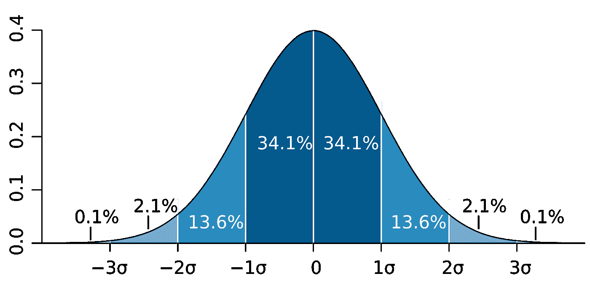*

*Courtesy [M. W. Toews](https://commons.wikimedia.org/wiki/File:Standard_deviation_diagram.svg)*

*在 ***贝叶斯*** 的统计方式中，分布有另外的解释。贝叶斯不仅仅表示参数的值以及每个值是真实值的可能性，而是认为分布描述了我们对参数的*信念*。因此，上面的钟形曲线表明，我们非常确定参数值非常接近于零，但我们认为真实值在一定程度上高于或低于该值的可能性是相等的。*

*碰巧的是，人类的身高确实遵循一条正态曲线，所以假设我们认为人类平均身高的真实值遵循一条钟形曲线，如下所示:*

*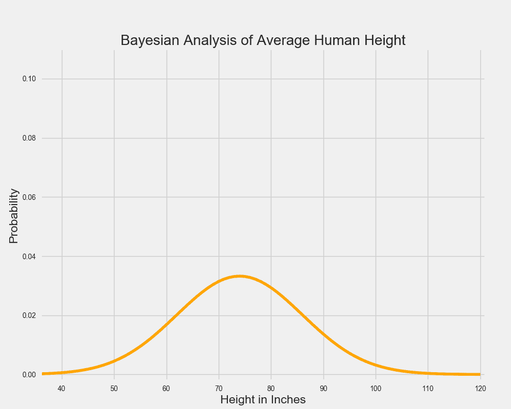*

*很明显，拥有这张图所代表的信念的人多年来一直生活在巨人中间，因为据他们所知，最有可能的平均成年人身高是 6 英尺 2 英寸”(但他们无论如何都不是超级自信)。*

*让我们想象一下，这个人去收集一些数据，他们观察了一系列 5 英尺到 6 英尺之间的人。我们可以用下面的数据，以及另一条显示人类平均身高的正态曲线*来解释这些数据:**

*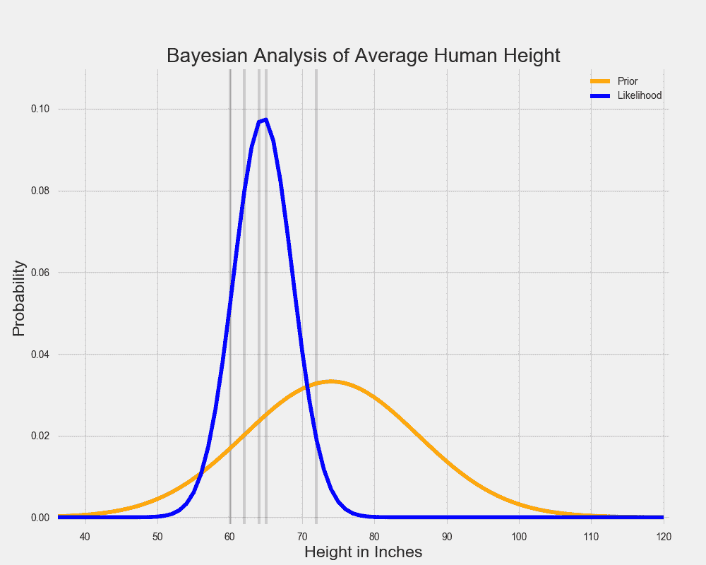*

*在贝叶斯统计中，代表我们对一个参数的信念的分布被称为**，因为它捕捉了我们在看到任何数据之前的*信念。 ***似然分布*** 通过表示一系列参数值以及每个参数解释我们正在观察的数据的似然性，总结了观察到的数据告诉我们的内容。估计使似然分布最大化的参数值只是在回答这个问题:什么参数值最有可能观察到我们已经观察到的数据？在没有先验信念的情况下，我们可能会止步于此。****

*然而，贝叶斯分析的关键是结合先验和似然分布来确定 ***后验分布*** 。这告诉我们，考虑到我们先前的信念，哪些参数值最大化了我们观察特定数据的机会。在我们的例子中，后验分布看起来像这样:*

*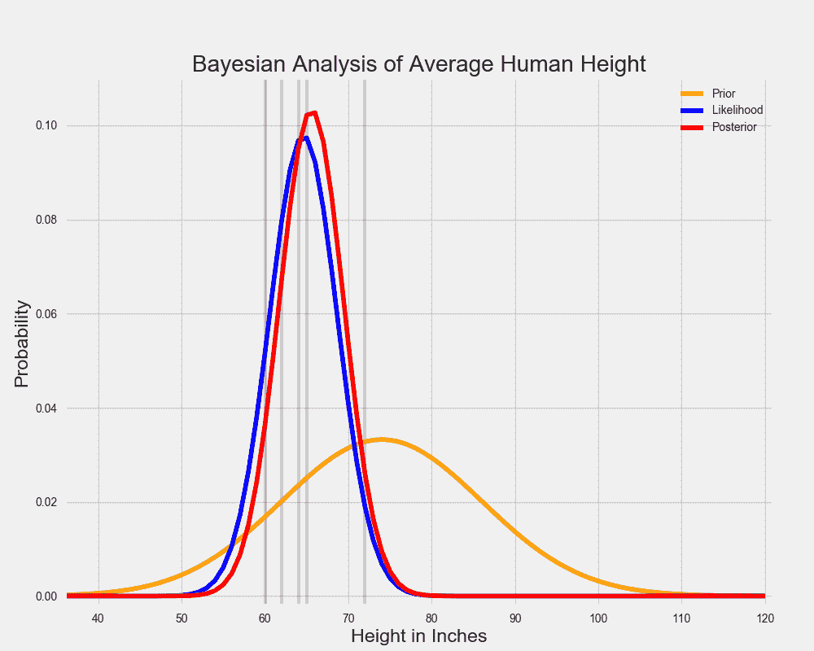*

*上图中，红线代表后验分布。你可以把它看作是先验分布和似然分布的一种平均值。由于先验分布更短且更分散，它代表了一组对人类平均身高真实值“不太确定”的信念。同时，似然性汇总了相对较窄范围内的数据，因此它代表了对真实参数值的“更有把握”的猜测。*

*当先验似然性被结合时，数据(由似然性表示)支配了在巨人中长大的假设个体的微弱先验信念。尽管那个人仍然相信人类的平均身高比数据告诉他的要稍微高一些，但是他基本上被数据说服了。*

*在两条钟形曲线的情况下，求解后验分布是非常容易的。有一个简单的等式可以将两者结合起来。但是如果我们的先验分布和似然分布不那么好呢？有时，使用不具有方便形状的分布来模拟我们的数据或我们先前的信念是最准确的。如果我们的可能性最好用一个双峰分布来表示，并且出于某种原因，我们想要解释一些非常古怪的先验分布，那会怎么样呢？我通过手绘一个难看的先验分布，想象了下面的场景:*

*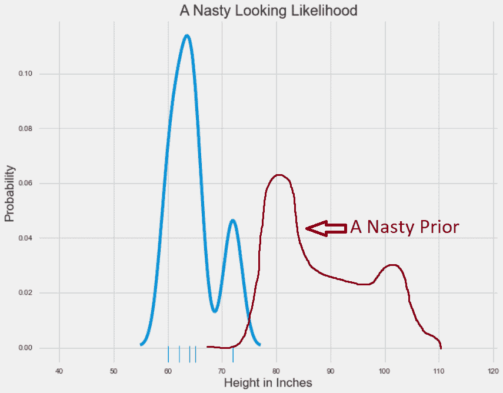*

*Visualizations rendered in Matplotlib, enhanced using MS Paint*

*如前所述，存在*某种*后验分布，其给出了每个参数值的可能性。但是很难看出它可能是什么样子，也不可能通过分析来解决。输入 MCMC 方法。*

*MCMC 方法允许我们在不能直接计算的情况下估计后验分布的形状。回想一下，MCMC 代表马尔可夫链蒙特卡罗方法。为了理解它们是如何工作的，我将首先介绍蒙特卡罗模拟，然后讨论马尔可夫链。*

*蒙特卡罗模拟只是一种通过重复生成随机数来估计固定参数的方法。通过获取生成的随机数并对其进行一些计算，蒙特卡罗模拟提供了一个参数的近似值，而直接计算它是不可能的或极其昂贵的。*

*假设我们想要估计下列圆的面积:*

*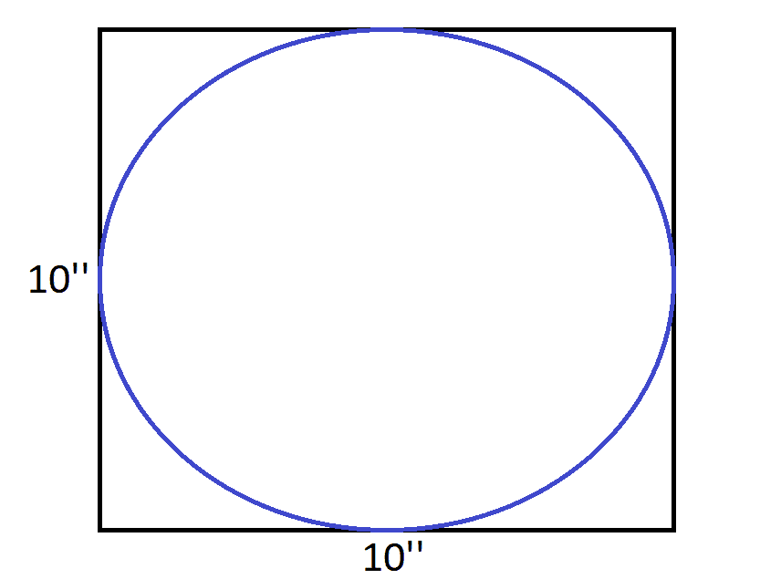*

*因为圆在一个边长为 10 英寸的正方形内，所以面积可以很容易地计算为 78.5 平方英寸。然而，相反，我们可以在正方形内随机下降 20 个点。然后我们计算落在圆内的点的比例，并乘以正方形的面积。这个数字是圆的面积的一个很好的近似值。*

*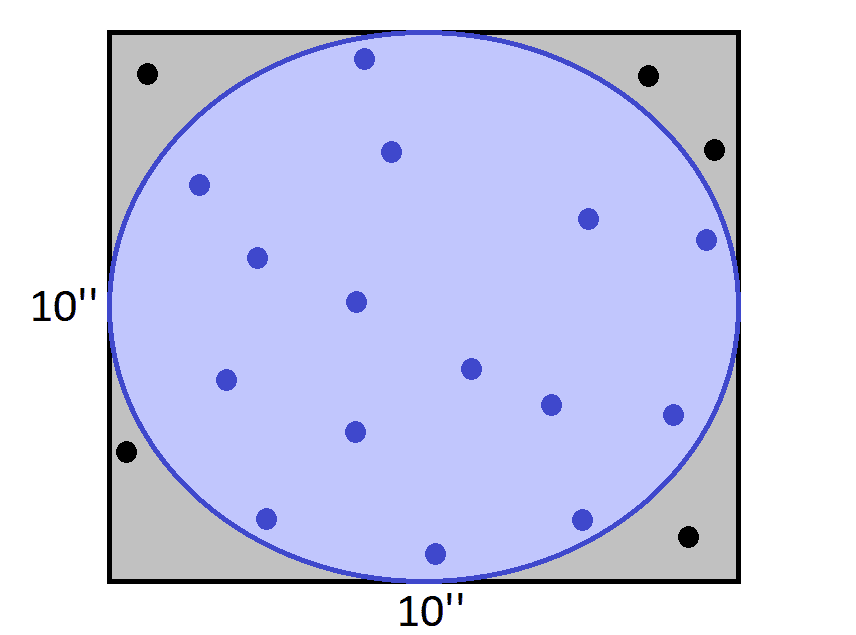*

*因为 20 个点中有 15 个点位于圆内，所以看起来圆大约有 75 平方英寸。对于只有 20 个随机点的蒙特卡洛模拟来说，这还不算太坏。*

*现在，假设我们想要计算由[蝙蝠侠方程](http://mathworld.wolfram.com/BatmanCurve.html)绘制的形状的面积:*

*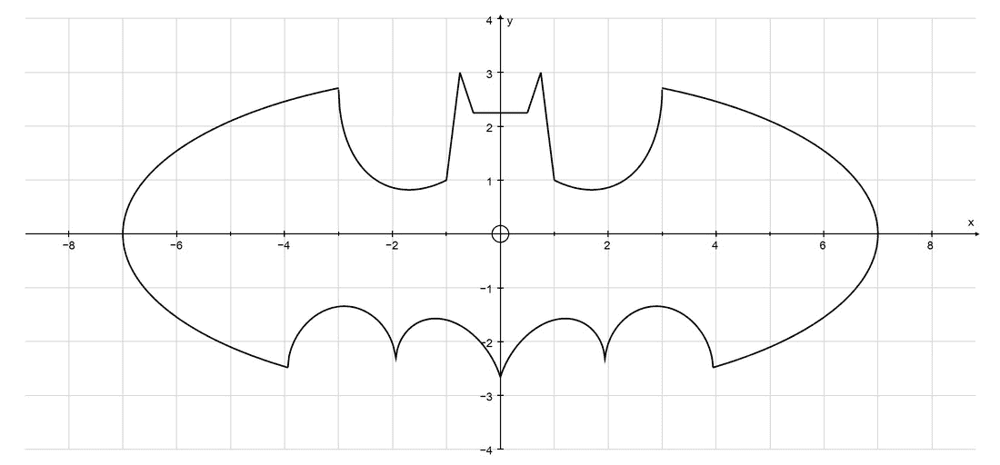*

*这是一个我们从未学过方程式的形状！因此，找到蝙蝠信号的区域是非常困难的。然而，通过在包含该形状的矩形内随机放置点，蒙特卡罗模拟可以很容易地提供该区域的近似值！*

*蒙特卡洛模拟不仅用于估算复杂形状的面积。通过生成大量的随机数，它们可以用来模拟非常复杂的过程。在实践中，它们被用来预测天气，或者估计赢得选举的概率。*

*理解 MCMC 方法的第二个要素是马尔可夫链。这些只是概率上相互关联的事件序列。每个事件都来自一组结果，每个结果根据一组固定的概率决定下一个发生的结果。*

*马尔可夫链的一个重要特征是它们是 ***无记忆*** :你预测下一个事件可能需要的一切在当前状态下都是可用的，了解事件的历史不会产生新的信息。像 [Chutes and Ladders](http://jakevdp.github.io/blog/2017/12/18/simulating-chutes-and-ladders/) 这样的游戏展现了这种无记忆性，或者说 ***Markov Property，*** 但是现实世界中很少有事情是这样运作的。然而，马尔可夫链是理解世界的强有力的方法。*

*在 19 世纪，钟形曲线被视为自然界中的一种常见模式。(例如，我们已经注意到，人类的身高遵循钟形曲线。)高尔顿板模拟重复随机事件的平均值，通过将弹珠扔过装有钉子的板，再现弹珠分布的正态曲线:*

*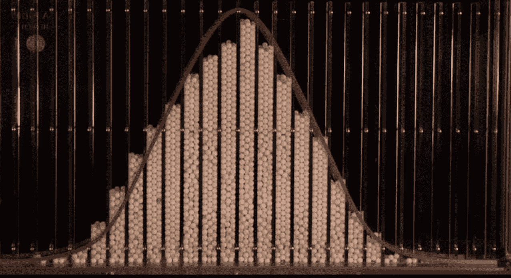*

*俄罗斯数学家和神学家 Pavel Nekrasov[认为](https://www.americanscientist.org/article/first-links-in-the-markov-chain)钟形曲线，以及更普遍的大数定律，仅仅是儿童游戏和琐碎谜题的产物，其中每个事件都是完全独立的。他认为现实世界中相互依赖的事件，如人类行为，并不符合良好的数学模式或分布。*

*Markov 链就是以 Andrey Markov 命名的，他试图证明非独立事件也可能符合模式。他最著名的一个例子需要从一部俄罗斯诗歌作品中数出数千个双字对。利用这些配对，他计算了每个字符的条件概率。也就是说，给定前面的某个字母或空格，下一个字母很有可能是 A、T 或空格。利用这些概率，Markov 能够模拟任意长的字符序列。这是一个马尔可夫链。虽然最初的几个字符很大程度上是由起始字符的选择决定的，但 Markov 表明，从长远来看，字符的分布形成了一种模式。因此，即使是相互依赖的事件，如果它们服从固定的概率，也符合平均值。*

*举个更有用的例子，想象你住在一个有五个房间的房子里。你有卧室、浴室、客厅、餐厅和厨房。让我们收集一些数据，假设在任何给定的时间点你在哪个房间，我们只需要知道你接下来可能会进入哪个房间。例如，如果你在厨房，你有 30%的机会呆在厨房，30%的机会进入餐厅，20%的机会进入客厅，10%的机会进入浴室，10%的机会进入卧室。使用每个房间的一组概率，我们可以构建一个预测链，预测你接下来可能会住哪个房间。*

*如果我们想预测某人在厨房呆了一会儿后会在家里的什么地方，那么预测几个州之外的地方可能会有用。但是由于我们的预测只是基于对一个人在房子里的位置的观察，所以有理由认为它们不会很好。举例来说，如果有人从卧室去了浴室，他们更有可能直接回到卧室，而不是从厨房出来。所以马尔可夫性质通常不适用于现实世界。*

*然而，运行马尔可夫链数千次迭代，确实能给出你可能在哪个房间的长期预测。更重要的是，这个预测完全不受这个人从哪个房间开始的影响！直觉上，这是有意义的:为了模拟和描述他们长期可能在哪里，或者一般的*，某人在某个时间点在房子的哪里并不重要。因此，马尔可夫链，这似乎是一种在几个时期内模拟随机变量的不合理方式，可以用来计算该变量的长期趋势，如果我们理解控制其行为的概率的话。**

**有了蒙特卡罗模拟和马尔可夫链的一些知识，我希望 MCMC 方法如何工作的无数学的解释是非常直观的。**

**回想一下，我们试图估计我们感兴趣的参数，人类平均身高的后验分布:**

**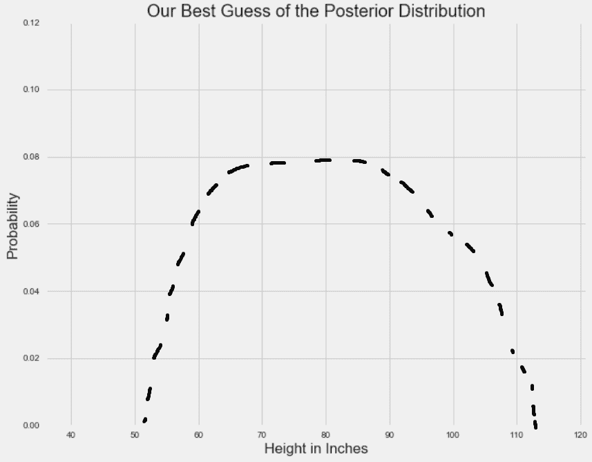**

**I am not a visualization expert, nor apparently am I any good at keeping my example within the bounds of common sense: my example of the posterior distribution seriously overestimates average human height.**

**我们知道后验分布在我们的先验分布和我们的似然分布的范围内的某个地方，但是不管什么原因，我们不能直接计算它。使用 MCMC 方法，我们将有效地*从后验*分布中抽取样本，然后计算统计数据，比如抽取样本的平均值。**

**首先，MCMC 方法选择一个随机参数值来考虑。模拟将继续生成随机值(这是蒙特卡罗部分)，但要遵守一些规则来确定什么是好的参数值。诀窍是，*对于一对参数值，*在给定我们先前的信念的情况下，通过计算每个值解释数据的可能性，可以计算出哪个是更好的参数值。如果一个随机产生的参数值比上一个更好，就以*比*好多少决定的一定概率加入到参数值链中(这是马尔可夫链部分)。**

**为了直观地解释这一点，让我们回忆一下在某一特定值的分布高度代表观察到该值的概率。因此，我们可以认为我们的参数值(x 轴)展示了高概率和低概率区域，显示在 y 轴上。对于单个参数，MCMC 方法从沿 x 轴随机采样开始:**

**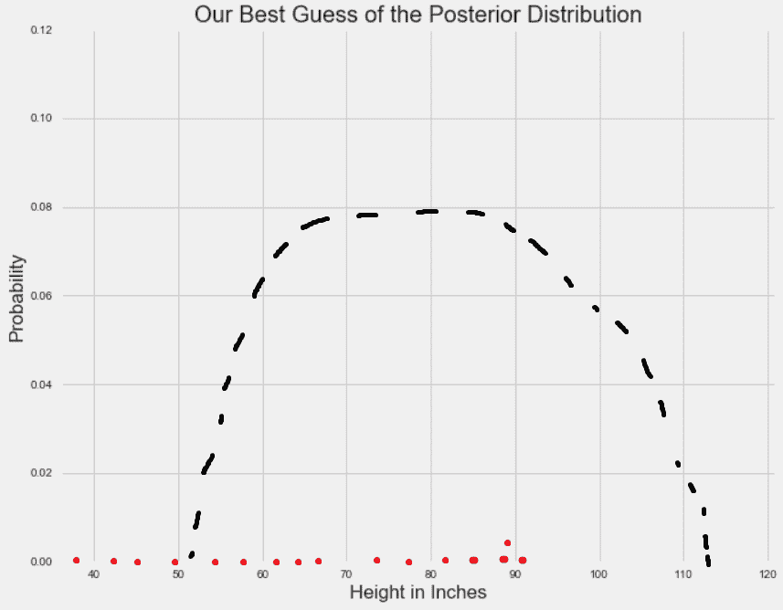**

**Red points are random parameter samples**

**由于随机样本受制于固定的概率，它们往往会在一段时间后收敛于我们感兴趣的参数的最高概率区域:**

**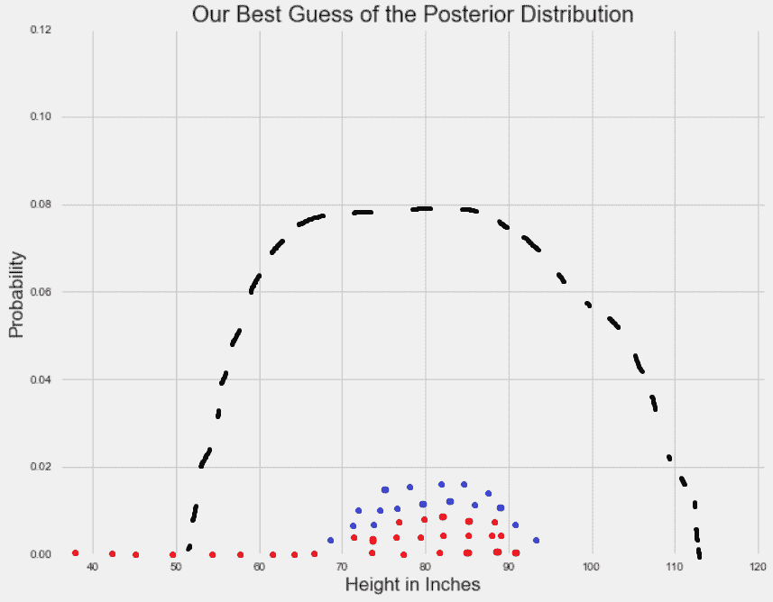**

**Blue points just represent random samples after an arbitrary point in time, when convergence is expected to have occurred. Note: I’m stacking point vertically purely for illustrative purposes.**

**在收敛发生后，MCMC 采样产生一组点，这些点是来自后验分布的样本。在这些点周围画一个直方图，然后计算你喜欢的任何统计数据:**

**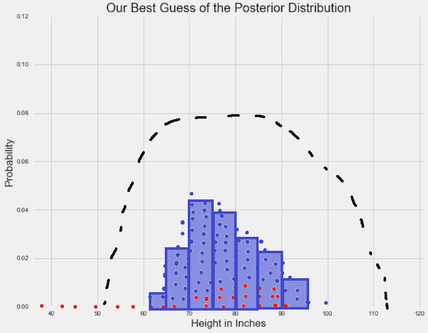**

**根据 MCMC 模拟生成的样本集计算的任何统计数据都是我们对真实后验分布统计数据的最佳猜测。**

**MCMC 方法还可以用来估计多个参数的后验分布(比如，人的身高*和体重*)。对于 *n* 个参数，在 n 维空间中存在高概率区域，其中某些参数值集合更好地解释观察到的数据。因此，我认为 MCMC 方法是在一个*概率*空间内随机抽样，以逼近后验分布。**

**回想一下“什么是马尔可夫链蒙特卡罗方法？”这个问题的简短回答这里又是一个 TL；博士:**

> **MCMC 方法用于通过概率空间中的随机采样来近似感兴趣参数的后验分布。**

**我希望我已经解释了这个简短的答案，为什么你会使用 MCMC 方法，以及它们是如何工作的。这篇文章的灵感来自于我在 DC 的大会数据科学沉浸式课程中的一次演讲。那次演讲的目的是向非技术观众解释马尔可夫链蒙特卡罗方法，我在这里也试图这样做。如果你认为这个解释在某些方面不切实际，或者如果它可以变得更直观，请留下评论。**