# 现实生活中的 AB 测试

> 原文：<https://towardsdatascience.com/ab-testing-in-real-life-9b490b3c50d1?source=collection_archive---------11----------------------->

一个甜蜜的实验故事

你喜欢烘焙，你的几个朋友都称赞你做的蛋糕好吃。最近，你一直在修补一些想法，将你的南瓜香料纸杯蛋糕带到一个全新的水平。但是你不确定你心目中的哪些改进会在你的朋友中成功或失败。

谢天谢地，你已经听说了[的 A/B 测试](https://en.wikipedia.org/wiki/A/B_testing)。

在 A/B 测试中，您运行两个随机实验，测试两个变量 A 和 B，也称为对照和实验。这项技术被广泛用于微调移动和网络应用程序中的客户体验，因为它有助于根据用户与产品的交互方式做出商业决策。

## 一个常见的例子是测试网站用户界面的微小变化，目的是增加注册用户的数量。

例如，一个测试可以是创建一个比当前网站稍大的注册按钮。你将运行你的变种(更大的注册按钮)，对网站的当前版本，也称为控制版本。在运行测试并比较了每个版本的转换率之后，您可以检查拥有一个更大的按钮是否对注册人数有任何影响。我们可以运行不同类型的测试，例如，改变图像，复制或网站的信息架构。

如果与控制版本相比，新版本的注册人数更高，那么您已经找到了一种既能改善网站体验又能提升业务的方法。然而，仅仅增加注册人数是不够的。你需要确保你的结果有足够的统计学意义。换句话说，你需要确保你的测试是以一种注册人数不会偶然增加的方式设计的。

## **你也可以将 A/B 测试应用到你的纸杯蛋糕实验中！**

你可以将使用你的“旧”食谱烘焙的纸杯蛋糕作为*对照*，并将其与使用相同食谱但添加了少许柠檬皮的纸杯蛋糕进行比较，即*实验*、，并观察你的朋友们对此的反应。

**我如何实际测试哪种配方最好？**

为了测试添加柠檬皮的效果，你会把用原始配方烘焙的纸杯蛋糕交给一组朋友，而另一组拿到新配方。为了确保没有人有偏见，每个朋友都被随机分配到他们的小组。

为了以更具分析性的方式收集他们的意见，你可以让两组朋友回答一个问题。例如，你可以问

*   你会再吃一个同批次的纸杯蛋糕吗？

用这些简单的是/否问题，你的每一个朋友最多能给纸杯蛋糕加一分。结合你所有朋友的分数，你可以用这些数据点来比较两组，看看柠檬皮的味道是否比原来的味道更好。

> A/B 测试的一个非常重要的方面是你应该一次只测试一个变体。如果你在同一个实验中引入了多种变化，你就不能把结果归因于某个特定的变化。

最后，如果柠檬皮食谱在你的朋友中更受欢迎，它将成为你的首选蛋糕食谱。

## 试验设计

最后，你将进行一项统计测试，以确定在纸杯蛋糕中加入柠檬皮是否真的有所改善。

在开始烘烤两批纸杯蛋糕之前，你需要准备好你的食谱和 A/B 测试清单。

## A/B 测试清单

1.  你想回答什么问题？

你可以把这个想成“我的假设是什么？”

无效假设是*原味纸杯蛋糕和柠檬皮纸杯蛋糕的总分没有区别*。它被称为*零假设*，因为它假设添加柠檬皮对人们是否喜欢这些纸杯蛋糕没有影响。

另一个假设是，想要第二个柠檬皮纸杯蛋糕的朋友数量比想要第二个用原始配方烘焙的纸杯蛋糕的朋友数量多。

**2。你如何评价这个实验？**

决定你的新食谱是否更受欢迎的是知道你的朋友是否会吃更多你的纸杯蛋糕。

你的衡量标准是有多少朋友愿意再吃一个同批次的纸杯蛋糕。如果越来越多的柠檬皮小组的朋友声称第二，这意味着在你的食谱中加入柠檬皮会使它更受欢迎。

**3。想要的效果是什么？**

在新配方中加入柠檬皮的情况下，加入这种新成分的影响微乎其微。

如果你要加入一种更贵的成分，比如每磅大约 100 美元的块菌，你可能会希望观察到结果有一定程度的改善，以证明金钱投资的合理性。通过在你的食谱中加入一种更昂贵的成分，这会让你对你正在做的投资更有信心。

**4。实验需要多少人？**

如果你给你的两个朋友打电话，让其中一个朋友吃柠檬皮纸杯蛋糕，另一个朋友吃用原始配方烘焙的纸杯蛋糕，你不会对你的测试有最大的信心。

为了弄清楚你需要邀请多少朋友来参加你的纸杯蛋糕品尝测试，你需要提前做一些决定

*   检验的统计功效
*   显著性水平
*   效果大小
*   基线度量

**统计功效**

[统计功效](https://en.wikipedia.org/wiki/Power_(statistics))是正确拒绝零假设的概率。你也可以把它解释为当有所述效果被观察时观察到效果的可能性，也就是说，当柠檬皮的食谱实际上比原始食谱更受你朋友的欢迎时。

在文献中，你可能会看到功率被定义为**1-β**、，因为它与产生所谓的[第二类误差](https://en.wikipedia.org/wiki/Type_I_and_type_II_errors#Type_II_error)成反比，通常称为β。第二类错误是在应该拒绝零假设时失败的概率。

当你设计一个高功效的实验时，你就降低了犯第二类错误的可能性。

实验的统计功效通常设定为 80%。

**显著性水平**

显著性水平是你用来确保你的测试是以一种结果不是偶然得到的方式设计的。最常用的值是 1%和 5%。这些分别对应于 90%和 95%的置信区间。

**效果大小和基线指标**

如上所述，效果大小将帮助您确定您希望看到的测试结果的变化量。为了做到这一点，我们必须把它建立在我们今天所观察到的基础上。

这意味着你需要知道我们的**基线度量**是什么，也就是你用来评估测试功效的度量的当前值。

我们已经定义了，我们将使用朋友的数量作为测试成功的衡量标准，这些朋友想要从同一批中得到第二个纸杯蛋糕。

所以，如果今天尝过你的纸杯蛋糕的人中有 50%想吃第二个，你知道你的基线指标是 0.5。有鉴于此，你知道你的实验有多大的改进空间。例如，假设您的基线度量是 95%。

有了这些信息你就知道了

*   你的食谱已经很成功了😀
*   几乎没有改进的空间(5%)，这可能证明运行更多测试来微调配方的努力是正确的，也可能不正确。
*   作为你测试的结果，你不能期望和改进大于 5%！这似乎是显而易见的，但在评估结果时，这是一个很好的检查。

准备好所有的东西后，你可以使用[在线计算器](http://www.evanmiller.org/ab-testing/sample-size.html)或者使用 [R 统计语言](https://stat.ethz.ch/R-manual/R-devel/library/stats/html/power.prop.test.html)来确定你需要招募的朋友数量(样本大小)来品尝每一种食谱。

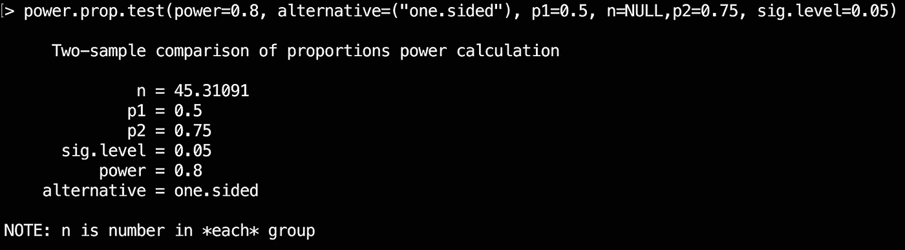

Using R to calculate the sample size

在我们的纸杯蛋糕实验中，我们需要 45 个朋友来尝试每一种食谱，假设我们的基线为 50% (p1)，预期效果大小为 25% (p2 = p1+效果大小)，显著性水平为 5%。

您还会注意到，我添加了*备选项=单侧*，这是因为将运行单侧统计测试。那是因为我们的另一个假设是*想要第二个柠檬皮纸杯蛋糕的朋友数量比想要第二个用原始配方烘焙的纸杯蛋糕的朋友数量多*

****4。实验应该持续多长时间？****

**在我们的纸杯蛋糕食谱示例中，这并不一定适用。除非我们在你的许多朋友都在节食的时候运行它，他们的行为会与预期的大相径庭。**

**然而，在像提高注册转化率的实验这样的商业场景中，实验的持续时间非常重要。你需要考虑网站访问的趋势和季节性，选择一个足够宽的时间范围，这样它们就不会干扰实验。**

**例如，如果你在网上销售产品，你可能不应该在黑色星期五这一周进行实验，因为我们知道用户更有可能在不同的网站上寻找最佳交易。或者，如果你销售户外产品，并且你知道，从历史上看，七月是你表现最好的月份，你可能也应该避免在那个月进行测试。即使你可以利用较高的网站访问量，这些客户可能会非常渴望得到他们所有的露营装备，不管你做了什么改变，他们都会购买。**

**你让你的 90 个朋友尝试你的食谱。**

**在吃了原始配方纸杯蛋糕的朋友中，有 25 人想再吃一个同一批次的，相比之下，吃了柠檬皮纸杯蛋糕的朋友中有 32 人想再吃一个。**

**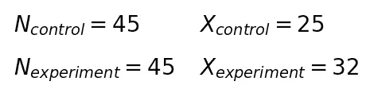**

**为了比较两组的结果，弄清楚加入柠檬皮是否真的有改善，你需要回到假设上来。*零假设*假设添加柠檬皮对人们是否喜欢这些纸杯蛋糕没有影响。**

**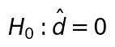**

**“d-hat”是两组朋友的结果之差。**

**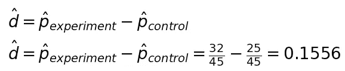**

**另一个假设是，吃第二个柠檬皮纸杯蛋糕的朋友比吃第二个用原始配方烘焙的纸杯蛋糕的朋友多。**

## ****更多的朋友喜欢柠檬皮纸杯蛋糕。这是偶然的吗？****

**为了确定这些结果是否只是偶然，我们需要计算两组结果差异的[置信区间](https://en.wikipedia.org/wiki/Confidence_interval)。这个区间将让我们了解两组之间的差异值的范围。**

**因此，我们需要计算*混合概率*，这只是一种混淆的说法，即我们正在组合我们将要比较的两个样本的概率。**

**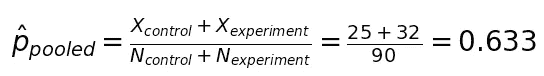**

**计算置信区间的最后一块是[标准误差](https://en.wikipedia.org/wiki/Standard_error)。它估计所获得的结果会有多大的变化，即样本分布中的值会有多广。**

**在这种情况下，我们将计算一个*合并标准误差*，它结合了两个样本的标准误差。**

**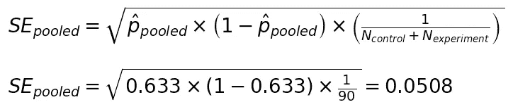**

**最后，我们的假设看起来像这样**

**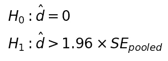**

**因为我们选择了 5%的显著性水平，因此 95%的置信区间，我们将这 5%归因于钟形曲线两个尾部之间的机会。我们假设数据的[分布是正态的](https://en.wikipedia.org/wiki/Normal_distribution)。**

**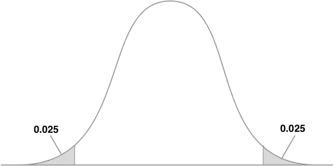**

**然后，我们使用一个互补的累积 Z 分数表[来查找 Z 统计值对应于 0.025 的值。](https://en.wikipedia.org/wiki/Standard_normal_table)**

**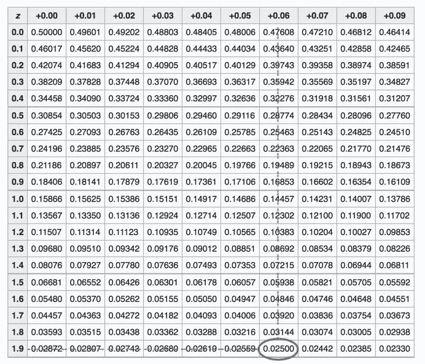**

**Part of the complementary [cumulative Z-scores Table](https://en.wikipedia.org/wiki/Standard_normal_table)**

**那就是 **1.96！**这就是为什么我们在定义中有它的替代假设。为了拒绝零假设，我们想要证明观察到的差异大于某个值周围的某个区间，该值是指 5%的结果是由于偶然。因此，使用 z 分数和标准误差。**

## **回到主要问题:柠檬皮纸杯蛋糕更受欢迎吗？**

**用所有的片段来计算另一个假设**

**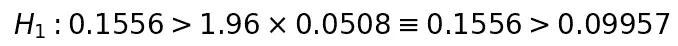**

**一切都表明我们可以拒绝零假设。每组估计概率之间的差值大于我们不等式的右边。那么，是的，柠檬皮纸杯蛋糕在你的朋友中更受欢迎。**

**但是，柠檬皮食谱应该成为你的首选蛋糕食谱吗？**

**你还记得我们决定我们想要看到的最小效果至少是 25%吗？它现在会帮助我们！**

**基于我们选择的显著性水平(5%)，我们可以定义我们的置信区间**

**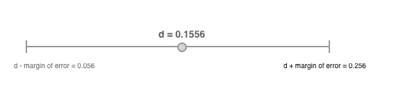**

**当我们选择最小效应时，我们是说，我们希望至少看到，控制测试和实验测试结果之间的差异。**

**然而，如果我们看看置信区间，我们可以看到，这并不能完全保证我们会看到这么大的差异。即使置信区间包括 0.25 的最小效应(25%)，我们也从区间的下限看到，存在最小效应不被保证的情况。因为它的值远低于 0.25。**

## **结论**

**事实上，柠檬皮纸杯蛋糕在你的朋友中更受欢迎。**

**如果调整这一配方成本更高，或者需要更多的时间和人力来整合到当前配方中，建议**保留原始配方**。因为你可能不会像你希望的那样，在你的朋友中多受 25%的欢迎。**

**如果它相对便宜，并且在烘焙过程中不涉及太多的工作，那么它值得成为你的首选食谱。因为从测试来看，更多的人在吃了第一个蛋糕后，还想吃第二个柠檬皮蛋糕，这有可能比原来的配方好 25%。**

***感谢阅读！***