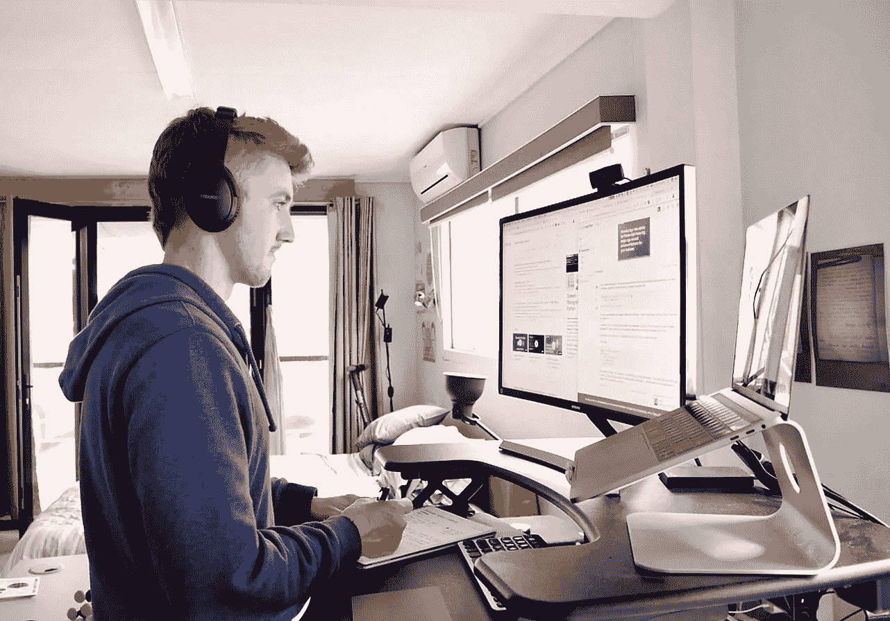
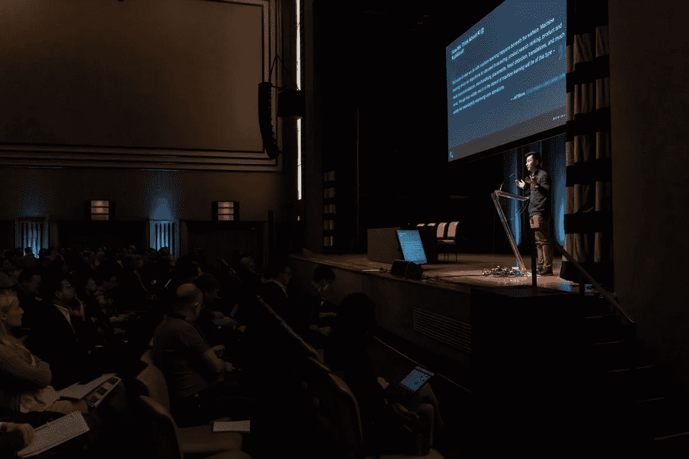

# 关于走向数据科学

> 原文：<https://towardsdatascience.com/about-towards-data-science-d691af11cc2f?source=collection_archive---------9----------------------->

## 最后更新于 2022 年 11 月

## 我们努力呈现我们的读者乐于阅读的写得好、内容丰富的文章。

Photo by [Ian Schneider](https://unsplash.com/@goian?utm_source=unsplash&utm_medium=referral&utm_content=creditCopyText) on [Unsplash](https://unsplash.com/?utm_source=unsplash&utm_medium=referral&utm_content=creditCopyText)

*东方数据科学公司是一家在加拿大注册的公司。通过使用 Medium，我们为成千上万的人提供了一个交流思想和扩展我们对数据科学的理解的平台。*

# **媒介生态系统**

*“你在其他地方找不到的想法和观点。”*

对人而不是广告的强调使得媒体独一无二。它不仅有助于作家展示他们的原创思想，而且还为广大读者提供了一个清晰的阅读体验。

媒介生态系统保持清晰透明，具有用户友好的[服务条款](https://medium.com/policy/medium-terms-of-service-9db0094a1e0f)和简单的[规则](https://medium.com/policy/medium-rules-30e5502c4eb4)可供所有人使用。作家受到更好的保护，因为他们控制着他们作品的许可证。

此外，2017 年，Medium 推出了互联网的第一个开放付费墙[。这种付费墙使创作者能够从相信想法和创意值得付费的读者群体中赚钱。我们很高兴成为其中的一员！](https://medium.com/creators)

**我们于 2016 年 10 月加入 Medium 充满活力的社区。起初，我们的目标只是收集好的帖子，并将其分发给更广泛的受众。仅仅几个月后，我们很高兴地看到，我们有一个非常快速增长的观众和许多新的贡献者。**

今天，我们与超过 4 名编辑和 15 名志愿编辑(编辑助理)一起工作，为我们的观众准备最精彩的内容。我们使用 Medium 的[私人笔记](https://help.medium.com/hc/en-us/articles/214035868-Notes)向我们的贡献者提供定制的反馈。这使我们能够在社交媒体上推广我们的最新文章，而不会增加使用其他平台时可能遇到的复杂性。

Photo by [Rodion Kutsaev](https://unsplash.com/@frostroomhead?utm_source=medium&utm_medium=referral)

# 令人印象深刻的贡献者

Medium 生态系统的成功吸引了越来越多渴望分享重要事物的独特声音。2017 年 2 月，Medium 首席执行官 Ev Williams 报告称，每周有超过 *5 万名作家在 Medium 上发表文章*。这个惊人的数字还在增长。更好的是，Medium 是一个面向所有人的平台，这意味着你可以找到来自世界各地的作者——他们是专业的，也是新手。

这个令人印象深刻的作者社区提升了我们的追随者，推动了数据科学的早期发展，并继续成为我们仍然存在的原因。2020 年 1 月，我们统计了全球各地的数千名作者，我们很高兴每天都能收到你们这么多的新投稿。

人们出于各种原因加入，无论是为了接触更广泛的受众，获得重要的反馈还是在我们的社区内建立专业网络。其他人喜欢和我们一起出版，因为他们仍然是他们原创作品的唯一所有者。无论我们的作者是选择每周一次、每月几次还是一年几次与我们一起发表，他们都做出了独特的贡献，成就了今天的我们。

例如， [Jonny Brooks-Bartlett](https://medium.com/u/c6ab8048de41?source=post_page-----d691af11cc2f--------------------------------) 发表了几篇关于[概率](/probability-concepts-explained-maximum-likelihood-estimation-c7b4342fdbb1)的文章。 [Susan Li](https://medium.com/u/731d8566944a?source=post_page-----d691af11cc2f--------------------------------) 与数据科学社区分享了她最新的[代码和教程](https://towardsdatascience.com/@actsusanli)。[乔治·赛义夫](https://medium.com/u/e2af5c8737ec?source=post_page-----d691af11cc2f--------------------------------)解释了不同类型的[聚类算法](/the-5-clustering-algorithms-data-scientists-need-to-know-a36d136ef68)以及其他一些概念。

自从我们开始以来，我们对收到的帖子的质量感到惊讶。我们可以感受到努力工作和愿意分享一些重要的东西。我们很荣幸能够帮助和支持我们的贡献者传达他们的信息。

*虽然我们允许独立作者根据我们的* [*规则和指南*](/questions-96667b06af5) *发布文章和视频，但我们不认可每个作者的贡献。*

Some of our [most-read articles](https://towardsdatascience.com/archive)

# **目的和价值**

## 我们的目的

“走向数据科学”最初是一个辅助项目，旨在帮助数据科学和机器学习社区共享概念、想法和代码。

现在是一个国际化的团队，我们日以继夜的工作在这个平台上分享的内容。每天，我们都会审查提交的内容，并向众多作者提供反馈。最重要的是，我们总是致力于新的项目，以帮助我们的贡献者达到我们的观众。

对于我们所做的一切，我们都尽可能地让社区参与进来。

我们的目标是呈现我们的读者乐于阅读的写得好、内容丰富的文章。最终，我们希望让世界变得更美好。我们相信共享和开发数据相关知识是实现这一目标的关键部分，因此我们努力为我们的社区带来价值。

> “我们相信，数据相关知识对于让世界变得更美好至关重要。”

## 一路上我们做的一些选择

随着我们的出版物逐年增长，我们必须决定分享我们贡献者内容的最佳方式。以下是几个重要的例子:

**被托管在介质上。**我们很早就决定在 Medium 上进行托管，我们很高兴这样做了。Medium 是一个很棒的平台。它提供了速度，安全性，一个智能手机应用程序，它允许评论，亮点，笔记等等。

我们也理解 Medium 不允许广告。广告正在损害许多平台的声誉，我们不希望商家能够付费让他们的产品出现在你的眼前。它扰乱和破坏思想的交流。我们的作者可以选择他们是否想要付费，我们相信这个平台提供的系统鼓励更高质量的内容。

**成长与学习。**2016 年，我们开始作为一个开放的出版物，我们接受了我们收到的大部分投稿。我们只是很高兴开始与数据科学社区联系，分享想法和代码。随着我们的受众和责任的增加，我们努力提高 TDS 的质量。从那以后，我们发布了[指南、规则和条款](/questions-96667b06af5)，并扩大了我们的编辑团队。我们不断努力，尽一切可能提高我们出版物的质量。

请注意，我们不一定赞同或同意我们成千上万的贡献者写的内容。当我们认为有可能引发有价值的讨论时，我们也会偶尔发表有争议的观点。我们知道看待一个问题有很多方式，我们鼓励我们的作者从不同寻常的角度来看待问题。我们渴望引发明智的讨论，我们喜欢读者们恭敬地提出自己的见解、解决方案和想法。

话虽如此，我们也是人。我们会犯错误，我们偶尔会错过我们发表的文章中的错误。如果你觉得你发现了违反 Medium 标准的东西，Medium 让你可以很容易地举报任何违反其规则的帖子和用户。我们还让我们的社区可以轻松地[注册投诉](/contact-us-83c96b92f285)，我们欢迎您的反馈和关注。

将最好、最独特的重要内容进行优先排序:我们在 TDS 所做的部分工作是决定哪些帖子比其他帖子获得更多曝光。我们决定在我们的出版物上刊登哪些文章，以及在我们的社交媒体渠道上分享多长时间和哪些文章。我们花时间试图找到最好的、最独特的、最重要的内容来分享和展示。

当我们使用术语“重要”时，我们指的是关键信息和未被充分表达的想法。例如，我们经常比其他文章更长时间地发布关于机器学习模型的公平性、偏见、安全性和可解释性的特殊帖子，因为我们希望确保尽可能多的人在我们的社区中看到和阅读它们。

*我们创建了一个* [*集合，致力于我们认为我们的社区应该了解更多关于*](/get-involved-50330087350#3536) *的内容，并发布了我们认为有价值的帖子。如果你想投稿，你可以在这里找到更多信息。*

## 我们的价值观

**保持乐观:**有时候，抗议的最好方式就是提出一些新的东西。我们帮助那些试图展示和分享新想法的人。我们提供的新想法和分享的知识越多，我们就能越快地解决紧迫的问题。

**关注改进**:因为我们关注长期，所以我们总是寻求实现可管理的渐进改进。我们一直希望赢得并建立读者的信任！

**心存感激**:没有媒体，或者没有我们的社区，我们永远不可能存在。我们感谢所有让这一切成为可能的人。我们特别感谢我们的作者、编辑同事以及其他在这一过程中帮助过我们的人。

Photo by [Jason Ng](https://unsplash.com/@jason_ng?utm_source=medium&utm_medium=referral) on [Unsplash](https://unsplash.com?utm_source=medium&utm_medium=referral)

## **土地确认函**

TDS 是一份拥有全球读者和分布式编辑团队的出版物。我们公司在加拿大注册成立，注册办公地址在通常被称为“多伦多”的地方，这里是许多民族的传统领地，包括在这片土地上生活了 10，000 多年的密西沙加人、阿尼什纳人、齐佩瓦人、豪德诺索尼人和休伦-文达人。今天，这个聚会场所仍然是来自海龟岛的许多土著人的家园，我们承认我们作为非土著定居者在[被盗土地](https://native-land.ca/)上的地位。使用和参与[土地确认函](http://www.lspirg.org/knowtheland)是承认该地区土著人民自古以来的持久存在和复原力的一种方式。它们也提醒我们，我们都要对这些关系负责，没有人可以免于追求和解和联盟。

我们对公平和公正的承诺超越了我们的地理位置和历史。TDS 是一份专注于数据科学和相邻领域的出版物，我们承认现代统计和计算的起源往往与优生学、种族主义和暴力行为密不可分。在我们的工作中，我们不仅努力承认这段历史，还积极倡导将数据科学作为反对歧视、偏见和边缘化的力量的声音和研究。

[News and Milestones](/take-a-peek-at-our-instagram-diary-6c2dbf02f08c) ✨

没有我们的编辑同事，我们的工作是不可能的。自从我们在 2017 年 10 月开始招聘以来，他们已经提高了在“走向数据科学”上发布的内容的质量。我们现在有一个善良、负责的团队，渴望学习、帮助和理解作者的想法。

像许多自下而上的运动一样，走向数据科学也是与朋友、家人和决定不求回报地提供帮助的人一起建立的。我们感谢他们和你所做的一切。

你可以在这里联系我们[。](/contact-us-83c96b92f285)