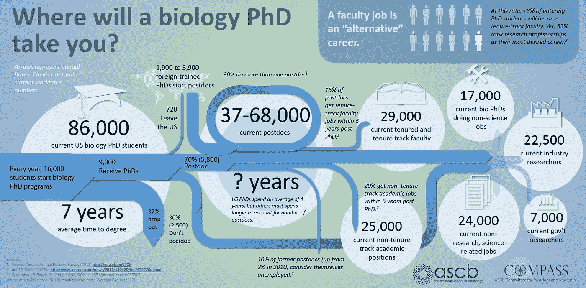

# 从学术界到数据科学:正在进行的工作

> 原文：<https://towardsdatascience.com/academia-to-data-science-a-work-in-progress-23515d20872c?source=collection_archive---------5----------------------->

“A tiny sprout growing in fine sand casting long shadow” by [Evan Kirby](https://unsplash.com/@evankirby2?utm_source=medium&utm_medium=referral) on [Unsplash](https://unsplash.com?utm_source=medium&utm_medium=referral)

大约一年前，我终于忍气吞声，下定决心，大学生活不适合我。这来之不易。在做出决定之前的几年里，我在探索其他职业和试图说服自己在神经科学实验室做博士后是正确的道路之间摇摆不定。这是一场斗争，一方面，我觉得自己感兴趣的问题类型已经改变，另一方面，我担心跳槽意味着我浪费了过去 3-4 年的职业生涯。最后，我接受了这样一个事实:无论我做出什么样的决定都是好的。重要的是承诺并坚持到底。

在某种程度上，离开学术界去从事数据科学似乎是一个自然的下一步(尽管是替代的)。自从上大学以来，我花了很多时间对促使人类和其他动物做它们所做的事情的外部和生物因素感兴趣。然而，最近，我对在更大范围内测量人类行为的想法产生了兴趣，并实际上利用这种洞察力来影响决策。虽然这在学术界似乎是一个艰难的问题，但它本质上是许多数据科学职位的工作描述。

自从决定离开学术界以来，我发现了一些有用的途径和建议，还有一些我可能不需要的。有些事情我认为我做得很好，有些事情我并不特别自豪。有些资源花了我很长时间才找到，我希望我能早点找到。这篇文章收集了一些关于这方面的漫谈，目的是传递给任何感兴趣的人。

在开始之前，有一件事我显然需要澄清:我仍在完成我的博士学位，因此无法用任何具体的成功措施来支持以下任何建议。对于数据科学职位的面试或求职，我也不能给出任何见解。如果人们觉得这篇文章有用，并且我在未来成功地完成了转变，我会很乐意在以后发表这些经历和更多。

# 秘诀 1:下定决心

正如我之前讨论的，我花了很长时间才决定离开学术界。有很多原因可以解释为什么你会这样。可能是你害怕让你的导师和同事失望。或者，像许多人一样，你发现进入一个你知之甚少的领域是令人生畏的。不管原因是什么，有一点是肯定的:

> **你打电话的时间拖得越久，一旦你最终成功转型到数据科学，你的时间就越少。**

# **秘诀 2:一点一点来**

学习获得数据科学工作所需的一切可能会非常令人生畏，尤其是如果你是从零开始的话。你需要用 python/R 进行分析(ew Matlab -参见[这个](https://twitter.com/choldgraf/status/1031660993783447552) twitter 线程)，你需要了解 SQL(尽管基本上没有理由在研究实验室环境中使用它)，你需要温习你的统计数据，你可能想要掌握一些机器学习甚至一些深度学习。你可以每天花几个小时疯狂地试图学会所有的东西，结果却筋疲力尽并放弃了，因为它妨碍了工作。或者，你可以试试这个:

> **设定一个超低的标准，目标是在大多数日子里做最少的̶̶e̶v̶e̶r̶y̶̶**。

有一堆心理学/神经科学的文献我不会引用(主要是因为我很懒，Charles Duhigg 在他的书[习惯](https://charlesduhigg.com/the-power-of-habit/)中总结得更好，你应该相信我，我是一名神经科学家)说为了养成习惯，你应该设定小的日常目标。实际上，当你完成了今天的目标后，你会有成就感，这增强了你明天再做一次的愿望。而且，很多时候你最终会超出你的目标，因为最困难的部分是克服激活障碍。如果你坚持这样做，你会在几周/几个月后回顾过去，并且想“我想我现在知道 python 了，不是吗？”。

我发现有一些资源可以很好地适应这种策略，如下所示:

*   [www。如果你是从零开始，并且想从 Python、SQL、Git 等学习一切，这是很棒的](http://www.Dataquest.io:)
*   Coursera 上的任何数据科学课程，特别是[吴恩达的机器学习课程](https://www.coursera.org/learn/machine-learning)和[深度学习专业](https://www.coursera.org/specializations/deep-learning)
*   [3blue1brown 线性代数精粹](https://www.youtube.com/watch?v=fNk_zzaMoSs&list=PLZHQObOWTQDPD3MizzM2xVFitgF8hE_ab)温习一些数学知识。还有微积分和神经网络。

这对于这种学习策略非常有用的原因是，这些材料被拼接成 10-20 分钟的视频或练习，对于一些小目标来说是完美的。还有一个有趣的注意:我设定的目标是为这篇文章写一段话，但是我陷入了一些漫无边际的话题。

# 技巧 3:屈服于你的罪恶快感

在我决定学习数据科学交易工具后，一些奇怪的事情开始发生。我的公寓开始积累关于 python、SQL、特征工程、深度学习的技术书籍。出于某种奇怪的原因，我甚至发现自己把这些书放在背包里上下班；我绝对没有看。我买下了每一本书，打算坐下来从头到尾读上几个小时。直到今天，我还没有完整地读完其中的一本。我曾经对此感到有点内疚(现在也是)。但是后来我发现我做错了什么。我试图阅读这些书，但我从书中学到的知识并没有立即派上用场。结果，我会觉得自己对刚刚读过的东西有了很好的理解，但这很快就变成了一种模糊的熟悉感。解决这种奇怪行为的方法是把书放在一边，开始一个新项目，目标是解决一个我感兴趣但鉴于我的技能组合可能难以解决的问题。不出所料，我经常在分析中遇到障碍，因为我不知道如何去做。然后我会意识到，“废话，我有一本书，可能可以教我如何做到这一点”。这将导致我狼吞虎咽地阅读整个章节，试图找出如何解决我的问题。所以我的建议是:

> **去吧，屈服于你买那本奥莱利新书** **的罪恶感吧(如果你有钱的话)但是一旦你收到钱，就把它放在一边，开始一个项目。**

我桌子上积灰最多的三本书:

*   aurélien géRon[使用 Scikit-Learn 和 TensorFlow 进行机器实践学习](https://www.amazon.com/Hands-Machine-Learning-Scikit-Learn-TensorFlow/dp/1491962291)
*   杰克·范德普拉斯的《Python 数据科学手册》
*   [机器学习的特征工程](https://www.amazon.com/Feature-Engineering-Machine-Learning-Principles/dp/1491953241)Alice Zheng

# **未完待续……**

如果上面的一些内容描绘了一幅研究生生活的灰暗画面，那不是我的本意。研究生生活的某些方面我不喜欢，但有些事情我几乎肯定会怀念。因此，有很多理由离开学术界，但也有同样多的理由留下来。此外，虽然不久前可能不是这种情况，但我相信甚至可能会有一些情况，你可能想进入学术界，并打算在短期工作后离开。为了不使这成为一个不合理的冗长的文本墙，也许我会把这些留到另一篇文章中。

欢迎在下面留下任何评论或反馈。如果这看起来对任何人有用，我更愿意再写一篇。另外，在 twitter 上关注我吧，这样我就不会觉得自己在发微博了。

*最后一个临别的想法:如果你担心离开学术界，因为你认为这样做是失败的，我鼓励你看看下面的图表，并查看一下* [***这个***](https://twitter.com/caitvw/status/1019218553822744576) *twitter 帖子，寻找一些好的感觉*

[Where will a biology PhD take you](https://www.ascb.org/compass/compass-points/where-will-a-biology-phd-take-you/) by Jessica Polka