# 使用 R 和 Python 从 Twitter API 访问数据

> 原文：<https://towardsdatascience.com/access-data-from-twitter-api-using-r-and-or-python-b8ac342d3efe?source=collection_archive---------3----------------------->

```
NOTE: There is an updated version of this tutorial that goes over setting up the Twitter Developer Account and the tweepy library (Python) [here](/how-to-access-data-from-the-twitter-api-using-tweepy-python-e2d9e4d54978).
```

使用 Twitter API 应该是一件简单的事情，但是有时图片和简单的代码可以为您节省额外的 5 分钟。我之前报道过如何使用 R 从 Twitter API 中[访问数据，但该流程自 2018 年 7 月起发生了变化。](https://medium.com/@GalarnykMichael/accessing-data-from-twitter-api-using-r-part1-b387a1c7d3e)

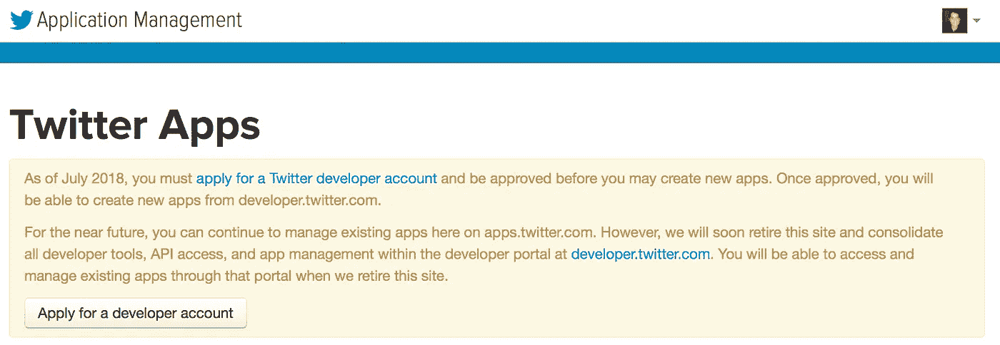

Things changed in July 2018

这篇文章首先讲述了如何设置你的 Twitter 开发者账户，然后讲述了如何使用 R 和 Python 搜索 tweets。

# 设置 Twitter 开发者账户和应用

1-)如果您还没有 twitter 帐户，请创建一个。

2-) [申请一个 twitter 开发者账号](https://developer.twitter.com/en/apply/user)。


This was made necessary as of July 2018

3-)如果您没有与 twitter 关联的电话号码，请输入电话号码。

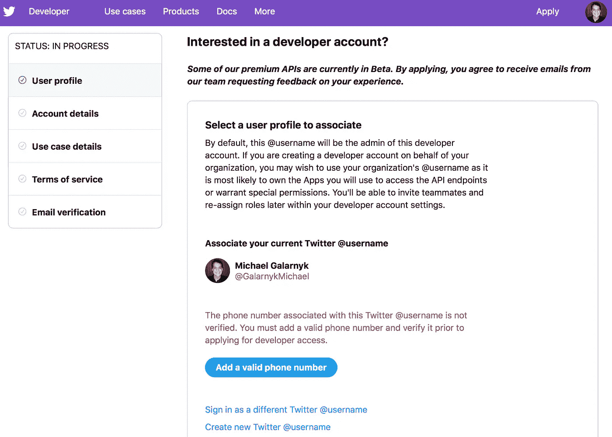

4-)添加帐户详细信息。点击继续。

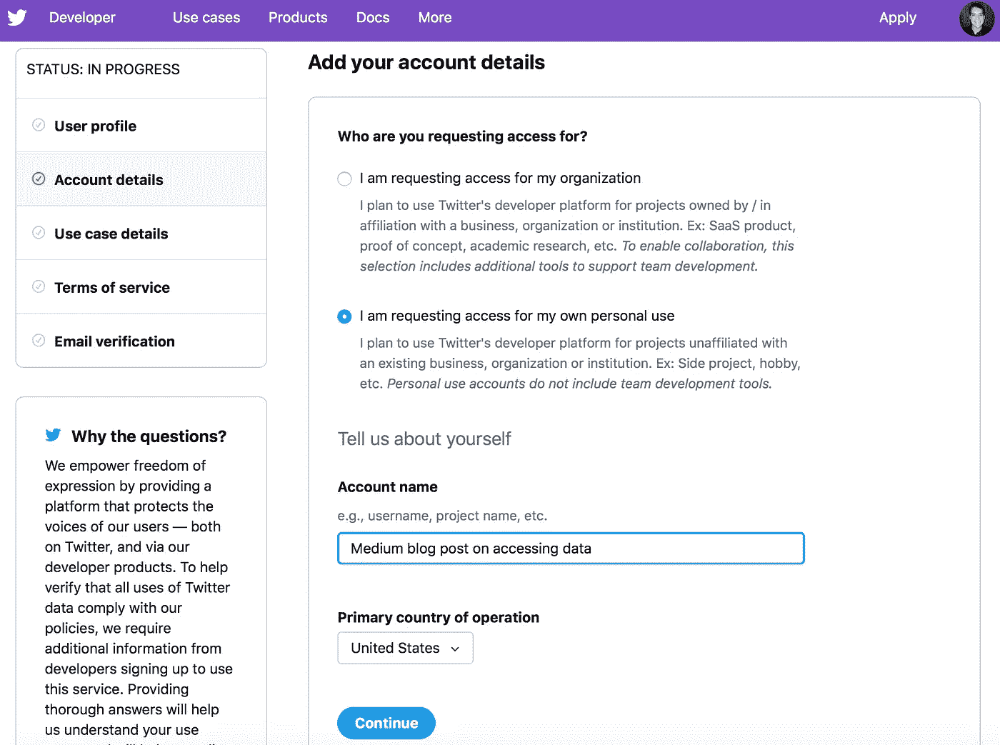

5-)用你自己的话描述你正在建造的东西。点击继续。

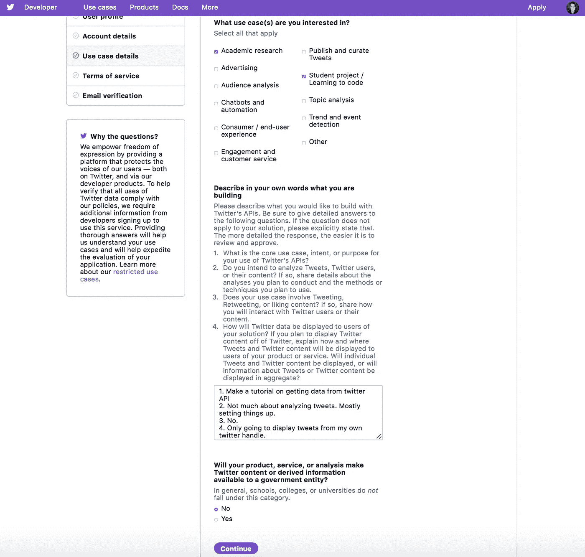

6-)提交申请。

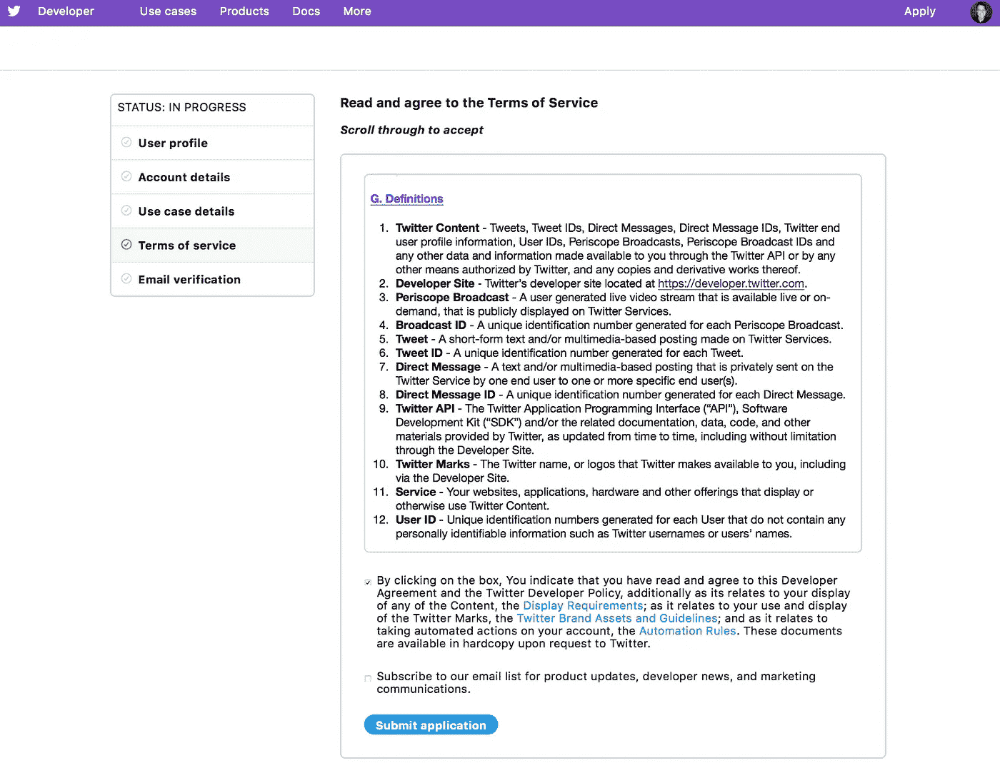

7-)检查与您的 twitter 相关的电子邮件，然后点击确认您的电子邮件。


8-)在欢迎屏幕上，点击创建应用程序。

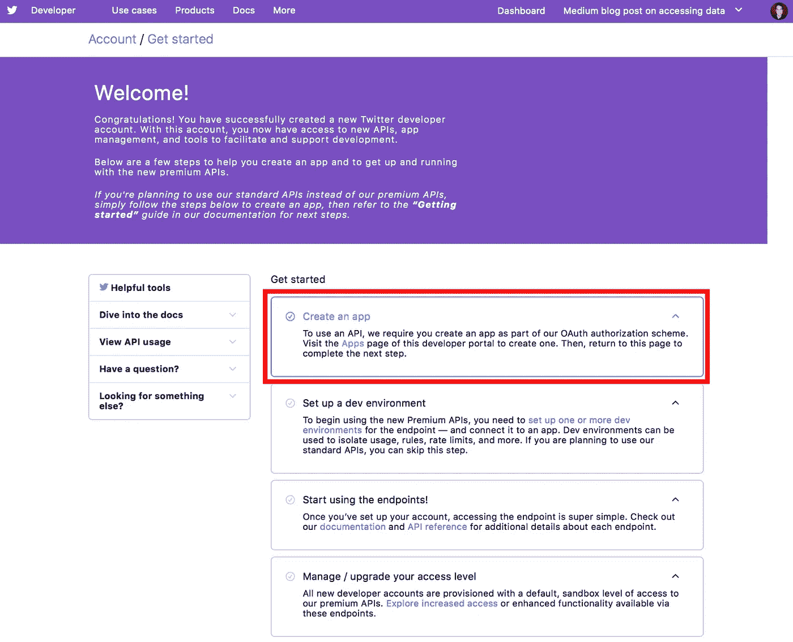

9-)填写您的应用程序详细信息，然后点击创建(在页面底部)。请确保不要尝试使用已被占用的 appName。

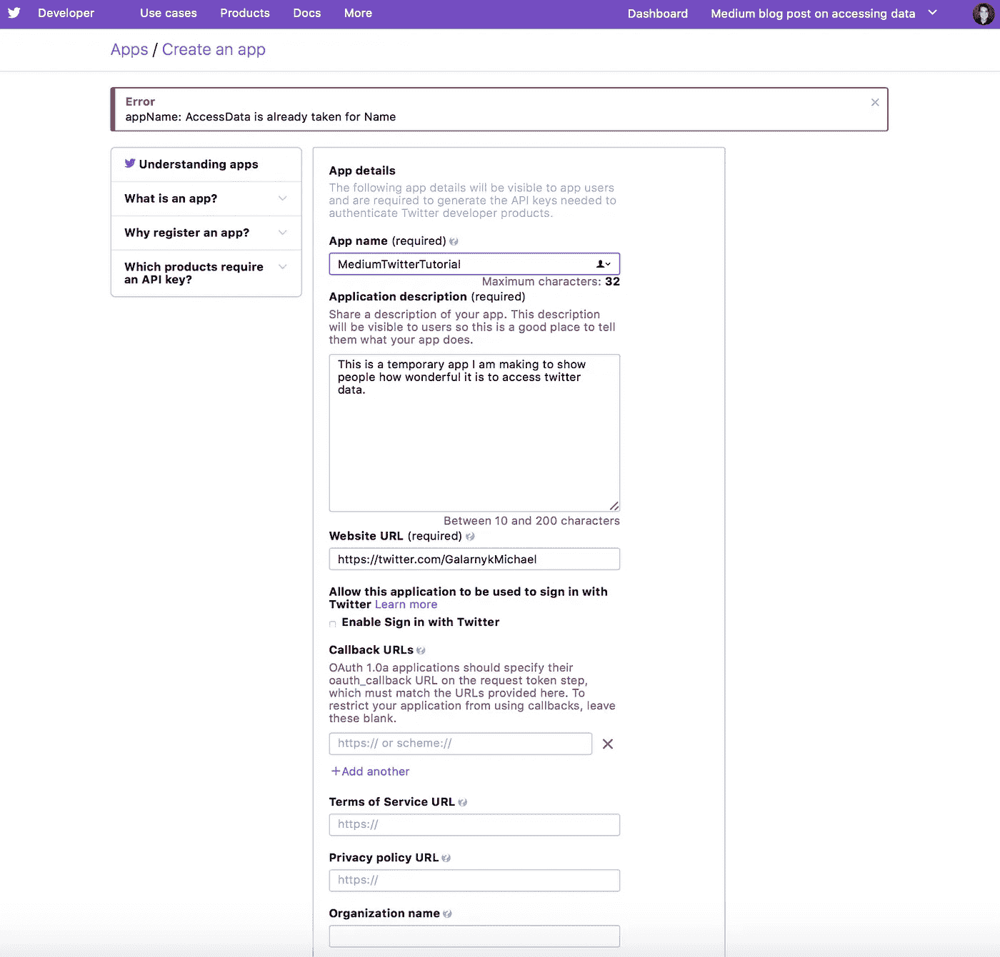

Make sure to make an App name that is not already taken

查看开发者条款并点击创建。

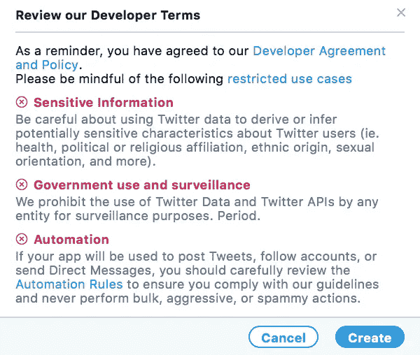

10-)首先，点击密钥和令牌。其次，单击“创建”以获取访问令牌和访问令牌密码。

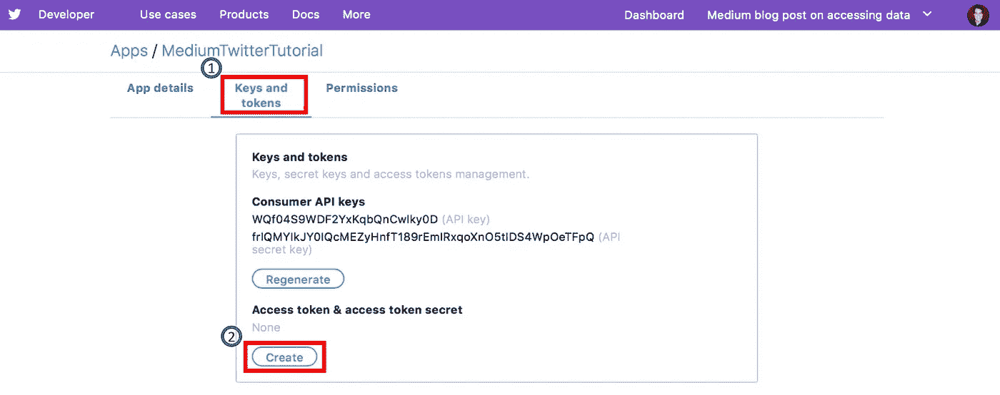

将您的 API 密钥、API 秘密密钥、访问令牌和访问令牌秘密保存在安全的地方。我应该指出，你不应该试图复制我的钥匙，因为我在本教程后重新生成它们。

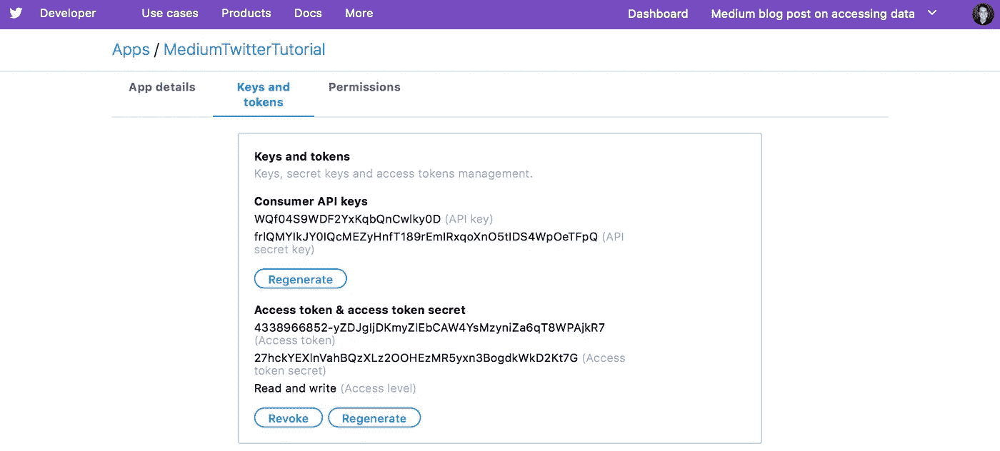

# Twitter API

## 稀有

如果你想用 R，可以用 twitteR(确保你先安装安装 twitteR 包)。twitteR 是一个 R 包，它提供了对 Twitter API 的访问。支持 API 的大部分功能，偏向于在数据分析中比日常交互更有用的 API 调用。如果您想了解更多关于如何根据您的各种需求使用软件包的信息，请阅读[用户简介](http://geoffjentry.hexdump.org/twitteR.pdf)。下面的代码使用 Twitter 搜索 API。

```
#install.packages("twitteR")library(twitteR) 
# Change consumer_key, consume_secret, access_token, and 
# access_secret based on your own keys
consumer_key <- ""
consumer_secret <-""
access_token <- ""
access_secret <- "" setup_twitter_oauth(consumer_key, consumer_secret, access_token, access_secret)
tw = searchTwitter('@GalarnykMichael', n = 25)
d = twListToDF(tw)
```

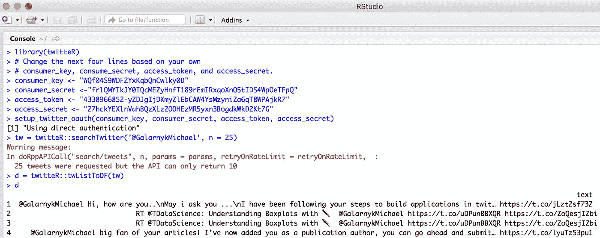

As of when this tutorial was written, the standard search API searches against a sampling of recent Tweets published in the past 7 days. Part of the ‘public’ set of APIs. [https://developer.twitter.com/en/docs/tweets/search/overview](https://developer.twitter.com/en/docs/tweets/search/overview)

## 计算机编程语言

下面的代码使用 python-twitter 包(可以使用`pip install python-twitter`安装)进行搜索。你可以在这里学习如何制作自己的查询[。](https://python-twitter.readthedocs.io/en/latest/searching.html)

```
import twitter"""
Change ACCESS_TOKEN, ACCESS_SECRET, CONSUMER_KEY and CONSUMER_SECRET
to your own. """ACCESS_TOKEN = ''
ACCESS_SECRET = ''
CONSUMER_KEY = ''
CONSUMER_SECRET = ''t = twitter.Api(consumer_key=CONSUMER_KEY,
                consumer_secret=CONSUMER_SECRET,
                access_token_key=ACCESS_TOKEN,
                access_token_secret=ACCESS_SECRET)results = t.GetSearch(raw_query="q=from%3AGalarnykMichael&src=typd")
```

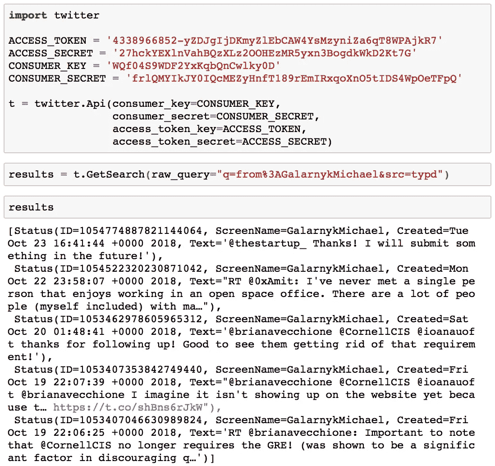

As of when this tutorial was written, the standard search API searches against a sampling of recent Tweets published in the past 7 days. Part of the ‘public’ set of APIs. [https://developer.twitter.com/en/docs/tweets/search/overview](https://developer.twitter.com/en/docs/tweets/search/overview)

# 结论

本教程是关于让您开始使用 Twitter API 的。如果您对本教程有任何问题或想法，请在下面的评论中或通过 [Twitter](https://twitter.com/GalarnykMichael) 联系我们。如果你想学习如何使用 Pandas、Matplotlib 或 Seaborn 库，请考虑参加我的[数据可视化 LinkedIn 学习课程](https://www.linkedin.com/learning/python-for-data-visualization/value-of-data-visualization)。