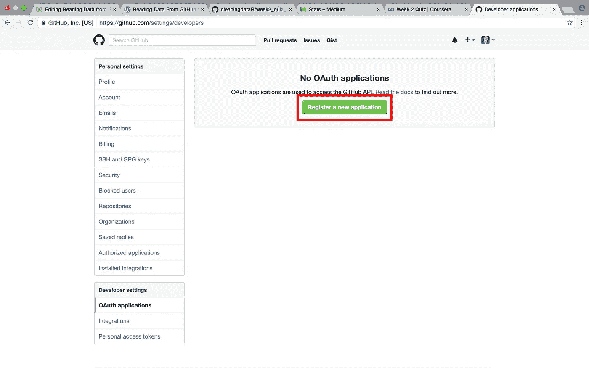
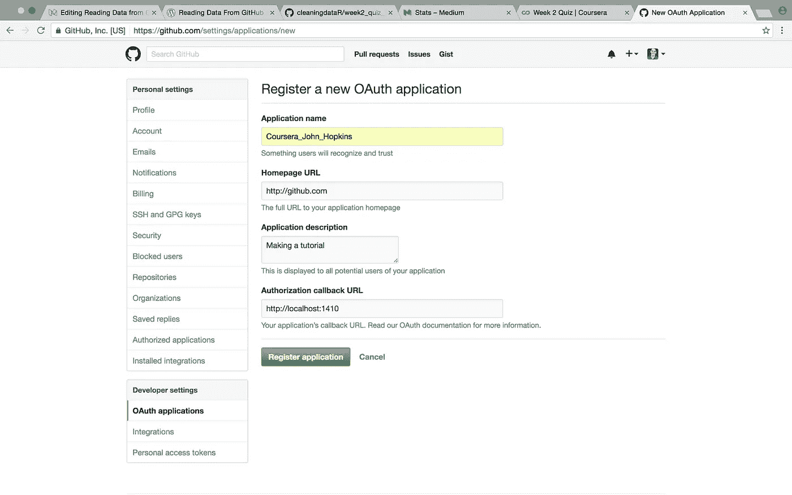
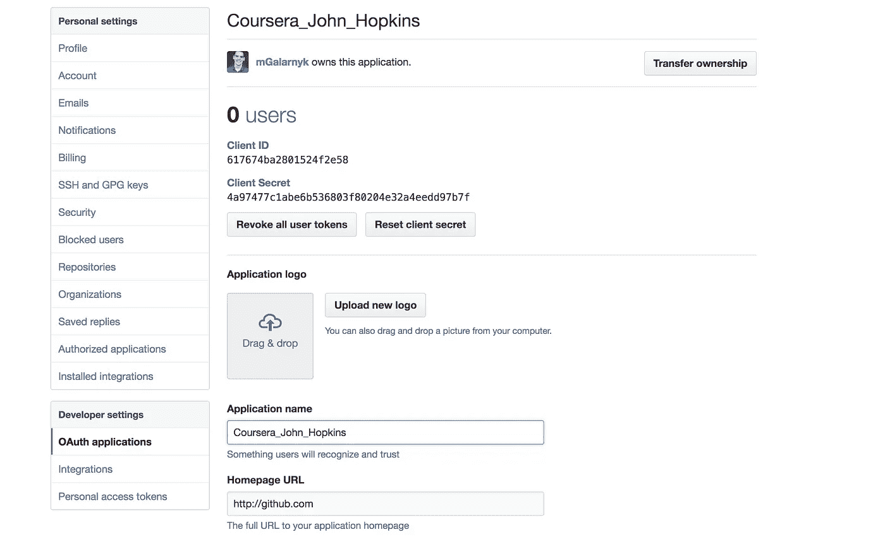

# 使用 R 从 Github API 访问数据

> 原文：<https://towardsdatascience.com/accessing-data-from-github-api-using-r-3633fb62cb08?source=collection_archive---------0----------------------->

FAccessing Data from Github API using R

使用 Github API 对于获取关于现有存储库的信息以及创建新的存储库非常有用。这篇文章讲述了如何使用 r 从 Github API 读取数据。

1.  通过以下链接向 Github 注册一个新应用: [githubDevLink](https://github.com/settings/developers)

2.点击注册新的应用程序。

Click on Register a New Applicatoin

3.填写页面。【http://github.com】的将为**的主页网址**工作。**授权回调 URL** 可以是 [http://localhost:1410](http://localhost:1410) 。给应用程序命名。下图使用了 Coursera_John_Hopkins，这将影响第 5 步后面的代码。完成后，点击**注册应用**。

Filling out Register a New Application

4.点击注册申请后，会出现一个类似下图的页面。

Make sure you copy your Client ID and Client Secret

5.使用下面的代码。根据客户端 ID、客户端机密和应用程序名称修改 appname、key 和 secret。

如果您有任何问题，请告诉我！你可以在这里或者 youtube 上发表评论(如果可以的话请订阅)！