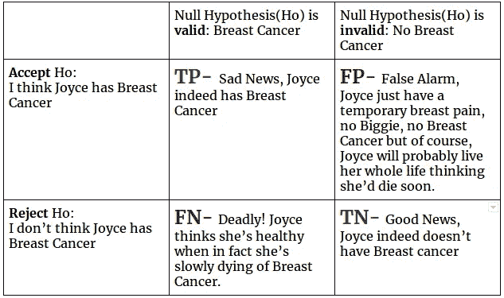
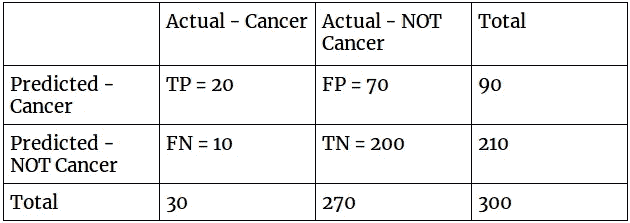

# 准确性悖论

> 原文：<https://towardsdatascience.com/accuracy-paradox-897a69e2dd9b?source=collection_archive---------0----------------------->


Beware of what lies beneath — wiki image

> “如果你对机器学习一无所知，你肯定知道准确性悖论”——阿金库勒·艾伦

我写了关于[车型评测 I](https://medium.com/towards-data-science/model-evaluation-i-precision-and-recall-166ddb257c7b) ，如果你还没有查看，你应该。

# 什么是准确性悖论？

准确性被定义为没有错误或失误。例如，一条信息是准确的，如果它 ***恰好*** 代表了正在讨论的内容。

悖论是一种看似与常识相矛盾或相反的陈述，但也许是真实的。

> 你有没有想过“忽略所有规则”这句话……本身就是一条规则——嗯！一个悖论

在机器学习行话中，准确率是分类系统中**正确性**的比例。

也就是说，如果我们有一个垃圾邮件检测系统**、**，我们收到的 5 封邮件中，有 4 封被模型 X 归类为垃圾邮件，而这些邮件确实是垃圾邮件。我们会说 X 型有 80%的准确性，也就是说，你可以在 80%的时间里依赖 X 型。

```
Accuracy of Model X = 4/5 * 100 = 80%
```

那么，什么是准确性悖论呢？我们稍后会谈到这一点，但首先让我们考虑一个案例研究作为例子。

# 个案研究

霍金斯医院软件团队(Will，Dustin，Mike 和 Lucas)建立了一个用于诊断女性乳腺癌的分类模型。在给定的人群中研究了 1000 名妇女的样本，其中 100 名患有乳腺癌，其余 900 名没有乳腺癌。Hawkins 软件团队基于该数据集训练了他们的模型。他们将数据集分成 70/30 的训练/测试集。

精确度非常高，他们部署了这个模型。

唉！部署后几个月，一些被医院诊断为“没有乳腺癌”的女性开始出现乳腺癌症状。

这怎么可能？

这引起了一系列问题和全体人民的恐惧。随着越来越多病人开始出现乳腺癌症状，霍金斯医院不得不对此采取措施。

他们决定聘请机器学习专家 Bob 来帮助他们了解他们的软件团队出了什么问题，因为该模型的准确率约为 90%。

# 霍金斯模型概述

通过分割数据集，我们有

**训练集:**

```
*No Breast cancer = 70/100 * 900 = 630
Breast cancer= 70/100 * 100 = 70*
```

**测试设置:**

```
*No Breast cancer = 30/100 * 900 = 270
Breast cancer= 30/100 * 100 = 30*
```

***为了让鲍勃解释他们的模型是如何得出错误预测的，他引入了两个假设，以其中一位女性乔伊斯为例——鲍勃开始解释如下，***

比方说，**我们有一个假设 H，**乔伊斯患的是乳房疼痛而不是乳腺癌，但是**另一个假设 Ho** (与第一个假设相反)说乔伊斯患的是乳腺癌。

***如果假设 Ho*** 为真(阳性)——乳腺癌

***else 假设 Ho*** 为假(阴性)——无乳腺癌

下表显示了如果这个**其他假设 Ho** 为真或不为真会发生什么。



This is called confusion matrix — i hope it’s not confusing.

*其中:*

*   TP =真阳性
*   FP =假阳性
*   FN =假阴性
*   TN =真阴性

## 霍金斯模型的预测结果

在用 70%的数据集训练他们的模型后，Hawkins 科学家用剩余的 30%数据测试了这个模型，以评估模型的准确性。他们的模型在 300 个预测中有 270 个是正确的。

```
Hawkins Accuracy = 270 / 300 = 0.9
```

这看起来是一个相当令人信服的模型，准确率高达 90%，为什么它会失败呢？

## 解开谜团

Bob 重新评估了他们的模型，下面是详细分析:

```
Number of women **with** breast cancer and classified as **no** breast cancer (FN) = 30Number of women with breast cancer and classified as breast cancer(TP) = 0Number of women without breast cancer and classified as **no** breast cancer (TN) = 270Number of women **without** breast cancer and classified as breast cancer (FP) = 
```

Bob 用下面的混淆矩阵表表示了这一点。


confusion matrix for Hawkins Model

总而言之，

霍金斯模型**正确**将 270 名未患乳腺癌的女性分类为**【无乳腺癌】**，而**错误**将 30 名患乳腺癌的女性分类为**【无乳腺癌】。**

> 我们给霍金斯模型 300 个问题，它答对了 270 个。该模型得分为 270/300——因此，我们可以说该模型通过了优秀测试，对吗？但是做到了吗？

Bob 注意到模型已经方便地将所有测试数据分类为**“无乳腺癌”**。

鲍勃计算出这个模型的准确性，它总是正确的 90%。

```
Accuracy = (TP + TN) / (TP+TN+FP+FN)
Accuracy = (0 + 270) / (0 + 270 + 0 + 30)= 0.90
Accuracy in % = 90%
```

鲍勃注意到一个模式，没有一个“乳腺癌”数据被正确标注。鲍勃作为专家走得更远，他决定看看模型在**精度**和**召回**方面做得如何。

鲍勃心想，如果**这些患有乳腺癌的人中**没有一个被诊断为“患有乳腺癌”,那么这个模型就不是**精确的**模型，也不会**回忆起**除了“没有乳腺癌”之外的任何事情。

他用下面的精确和回忆公式证明了这一点

```
Precision = TP / (TP + FP)
Precision = 0 / (0 + 0) = 0
Precision in % = 0%Recall = TP / (TP + FN)
Recall = 0 / (0 + 30) = 0
Recall in % = 0%
```

这意味着，这个模型将总是把传递给它的任何数据归类为“没有乳腺癌”。

这解释了为什么一些病人表现出乳腺癌的症状。

霍金斯模式根本行不通。

> 鲍勃破解了它，霍金斯模型是一个狄摩高根(骗局)。

鲍勃提出了一个稍加修改的模型，他想让他们明白他所说的他们的模型是狄摩高根的意思。

## **鲍勃的模型**

在用 70%的数据集训练了他的模型之后，Bob 接着用剩下的 30%的数据测试了模型以评估模型。与 Hawkins 不同，Bob 的软件团队不依赖准确性作为评估其模型的唯一标准。

下面是鲍勃的模型的结果；

```
Number of women **with** breast cancer and classified as **no** breast cancer (FN) = 10Number of women with breast cancer and classified as breast cancer(TP) = 20Number of women without breast cancer and classified as **no** breast cancer (TN) = 200Number of women **without** breast cancer and classified as breast cancer (FP) = 70
```



confusion matrix for Bob’s Model

显然，Bob 的模型犯了一些错误，因为它惊吓了 70 名没有患乳腺癌的完全健康的人。* *鲍勃心里想，认为自己得了乳腺癌而没有得，不是比认为自己没有得乳腺癌却得了更好吗？

## 鲍勃的模型评估

```
Accuracy = (TP + TN) / (TP + TN + FP + FN)
Accuracy = (20 + 200) / (20 + 200 + 10 + 70) = 0.733
Accuracy in % = 73.3%
```

Hawkins 的软件团队内部出现了问题，Bob 怎么可能告诉他们他的模型(准确率为 73%)比他们的模型(准确率为 90%)更好。)

Bob 进一步计算了他的新模型的精确度和召回率

```
Precision = TP / (TP + FP)
Precision = 20 / (20 + 70) = 0.222
Precision in % = 22.2%Recall = TP / (TP + FN)
Recall = 20/ (20 + 10) = 0.67
Recall in % = 67%
```

虽然 Bob 的模型假设总共有 90 名女性而不是 30 名女性患有癌症，但它预测乳腺癌的正确率为 22.2%，而 Hawkins 模型的精确度为 0。

此外，在 30 名实际患有乳腺癌的女性中，Bob 的模型能够在 67%的时间内正确回忆起某人患有乳腺癌，而 Hawkins 的模型则没有回忆。

在这之后，Bob 能够让团队相信他的模型比他们目前拥有的要好。

达斯汀问，但是准确性的差异呢？

*鲍勃回答说:这是一个悖论。*

## 准确性悖论

预测分析的准确性悖论指出，具有给定准确性水平的预测模型**可能**比具有**更高**准确性的模型**具有更大的**预测能力。

分解这个，

具有给定精确度水平的预测模型(73% — Bob 的模型)可能比具有更高精确度的模型(90% —Hawkins 模型)具有更大的预测能力(更高的精确度和召回率)

这就是为什么它被称为悖论的原因，因为直觉上，你会认为精度更高的模型是最好的模型，但精度悖论告诉我们，有时情况并非如此。

因此，对于某些系统(如 Hawkins)来说，精确度和召回率比“良好的精确度”更好，因此使用适当的指标来评估您的模型是很重要的。

大脑鲍勃，拯救了世界！

***值得注意的是，交易误报可能会带来非常致命的代价，正如*[*tweetypsych*](https://medium.com/u/4a6d37f6a52b?source=post_page-----897a69e2dd9b--------------------------------)*在评论部分指出的那样。*

虽然搜索引擎模型可能会有一些假阳性，但乳腺癌模型不应该，因为这可能会导致完全健康的人被引入残酷的治疗或更糟。

*—所有角色的灵感都来自‘陌生的事物’。所有的人物和故事都是虚构的。*

*外部链接*

1.  [http://www . statistics show to . com/probability-and-statistics/null-hypothesis/](http://www.statisticshowto.com/probability-and-statistics/null-hypothesis/)
2.  【https://en.wikipedia.org/wiki/Accuracy_paradox 
3.  [https://en.wikipedia.org/wiki/Confusion_matrix](https://en.wikipedia.org/wiki/Confusion_matrix)
4.  [https://towards data science . com/model-evaluation-I-precision-and-recall-166 DDB 257 c7b](/model-evaluation-i-precision-and-recall-166ddb257c7b)
5.  [https://en.wikipedia.org/wiki/Base_rate](https://en.wikipedia.org/wiki/Base_rate)