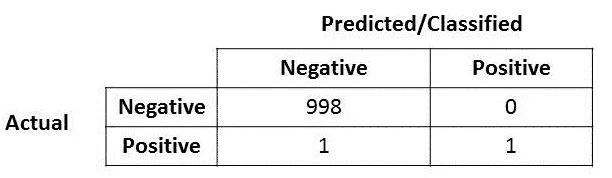
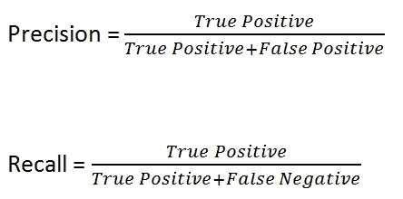
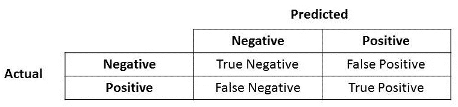
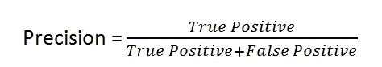
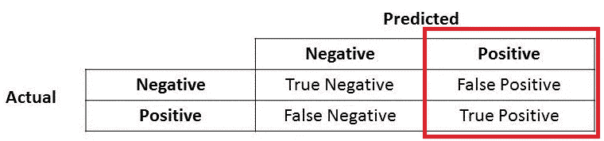
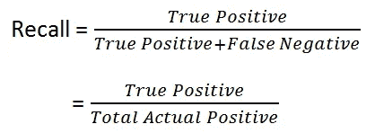
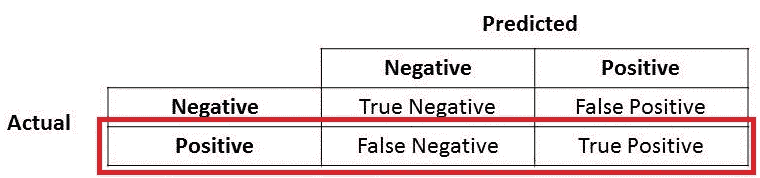
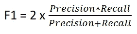

# 准确度、精密度、召回率还是 F1？

> 原文：<https://towardsdatascience.com/accuracy-precision-recall-or-f1-331fb37c5cb9?source=collection_archive---------0----------------------->

Which metrics to choose?

当我与寻求将数据科学实施到他们的流程中的组织交谈时，他们经常会问这样一个问题:“我如何获得最准确的模型？”。我进一步问道，“你试图用这个模型解决什么样的业务挑战？”我会得到困惑的表情，因为我提出的问题并没有真正回答他们的问题。然后，在我们开始探索准确性是否是我们应该从中选择“最佳”模型的最重要和最终的模型度量标准之前，我需要解释为什么我会问这个问题。

因此，我想在这篇博文中解释一下，准确性不一定是科学家们追求的唯一模型指标，也包括对其他指标的简单解释。

首先，让我们看看下面的混淆矩阵。模型的精确度是多少？

很容易，你会注意到这个模型的准确率非常非常高，达到 99.9%！！哇！你中了头奖和圣杯(*尖叫着在房间里跑来跑去，在空中挥舞拳头几次*)！

但是…(你知道这是迟早的事，对吗？)如果我提到这里的阳性实际上是一个生病的人，他携带着一种可以快速传播的病毒，会怎么样？还是这里的阳性代表诈骗案？或者这里的阳性代表恐怖分子，模型说它不是恐怖分子？你明白了。在我提出的这三种情况下，错误分类的实际阳性(或假阴性)的成本非常高。

好了，现在您意识到在选择最佳模型时，准确性并不是最重要的模型指标……接下来呢？

# **精度和召回**

让我介绍两个新的度量标准(如果你还没有听说过，如果你听说过，也许只是迁就我一下，继续读下去？:D)

所以如果你查看维基百科，你会发现计算[精度和召回](https://en.wikipedia.org/wiki/Precision_and_recall#Definition_(classification_context))的公式如下:

我放在这里做进一步解释。

让我把混淆矩阵和它的组成部分放在这里。

**精密**

太好了！现在让我们先来看看精度。

你注意到分母是什么？分母其实是预测的总正！所以公式变成了

True Positive + False Positive = Total Predicted Positive

您可以立即看到，Precision 会讨论您的模型在那些预测的正值中有多精确，有多少是实际的正值。

当假阳性的代价很高时，精度是确定的好的量度。例如，垃圾邮件检测。在垃圾邮件检测中，误报意味着非垃圾邮件(实际为阴性)被识别为垃圾邮件(预测的垃圾邮件)。如果垃圾邮件检测模型的精度不高，电子邮件用户可能会丢失重要的电子邮件。

**召回**

所以让我们用同样的逻辑来回忆。回忆一下召回是如何计算的。

True Positive + False Negative = Actual Positive

这就对了。因此，Recall 实际上计算了我们的模型通过将其标记为阳性(真阳性)而捕获的实际阳性数量。应用同样的理解，我们知道当存在与假阴性相关联的高成本时，召回将是我们用来选择我们的最佳模型的模型度量。

例如在欺诈检测或病人检测中。如果欺诈性交易(实际为正)被预测为非欺诈性交易(预测为负)，那么对银行来说，后果可能非常糟糕。

类似地，在病人检测中。如果一个生病的病人(实际为阳性)通过测试并被预测为没有生病(预测为阴性)。如果疾病是传染性的，与假阴性相关的成本将会非常高。

# F1 分数

现在，如果你阅读大量关于精度和召回率的其他文献，你就不能回避另一个指标，F1，它是精度和召回率的函数。看[维基百科](https://en.wikipedia.org/wiki/F1_score#Formulation)，公式如下:

当你想在精确度和召回率之间寻求平衡时，F1 分数是需要的。对…那么 F1 的分数和准确性有什么区别呢？我们之前已经看到，准确性在很大程度上取决于大量真阴性，在大多数商业环境中，我们并不太关注这些真阴性，而假阴性和假阳性通常会产生商业成本(有形和无形)，因此，如果我们需要在精确度和召回率之间寻求平衡，并且存在不均匀的类别分布(大量实际阴性)，F1 分数可能是更好的衡量标准。

我希望这个解释能帮助那些开始研究数据科学和研究分类问题的人，准确性并不总是选择最佳模型的标准。

**注:**考虑注册我的[时事通讯](https://koopingshung.substack.com/p/coming-soon)或前往我的[网站](https://koopingshung.com/)了解最新消息。

祝所有读者有一个愉快的数据科学学习之旅。