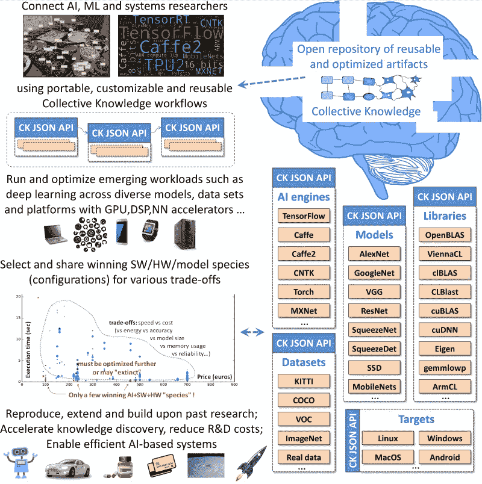

# ACM 请求:第一次公开和可重复的锦标赛，以共同设计帕累托有效的深度学习(速度、准确性、能量、规模、成本)

> 原文：<https://towardsdatascience.com/acm-request-1st-open-and-reproducible-tournament-to-co-design-pareto-efficient-deep-learning-ea8e5a13d777?source=collection_archive---------6----------------------->

第一届可再生的高质量系统锦标赛(ReQuEST)将在 ASP los’18(ACM 编程语言和操作系统架构支持会议，这是一个跨计算机架构和硬件、编程语言和编译器、操作系统和网络的多学科系统研究的首要论坛)上首次亮相。

ReQuEST 由领先的大学联盟(Washington、Cornell、Toronto、Cambridge、EPFL)和 cTuning 基金会组织，旨在提供一个开源锦标赛框架、一个通用的实验方法和一个开放的存储库，用于对整个软件/硬件堆栈中广泛的现实世界应用程序、模型和库的质量与效率进行持续评估和多目标优化。

ReQuEST 将使用已建立的[工件评估方法](http://cTuning.org/ae)以及在领先的 ACM/IEEE 会议上验证的[集体知识框架](https://github.com/ctuning/ck)来重现结果，在实时仪表板上显示结果，并与社区共享工件。优秀作品将在相关研讨会上展示，并在 [ACM 数字图书馆](http://dl.acm.org)中发表。为了获胜，参赛作品的结果不一定要位于帕累托边界，因为参赛作品也可以因其原创性、可再现性、适应性、可扩展性、可移植性、易用性等而受到称赞。

第一个请求竞赛将专注于图像识别的深度学习，其雄心勃勃的长期目标是建立一个可移植和可定制的“即插即用”AI/ML 算法的公共存储库，这些算法在从物联网到超级计算机的不同数据集、模型和平台上进行了优化(参见[现场演示](http://cKnowledge.org/repo))。正如我们的行业顾问委员会所建议的那样，未来的竞争将考虑其他新兴工作负载。

欲了解更多信息，请访问[http://cKnowledge.org/request](http://cknowledge.org/request)

