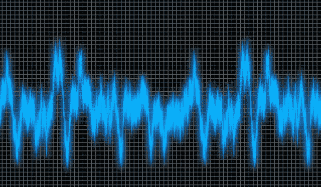
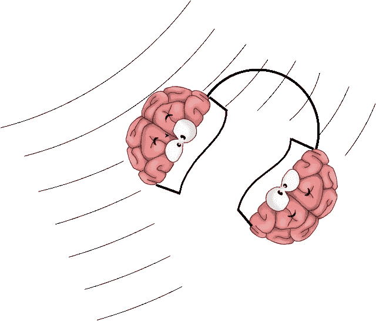
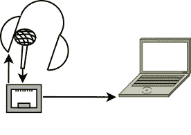
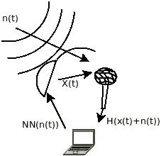
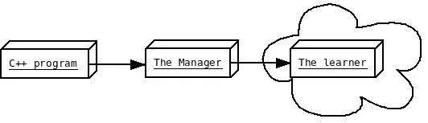
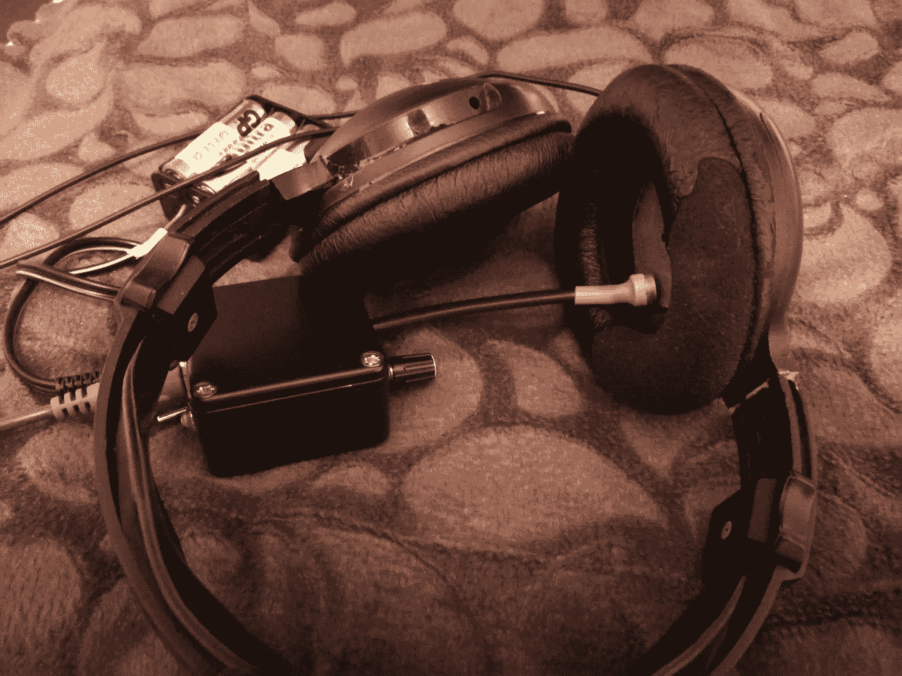
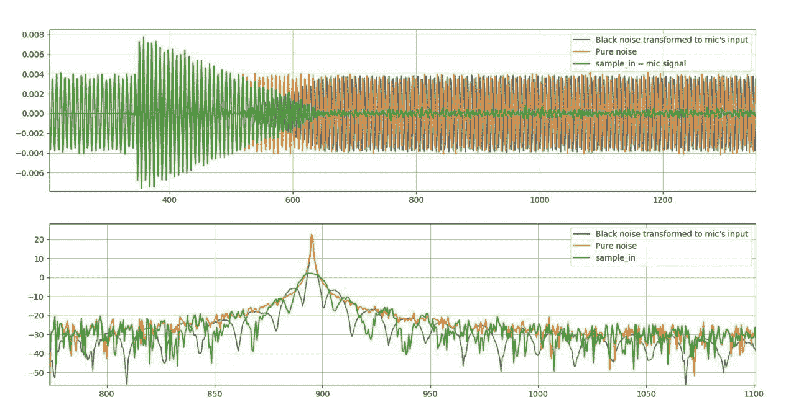
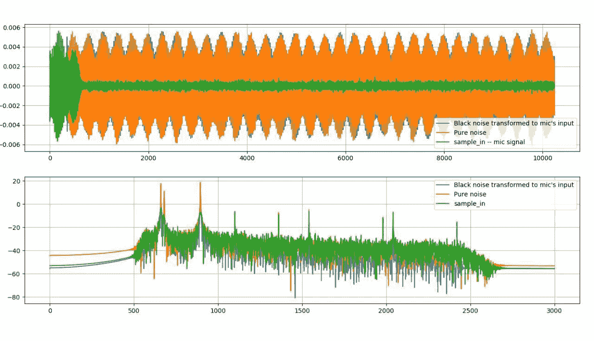

# 通过机器学习消除声学噪声

> 原文：<https://towardsdatascience.com/acoustic-noise-cancellation-by-machine-learning-4144af497661?source=collection_archive---------1----------------------->

## 用 TensorFlow 制作的 DIY 噪声消除系统原型。

Image by TheDigitalArtist on Pixabay

在这篇文章中，我描述了我如何通过自己的神经网络建立一个主动噪声消除系统。我刚刚得到了我要分享的第一个结果，但是这个系统看起来像一堆脚本、二进制文件、电线、声卡、麦克风和耳机，所以我还不打算公布任何来源。可能以后吧。

# 使用 Tensorflow、ALSA、C++ & SIMD 和 Python 的 Pet 项目

在过去的一年里，我一直在构建一个基于人工神经网络的声学噪声消除系统。我是在业余时间做的，所以这就是为什么一个相对小的实验花了这么长时间。我建立的系统是一个概念验证，它显示了神经网络作为噪声消除器的一致性。

我对 ML 最近在像神经风格转移这样的图像处理方面的成就印象深刻。我想:“如果我们用重复的音频噪声模式来教 RNN，以便通过 ANC 来抑制它，会怎么样？”我之前已经在 DSP 上为一些雷达的东西实现了感知器，所以我不担心在实时软件中实现神经网络的必要性。虽然我以前没有和 tensorflow 和 gpu 打过交道，但我渴望用它们做点什么。到目前为止，在我看来，这是一次有趣的旅行，最后我取得了一些成果，并获得了许多开发人员的乐趣。

Artificial Brain Denoising

## 为什么我们需要 ML 来抑制噪声？

现代 ANC 系统成功地抑制了飞机中的平稳噪声。常见的方法包括自适应滤波器，如 [LMS](https://en.wikipedia.org/wiki/Least_mean_squares_filter) 或 [RLS](https://en.wikipedia.org/wiki/Recursive_least_squares_filter) 。这种方法的主要缺陷是，它们的核心只是 FIR 滤波器，其系数是不断调整的，并且它仅在几千个样本后才适合噪声。这意味着自适应滤波器开始重新适应环境噪声的每一个变化，即使它在几秒钟前听到了那个模式。由于神经网络能够适应内部结构非常复杂的信号，因此在 ANC 中使用 ML 方法可以提高其性能。

> ANC 中的 NN 用于预测在黑噪声与麦克风位置的噪声相遇的时刻的噪声样本值。

我认为室外的噪音，比如大声的排气系统或洗碗机，从广义上来说不是静止的，而是相当重复的，可以相对容易地被神经网络学习到。

# 测试设置

我的宠物项目作为经典的噪音消除耳机，除了麦克风位于耳罩内**。测试设置看起来简单明了:**

我没有把麦克风放在外面(像所有降噪耳机一样)，因为我想在更广泛的情况下解决 ANC 问题。这种设置让我可以轻松地根据房间或汽车环境调整代码，因为所有情况下的结构看起来都是一样的。

## 软件布局

该软件由三个进程组成:

*   **C++程序**进行实时信号处理，
*   **管理者**是用 tensorflow 教 NN 的 Python 脚本，
*   而**学习者**是另一个管理整个过程的 Python 脚本。

管理器脚本通过 [gprc](https://grpc.io/) 与他人通信。

DIY mic-preamp and my old and dirty audio-technica ATH-910PRO

麦克风前置放大器和耳机连接到声卡，声卡通过 USB 连接到装有 Linux Mint 17 的笔记本电脑。

麦克风测量噪声和黑噪声的组合。然后 C++程序做以下事情:

1.  读取样本，
2.  分离外部噪声和来自耳机的反信号，
3.  将噪声样本传递到神经网络的前馈通道以获得黑噪声样本，
4.  将 NN 产生的黑噪声样本回放到耳机，
5.  通过管理器脚本将噪声样本传输到学习器脚本，从管理器获取新的神经网络系数。

我站在离耳机几米远的地方，用手机播放噪音。这种结构成功抑制了不同的噪音模式，甚至是像一束束鼻窦这样的非平稳信号，可以用手随意打开和关闭。

# 内部细节

**输入声音**以 48 kHz、16 位宽采样。它被代码向下采样 8x 倍，并被转发到分离器。

**需要分离器**将外部噪声与输入样本隔离，就好像没有信号反馈到耳机一样。

**感知器**是我自己用 C++实现的，为了满足实时处理的要求，内置了 SIMD 指令。感知器由两个隐藏层组成:

*   输入层 tanh[304 x 64]采用之前隔离的外部噪声的最后 304 个样本。
*   中间层 tanh[64 x 64]。
*   输出图层是线性的[64 x 1]。

这是一个相对较小的网络，能够管理最近 304 个样本的范围。它实现简单，只需 30-60 秒就能学会。我要把它升级成某种递归变体，我已经在 Jupyter 笔记本上检查了 RNN 模型适应一些复杂声音的能力。它看起来很有希望，但需要更多的时间来收敛。希望以后写一篇关于这个笔记本的帖子。

**输出信号**被上采样 8 倍并发送给耳机。

与此同时，该程序正在向 python 脚本发送大量外部噪声样本，该脚本不断调整感知器的权重以适应新测量的噪声模式，并将其发送回 c++程序。我在带有 GPU 的虚拟机中的云中运行这个 python 脚本。顺便说一句，我发现 Paperspace 是最适合 ML 实验的！下面是我的[推荐链接](https://www.paperspace.com/&R=DUWONN)。

# 结果

这是一些展示已有成果的图表。这个数据是来自 C++程序的一个日志，现在还没有客观的测量。然而，我试着把这个耳机戴在头上，它看起来就像剧情显示的那样工作。

## 条款

**黑噪声**是送到麦克风的信号。

**纯噪声**是被分离器隔离的外部噪声。

**转换到麦克风输入端的黑噪声**是分离器分离出的信号的剩余部分。

**samples_in** 是麦克风测得的原始声音样本(当然是 8 倍下采样)。

下面是感知器如何感知输入并开始操作的示意图。

Single sine-wave @ 880 Hz

Multiple sine-waves and longer period of time.