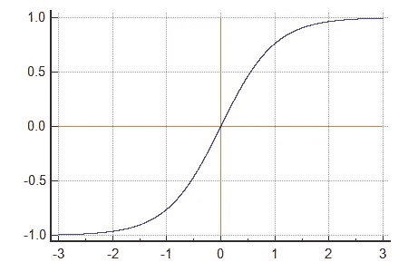
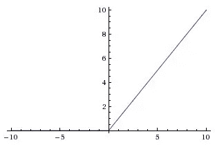
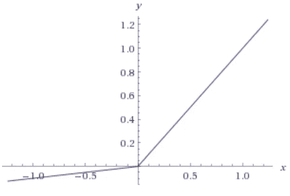

# 激活功能

> 原文：<https://towardsdatascience.com/activation-functions-b63185778794?source=collection_archive---------5----------------------->


## 那么，为什么我们的神经网络中需要激活函数呢？

欢迎来到我的第一篇帖子！我是一名数据科学家，也是媒体博客的积极读者。现在，我正计划使用 Medium blog 来记录我在学习深度学习方面的旅程，并通过我一直在从事的项目来分享我的经验。希望通过分享我对这些主题的看法，我也可以从 Medium 上奇妙的数据科学/深度学习社区中学习！我很想听到你对我第一篇文章的反馈。说到这里，让我们开始吧…

神经网络如何学习的基本思想是——我们有一些输入数据，我们将其输入网络，然后我们逐层执行一系列线性操作，并得出一个输出。对于特定层的一个简单情况是，我们将输入乘以权重，添加偏差并应用激活函数，然后将输出传递给下一层。我们不断重复这个过程，直到我们到达最后一层。最终值是我们的输出。然后，我们计算“计算输出”和“真实输出”之间的误差，然后计算该误差相对于每层参数的偏导数，并相应地不断更新参数！

神经网络被称为通用函数逼近器。神经网络的主要潜在目标是学习复杂的非线性函数。如果我们在多层神经网络中不应用任何非线性，我们只是试图使用线性超平面来分离类别。正如我们所知，在现实世界中没有什么是线性的！


Source: Google

同样，假设我们执行如上所述的简单线性运算，即:将输入乘以权重，加上偏差，并对到达神经元的所有输入求和。在某些情况下，上面导出的输出可能会取较大的值。当这个输出被输入到下一层时，它们可以被转换成更大的值，使得计算变得不可控。这是激活函数发挥主要作用的地方，即把一个实数压缩到一个固定的区间(例如在-1 和 1 之间)。

让我们看看不同类型的激活函数以及它们之间的比较:

# **乙状结肠:**


sigmoid 激活函数具有数学形式“sig(z) = 1/ (1 + e^-z)`.正如我们所看到的，它基本上接受一个实数值作为输入，并在 0 和 1 之间压缩它。它也经常被称为挤压功能。其目的是在输入空间中引入非线性。非线性是我们摇摆的地方，网络学习捕捉复杂的关系。从上面的数学表示可以看出，通过 sigmoid 函数的大负数变成 0，大正数变成 1。由于这一特性，sigmoid 函数通常有一个非常好的解释，即神经元的放电频率；从根本不触发(0)到以假定的最大频率完全饱和触发(1)。然而，随着时间的推移，由于以下两个主要缺点，sigmoid 激活函数变得不太流行:

*   **杀伤梯度:**
    乙状结肠神经元在边界上饱和，因此这些区域的局部梯度几乎为零。为了让您更直观地理解这一点，请考虑 sigmoid 函数的输入为+15 和-15。sigmoid 函数的导数是‘SIG(z)*(1—SIG(z))’。如上所述，大的正值被挤压在 1 附近，大的负值被挤压在 0 附近。因此，有效地使局部梯度接近 0。结果，在反向传播期间，该梯度被乘以最终目标函数的该神经元输出的梯度，因此它将有效地“杀死”梯度，并且没有信号将通过神经元流向其权重。此外，我们必须注意初始化 sigmoid 神经元的权重以避免饱和，因为如果初始权重太大，那么大多数神经元将会饱和，因此网络将很难学习。
*   **非零中心输出:**
    输出总是在 0 和 1 之间，这意味着应用 sigmoid 后的输出总是正的，因此，在梯度下降期间，反向传播期间权重的梯度将总是正的或负的，这取决于神经元的输出。结果，梯度更新在不同的方向上走得太远，这使得优化更加困难。

python 实现类似于:

```
import numpy as npdef sigmoid(z):
 return 1 / (1 + np.exp(-z))
```

# **谭:**



Source: Google

双曲正切激活函数的数学形式为“双曲正切(z)=(e^z-e^-z)/(e^z+e^-z)`.)它基本上是一个移位的乙状结肠神经元。它基本上接受一个实数值，并在-1 和+1 之间压缩它。类似于乙状结肠神经元，它在大的正值和负值时饱和。然而，它的输出总是以零为中心，这是有帮助的，因为网络后面层中的神经元将接收以零为中心的输入。因此，在实践中，双曲正切激活函数在 sigmoid 上的隐藏层中是优选的。

```
 import numpy as npdef tanh(z):
 return np.tanh(z) 
```

# **ReLU:**



Source: Google

ReLU 或整流线性单位表示为“ReLU(z) = max(0，z)”。它基本上将输入阈值设置为零，即 ReLU 神经元输入中的所有负值都设置为零。最近，它变得流行起来，因为发现与 Sigmoid 或 Tanh 激活函数相比，它大大加速了随机梯度下降的收敛。为了直观起见，梯度可以是 0 或 1，具体取决于输入的符号。让我们讨论一下 ReLU 的一些优点:

*   **激活的稀疏性** :
    正如我们上面所研究的，ReLU 和 Tanh 激活函数几乎总是在神经网络中被激发，导致几乎所有的激活都在计算网络的最终输出时被处理。这当然是件好事，但前提是我们的网络很小，或者我们有无限的计算能力。想象一下，我们有一个非常深的神经网络，其中有许多神经元，理想情况下，我们希望只有一部分神经元激活，并对网络的最终输出做出贡献，因此，我们希望网络中的一部分神经元是被动的。ReLU 给了我们这个好处。因此，由于 ReLU 的特性，有可能 50%的神经元给出 0 次激活，从而导致更少的神经元触发，结果网络变得更轻，我们可以更快地计算输出。

然而，它有一个缺点，即所谓的神经元死亡问题。


*   **死亡神经元:**
    ReLU 单位在训练过程中可以很脆弱，可以“死亡”。也就是说，如果单元最初没有被激活，那么在反向传播期间零梯度流过它们。因此,“死亡”的神经元将停止响应输出误差的变化，因此，在反向传播期间，参数将永远不会更新。但是，有一些概念，如 Leaky ReLU，可以用来克服这个问题。此外，适当设置学习速率可以防止神经元死亡。

```
import numpy as npdef relu(z):
 return z * (z > 0)
```

# **泄漏的 ReLU:**



Source: Google

漏 ReLU 只是传统 ReLU 函数的扩展。正如我们看到的，对于小于 0 的值，梯度为 0，这导致这些区域中的“死亡神经元”。为了解决这个问题，Leaky ReLU 就派上了用场。也就是说，我们不是将小于 0 的值定义为 0，而是将负值定义为输入的一个小的线性组合。常用的小值是 0.01。它表示为` LeakyReLU(z) = max(0.01 * z，z)`。通过做一点小小的改变，漏 ReLU 的思想可以被进一步扩展。我们可以学习乘数，并将其作为我们过程中的一个附加超参数，而不是将“z”乘以一个常数。这就是所谓的参数 ReLU。在实践中，相信这比泄漏 ReLU 执行得更好。

```
import numpy as npdef leaky_relu(z):
 return np.maximum(0.01 * z, z)
```

感谢您的阅读。在这篇文章中，我试图放下我对一些最常用的激活函数的理解，为什么我们首先使用它们，以及应该使用哪种激活函数。不断寒心，不断创新！

杂项:

如果你在数据科学或深度学习领域工作，如果你认为有合作的机会，请不要犹豫。我正在寻找全职机会，并愿意讨论。

参考资料:

[1]:[http://cs231n.github.io/neural-networks-1/#actfun](http://cs231n.github.io/neural-networks-1/#actfun)

【2】:【http://www.deeplearningbook.org/ 