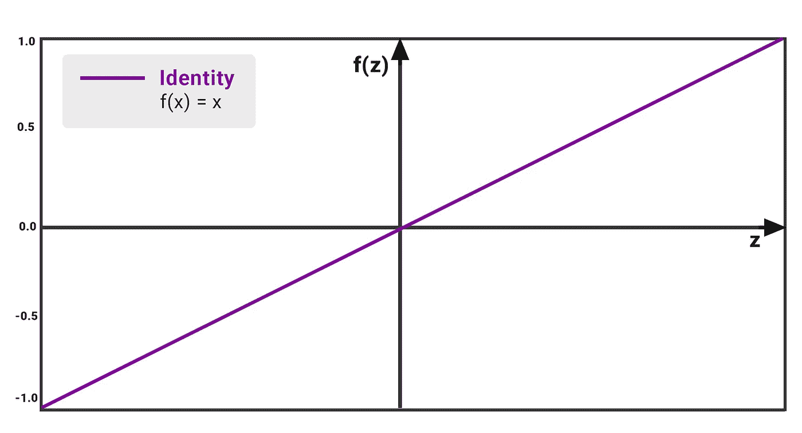
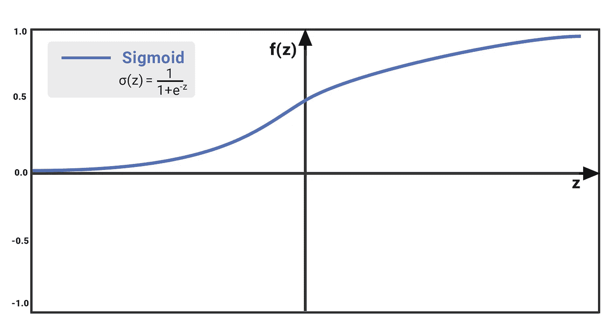
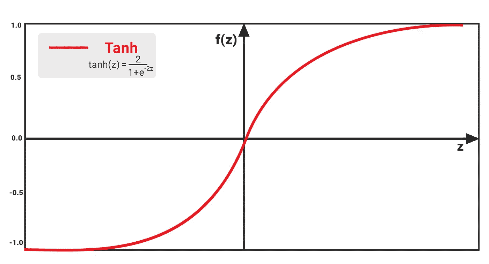
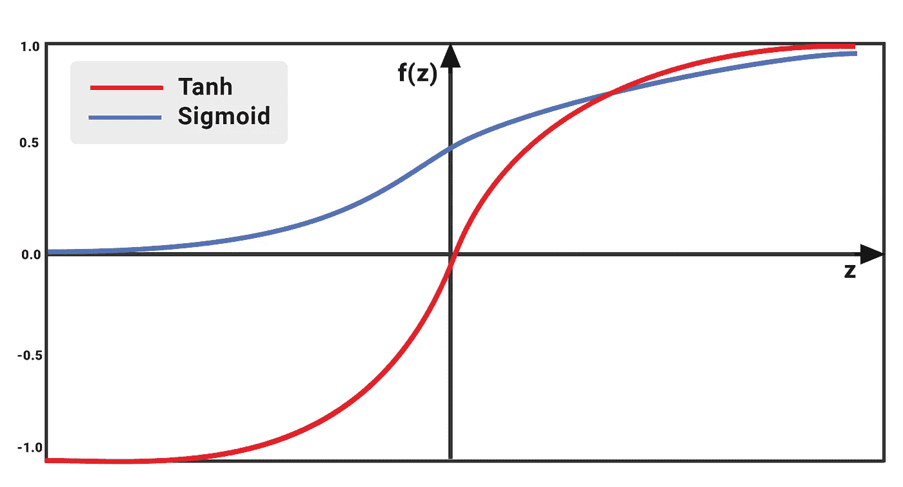
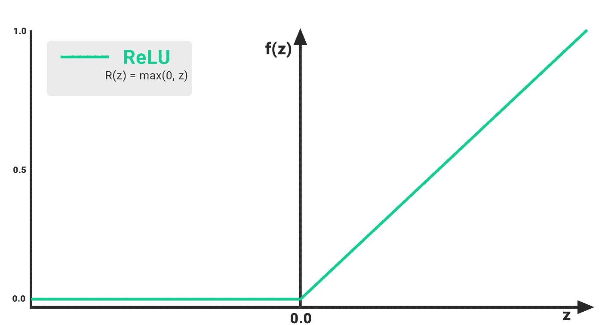
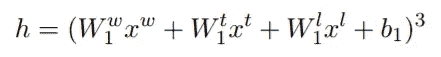
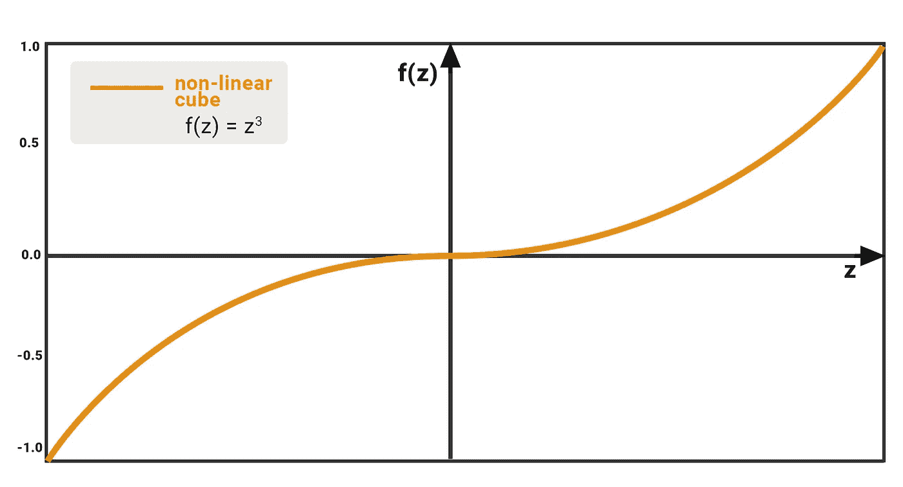

# 神经网络中的激活函数

> 原文：<https://towardsdatascience.com/activation-functions-in-neural-networks-83ff7f46a6bd?source=collection_archive---------8----------------------->

## 动机、使用案例、优势和局限性

> ***TL；*** *博士这篇文章讨论了深度学习和神经网络中使用的各种线性和非线性激活函数。我们还将研究每个函数在不同情况下的表现，每个函数的优缺点，然后以最后一个激活函数结束，该函数的表现优于自然语言处理应用程序中讨论的函数。*

## 介绍

继续神经网络的话题。今天我们将讨论什么是**激活函数**，并尝试理解其基本概念。我们深入研究了这些函数的线性和非线性版本，并探索了它们在哪些方面表现最佳，在哪些方面表现不佳。

在我们继续讨论什么是激活功能之前，让我们先回顾一下神经网络是如何运作的。因此，神经网络是模拟大脑工作方式的人工神经元的复杂网络。他们接受输入参数及其相关权重和偏差，然后我们计算“激活”神经元的加权和。我们的激活函数决定哪些神经元将把值推进到下一层。它是如何工作的，是我们接下来将要看到的。

## 基本概念

在前向传播步骤中，我们的人工神经元接收来自不同参数或特征的输入。理想情况下，每个输入都有自己的值或权重和偏差，这些值或权重和偏差可以显示导致最终预测值发生变化的相互依赖性。这是一种被称为**互动效应**的现象。

一个很好的例子是在糖尿病患者数据集上尝试回归模型。目标是根据一个人的体重和身高来预测他是否有患糖尿病的风险。一些体重表明，如果一个人的身高比一个健康指数相对较高的人矮，那么他患糖尿病的风险更大。当然还有其他我们目前没有考虑的参数。我们说身高和体重之间有交互作用。

激活函数考虑了不同参数中的相互作用效应，并进行转换，然后决定哪个神经元*将值向前*传递到下一层。

## 线性函数

我们从最简单的函数开始。**线性功能**。 *f(z)* 的值与 *z* 的值成比例增加。输入值是层中神经元的权重和偏差的加权和。线性函数解决了二进制阶跃函数仅报告值 0 和 1 的问题。

**Fig 1:** Performance of Linear or Identity Activation Function

函数的输出不受任何范围的限制；也就是说， *f(z)* 的值可以从中得出，这不一定是一个问题，因为我们可以通过取 com 之后触发的神经元的最大值来进入下一层或最后一层。除此之外，线性激活函数有其一系列缺点，例如:

*   我们观察到函数的导数是一个常数。这意味着存在恒定的梯度下降，因为与 z 值无关。
*   我们的模型不是真正的学习，因为它没有改进误差项，这是神经网络的全部要点。
*   由于激活是线性的，嵌套在 2 或 N 个具有相同功能的隐藏层中不会有实际效果。N 层基本上可以压缩成一层。

我们看到这个函数不适合处理复杂的。因此，为了解决这个问题，我们使用非线性函数来使我们的模型能够迭代学习。

## Sigmoid 函数

Sigmoid 函数将一个值作为输入，并输出另一个介于 0 和 1 之间的值。当构建神经网络模型时，它是非线性的并且易于操作。这个函数的优点是在不同的 *z* 值上连续可微分，并且具有固定的输出范围。

**Fig 2:** Performance of Sigmoid Activation Function

通过观察，我们看到 *f(z)* 的值以非常慢的速率增加。数学上的原因是，随着 *z* (在 x 轴上)增加，e 指数-z 的值变得无穷小，并且 *f(z)* 的值在某个点变得等于 1。换句话说，这个函数容易受到我们在上一讲中讨论的消失梯度问题的影响。高层次的问题是，利用 sigmoid 激活的模型(我们的慢学习者和处于实验阶段的学习者)将生成具有较低准确性的预测值。

当我们的神经网络中有多个隐藏层时，这个函数会出现另一个问题。我们通过这个激活函数得到的所有值都是正的，sigmoid 在 0-1 范围内产生不同大小的值，因此很难优化。

除了缺点，我们确实看到 sigmoid 函数特别是在二进制分类模型中作为输出层的一部分使用，以捕捉从 0 到 1 的概率。在大多数情况下，我们通常会遇到涉及多个类的问题，对于这样的模型，我们使用 Softmax 函数(这个函数的细节在[之前的讲座](/softmax-function-simplified-714068bf8156)中有进一步的解释)。

## Tanh 函数

双曲正切函数是 sigmoid 函数的修改版或放大版。我们在 Sigmoid 中看到的是 *f(z)* 的值有界在 0 和 1 之间；然而，在 Tanh 的情况下，值被限制在-1 和 1 之间。

从某种意义上说，这很简单，我们能够得到不同符号的值，这有助于我们确定在下一层要考虑哪些分数，忽略哪些分数。但是，该函数仍然存在 sigmoid 函数中出现的梯度消失问题。该模型在+2 和-2 范围之外以指数方式变慢。除了在这个狭窄的范围内，梯度的变化非常小。

**Fig 3:** Performance of Tanh Activation Function

关于双曲正切函数和 sigmoid 函数的最后一点，双曲正切函数的梯度或导数比 Sigmoid 函数更陡，我们可以在下面的图 4 中观察到。我们选择使用 Sigmoid 还是 Tanh 实际上取决于问题陈述对梯度的要求。

**Fig 4:** Comparision of Sigmoid and Tanh Activation Function

## 校正线性单位函数

整流线性单元或简称 ReLU 将被认为是深度学习模型中最常用的激活函数。如果接收到任何负输入，该函数简单地输出值 0，但是对于任何正值 *z，*，它像线性函数一样返回该值。所以可以写成 *f(z)=max(0，z)*

**Fig 5:** Performance of ReLU Activation Function

然而，应该注意，ReLU 函数仍然是非线性的，因此我们能够反向传播误差，并且具有多层神经元。这个功能很快被采用，因为 ReLU 解决了乙状结肠和 Tanh 面临的几个问题:

*   ReLU 函数在其跨越所有负数的范围的一半上具有 0 的导数。对于正输入，导数为 1。因此，我们已经纠正了“消失”梯度问题。
*   一次只有少数神经元被激活，使得网络变得稀疏，从而变得高效(我们将会看到稀疏并不总是一件好事)
*   与 Sigmoid 和 Tanh 相比，它在计算上是经济的。

尽管 ReLU 是比其它非线性替代物更好的激活函数，但是它有自己的一系列限制和缺点:

*   该函数遇到了垂死的 ReLU 问题——对于对应于形成 y = 0 线的 z < 0, the gradient will be 0 because of which the weights will not get adjusted during the gradient descent in backpropagation. That means, such neurons will stop responding to variations in error/input, so the output network becomes passive due to added sparsity.
*   It is best used in between the input and output layers, more specifically within hidden

As a final note on ReLU, there is a way to counter the dying ReLU problem by using a modified version of the function called the ‘Leaky’ ReLU. To put it briefly, we take the *z* < 0 值的激活，通过添加小的非零恒定梯度α(通常，α=0.01)将其转换成非水平直线。所以我们对于*z*0 的新公式是 *f(z) = αz* 。

为了获得更多的信息，我已经附上了关于 Leaky ReLU 的研究论文:[https://arxiv.org/abs/1502.01852](https://arxiv.org/abs/1502.01852)

## 额外收获:非线性立方体激活功能

有一个有趣的激活功能应用于词性标注，它比文章中提到的所有其他功能都要好。曼宁和陈(2014)的论文提出了一种学习神经网络分类器的新方法，用于自然语言处理的贪婪的、基于转换的依存解析器。他们引入了由 z 表示的非线性立方函数，这在下面的隐藏层的方程中被进一步阐述:

**Fig 6:** Cube Activation function that takes weights of the words, tags, and labels along with its bias.

上面的等式表示输入单元的加权和，在这种情况下，输入单元是单词、标签和标记嵌入加上相关联的偏差。然后，总和的 3 次方被用来计算该迭代的输出值。

这个特定激活功能的性能可以在下面的图表中看到。这不是成比例的，但我们可以确定，在这种情况下，随着学习以指数速率( *z* )进行，误差项减少了。

**Fig 7:** Performance of Cube (z³) Activation Function

该论文在实验中是彻底的，其中该模型与其他最先进的模型进行了严格的测试，并且为了快速得出激活函数之间关于性能的比较，我们观察到:

非线性立方体> ReLU > Tanh > Sigmoid

为了更好地了解这个模型是如何运行的，我在下面附上了曼宁论文的链接。

一个使用神经网络的快速准确的依存句法分析器:【https://cs.stanford.edu/~danqi/papers/emnlp2014.pdf】T3

## 结论

我们学习了在 ML 模型中使用的许多激活函数。对于研究人员来说，这些函数用于比较在给定问题陈述的情况下什么是最好的。对于选择特定的激活功能，没有严格的规则。然而，这取决于模型的架构、超参数和我们试图捕捉的特征。理想情况下，我们在基本模型上使用 ReLU 函数，但是如果我们不能达到最佳结果，我们也可以尝试其他函数。

最后一点，请随意评论您自己设计的非线性激活函数版本、高级概述以及它在什么情况下性能最佳。

*传播和分享知识。如果这篇文章激起了你的兴趣，请鼓掌，因为它总是激励我写出更多的信息内容。更多数据科技相关帖子关注我* [*这里*](https://medium.com/@hamzamahmood) *。
我在*[*Linkedin*](https://www.linkedin.com/in/hmahmood93/)*上也有空，偶尔*[*tweet*](https://twitter.com/mahmooyo)*也有空。:)*