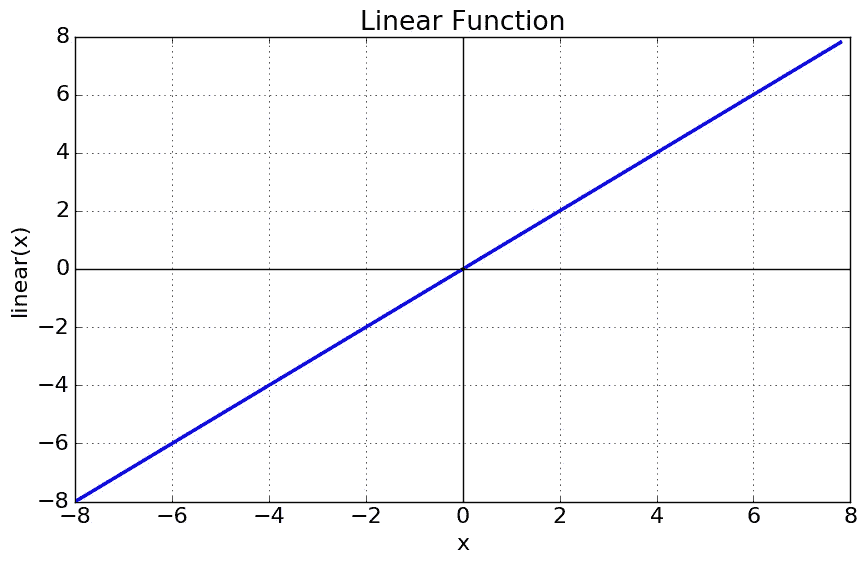
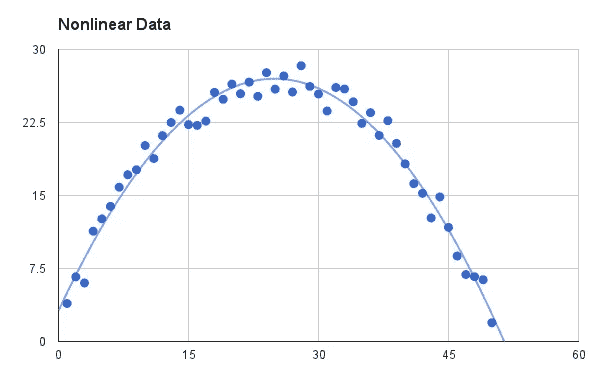
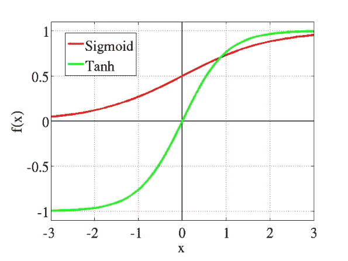
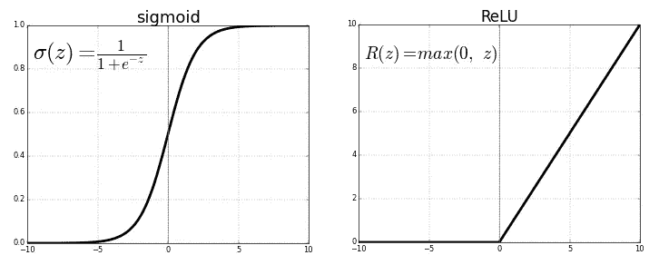
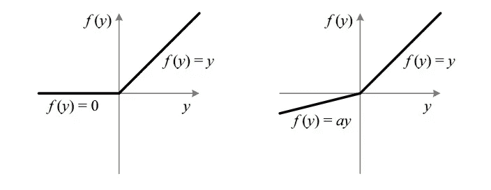
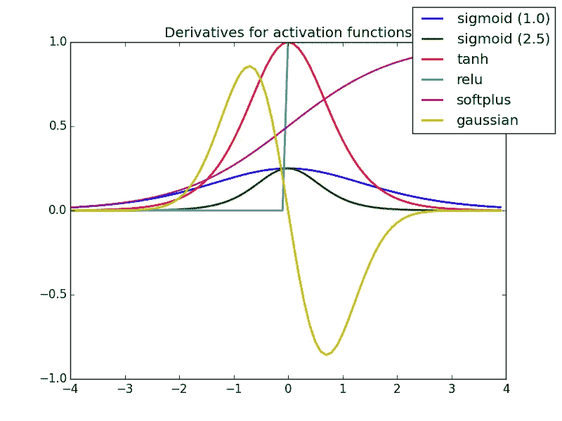

# 神经网络中的激活函数

> 原文：<https://towardsdatascience.com/activation-functions-neural-networks-1cbd9f8d91d6?source=collection_archive---------0----------------------->

## Sigmoid，tanh，Softmax，ReLU，Leaky ReLU 解释！！！

## **什么是激活功能？**

> 它只是一个东西函数，你用它来得到 node 的输出。它也被称为**传递函数**。

## **为什么我们在神经网络中使用激活函数？**

> 它用于确定神经网络的输出，如是或否。它将结果值映射到 0 到 1 或-1 到 1 等之间。(取决于功能)。

激活功能基本上可以分为两种类型

1.  线性激活函数
2.  非线性激活函数

> 仅供参考:备忘单如下。

## **线性或身份激活功能**

如你所见，这个函数是一条直线或线性的。因此，函数的输出将不会被限制在任何范围之间。

**Fig: Linear Activation Function**

**方程式:** f(x) = x

**范围:**(-无穷大到无穷大)

它对输入神经网络的通常数据的复杂性或各种参数没有帮助。

## **非线性激活功能**

非线性激活函数是最常用的激活函数。非线性有助于使图表看起来像这样

**Fig: Non-linear Activation Function**

这使得模型很容易概括或适应各种数据，并区分输出。

需要理解非线性函数的主要术语有:

> **导数或微分:**y 轴的变化与 x 轴的变化。它也被称为斜坡。
> 
> **单调函数:**要么完全非增，要么完全非减的函数。

非线性激活函数主要根据它们的**范围或曲线**来划分

## **1。乙状结肠或逻辑激活功能**

Sigmoid 函数曲线看起来像 S 形。

**Fig: Sigmoid Function**

我们之所以用 sigmoid 函数，主要是因为它存在于 **(0 到 1)之间。**因此，它特别适用于我们必须**预测概率**作为输出的模型。由于任何事情的概率只存在于 **0 和 1 之间，** sigmoid 是正确的选择。

该函数是**可微的**。这意味着，我们可以在任意两点找到 s 形曲线的斜率。

函数是**单调的**，但函数的导数不是。

逻辑 sigmoid 函数会导致神经网络在训练时停滞不前。

**softmax 函数**是一个更通用的逻辑激活函数，用于多类分类。

## **2。双曲正切或双曲正切激活函数**

tanh 也像逻辑 s 形但更好。双曲正切函数的范围是从(-1 到 1)。tanh 也是 s 形的(s 形)。

**Fig: tanh v/s Logistic Sigmoid**

优点是负输入将被映射为强负输入，而零输入将被映射到双曲正切图中的零附近。

函数是**可微的**。

函数是**单调的**，而它的**导数不是单调的**。

双曲正切函数主要用于两类之间的分类。

> 双曲正切和逻辑 sigmoid 激活函数都用于前馈网络。

## **3。ReLU(整流线性单元)激活功能**

ReLU 是目前世界上使用最多的激活函数。因为，它被用于几乎所有的卷积神经网络或深度学习。

**Fig: ReLU v/s Logistic Sigmoid**

正如你所看到的，ReLU 是半整流(从底部)。当 z 小于零时 f(z)为零，当 z 大于或等于零时 f(z)等于 z。

**范围:**【0 到无穷大】

函数及其导数**都是** **单调**。

但问题是，所有的负值立即变为零，这降低了模型根据数据进行适当拟合或训练的能力。这意味着给予 ReLU 激活函数的任何负输入都会在图形中立即将值变成零，这反过来会通过不适当地映射负值来影响结果图形。

## **4。泄漏的 ReLU**

这是解决濒临死亡的 ReLU 问题的一次尝试

**Fig : ReLU v/s Leaky ReLU**

你能看到漏洞吗？😆

泄漏有助于增加 ReLU 功能的范围。通常情况下， **a** 的值在 0.01 左右。

当 **a 不为 0.01** 时，称为**随机化 ReLU** 。

因此，泄漏 ReLU 的**范围**为(-无穷大到无穷大)。

泄漏和随机化 ReLU 函数本质上都是单调的。同样，它们的导数在性质上也是单调的。

## 为什么要用导数/微分？

> 更新曲线时，根据坡度在**和**和**中知道向哪个方向**改变或更新曲线多少。这就是为什么我们在机器学习和深度学习的几乎每个部分都使用微分。

**Fig: Activation Function Cheetsheet**

**Fig: Derivative of Activation Functions**

乐意帮忙。支持我。

If you liked it

所以，跟着我上[中](https://medium.com/@sagarsharma4244)、 [LinkedIn](https://www.linkedin.com/in/sagar-sharma-232a06148/) 看看类似的帖子。

任何评论或者如果你有任何问题，**写在评论里。**

**鼓掌吧！分享一下！跟我来。**

# 你会喜欢的以前的故事:

 [## “TensorFlow”里的“Tensor”是什么鬼？

### 我不知道…

hackernoon.com](https://hackernoon.com/what-the-hell-is-tensor-in-tensorflow-e40dbf0253ee)  [## 纪元与批量大小与迭代次数

### 了解您的代码…

towardsdatascience.com](/epoch-vs-iterations-vs-batch-size-4dfb9c7ce9c9)  [## 蒙特卡罗树搜索

### 每个数据科学爱好者的 MCTS

towardsdatascience.com](/monte-carlo-tree-search-158a917a8baa)  [## 强化学习中的政策网络与价值网络

### 在强化学习中，代理在他们的环境中采取随机决策，并学习选择正确的决策…

towardsdatascience.com](/policy-networks-vs-value-networks-in-reinforcement-learning-da2776056ad2)  [## TensorFlow 图像识别 Python API 教程

### 在带有 Inception-v3 的 CPU 上(以秒为单位)

towardsdatascience.com](/tensorflow-image-recognition-python-api-e35f7d412a70)  [## 如何使用 Python 发送电子邮件

### 使用 Flask 设计专业邮件！

medium.com](https://medium.com/@sagarsharma4244/how-to-send-emails-using-python-4293dacc57d9)