# 主动学习 MNIST——节省标签

> 原文：<https://towardsdatascience.com/active-learning-on-mnist-saving-on-labeling-f3971994c7ba?source=collection_archive---------13----------------------->

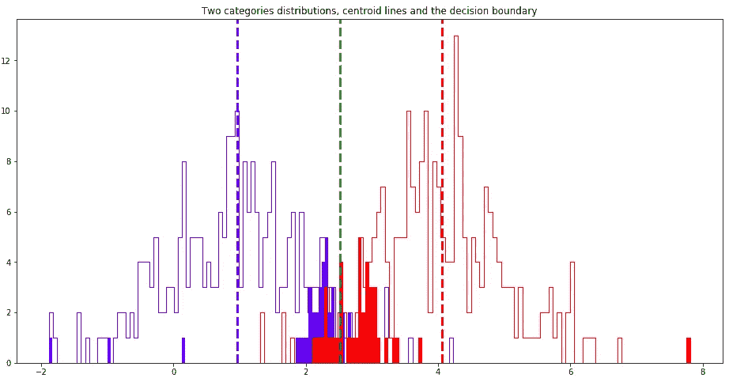

## 标记数据的聪明方法是从决策边界开始

主动学习是一种半监督技术，允许通过从学习过程(损失)的角度选择最重要的样本来标记较少的数据。在数据量大且标记率高的情况下，它会对项目成本产生巨大影响。例如，对象检测和 NLP-NER 问题。
文章基于以下代码: [**主动学习 MNIST**](https://github.com/andy-bosyi/articles/blob/master/ActiveLearning-MNIST.ipynb)

## 实验数据

```
*#load 4000 of MNIST data for train and 400 for testing*
(x_train, y_train), (x_test, y_test) = tf.keras.datasets.mnist.load_data()
x_full = x_train[:4000] / 255
y_full = y_train[:4000]
x_test = x_test[:400] /255
y_test = y_test[:400]
x_full.shape, y_full.shape, x_test.shape, y_test.shape
```

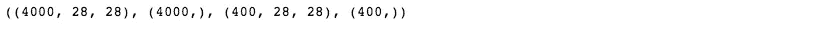

```
plt.imshow(x_full[3999])
```

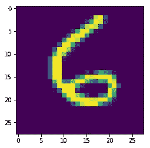

<matplotlib.image.AxesImage at 0x7f59087e5978>

我将使用 MNIST 数据集的子集，这是 6 万张带标签的数字图片和 10K 测试样本。为了更快地训练，训练需要 4000 个样本(图片)，测试需要 400 个样本(神经网络在训练过程中永远看不到)。为了标准化，我将灰度图像点除以 255。

# 模型、培训和标签流程

```
*#build computation graph*
x = tf.placeholder(tf.float32, [**None**, 28, 28])
x_flat = tf.reshape(x, [-1, 28 * 28])
y_ = tf.placeholder(tf.int32, [**None**])
W = tf.Variable(tf.zeros([28 * 28, 10]), tf.float32)
b = tf.Variable(tf.zeros([10]), tf.float32)
y = tf.matmul(x_flat, W) + b
y_sm = tf.nn.softmax(y)
loss = tf.reduce_mean(tf.nn.sparse_softmax_cross_entropy_with_logits(labels=y_, logits=y))
train = tf.train.AdamOptimizer(0.1).minimize(loss)
accuracy = tf.reduce_mean(tf.cast(tf.equal(y_, tf.cast(tf.argmax(y, 1), tf.int32)), tf.float32))
```

作为一个框架，我们可以使用 TensorFlow 计算图来构建十个神经元(每个数字)。w 和 b 是神经元的权重。softmax 输出 y_sm 将有助于数字的概率(置信度)。损失将是预测和标记数据之间典型的“软最大化”交叉熵。优化器的选择是一个流行的 Adam，学习率几乎是默认的— 0.1。作为一个主要的衡量标准，我将使用测试数据集的准确性。

```
**def** reset():
    *'''Initialize data sets and session'''*
    **global** x_labeled, y_labeled, x_unlabeled, y_unlabeled
    x_labeled = x_full[:0]
    y_labeled = y_full[:0]
    x_unlabeled = x_full
    y_unlabeled = y_full
    tf.global_variables_initializer().run()
    tf.local_variables_initializer().run() 

**def** fit():
    *'''Train current labeled dataset until overfit.'''*
    trial_count = 10
    acc = sess.run(accuracy, feed_dict={x:x_test, y_:y_test})
    weights = sess.run([W, b])
    **while** trial_count > 0:
        sess.run(train, feed_dict={x:x_labeled, y_:y_labeled})
        acc_new = sess.run(accuracy, feed_dict={x:x_test, y_:y_test})
        **if** acc_new <= acc:
            trial_count -= 1
        **else**:
            trial_count = 10
            weights = sess.run([W, b])
            acc = acc_new

    sess.run([W.assign(weights[0]), b.assign(weights[1])])    
    acc = sess.run(accuracy, feed_dict={x:x_test, y_:y_test})
    print('Labels:', x_labeled.shape[0], '**\t**Accuracy:', acc)

**def** label_manually(n):
    *'''Human powered labeling (actually copying from the prelabeled MNIST dataset).'''*
    **global** x_labeled, y_labeled, x_unlabeled, y_unlabeled
    x_labeled = np.concatenate([x_labeled, x_unlabeled[:n]])
    y_labeled = np.concatenate([y_labeled, y_unlabeled[:n]])
    x_unlabeled = x_unlabeled[n:]
    y_unlabeled = y_unlabeled[n:]
```

这里我定义了这三个过程，以便更方便地编码。
**reset()** —清空已标记的数据集，将所有数据放入未标记的数据集中，并重置会话变量

**fit()** —运行训练，试图达到最佳准确度。如果在前十次尝试中没有提高，训练将在最后一次最佳结果时停止。我们不能使用任何大量的训练时期，因为模型往往很快过拟合或需要一个密集的 L2 正则化。

**label_manually()** —这是对人工数据标注的模拟。实际上，我们从已经标注的 MNIST 数据集中获取标注。

## 地面实况; 真值（机器学习）

```
*#train full dataset of 1000*
reset()
label_manually(4000)
fit()
```

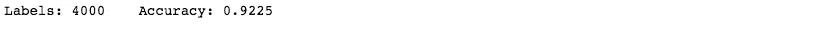

如果我们足够幸运，有足够的资源来标记整个数据集，我们将获得 92.25%的准确率。

## 使聚集

```
*#apply clustering*
kmeans = tf.contrib.factorization.KMeansClustering(10, use_mini_batch=**False**)
kmeans.train(**lambda**: tf.train.limit_epochs(x_full.reshape(4000, 784).astype(np.float32), 10))
```

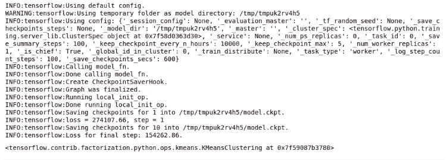

```
centers = kmeans.cluster_centers().reshape([10, 28, 28])
plt.imshow(np.concatenate([centers[i] **for** i **in** range(10)], axis=1))
```

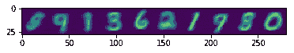

<matplotlib.image.AxesImage at 0x7f58d033a860>

在这里，我尝试使用 k-means 聚类来找到一组数字，并使用这些信息进行自动标记。我运行 Tensorflow 聚类估计器，然后可视化得到的十个质心。如你所见，结果远非完美——数字“9”出现了三次，有时与“8”和“3”混在一起。

## 随机标记

```
*#try to run on random 400*
reset()
label_manually(400)
fit()
```

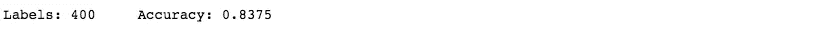

让我们尝试只标记 10%的数据(400 个样本)，我们将获得 83.75%的准确性，这与 92.25%的基本事实相差甚远。

## 主动学习

```
*#now try to run on 10*
reset()
label_manually(10)
fit()
```

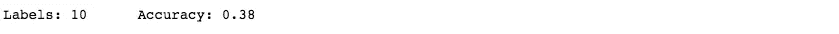

```
*#pass unlabeled rest 3990 through the early model*
res = sess.run(y_sm, feed_dict={x:x_unlabeled})
*#find less confident samples*
pmax = np.amax(res, axis=1)
pidx = np.argsort(pmax)
*#sort the unlabeled corpus on the confidency*
x_unlabeled = x_unlabeled[pidx]
y_unlabeled = y_unlabeled[pidx]
plt.plot(pmax[pidx])
```

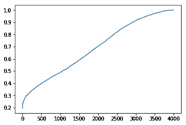

[<matplotlib.lines.Line2D at 0x7f58d0192f28>]

现在我们将使用主动学习来标记相同的 10%的数据(400 个样本)。为此，我们从 10 个样本中抽取一批样本，并训练一个非常原始的模型。然后，我们将剩余的数据(3990 个样本)通过该模型，并评估最大 softmax 输出。这将显示所选类是正确答案的概率(换句话说，神经网络的置信度)。排序后，我们可以在图上看到置信度的分布从 20%到 100%不等。这个想法是从信心不足的样品中选择下一批进行标记。

```
*#do the same in a loop for 400 samples*
**for** i  **in** range(39):
    label_manually(10)
    fit()

    res = sess.run(y_sm, feed_dict={x:x_unlabeled})
    pmax = np.amax(res, axis=1)
    pidx = np.argsort(pmax)
    x_unlabeled = x_unlabeled[pidx]
    y_unlabeled = y_unlabeled[pidx]
```

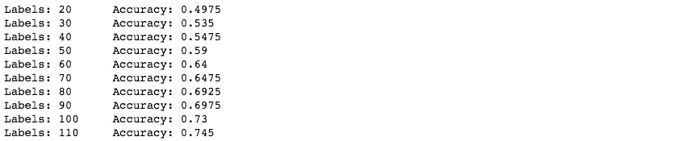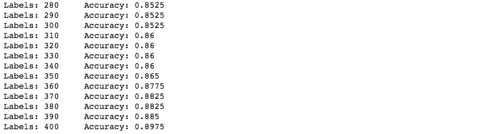

在对 40 个批次的 10 个样品运行这样的程序后，我们可以看到最终的准确度几乎是 90%。这远远超过在随机标记数据的情况下达到的 83.75%。

## 如何处理剩余的未标记数据

```
*#pass rest unlabeled data through the model and try to autolabel*
res = sess.run(y_sm, feed_dict={x:x_unlabeled})
y_autolabeled = res.argmax(axis=1)
x_labeled = np.concatenate([x_labeled, x_unlabeled])
y_labeled = np.concatenate([y_labeled, y_autolabeled])
*#train on 400 labeled by active learning and 3600 stochasticly autolabeled data*
fit()
```

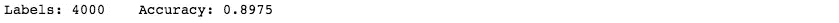

传统的方法是通过现有模型运行数据集的其余部分，并自动标记数据。然后，在训练过程中推动它可能有助于更好地调整模型。然而在我们的例子中，它并没有给我们带来任何更好的结果。

我的方法是做同样的事情，但是，如同在主动学习中一样，考虑到信心:

```
*#pass rest of unlabeled (3600) data trough the model for automatic labeling and show most confident samples*
res = sess.run(y_sm, feed_dict={x:x_unlabeled})
y_autolabeled = res.argmax(axis=1)
pmax = np.amax(res, axis=1)
pidx = np.argsort(pmax)
*#sort by confidency*
x_unlabeled = x_unlabeled[pidx]
y_autolabeled = y_autolabeled[pidx]
plt.plot(pmax[pidx])
```

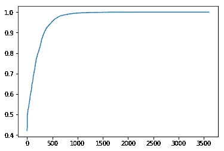

[<matplotlib.lines.Line2D at 0x7f58cf918fd0>]

```
*#automatically label 10 most confident sample and train for it*
x_labeled = np.concatenate([x_labeled, x_unlabeled[-10:]])
y_labeled = np.concatenate([y_labeled, y_autolabeled[-10:]])
x_unlabeled = x_unlabeled[:-10]
fit()
```

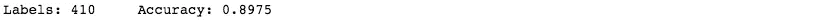

在这里，我们通过模型评估运行剩余的未标记数据，我们仍然可以看到剩余样本的置信度不同。因此，想法是采取一批十个最有信心的样本，并训练模型。

```
*#run rest of unlabelled samples starting from most confident*
**for** i **in** range(359):
    res = sess.run(y_sm, feed_dict={x:x_unlabeled})
    y_autolabeled = res.argmax(axis=1)
    pmax = np.amax(res, axis=1)
    pidx = np.argsort(pmax)
    x_unlabeled = x_unlabeled[pidx]
    y_autolabeled = y_autolabeled[pidx]
    x_labeled = np.concatenate([x_labeled, x_unlabeled[-10:]])
    y_labeled = np.concatenate([y_labeled, y_autolabeled[-10:]])
    x_unlabeled = x_unlabeled[:-10]
    fit()
```

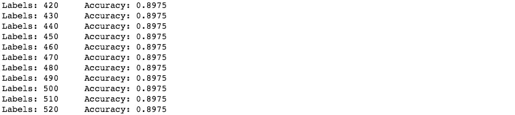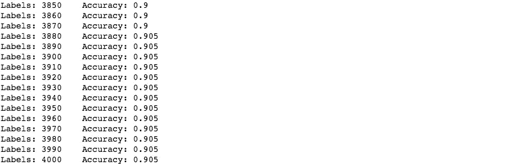

这个过程需要一些时间，并给我们额外的 0.8%的准确性。

## 结果

实验准确率
4000 个样本 92.25%
400 个随机样本 83.75%
400 个主动学习样本 89.75%
+自动标注 90.50%

## 结论

当然，这种方法有其缺点，如计算资源的大量使用，以及数据标记与早期模型评估混合需要特殊过程的事实。此外，出于测试目的，数据也需要被标记。但是，如果标签的成本很高(特别是对于 NLP、CV 项目)，这种方法可以节省大量资源，并推动更好的项目结果。

## 附言（同 postscript）；警官（police sergeant）

如果你有私人问题，请在 [Linkedin](https://www.linkedin.com/in/andybosyi/) 或[脸书](https://www.facebook.com/profile.php?id=100013517439841)联系我，我有时会在那里发布关于人工智能的简短新闻和想法。

我要感谢我的同事们[亚历克斯·西姆基夫](https://www.linkedin.com/in/oleksiy-simkiv/)、[米科拉·科兹连科](https://www.linkedin.com/in/mykola-kozlenko/)、[沃洛季米尔·森德茨基](https://medium.com/@volodymyrsendetskyi)、维亚奇·博西和[纳扎尔·萨维琴科](https://www.linkedin.com/in/nazar-savchenko/)富有成效的讨论、合作和有益的建议，以及整个 MindCraft.ai 团队的持续支持。
Andy Bosyi，
mind craft . ai 首席执行官
信息技术&数据科学