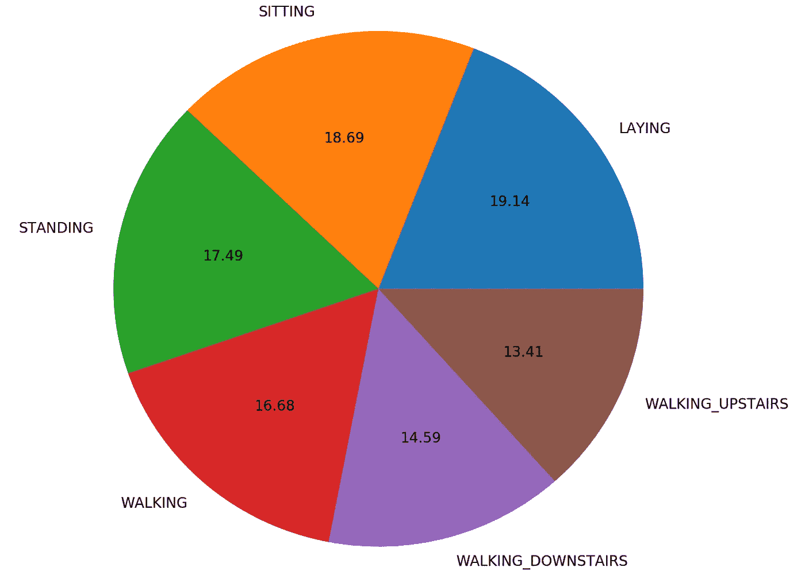
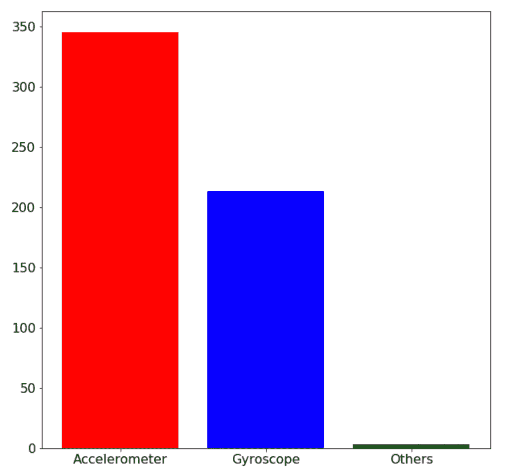
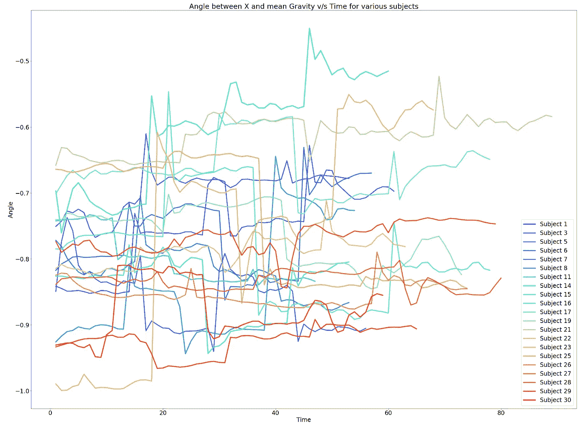
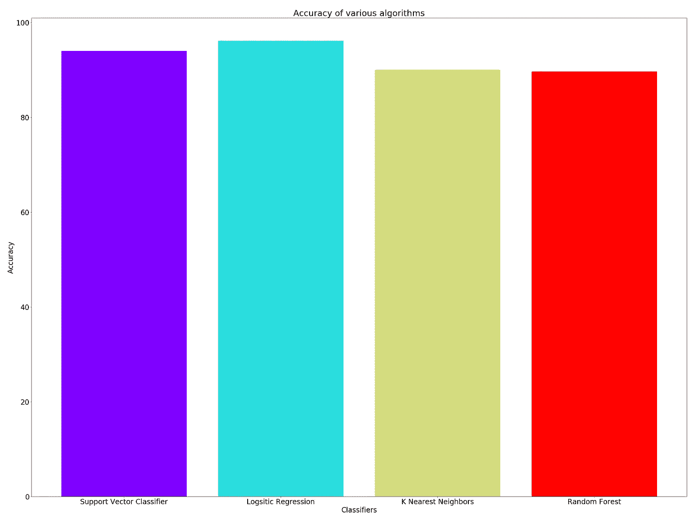

# 使用智能手机的活动识别—机器学习应用

> 原文：<https://towardsdatascience.com/activity-recognition-using-smartphones-machine-learning-application-a10e7b5578f9?source=collection_archive---------3----------------------->


“white building with data has a better idea text signage” by [Franki Chamaki](https://unsplash.com/@franki?utm_source=medium&utm_medium=referral) on [Unsplash](https://unsplash.com?utm_source=medium&utm_medium=referral)

当我第一次开始探索机器学习时，我阅读了大量的文章和研究论文。我最初发现的一篇论文涉及使用机器学习对活动进行分类。尽管当时实现似乎是一个遥不可及的目标，但我还是被这个应用程序吸引住了。从那天起，我获得了一些经验，我相信今天我可以应用我的机器学习知识来识别现在的活动。

对于数据集，我从 [Kaggle 竞赛](https://www.kaggle.com/uciml/human-activity-recognition-with-smartphones)中选择了`training.csv`和`test.csv`文件。我在这个项目中使用了一个 Jupyter 笔记本，在我的[活动识别中使用了机器学习报告](https://github.com/kb22/Activity-Recognition-using-Machine-Learning)。

> 顺便提一下，现在通过[谷歌数据集搜索](https://toolbox.google.com/datasetsearch)在线查找数据集变得容易多了。这是我找到这个项目数据集的地方。

因此，在这篇文章中，我将解释我在这个项目中采取的步骤，以及我如何使用机器学习以超过 96%的准确率对活动进行分类。分叉存储库，打开笔记本，开始吧。

# 导入库

在这个项目中，我们将需要许多存储库。

1.  **numpy 和 pandas:** numpy 使我们能够高效地使用数组。Pandas 用于读取数据集文件并将其作为 dataframe 导入，data frame 类似于包含行和列的表。
2.  matplotlib: matplotlib 是一个高度可定制的包，它有一个子包`pyplot`，可以让我们绘制图表、柱状图、饼状图等等。我们可以选择添加图例、轴标题、改变线条粗细等。`cm`包(colormap)允许我们为图表获取颜色。
3.  **sklearn:** 这个机器学习库包括许多已经内置的机器学习算法，其中某些参数设置为默认参数，因此它们开箱即用。

如果你注意到了，我加了一行`%matplotlib inline`。这将 matplotlib 的后端更改为 Jupyter 笔记本，因此，所有绘图现在都将显示在 Jupyter 笔记本本身中。

在这个项目中，我使用了四种算法，即支持向量分类器作为`SVC`，逻辑回归作为`LogisticRegression`，K 近邻分类器作为`KNeighborsClassifier`，随机森林分类器作为`RandomForestClassifier`。为了计算精度，我导入了`accuracy_score`。

# 了解数据集

Person walking up the stairs

首先我们将使用`read_csv()`方法将训练和测试文件导入笔记本，并保存在变量`training_data`和`testing_data`中。

我们使用`shape`方法来寻找数据集的大小。其结果是输出为`(rows, columns)`。训练数据集中有 7352 行和 563 列，测试数据集中有 2947 行和 563 列。我们必须确保数据集没有任何空值。我们使用`isnull().values.any()`来检查是否有单元格是空的。我们打印输出，看到输出是`False`,意味着没有空值。所以，我们可以继续。

我们可以使用`head(5)`方法来获得训练数据的前 5 行。我们看到有 563 列，最后一列为**活动**，它将作为我们的**标签**。在剩下的专栏中，subject 对于我们的机器学习应用程序没有特别的用途，因为我们想要探索活动，而不是谁执行了它。我们可以删除该列，剩下的 561 列将成为我们的**功能**。测试数据也是如此。

按照惯例，小写字母`y`充当标签集，大写字母`X`充当特征集。因此，这些名称是`y_train`、`X_train`、`y_test`和`X_test`。我们将在机器学习分析中使用这些变量。

# 可视化数据集

处理数据的关键之一是确保所有类的大小大致相等。这是必不可少的，这样机器学习算法就不会偏向任何一个类。

让我们借助一个例子来理解这一点。比方说，数据集包含 30 项活动，其份额百分比各不相同。数据集包含 99%的活动 1 数据和 1%的其余活动数据。在这种情况下，机器学习将永远不会学习关于数据的任何模式。它会认为 100 个案例中有 99 个案例的活动是活动 1。因此，它将总是输出 Activity 1，而不考虑任何数据，并且仍然可以达到 99%的准确率。这种模型是不正确的，因此必须确保不同数据类别的份额大致相等。

我们首先在`count_of_each_activity`变量中获得每种类型活动的记录数。`value_counts()`给出计数，`np.array`将其转换成一个数组。计数按活动名称的字母顺序显示。

`unique()`在`y_train`给了我们独特的价值观。我们必须对其进行排序，以便它们与上面收集的计数值保持一致。`rcParams`帮助我们为我们的图表定义某些样式。我们使用`figure.figsize`定义图形大小，使用`font.size`定义字体大小。

我们现在已经为饼图准备好了数据。`pie()`方法创建饼图。第一个参数是每个活动的计数，第二个参数是由`labels`表示的相应活动名称，第三个参数`autopct`计算每个活动的百分比。



Pie chart for share of each activity in dataset

观察上面的饼图，您可以看到每项活动的份额几乎相等。数据集的格式非常好，可以直接使用。

接下来，我观察 datatset 中的读数类型。如果您查看列标题，您会发现这些列要么有文本`Acc`来指代加速度计读数，要么有文本`Gyro`来指代陀螺仪值，要么两者都没有来指代所有其他值。

我首先遍历列名，检查它们是否包含“Acc”或“Gyro”。基于变量值，我使用`pyplot`子包的`bar()`方法绘制了一个条形图。第一个参数是 X 轴标签，第二个参数是 Y 轴值的数组，`color`参数分别为三个条形定义了颜色*红色*、*蓝色*和*绿色*。我再次为这个条形图定义了图形大小和字体大小。



Bar plot of column types

## 检查某项活动

为了更好地了解数据，我知道我必须看一看这些活动。因此，我决定尝试探索更多关于“站立”的活动。

这是我开始之前知道的所有信息:

1.  该数据集具有 30 个人的活动记录，并且一些个人进行了站立活动。
2.  收集到的数据会连续记录每个人，尤其是每个活动。这意味着任何给定活动的记录实际上都是时间序列。
3.  每个记录中有许多特征，但是我不能一次包含所有的特征，因为这可能会使数据的理解更加困难。

根据我所掌握的信息，我决定绘制一个线图，显示在一段时间内执行*站立*活动的所有人的特征。我把这个特征作为 X 和平均重力之间的*角度，除了由于人为误差造成的微小变化，这个角度应该保持不变。*


“man standing on road” by [Anthony Tori](https://unsplash.com/@anthonytori?utm_source=medium&utm_medium=referral) on [Unsplash](https://unsplash.com?utm_source=medium&utm_medium=referral)

我首先从数据集中选择所有“活动”标签为“站立”的行，并将其存储在`standing_activity`中。这里，我们必须确保我们重置了索引。这是必要的，因为当我们选择上面的行时，被删除的行确实被删除了，但是其余行的索引没有改变，它们不再是连续的。

为每个个体收集的数据是连续的时间序列，并以相同的速率记录。因此，每次主题改变时，我可以简单地从`0`开始为每个活动分配时间值。对于每个主题，*持续*活动记录将以时间值`0`开始，并以`1`递增，直到前一行的主题与当前行的主题相匹配。我将所有的时间序列存储在变量`time_series`中，并使用 pandas 方法`DataFrame()`将其转换为数据帧，然后存储在变量`time_series_df`中。最后，我使用 pandas `concatenate()`方法将记录和时间序列变量组合在一起。`axis = 1`告诉该方法组合两个数据帧，并将它们作为列追加。

`np.zeros()`创建一个由零组成的 numpy 数组，其大小等于括号内的数字。对于一个数据帧，如果我们在括号内分别使用`0`或`1`，在`shape`的末尾添加一个方括号有助于我们获得行或列。

现在，当数据准备好被绘制时，我使用 matplotlib 的`cm`子包通过`rainbow`方法获得一个颜色列表。

然后，我遍历`standing_activity_df`中的主题列表。我使用`rcParams`指定图形的大小。在绘图方法中，第一个参数是 X 轴值，在我们的例子中是`Time`列。第二列是 Y 轴值，所以我输入了`angle(X, gravityMean)`值。颜色在`c`中定义，主题编号设置为`label`，线条宽度在`linewidth`中设置为 4。然后，我指定绘图的 X 轴标签、Y 轴标签和标题。`legend()`方法在图上显示图例。



Angle between X and mean Gravity v/s Time graph

如果我们仔细观察图表，我们可以看到平均每条线在 0.2–0.3 值的最大范围之间转换。这确实是预期的行为，因为微小的变化可能是由微小的人为错误造成的。

# 将活动分类

现在是我们过程中的最后一步，实际使用机器学习算法并进行分类。

我们创建一个大小为 4 的零数组来存储每个算法的精度。我们将在创建条形图时使用它。

```
accuracy_scores = np.zeros(4)
```

每一个的过程都是一样的，因为我将使用各种参数的默认值。让我们借助支持向量分类器来理解一下。首先，我把算法的名字写成 imported `SVC()`。随后是`fit()`方法，该方法根据提供的数据对算法进行建模。我输入参数作为训练数据，因此，`X_train`和`y_train`。

接下来，我使用`predict()`方法预测测试数据`X_test`的输出，并将其存储在`prediction`变量中。然后我使用`accuracy_score`函数来计算精度，它将第一个参数作为真值，第二个参数作为预测值。我把它乘以 100 转换成百分比。我们对每个算法都执行相同的步骤。

从上面的输出值可以看出，*逻辑回归*算法表现最好，准确率超过 96%。我们也可以将输出可视化为条形图。



Classifiers accuracy bars

# 结论

在本文中，我讨论了活动识别，从数据集绘制了可视化效果，并使用机器学习算法对活动进行分类。从结果来看， *Logistic 回归*的准确率最高。

我希望你喜欢我的作品。从未来的角度来看，您可以尝试其他算法，或者选择不同的参数值来进一步提高精度。请随时分享你的想法和想法。