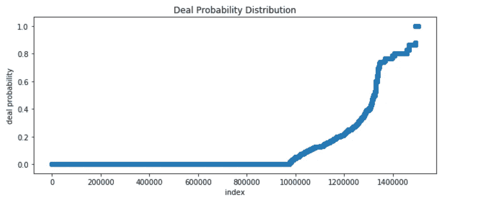
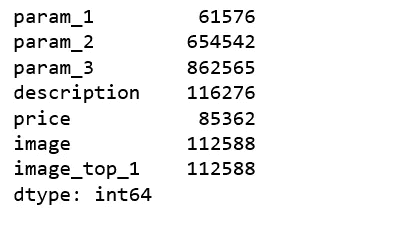
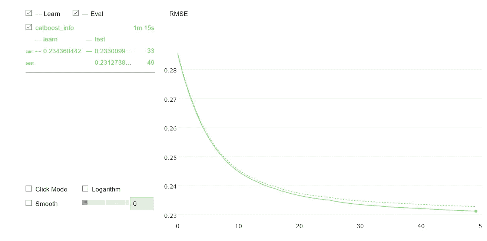
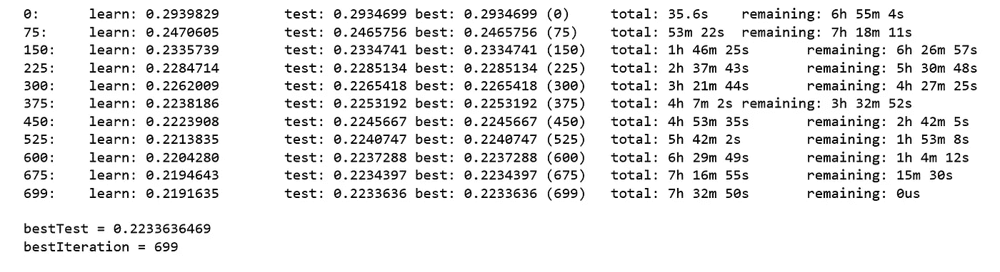
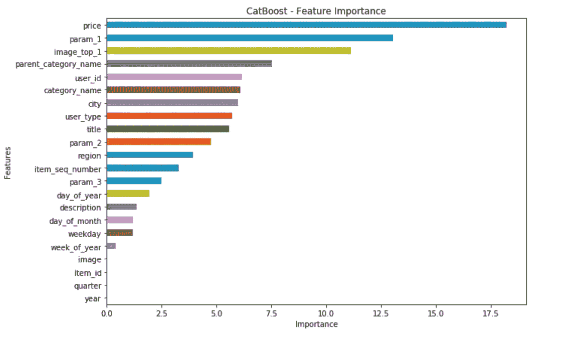
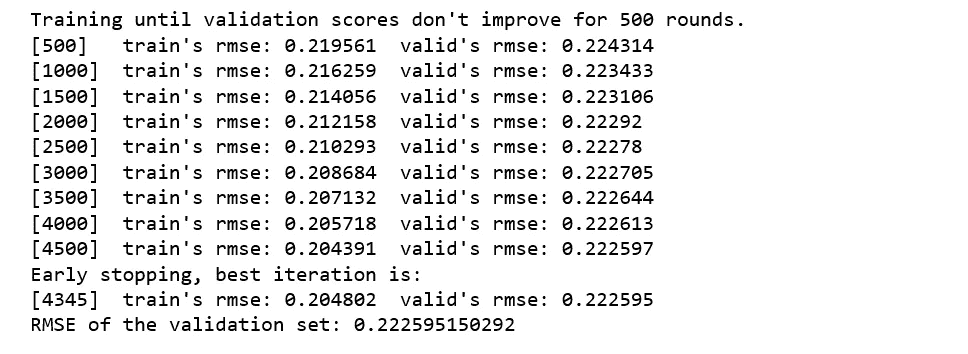
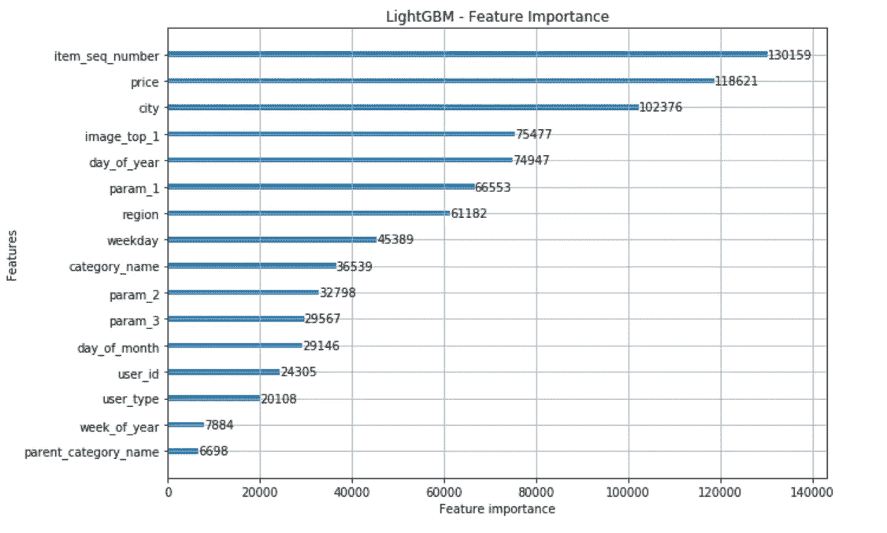

# 利用 Catboost 和 LightGBM 进行广告需求预测

> 原文：<https://towardsdatascience.com/ad-demand-forecast-with-catboost-lightgbm-819e5073cd3e?source=collection_archive---------11----------------------->


Photo credit: Pixabay

## 预测在线分类广告的需求，特征工程

Avito.ru 是一个俄罗斯分类广告网站，有出售一般商品、工作、房地产、个人、出售汽车和服务等板块。

它是俄罗斯最受欢迎的分类广告网站，也是仅次于 Craigslist 和中国网站 58.com 的世界第三大分类广告网站。2016 年 12 月，它的独立月访问量超过 3500 万。平均而言，Avito.ru 的用户每天发布超过 500，000 条新广告，整体广告约为 3，000 万个活跃列表。

我们希望帮助 Avito.ru 根据在线广告的特征(如类别、标题、图像、上下文(发布的地理位置)以及在类似上下文中对类似广告的历史需求)来预测对在线广告的需求。有了这些信息，Avito 可以通知卖家如何最好地优化他们的列表，并提供一些他们实际上应该期望收到多少兴趣的指示。

# 数据

训练数据包含以下特征:

*   `item_id` -广告 id。
*   `user_id` -用户 id。
*   `region`——公元地区。
*   `city` - Ad 城。
*   `parent_category_name`-Avito 广告模型分类的顶级广告类别。
*   `category_name`-Avito 广告模型分类的精细颗粒广告类别。
*   【Avito 广告模型的可选参数。
*   【Avito 广告模型的可选参数。
*   【Avito 广告模型的可选参数。
*   `title` -广告标题。
*   `description` -广告描述。
*   `price` -广告价格。
*   `item_seq_number` -用户的广告序列号。
*   `activation_date` -投放广告的日期。
*   `user_type` -用户类型。
*   `image` -图像的 Id 代码。绑定到 train_jpg 中的 jpg 文件。不是每个广告都有图像。
*   `image_top_1` - Avito 对图像的分类代码。
*   `deal_probability` -目标变量。这是一个广告实际卖出东西的可能性。这个特性的值可以是从零到一的任意浮点数。

```
df = pd.read_csv('train_avito.csv', parse_dates = ['activation_date'])
df.head()
```


Figure 1

由于`deal_probability`是我们的目标变量，我们想更详细地研究它。

```
import seaborn as sns
import matplotlib.pyplot as plt
pd.set_option('display.float_format', '{:.2f}'.format)
plt.figure(figsize = (10, 4))
n, bins, patches = plt.hist(df['deal_probability'], 100, facecolor='blue', alpha=0.75)
plt.xlabel('Ad price')
plt.xlim(0, 1)
plt.title('Histogram of deal probability')
plt.show();
```


Figure 2

```
plt.figure(figsize = (10, 4))
plt.scatter(range(df.shape[0]), np.sort(df['deal_probability'].values))
plt.xlabel('index')
plt.ylabel('deal probability')
plt.title("Deal Probability Distribution")
plt.show();
```



Figure 3

几乎一百万个广告的概率为 0，这意味着它没有卖出任何东西，很少有广告的概率为 1，这意味着它确实卖出了一些东西。其他广告的概率在 0 到 1 之间。

# CatBoost

由 [Yandex](https://research.yandex.com/) 研究人员和工程师开发的 CatBoost 是一种在决策树上使用梯度推进的机器学习算法。它是一个开源库。听了很多关于 CatBoost 的好东西，我们应该试一试。

## 特征工程

**缺失值**

以下是要素中缺失值的数量。

```
null_value_stats = df.isnull().sum()
null_value_stats[null_value_stats != 0]
```



Figure 4

我们决定用-999 来填充这些缺失值，通过从它们的分布中填充缺失值，模型将能够很容易地区分它们并将其考虑在内。

```
df.fillna(-999, inplace=True)
```

**日期时间特征**

在删除此列之前，我们使用原始的`activation_date`列创建了几个新的日期时间特性。

```
df['year'] = df['activation_date'].dt.year
df['day_of_year'] = df['activation_date'].dt.dayofyear
df['weekday'] = f['activation_date'].dt.weekday
df['week_of_year'] = df['activation_date'].dt.week
df['day_of_month'] = df['activation_date'].dt.day
df['quarter'] = df['activation_date'].dt.quarterdf.drop('activation_date', axis=1, inplace=True)
```

我们的特征有不同的类型——一些是数字的，一些是分类的，还有一些是文本的，比如`title`和`description`，我们可以把这些文本特征当作分类特征。

```
categorical = ['item_id', 'user_id', 'region', 'city', 'parent_category_name', 'category_name', 'param_1', 'param_2', 'param_3', 'title', 'description', 'item_seq_number', 'user_type', 'image', 'image_top_1']
```

我们不需要对分类特征进行编码。CatBoost 支持数字和分类特征。然而，我们确实需要确定分类特征指数。

```
X = df.drop('deal_probability', axis=1)
y = df.deal_probabilitydef column_index(df, query_cols):
    cols = df.columns.values
    sidx = np.argsort(cols)
    return sidx[np.searchsorted(cols, query_cols, sorter=sidx)]categorical_features_indices = column_index(X, categorical)
```

## CatBoost 模型训练

```
X_train, X_valid, y_train, y_valid = train_test_split(
    X, y, test_size=0.25, random_state=42)model=CatBoostRegressor(iterations=50, depth=3, learning_rate=0.1, loss_function='RMSE')
model.fit(X_train, y_train,cat_features=categorical_features_indices,eval_set=(X_valid, y_valid),plot=True);
```



Figure 6

一个基本模型给出了一个公平的解决方案，训练和测试误差几乎是同步的。我们将尝试调整模型参数和功能来改善结果。

## CatBoost 模型调整

*   `iterations`是解决机器学习问题时可以建立的最大树数。
*   `learning_rate`用于减少梯度步长。
*   `depth`是树的深度。使用 CPU 时，最大为 16 的任何整数。
*   我们用公制计算 RMSE。
*   `bagging_temperature`定义贝叶斯自举的设置，值越高，装袋越积极。我们不希望它太高。
*   我们将使用过拟合检测器，因此，如果发生过拟合，CatBoost 可以在训练参数指示之前停止训练。过拟合检测器的类型是“Iter”。
*   `metric_period`是计算目标和指标值的迭代频率。
*   `od_wait`，认为模型过拟合，从具有最优度量值的迭代开始，在指定的迭代次数(100)后停止训练。
*   `eval_set`是用于过拟合检测器、最佳迭代选择和监控指标变化的验证数据集。
*   `use_best_model=True`如果输入了一个验证集(定义了`eval_set`参数),并且该集中至少有一个对象的标签值与其他不同。

CatBoost.py



Figure 7

## CatBoost 功能重要性

```
fea_imp = pd.DataFrame({'imp': model.feature_importances_, 'col': X.columns})
fea_imp = fea_imp.sort_values(['imp', 'col'], ascending=[True, False]).iloc[-30:]
fea_imp.plot(kind='barh', x='col', y='imp', figsize=(10, 7), legend=None)
plt.title('CatBoost - Feature Importance')
plt.ylabel('Features')
plt.xlabel('Importance');
```



Figure 8

CatBoost 功能重要性排名的结果显示，属性“价格”对交易概率的影响最大。另一方面，日期时间特征对交易概率的影响很小。

# LightGBM

[LightGBM](https://lightgbm.readthedocs.io/en/latest/) 是一个基于决策树算法的快速、分布式、高性能梯度提升框架。它隶属于微软的 DMTK 项目。

我们将训练一个 [LightGBM](https://github.com/Microsoft/LightGBM) 模型来预测交易概率。我们将经历与训练 CatBoost 模型时相似的特征工程过程，此外，我们还将对分类特征进行编码。

## 特征工程

lightGBM_feature_engineering.py

将数据转换为 LightGBM 数据集格式。这是 LightGBM 培训的必修内容。

```
X_train, X_valid, y_train, y_valid = train_test_split(
    X, y, test_size=0.25, random_state=42)

# LightGBM dataset formatting 
lgtrain = lgb.Dataset(X_train, y_train,
                feature_name=feature_names,
                categorical_feature = categorical)
lgvalid = lgb.Dataset(X_valid, y_valid,
                feature_name=feature_names,
                categorical_feature = categorical)
```

## LightGBM 模型训练

*   `num_leaves`是控制树模型复杂度的主要参数。当试图调整`num_leaves`时，我们应该让它小于`2^(max_depth)` (225)。
*   我们使用`max_depth`来限制深树的生长。
*   为了更精确，我们用大的`num_iterations`代替小的`learning_rate`。
*   为了加快训练速度和处理过拟合，我们设置了`feature_fraction=0.6`，即在训练每棵树之前选择 60%的特征。
*   Set `verbosity = -1`，eval set 上的 eval metric 在每个详细增强阶段打印。
*   `early_stopping_rounds = 500`，模型将进行训练，直到验证分数停止提高。验证分数需要至少每 500 轮提高一次才能继续训练。
*   `verbose_eval = 500`，每 500 个升压阶段打印一个评估指标。

lightGBM_model_training.py



Figure 8

## LightGBM 功能重要性

```
fig, ax = plt.subplots(figsize=(10, 7))
lgb.plot_importance(lgb_clf, max_num_features=30, ax=ax)
plt.title("LightGBM - Feature Importance");
```



Figure 9

看到价格仍然处于最高水平并不奇怪。有趣的是，在 lightGBM 模型中,`item_seq_number`对交易概率的影响最大，但在 CatBoost 模型中，它仅是第 12 个特征。

今天就到这里， [Jupyter 笔记本](https://github.com/susanli2016/Machine-Learning-with-Python/blob/master/Ad%20Demand%20Forecast%20Avito.ipynb)可以在 [Github](https://github.com/susanli2016/Machine-Learning-with-Python/blob/master/Ad%20Demand%20Forecast%20Avito.ipynb) 上找到。新年快乐

参考:[卡格尔](https://www.kaggle.com/c/avito-demand-prediction)