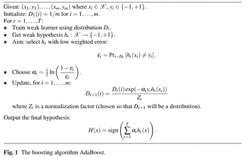
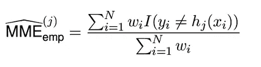
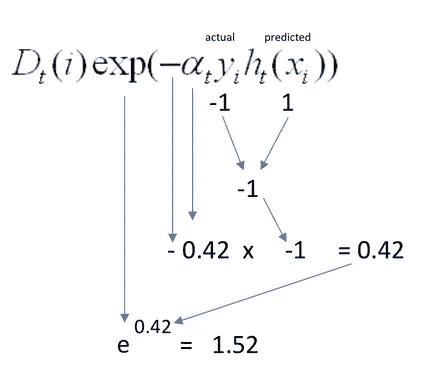

# 傻瓜 Adaboost:将数学(及其方程)分解成简单的术语

> 原文：<https://towardsdatascience.com/adaboost-for-dummies-breaking-down-the-math-and-its-equations-into-simple-terms-87f439757dcf?source=collection_archive---------2----------------------->

Learning machines is a long walk up the stairs. But we can shorten the path. (Photo by [Gabriel Izgi](https://unsplash.com/photos/cfQEO_1S0Rs?utm_source=unsplash&utm_medium=referral&utm_content=creditCopyText) on [Unsplash](https://unsplash.com/search/photos/ideas?utm_source=unsplash&utm_medium=referral&utm_content=creditCopyText))

Adaboost 是 Adaptive Boosting 的缩写，是一种机器学习方法，在概念上容易理解，但在数学上不太容易掌握。部分原因是由于方程和公式没有被分解成简单的术语，用基本的数学作为方程的演示。本文旨在通过 Adaboost 实现这一目标，将数据科学领域的新手作为主要目标受众。

有许多精彩的讲座、视频和论文有效而简洁地解释了 Adaboost 背后的概念。简而言之，这种想法是为分类器和数据点(样本)设置权重，迫使分类器专注于难以正确分类的观察值。该过程按顺序完成*，因为随着算法迭代的进行，在每一步都调整两个权重。这就是 Adaboost 被称为*顺序集成方法*的原因——集成是指一种结合几个模型以提高最终预测性能的学习类型。*

这一概念很容易理解，但是一旦我们试图更深入地理解支持这一概念的数学，我们就会面对许多具有类似景象的文章和讲座:

对于那些没有数学学术背景的人和/或非数学类型的人来说，随着最近的机器学习热潮，现在正在学习数据科学，光是符号就显得非常令人生畏。本文旨在通过分解符号和公式，并使用简单的数学来解释 Adaboost 的工作原理，从而消除混淆和恐惧。

# 基本术语

首先，让我们复习一些基本术语。

增强:结合许多弱(简单)学习者来创建高度准确的预测。

弱学习者:产生比随机猜测略好的预测的分类器。随机猜测相当于 50%，像抛硬币一样。熟悉信息论，尤其是香农熵概念的人对此会很熟悉。

假设:我们的分类器，也就是我们的机器学习算法用来逼近未知函数的函数，目标(真实)函数，它模拟输入值 x 和输出值 y 之间的关系。

Adaboost:第一个实用的 boosting 算法，由 Freund 和 Schapire (1995)发明。它基于 Vapnik 和 Chervonekis 的想法，即一个经过训练的分类器要在其预测中有效和准确，它应该满足以下三个条件:

1)应该在“足够”的训练样本上训练分类器

2)它应该通过产生低训练误差来提供对这些例子的良好拟合

3)它应该简单(因为简单的模型比过于复杂的模型更好)

# 解释 Adaboost，一步一步来

让我们回顾一下迭代公式，将每一步的每一个符号分解成一个粒度级别，以便于理解。

**1)** **给定(x1，y1)，…..，(x_m，y_m)其中 x_i ∈ X，y_i ∈ {-1，+1}**

*有用的符号*

∑:"元素"

{}:设置

*ex:* 如果 A = {1，2，3，7}，2 ∈ A

(x_1，y_1):第一个训练样本，(x_m，y_m) =第 m 个训练样本

既然我们已经记下了所有的符号，我们可以将公式的第一部分读作:

“给定包含 m 个样本的训练集，其中所有 X 个输入是总集 X 的元素，y 个输出是仅包含两个值的集的元素，-1(负类)和 1(正类)…”

**2)初始化:对于 i = 1，…，m，D1(I)= 1/m**

这里，D =样本的权重，i =第 I 个训练样本。在其他论文中，D 将被写成 w。因此，下一个语句是:

“…将样本的所有权重初始化为 1 除以训练样本数…”

**3)对于 t=1，…，T:**

*使用分布式 Dt 训练弱学习者。

*得到弱假设 h_t: X -> {-1，+1}

*目标:选择加权误差低的 h_t:

ε = Pr_i~Dt [h_t(xi)不等于 y_i]

*选择α_t = 1/2 * ln(1-ε / ε)

*更新，对于 i = 1，…，m:

Dt+1(I)= Dt(I)exp(-αt * y _ I * h _ t(x _ I)/Zt

*有用的符号*

Pr =概率

假设/分类器

ε =模型的最小错误分类误差

α =分类器的重量

exp =欧拉方程 e: 2.71828

Zt =归一化因子，用于确保权重代表真实分布

有了这些符号，我们可以阅读下一部分:

对于 t=1 到 T 个分类器，使其适合训练数据(其中每个预测为-1 或 1)，并选择加权分类错误最低的分类器

正式计算 **ε** 的公式如下:

让我们来分解这个特定的模型。

*有用的符号*

σ=总和

如果分类错误，y_i 不等于 h_j = 1，如果分类正确，y _ I 不等于 0

重量指数=重量

因此，公式为:“误差等于错误分类率的总和，其中训练样本 I 和 y_i 的权重不等于我们的预测 h_j(如果错误分类，则等于 1，如果正确分类，则等于 0)。”

让我们用简单的数学来理解这个公式。假设有 4 个不同的样本，权重分别为 0.5、0.2、0.1 和 0.04。想象一下，我们的分类器 h 预测值为 1，1，-1 和-1，但实际输出值 y 为-1，1，-1，1。

> 预测时间:1 1 月 1 日
> 
> 实际值:-1 1 -1 1
> 
> 重量:0.5 0.2 0.1 0.04
> 
> 1 或 0: 1 0 0 1

这导致错误分类率的以下计算:

> 误分类率/误差=(0.5 * 1+0.2 * 0+0.1 * 0+0.04 * 1)/(0.5+0.2+0.1+0.04)
> 
> 误差= 0.64285714285

接下来，通过公式 1/2 * ln(1- error / error)为分类器选择权重α。

在这里，简单的数学可能比语言解释得更清楚。例如，假设我们有 0.30，0.70，0.5 的误差。

我们的分类器权重计算如下:

> ε = 0.3
> 
> α = 1/2 * ln(1- 0.3 / 0.3) = 0.42365
> 
> ε = 0.7
> 
> α = 1/2 * ln(1- 0.7 / 0.7) = -0.42365
> 
> ε = 0.5
> 
> α = 1/2 * ln(1- 0.5 / 0.5) = 0

注意三个有趣的观察结果:1)准确度高于 50%的分类器导致该分类器的正权重(换句话说，如果ε < = 0.5) ，则 *α >为 0)，2)准确度为 50%的分类器为 0，因此对最终预测没有贡献，以及 3)误差 0.3 和 0.7 导致符号相反的分类器权重。*

现在是等式中非常重要的部分:更新每个样本的权重。我在上面提到过，更新的重点是迫使分类器专注于难以正确分类的观察值。这是通过在迭代后用增加的权重更新错误分类的案例来实现的。增加权重将使我们的学习算法在下一次迭代中更加关注这些观察结果。相反，在下一次迭代中，正确分类的案例将接收到降低的权重，并减少我们的分类器的注意力。

再一次，用简单的数字作为示范，信息吸收是没有痛苦的。让我们用上面 0.3 的误差率代入公式。请记住，我们正在寻找*低加权误差*。换句话说，我们不应该使用 0.5 及以上的错误率。在低错误率的情况下，让我们检查当案例被错误分类时和当案例被正确分类时会发生什么。

misclassified

correctly classified

现在你知道了！在不正确分类的情况下，exp 项变得大于 1，而在正确分类的情况下，exp 项变得小于 1。因此，不正确的分类将获得更高的权重，促使我们的分类器在下一次迭代中更加关注它们，而正确分类的相反情况将导致相反的结果。

我们继续这种迭代，直到 a)实现低训练误差，或者 b)已经添加了预设数量的弱学习者(这是在我们控制之下的参数)。然后，我们通过将每个分类器的加权预测相加得到最终预测。

## 摘要

我们已经看到了 Adaboost 是如何通过分解公式中的每一个符号在粒度级别上工作的。然后，我们应用简单的数学来理解公式的每个组成部分是如何工作的。这种通过分解的部分来处理公式的实践对于理解机器学习算法是一种有用的实践。