# Adam——深度学习优化的最新趋势。

> 原文：<https://towardsdatascience.com/adam-latest-trends-in-deep-learning-optimization-6be9a291375c?source=collection_archive---------1----------------------->

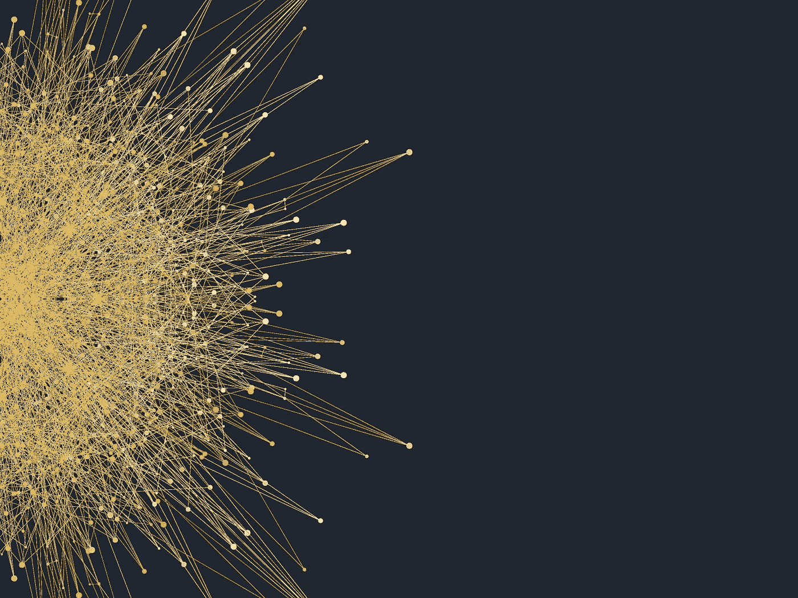

Adam [1]是一种自适应学习率优化算法，专门为训练深度神经网络而设计。Adam 于 2014 年首次发布，在深度学习实践者的一个非常著名的会议上亮相— [ICLR 2015](https://www.iclr.cc/archive/www/doku.php%3Fid=iclr2015:main.html) 。该论文包含一些非常有前途的图表，显示了在训练速度方面的巨大性能增益。然而，过了一段时间，人们开始注意到，在某些情况下，亚当实际上找到了比[随机梯度下降](/stochastic-gradient-descent-with-momentum-a84097641a5d)更差的解决方案。已经做了很多研究来解决亚当的问题。

该算法利用自适应学习速率方法的能力来为每个参数找到单独的学习速率。它还具有 Adagrad [10]和 RMSprop [11]的优点，Adagrad[10]在具有稀疏梯度的设置中工作得非常好，但在神经网络的非凸优化中很困难，rms prop[11]解决了 Adagrad 的一些问题，并且在在线设置中工作得非常好。根据[Andrej Karpathy](https://medium.com/@karpathy/a-peek-at-trends-in-machine-learning-ab8a1085a106)的文章《机器学习趋势一瞥】, Adam 的受欢迎程度呈指数增长。

在这篇文章中，我首先介绍了在原始论文中提出的 Adam 算法，然后介绍了围绕它的最新研究，展示了这些算法在某些领域不如经典 SGD 的一些潜在原因，并提供了几种解决方案，缩小了 SGD 和 Adam 之间的差距。

# 圣经》和《古兰经》传统中）亚当（人类第一人的名字

Adam 可以看作是 RMSprop 和带动量的随机梯度下降的组合。它使用平方梯度来缩放学习速率，如 RMSprop，并通过使用梯度的移动平均值而不是梯度本身来利用动量，如 SGD 使用动量。让我们仔细看看它是如何工作的。

Adam 是一种自适应学习率方法，这意味着它计算不同参数的个人学习率。它的名字来源于自适应[矩](https://en.wikipedia.org/wiki/Moment_(mathematics))估计，之所以这么叫是因为 Adam 使用梯度的一阶和二阶矩的估计来适应神经网络的每个权重的学习速率。现在，什么是瞬间？随机变量的 n 阶矩定义为该变量的[期望值](https://en.wikipedia.org/wiki/Expected_value)的 n 次方。更正式地说:

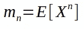

m — moment, X -random variable.

第一次理解这个想法可能相当困难，所以如果你不能完全理解，你仍然应该继续，你将能够理解算法是如何工作的。注意，神经网络成本函数的梯度可以被认为是随机变量，因为它通常在一些小的随机批数据上评估。一阶矩是均值，二阶矩是无中心方差(意思是我们在方差计算的时候不减去均值)。我们稍后会看到如何使用这些值，现在，我们必须决定如何得到它们。为了估计力矩，Adam 利用指数移动平均值，根据当前小批量评估的梯度进行计算:

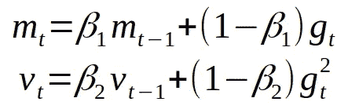

Moving averages of gradient and squared gradient.

其中，m 和 v 是移动平均值，g 是当前小批量的梯度，β是新引入的算法超参数。它们分别有非常好的默认值 0.9 和 0.999。几乎没有人会改变这些价值观。移动平均的向量在第一次迭代时被初始化为零。

要了解这些值如何与第一个等式中定义的时刻相关，让我们看看移动平均线的预期值。由于 m 和 v 是一阶矩和二阶矩的估计值，我们希望具有以下性质:

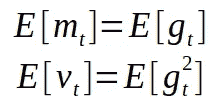

估计量的期望值应该等于我们试图估计的参数，碰巧的是，在我们的例子中，参数也是期望值。如果这些性质成立，这将意味着，我们有**无偏估计量**。(要了解更多关于不同估计量的统计特性，请参考伊恩·古德费勒的[深度学习书籍，第 5 章](http://www.deeplearningbook.org/contents/ml.html)关于机器学习基础知识)。现在，我们将看到这些对我们的移动平均线不成立。因为我们用零初始化平均值，所以估计量偏向于零。让我们证明对于 m(对于 v 的证明是类似的)。为了证明这一点，我们需要用公式计算 m 的第一个梯度。让我们尝试展开 m 的几个值，看看我们要使用的模式:

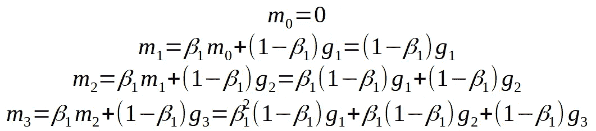

正如你所看到的，我们把 m 的值扩大得越多，梯度的第一个值对整体值的贡献就越小，因为它们会乘以越来越小的β。捕捉到这种模式，我们可以改写均线的公式:

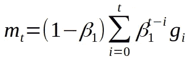

现在，让我们看看 m 的期望值，看看它与真正的一阶矩有什么关系，这样我们就可以校正两者的差异:

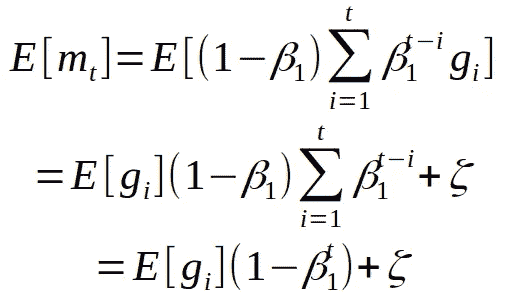

Bias correction for the first momentum estimator

在第一行中，我们使用移动平均的新公式来展开 m。接下来，我们用 g[t]来近似 g[i]。现在我们可以把它从 sum 中取出来，因为它现在不依赖于 I，因为正在进行逼近，所以误差 C 出现在公式中。在最后一行中，我们只使用了有限几何级数求和的公式。从这个等式中我们应该注意两件事。

1.  我们有偏倚的估计量。这不仅仅适用于 Adam，同样适用于算法，使用移动平均线(SGD with momentum，RMSprop 等)。).
2.  除非是训练的乞求，否则不会有太大的作用，因为β的 t 次方的值很快就趋向于零。

现在我们需要修正估计量，使期望值是我们想要的。这一步通常被称为偏差校正。我们的估计量的最终公式如下:

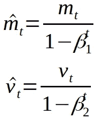

Bias corrected estimators for the first and second moments.

剩下要做的唯一事情就是使用这些移动平均值来分别衡量每个参数的学习率。在 Adam 中完成的方式非常简单，要执行权重更新，我们执行以下操作:

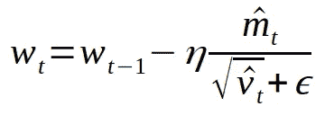

其中 w 是模型权重，eta(看起来像字母 n)是步长(它可以取决于迭代)。就这样，这就是亚当的更新规则。对于一些人来说，用代码来理解这些概念可能更容易，所以下面是 Adam 在 python 中的可能实现:

在 Adam 上有两个小的变化，我在实践中没有看到太多，但它们在主要的深度学习框架中实现了，所以有必要简要地提到它们。

第一个名为 **Adamax** 是 Adam 的作者在同一篇论文中介绍的。Adamax 的想法是将值 v 视为单个当前和过去梯度的 [L2 范数](https://en.wikipedia.org/wiki/Euclidean_distance)。我们可以将其推广到 Lp 更新规则，但对于 p 的大值，它会变得非常不稳定。但如果我们使用[L-无穷范数](https://en.wikipedia.org/wiki/Uniform_norm)的特例，它会产生一个令人惊讶的稳定且性能良好的算法。以下是如何用 python 实现 Adamax:

第二个有点难懂，叫做**那达慕**【6】。《那达慕》由蒂莫西·多扎特在《将内斯特罗夫的动力融入亚当》一文中发表。顾名思义，这个想法是用内斯特罗夫动量项来表示第一条移动平均线。让我们来看看 SGD 的更新规则:

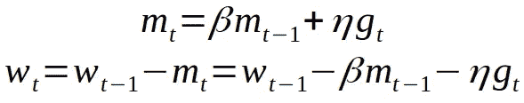

SGD with momentum update rule

如上图，更新规则相当于在动量向量方向上走一步，然后在梯度方向上走一步。但是动量步长不依赖于当前的梯度，所以在计算梯度之前，我们可以通过用动量步长更新参数来获得更高质量的梯度步长方向。为此，我们对更新进行了如下修改:

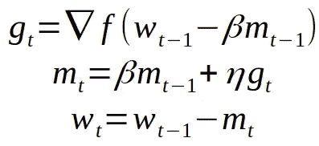

f — loss function to optimize.

所以，对于内斯特罗夫加速动量，我们首先在之前累积的梯度方向上做一个大的跳跃，然后测量我们结束的梯度，做一个修正。从 [cs231n 的课堂笔记](http://cs231n.github.io/neural-networks-3/)中可以看到一个很好的形象化的例子:

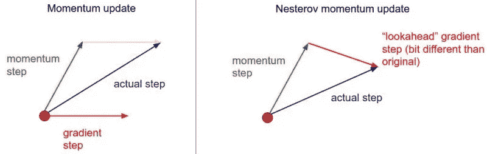

sourec: [cs231n lecture notes](http://cs231n.github.io/neural-networks-3/).

同样的方法可以纳入亚当，通过改变第一移动平均线到内斯特罗夫加速动量。这里可以应用一个计算技巧:代替更新参数以产生动量步长并再次变回来，我们可以通过仅应用时间步长 t + 1 的动量步长一次来实现相同的效果，在先前时间步长 t 而不是 t + 1 的更新期间。使用此技巧，Nadam 的实现可能如下所示:

# 亚当的属性

这里我列出了亚当的一些特性，为了证明这些特性是正确的，请参考这篇论文。

1.  Adam 在每次迭代中采用的实际步长近似受限于步长超参数。这一特性增加了对先前非直观学习率超参数的直观理解。
2.  Adam 更新规则的步长对于梯度的大小是不变的，这在穿过具有微小梯度的区域(例如鞍点或峡谷)时很有帮助。在这些领域，SGD 很难快速浏览。
3.  Adam 的设计结合了 Adagrad 和 RMSprop 的优点，前者适用于稀疏渐变，后者适用于在线设置。拥有这两者使我们能够将 Adam 用于更广泛的任务。Adam 也可以看做是 RMSprop 和 SGD 与 momentum 的结合。

# 亚当的问题

当亚当第一次被介绍时，人们对它的力量感到非常兴奋。论文中包含了一些非常乐观的图表，显示了在训练速度方面取得的巨大成绩:

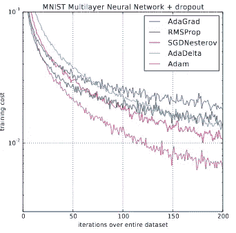

source: original Adam paper

然后，Nadam paper 展示了显示更好结果的图表:

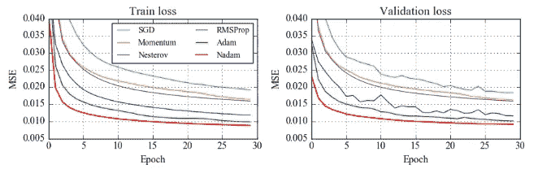

source: Nadam paper

然而，过了一段时间后，人们开始注意到，尽管训练时间很长，但 Adam 在一些领域并没有收敛到最优解，因此对于一些任务(如在流行的 [CIFAR 数据集](https://www.cs.toronto.edu/~kriz/cifar.html)上的图像分类)，最先进的结果仍然只能通过应用 SGD with momentum 来实现。不止是威尔逊等人。al [9]在他们的论文“自适应梯度方法在机器学习中的边际价值”中表明，当在一组不同的深度学习任务上进行测试时，自适应方法(如亚当或[阿达德尔塔](https://arxiv.org/abs/1212.5701))的泛化能力不如 SGD，这阻碍了人们使用流行的优化算法。自那以后，人们做了大量的研究来分析 Adam 的不良概括，试图让它缩小与 SGD 的差距。

Nitish Shirish Keskar 和 Richard Socher 在他们的论文“通过从 Adam 切换到 SGD 来提高泛化性能”[5]中也表明，通过在训练期间切换到 SGD，他们能够获得比单独使用 Adam 更好的泛化能力。他们提出了一个简单的解决方案，使用了一个非常简单的想法。他们已经注意到，在训练的早期阶段，亚当仍然比 SGD 表现更好，但后来学习饱和了。他们提出了一个简单的策略，他们称之为 **SWATS** ，其中他们开始用 Adam 训练深度神经网络，但当某些标准达到时，就切换到 SGD。他们成功取得了与 SGD 相当的成绩。

# 论亚当的收敛性

找出 Adam 的问题在于分析它的收敛性。作者在他们最初的论文中证明了 Adam 在凸集上收敛到全局最小值，然而，后来几篇论文发现他们的证明包含一些错误。Block et。al [7]声称他们在最初的收敛分析中发现了错误，但仍然证明了该算法收敛，并在他们的论文中提供了证明。谷歌员工最近的另一篇文章在 [ICLR 2018](https://iclr.cc/Conferences/2018/Schedule?type=Poster) 上发表，甚至获得了最佳论文奖。为了深入他们的论文，我应该首先描述 Adam 作者用来证明它收敛于凸函数的框架。

2003 年 Martin Zinkevich 介绍了在线凸规划问题[8]。在所呈现的设置中，我们有一系列凸函数 c1、c2 等(在深度学习优化的情况下，在第 I 个小批量中执行的损失函数)。在每个时间戳 t 中解决问题(Adam)的算法选择点 x[t](模型的参数)，然后接收当前时间戳的损失函数 c。这种设置转化为许多现实世界的问题，例如阅读论文的介绍。为了理解算法工作得有多好，T 轮后算法的后悔值定义如下:

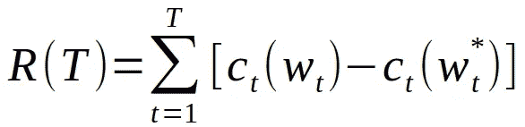

Regret of the algorithm in the online convex programming

其中 R 是遗憾，c 是关于第 t 个小批量的损失函数，w 是模型参数(权重)的向量，w 星是权重向量的最优值。我们的目标是证明算法的后悔是 R(T) = O(T)或更小，这意味着平均起来模型收敛到一个最优解。Martin Zinkevich 在他的论文中使用凸函数的性质证明了梯度下降在这种情况下收敛到最优解:

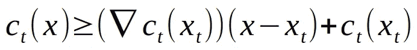

Well-known property of convex functions.

相同的方法和框架使用 Adam 作者来证明他们的算法收敛到最优解。Reddi 等人[3]在他们的证明中发现了几个错误，主要错误出现在 Adam 和 Improving Adam 的收敛证明论文中:

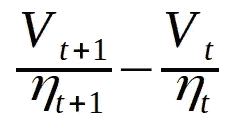

其中 V 被定义为一个抽象函数，它对每个算法不同的参数的学习速率进行缩放。对于 Adam，它是过去平方梯度的移动平均值，对于 Adagrad，它是所有过去和当前梯度的总和，对于 SGD，它只是 1。作者发现，为了证明有效，这个值必须是正的。很容易看出，对于 SGD 和 Adagrad，它总是正的，然而，对于 Adam(或 RMSprop)，V 的值可以出乎意料地起作用。他们还提出了一个亚当未能收敛的例子:

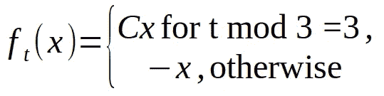

Adam fails on this sequence

对于这个序列，很容易看出最优解是 x = -1，然而，作者如何显示，亚当收敛到 x = 1 的高度次优值。该算法每 3 步获得一次大的梯度 C，而在另外 2 步中，它观察梯度-1，这使算法朝错误的方向移动。由于步长值通常会随着时间的推移而减小，因此他们提出了保持最大值 V 的解决方案，并使用它来代替移动平均值来更新参数。由此产生的算法被称为 **Amsgrad。**我们可以用[这个我创作的小本子](https://github.com/bushaev/adam/blob/master/AdamNonConvergence.ipynb)来证实他们的实验，它展示了不同的算法收敛于上面定义的函数序列。

Amsgrad without bias correction

它对现实世界数据的实际应用有多大帮助？可悲的是，我还没有看到一个案例比亚当更有助于获得更好的结果。在[的 Filip Korzeniowski 在他的帖子](https://fdlm.github.io/post/amsgrad/)中描述了 Amsgrad 的实验，该实验显示了与 Adam 相似的结果。西尔万·古格和杰瑞米·霍华德在他们的文章中显示，在他们的实验中，Amsgrad 实际上比亚当表现得更差。该论文的一些评论者还指出，问题可能不在于 Adam 本身，而在于我在上面描述的用于收敛分析的框架，该框架不允许太多的超参数调整。

# 亚当的体重下降

Ilya Loshchilov 和 Frank Hutter 的论文“修正 Adam 中的权重衰减正则化”[4]实际上对 Adam 有帮助。这篇论文包含了很多对亚当和体重衰减的贡献和见解。首先，他们表明，尽管普遍认为 [L2 正则化](https://en.wikipedia.org/wiki/Regularization_(mathematics))不同于[权重衰减](https://papers.nips.cc/paper/156-comparing-biases-for-minimal-network-construction-with-back-propagation.pdf)，尽管它对于随机梯度下降是等价的。1988 年引入重量衰减的方式是:

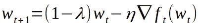

其中 lambda 是要调整的权重衰减超参数。我稍微改变了一下符号，以便和文章的其余部分保持一致。如上所述，当进行权重更新时，权重衰减应用于最后一步，惩罚大的权重。SGD 的传统实现方式是通过 L2 正则化，我们修改成本函数以包含权重向量的 L2 范数:

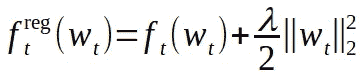

历史上，随机梯度下降方法继承了这种实现权重衰减正则化的方式，Adam 也是如此。然而，L2 正则化并不等同于亚当的权重衰减。当使用 L2 正则化时，我们用于大权重的罚值通过过去和当前平方梯度的移动平均来缩放，因此具有大的典型梯度幅度的权重通过比其他权重更小的相对量来正则化。相比之下，权重衰减通过相同的因子来调整所有权重。要对 Adam 使用权重衰减，我们需要修改更新规则，如下所示:

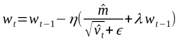

Adam update rule with weight decay

已经显示了这些类型的正则化对于 Adam 是不同的，作者继续显示了它们的工作情况。论文中的图表很好地显示了结果的差异:

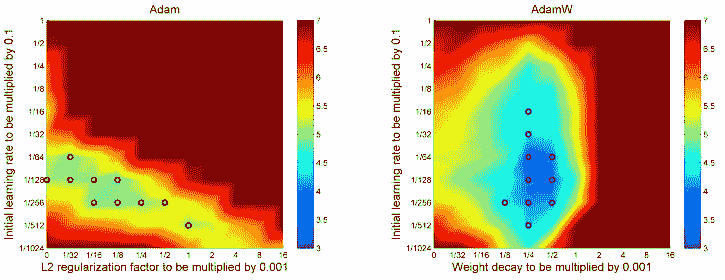

The Top-1 test error of ResNet on CIFAR-10 measured after 100 epochs

这些图表显示了学习率和正则化方法之间的关系。颜色代表这对超参数的测试误差的高低。正如我们在上面可以看到的，不仅 Adam 与重量衰减得到更低的测试误差，它实际上有助于解耦学习率和正则化超参数。在左图中，我们可以看到，如果我们改变参数，比如学习率，那么为了再次达到最佳点，我们还需要改变 L2 因子，这表明这两个参数是相互依赖的。这种依赖性导致超参数调整有时是一项非常困难的任务。在右图中，我们可以看到，只要我们保持在某个参数的最佳值范围内，我们就可以独立地改变另一个参数。

该论文作者的另一项贡献表明，用于权重衰减的最佳值实际上取决于训练期间的迭代次数。为了解决这个问题，他们提出了一个简单的自适应公式来设置重量衰减:

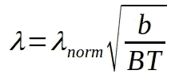

其中 B 是批量大小，B 是每个时期的训练点总数，T 是时期总数。这将使用新的 lambda 归一化参数来替换 lambda 超参数 lambda。

作者甚至没有就此停止，在修复体重衰减后，他们试图将学习率计划与新版 Adam 的[热重启](https://arxiv.org/abs/1608.03983)一起应用。热重启对随机梯度下降有很大帮助，我在我的帖子[中谈到了更多关于提高学习率的方法](https://techburst.io/improving-the-way-we-work-with-learning-rate-5e99554f163b)。但是之前亚当落后 SGD 很多。随着新的体重下降，亚当在重新开始时取得了更好的成绩，但仍然不如 SGDR。

# 第二代亚当

张等人提出了另一种修正亚当的尝试，这种尝试我在实践中并不多见。al 在他们的论文“规范化的方向保持亚当”[2]。这篇论文注意到了 Adam 的两个问题，这两个问题可能会导致更糟糕的概括:

1.  SGD 的更新存在于历史梯度的跨度中，而 Adam 则不是这样。在已经提到的论文[9]中也观察到了这种差异。
2.  第二，虽然 Adam 参数更新的幅度对于梯度的缩放是不变的，但是更新对同一整体网络函数的影响仍然随着参数的幅度而变化。

为了解决这些问题，作者提出了他们称之为规范化方向保持亚当的算法。算法以下列方式调整亚当。首先，不是估计每个单独参数的平均梯度幅度，而是估计梯度向量的平均平方 L2 范数。因为现在 V 是标量值，M 是与 W 方向相同的向量，所以更新的方向是 M 的负方向，因此在 W 的历史梯度的跨度内。对于第二种情况，在使用梯度之前，算法将其投影到单位球上，然后在更新之后，权重通过它们的范数被归一化。更多细节请关注他们的论文。

# 结论

Adam 绝对是深度学习的最佳优化算法之一，其受欢迎程度增长非常快。虽然人们已经注意到在某些领域使用 Adam 的一些问题，但研究人员仍在继续努力寻找解决方案，使 Adam 的结果与 SGD 的结果不相上下。

# 参考

1.  迪德里克·p·金马和吉米·巴雷。[亚当:一种随机优化的方法](https://arxiv.org/abs/1412.6980)。2014.arXiv:1412.6980v9
2.  张子君等人[归一化保向亚当](https://arxiv.org/pdf/1709.04546.pdf)。2017.arXiv:1709.04546v2
3.  [萨尚克·雷迪](https://openreview.net/profile?email=sashank%40google.com)，[萨延·卡莱](https://openreview.net/profile?email=satyenkale%40google.com)，[桑基夫·库马尔](https://openreview.net/profile?email=sanjivk%40google.com)。[论亚当的趋同与超越](https://openreview.net/forum?id=ryQu7f-RZ)。2018.
4.  [伊利亚·洛希洛夫](https://arxiv.org/search/cs?searchtype=author&query=Loshchilov%2C+I)，[弗兰克·赫特](https://arxiv.org/search/cs?searchtype=author&query=Hutter%2C+F)。[修正 Adam](https://arxiv.org/abs/1711.05101) 中的权重衰减正则化。2017.arXiv:1711.05101v2
5.  尼提什·希里什·凯斯卡尔，[理查德·索彻](https://arxiv.org/search/cs?searchtype=author&query=Socher%2C+R)。[通过从 Adam 切换到 SGD 来提高泛化性能](https://arxiv.org/abs/1712.07628)。2017 arXiv:1712.07628v1
6.  蒂莫西·多扎特。将内斯特罗夫的动力融入亚当。2016.
7.  [塞巴斯蒂安·博克](https://arxiv.org/search/cs?searchtype=author&query=Bock%2C+S)，[约瑟夫·戈波尔德](https://arxiv.org/search/cs?searchtype=author&query=Goppold%2C+J)，[马丁·韦奥](https://arxiv.org/search/cs?searchtype=author&query=Wei%C3%9F%2C+M)。[ADAM 优化器收敛证明的改进](https://arxiv.org/abs/1804.10587)。2018.arXiv:1804.10587v1
8.  马丁·津克维奇。[在线凸规划和广义无穷小梯度上升](http://www.cs.cmu.edu/~maz/publications/techconvex.pdf)。2003.
9.  [阿希娅·c·威尔逊](https://arxiv.org/search/stat?searchtype=author&query=Wilson%2C+A+C)，[丽贝卡·鲁洛夫斯](https://arxiv.org/search/stat?searchtype=author&query=Roelofs%2C+R)，[米切尔·斯特恩](https://arxiv.org/search/stat?searchtype=author&query=Stern%2C+M)，[内森·斯雷布罗](https://arxiv.org/search/stat?searchtype=author&query=Srebro%2C+N)，[本杰明·雷希特](https://arxiv.org/search/stat?searchtype=author&query=Recht%2C+B)。[机器学习中自适应梯度方法的边际价值](https://arxiv.org/abs/1705.08292)。2017.arXiv:1705.08292v2
10.  约翰·杜奇，埃拉德·哈赞，约拉姆·辛格。[在线学习和随机优化的自适应次梯度方法](http://www.jmlr.org/papers/volume12/duchi11a/duchi11a.pdf)。机器学习研究杂志，12:2121–2159，2011。
11.  提门·提勒曼和杰弗里·辛顿。讲座 6.5-rmsprop: [将梯度除以其最近震级的移动平均值](https://www.coursera.org/learn/neural-networks/lecture/YQHki/rmsprop-divide-the-gradient-by-a-running-average-of-its-recent-magnitude)。COURSERA:用于机器学习的神经网络，4(2):26–31，2012。