# 自适应元启发式智能粒子(AMI-P)

> 原文：<https://towardsdatascience.com/adaptive-meta-heuristically-intelligent-particle-ami-p-4badd123b3a2?source=collection_archive---------8----------------------->

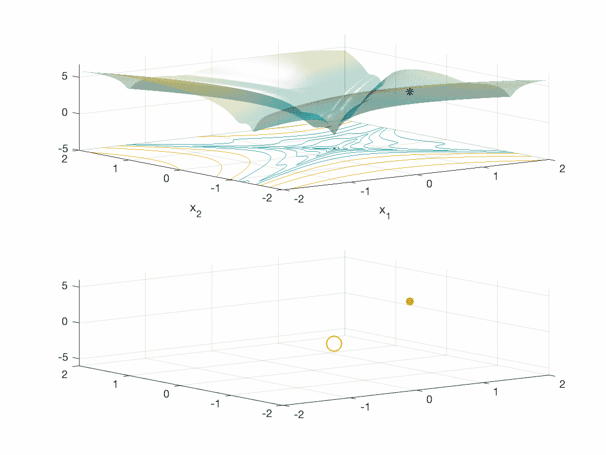

Red Stars — Track of best solutions. Blue Star — AMI-Particle

# **AMI 粒子**

*AMI-P 是我新发现的优化方法。AMI 粒子使用单个粒子迭代地搜索全局最优，该单个粒子智能地学习并适应凸和非凸 n 维搜索空间。*

如下所示，AMI-P 在单峰和多峰目标函数中都收敛到全局最优。这项研究部分是因为我发现了一个数学恒等式。这个恒等式通过在目标函数的可行搜索空间内请求自适应 n 维旋转，赋予了 *AMI* 粒子探索和开发的平衡。

*AMI* 粒子的一个独特但值得注意的特征是它不含*导数；因此，AMI-P 是无梯度的*。这允许 AMI 粒子在相对于维度的线性时间*中在更高维度中收敛。*动画性能*部分下面是 100，000- & 1，000，000 维单峰和多峰函数的性能结果。*

*下面显示的所有结果都是使用 Matlab 在 MacBook Pro 上运行 200 次后的最差性能。这些对于应用数学领域来说是非常有希望的结果。数学优化方法是* ***人工智能(神经网络)、力学、分子工程、土木工程、运筹学、地球物理学、控制工程、电气工程以及最后但并非最不重要的经济学和金融学中的关键因素。***

# 粒子动画表演

对于每个测试函数，使用 Matlab 生成二维动画性能图。动画显示了粒子*探索*搜索空间，同时保持*‘吸引’*到它学习*利用*的区域。

*粒子每次收敛到全局最优小于~ 0.1/s；然而，出于演示的目的，我放慢了动画 gif 的速度。*

动画图下方是针对*球体*、 *Rastrigin* 和 *Griewank* 函数的 100，000 维和 1，000，000 维测试中的 AMI-Particle 性能结果。

## **粒子-球函数**

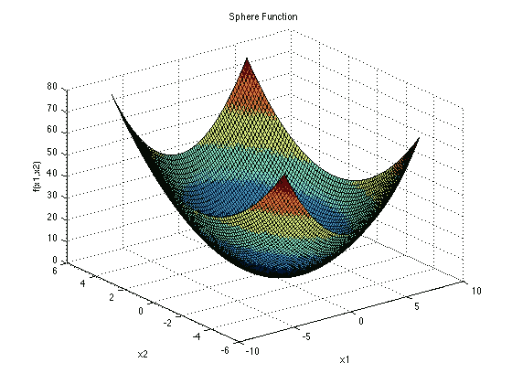

[https://www.sfu.ca/~ssurjano/griewank.html](https://www.sfu.ca/~ssurjano/griewank.html)

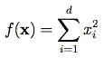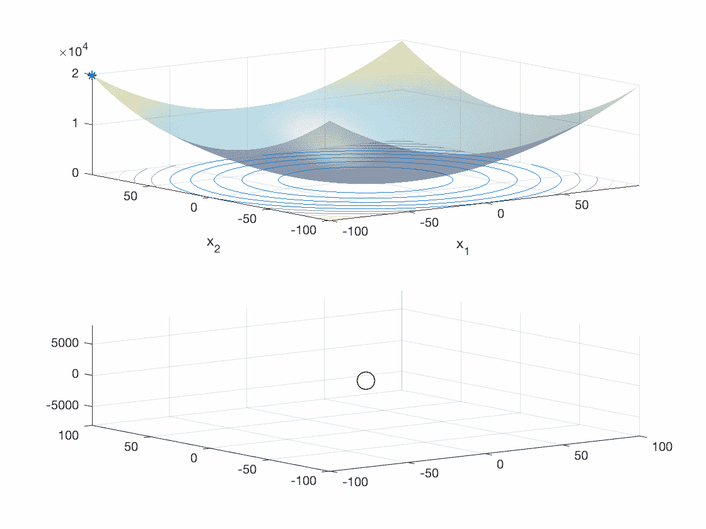

AMI Particle Sphere Test — 2-D where xi ∈ [-100, 100], for all i = 1, …, D (100 epochs)

## AMI 粒子— Rastrigin 函数

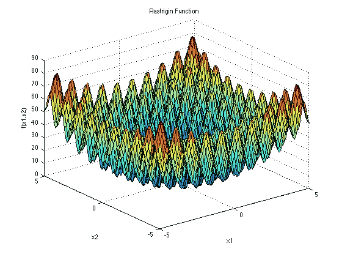

[https://www.sfu.ca/~ssurjano/rastr.html](https://www.sfu.ca/~ssurjano/rastr.html)

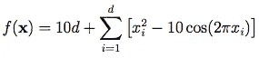

AMI Particle Rastrigin Test — 2-D where xi ∈ [-5.12, 5.12], for all i = 1, …, D (100 epochs)

## AMI-Particle — **格里万克函数**

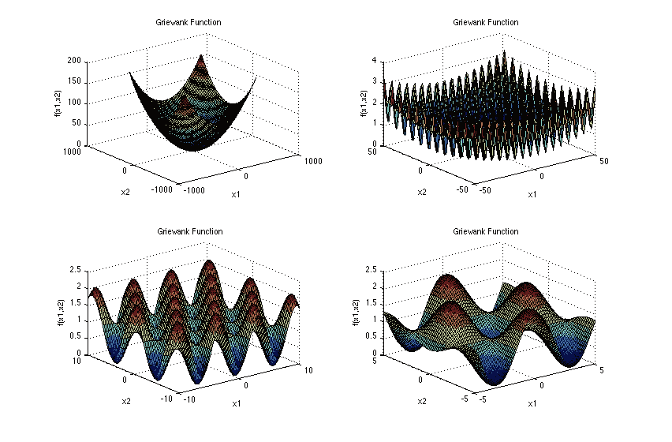

[https://www.sfu.ca/~ssurjano/griewank.html](https://www.sfu.ca/~ssurjano/griewank.html)

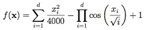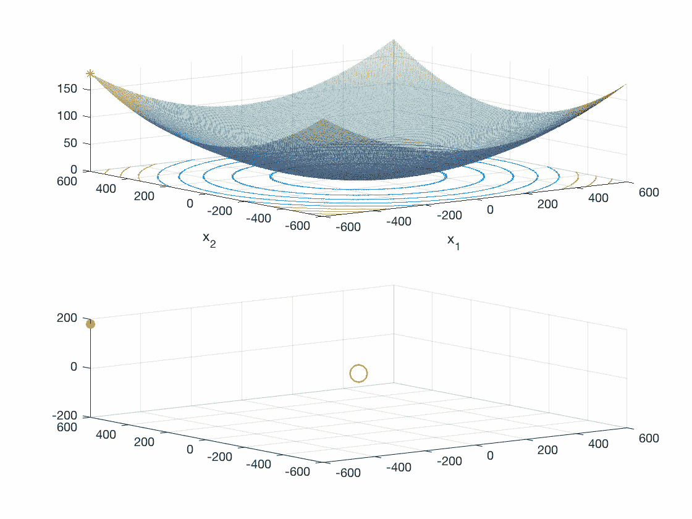

AMI Particle Griewank Test — 2-D where xi ∈ [-600, 600], for all i = 1, …, D (250 epochs)

## 粒子——戈尔茨坦价格函数

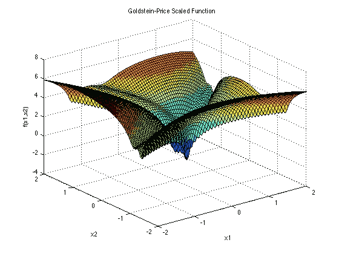

[https://www.sfu.ca/~ssurjano/goldpr.html](https://www.sfu.ca/~ssurjano/goldpr.html)

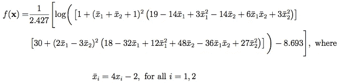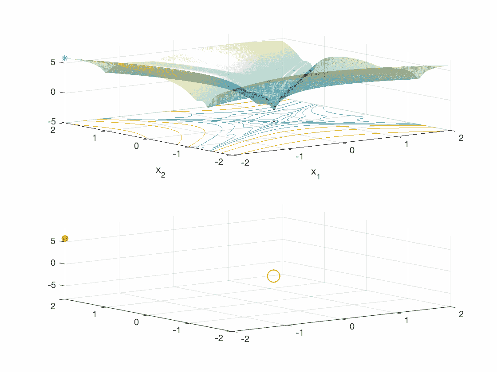

AMI Particle Goldstein-Price Test — 2-D where xi ∈ [-2, 2], for all i = 1, 2 (300 epochs)

# AMI 粒子——维度测试

## 10 万维收敛测试

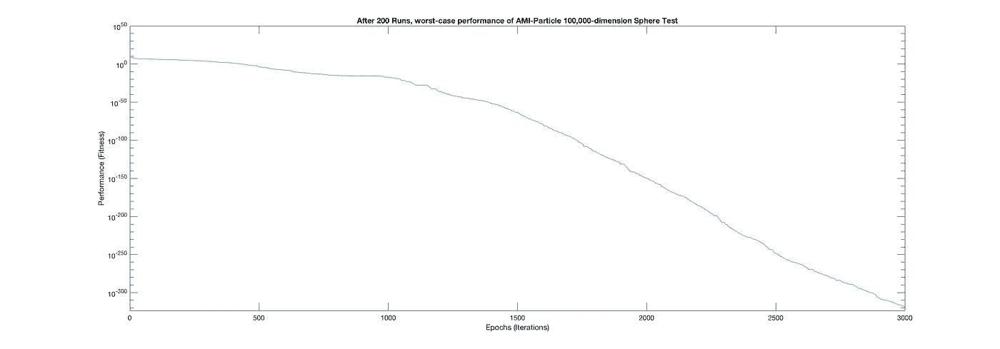

AMI-Particle 100,000-d Sphere Test — Worst-Case Performance Results of 200 Runs (~ 3/s)

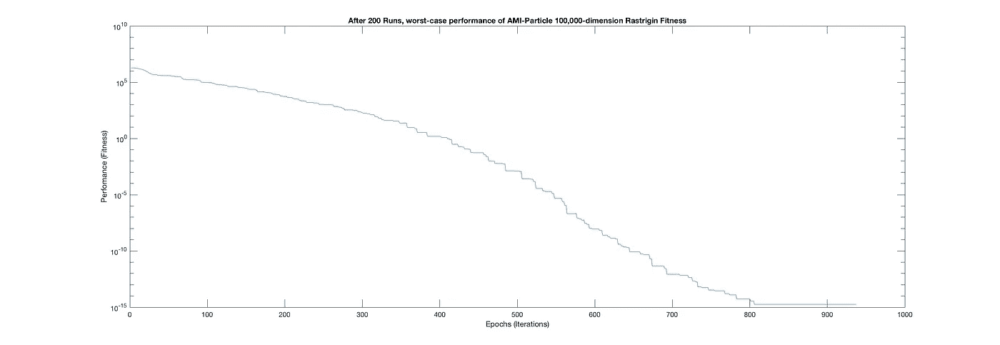

AMI-Particle 100,00-d Rastrigin Test — Worst-Case Performance Results of 200 Runs (~ 3/s)

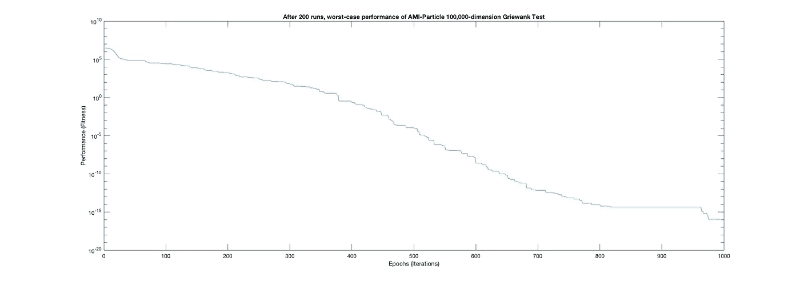

AMI-Particle 100,000-d Griewank Test — Worst-Case Performance Results of 200 Runs (~3/s)

## 1，000，000 维收敛测试

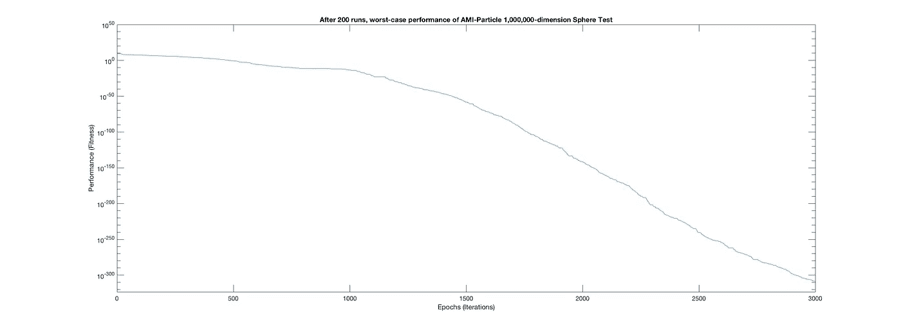

AMI-Particle 1,000,000-d Sphere Test — Worst-Case Performance Results of 200 Runs (~ 9/s)

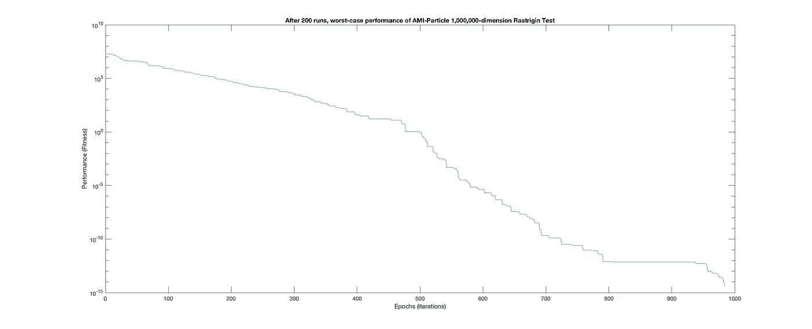

AMI-Particle 1,000,000-d Rastrigin Test — Worst-Case Performance Results of 200 Runs (~ 9/s)

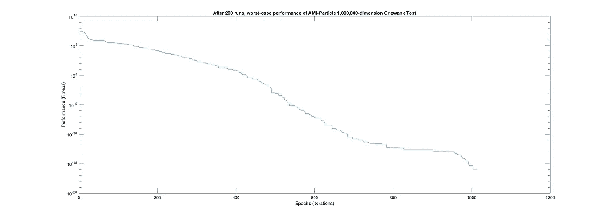

AMI-Particle 1,000,000-d Griewank Test — Worst-Case Performance Results of 200 Runs (~ 9/s)

# 下一步是什么？

随着使用不同的*数学优化*方法解决的过多现实世界问题的增加，*自适应元启发式智能粒子*方法的有希望的结果激励着我继续我的研究。我相信这种方法可以大幅提高性能，并减少*人工智能*和*深度学习中*神经网络*所需的计算资源。*