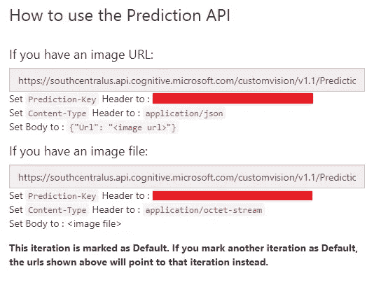
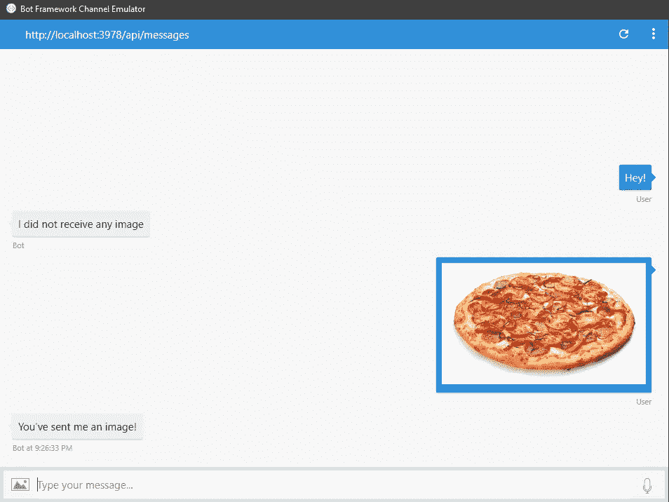
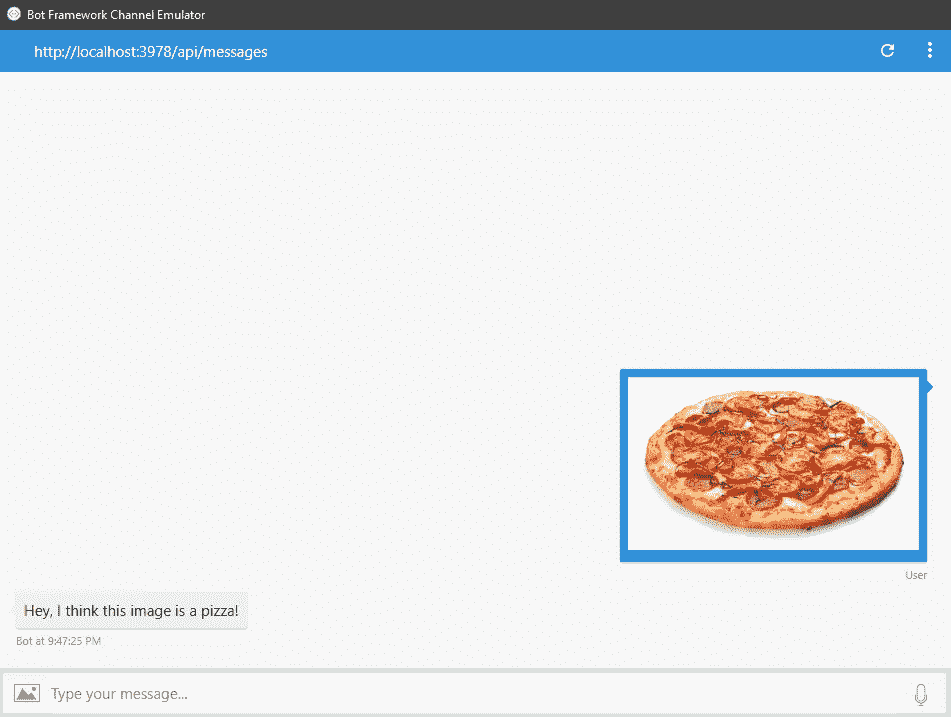

# 使用 CustomVision.ai 和 Microsoft bot Framework 为您的聊天机器人添加图像识别功能

> 原文：<https://towardsdatascience.com/add-image-recognition-to-your-chatbot-with-customvision-ai-and-microsoft-bot-framework-d0f8b30dba50?source=collection_archive---------6----------------------->

在我之前的博客文章中，我已经分享了关于[如何使用 CustomVision.ai](/how-to-create-a-custom-image-classifier-with-customvision-ai-fe3df6fd219b) 创建自定义图像分类器。一旦您能够使用自定义视觉创建图像分类器，您可能会尝试将图像分类器添加到您的应用程序中，如手机、网络或聊天机器人。

在本教程中，我将向你展示如何使用你的自定义视觉图像分类器，到你的使用 Node.js 的聊天机器人。

# 设置您的聊天机器人

我们要做的第一步是使用微软机器人框架创建我们的聊天机器人。

1.  为你的聊天机器人创建一个项目文件夹
2.  在您的终端中执行`npm init`来创建`package.json`
3.  安装将用于项目`npm i --save botbuilder restify`的节点模块
4.  在您的项目文件夹中创建一个`app.js`

在你的`app.js`文件中，添加我们聊天机器人工作所需的初始代码。

# 获取自定义视觉的预测 API 端点

下一步将是获得自定义视觉的预测 API 端点，我们稍后将用于我们的聊天机器人。(*注意:这里假设您已经在 Custom Vision* 中创建和训练了您的分类器)

1.  前往[https://www . custom vision . ai](https://www.customvision.ai)
2.  选择您已经创建或想要使用的项目
3.  转到“性能”选项卡
4.  点击“预测 URL”
5.  记下“图像文件”端点 URL 和“预测关键字”

# 使用自定义视觉的预测 API 到我们的聊天机器人

一旦您做好了一切准备，我们现在将使用来自自定义视觉的预测 API 到我们的聊天机器人。

## 让我们的聊天机器人读取图像附件

这里我们需要做的第一件事是通过编程使我们的聊天机器人能够读取来自用户的图像附件。

1.  在中创建一个`utils.js`文件，我们将在其中包含读取图像附件的实现
2.  运行`npm i needle --save`
3.  实现`utils.js`的代码

4.将`utils.js`代码导入`app.js`

5.向`bot.dialog()`添加一些测试代码，看看我们的聊天机器人现在是否可以确定它是否从用户那里接收到图像附件

现在你可以在你的 [Bot 框架模拟器](http://emulator.botframework.com)上测试它，它至少应该是这样的:

## 创建一个使用自定义视觉预测 API 的服务

既然我们的聊天机器人可以确定用户是否发送了图像附件，那么下一步就是将来自用户的图像附件发送到定制的视觉预测 API。

1.  在聊天机器人的项目文件夹中创建`customVisionService.js`文件
2.  运行`npm i request-promise --save`
3.  执行`customVisionService.js`的代码

4.导入并使用`customVisionService.js`到你的`app.js`

现在，您可以在您的 bot 框架模拟器上再次测试这一点，并尝试向您的 Bot 发送一个图像附件，看看它将如何工作。

非常简单明了，对吗？如果想看完整个项目做参考，可以查看 GitHub 库[这里](https://github.com/prtdomingo/BotFramework.CustomVision)。