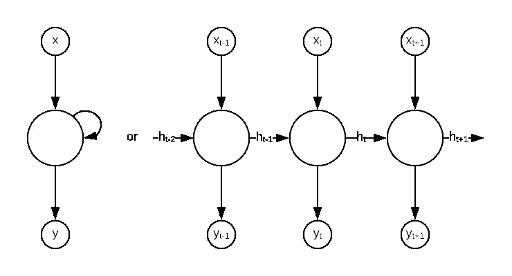
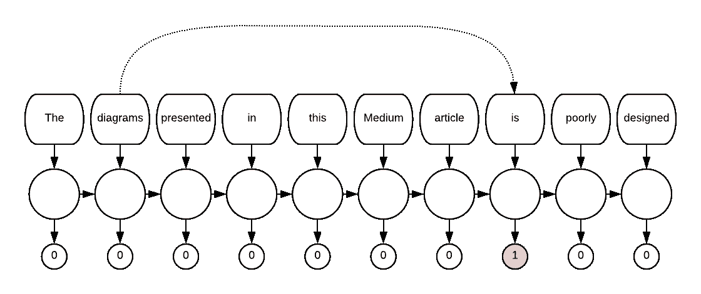

# AddressNet:如何使用递归神经网络构建一个健壮的街道地址解析器

> 原文：<https://towardsdatascience.com/addressnet-how-to-build-a-robust-street-address-parser-using-a-recurrent-neural-network-518d97b9aebd?source=collection_archive---------5----------------------->


Australian Postage stamps, image by author

街道地址是复杂的野兽；它们被设计成对我们人类来说是系统的和明确的，但对机器来说却是一场灾难。事实上，你将为谷歌的每 1000 次地址查询支付[5 美元，澳大利亚邮政将为你提供](https://developers.google.com/maps/billing/understanding-cost-of-use)[一批经过认证的“解决方案提供商”](https://auspost.com.au/business/marketing-and-communications/access-data-and-insights/address-data/address-validation)，同时还为那些预先分拣邮件并为其贴上条形码的人(即做艰苦工作的人)提供折扣。

维护结构化地址数据的价值超出了过去的邮资。将地址简化为地理坐标(地理编码)的能力可以为一些看似简单的问题提供答案，比如“我在哪里的销售额最高？”，但不需要太多的想象力就能看出如何从一个人的位置得出各种各样的关联，例如公共卫生部门的(我目前工作的行业)。

当然，从一开始就以结构化的方式收集这些信息是有意义的，但是如果您有一个手动输入且未经验证的地址记录的遗留数据集，该怎么办呢？如果你在 StackOverflow 上问…的[无辜的问题](https://stackoverflow.com/questions/2355597/java-parse-australian-street-addresses)

> 寻找一种快速而简单的方法将澳大利亚的街道地址解析成各个部分:
> `3A/45 Jindabyne Rd, Oakleigh, VIC 3166`

…您将很快被告知"[您将获得完全无用的数据](https://stackoverflow.com/a/2359806)"，然后您将看到一个类似于的[正则表达式:](https://stackoverflow.com/a/43840487)

```
(?P<Unit_Number>\d*)\s*[\/,\,]\s*(?P<Street_Number>\d*)\s*(?P<Street_Name>[a-zA-Z\s]*),?\s*(?P<State>NSW|ACT|NT|QLD|SA|TAS|VIC|WA)\s*(?P<Post_Code>\d{4})| (?P<street_number>\d*)\s*(?P<street_name>[a-zA-Z\s]*),?\s*(?P<state>NSW|ACT|NT|QLD|SA|TAS|VIC|WA)\s*(?P<post_code>\d{4})
```

对复杂和无情的正则表达式感到沮丧和悲伤，你会偷偷溜走，在 instagram 上查找#ferrets，因为这才是互联网的真正目的。

我是来告诉你不要难过的。我的意思是，观察雪貂；毕竟他们很可爱…我不想剥夺你的可爱。但是一旦你完成了，回来。我将向您展示如何构建自己的地址解析机器。

遵循传统的神经网络命名法[Thing]+Net 的 address Net 是一个漂亮的模型，它通过给地址的位标上[22 个可能组成部分](https://github.com/jasonrig/address-net/blob/master/README.md#model-output)中的任何一个来整理它们，并且基于[GNAF 数据库](https://data.gov.au/dataset/geocoded-national-address-file-g-naf)。这是我在 TensorFlow 上花了大约一周时间研究的成果(也让我自己从机器学习的间隙中解脱出来)——我确信一个更有才华的人可以在更短的时间内完成这个(现在的孩子们)。

**TL；dr:如果你想要一个 Python API 来分割你的澳大利亚街道地址，试试吧。**

```
>>> from addressnet.predict import predict_one
>>> print(predict_one("3A/45 Jindabyne Rd, Oakleigh, VIC 3166"))
{'flat_number': '3', 'flat_number_suffix': 'A', 'number_first': '45', 'street_name': 'JINDABYNE', 'street_type': 'ROAD', 'locality_name': 'OAKLEIGH', 'state': 'VICTORIA', 'postcode': '3166'}
```

嘣。

那么这个诡计是如何运作的呢？很抱歉，我不能公正地对待这个理论；许多比我更聪明的人在这些话题上写了很多。因此，我将从较高的层面解释 AddressNet 中使用的过程，并链接到我最喜欢的作者，他们优雅的解释不值得在此复制。

**address net 模型的核心是一个递归神经网络** (RNN)，它们非常擅长模拟序列数据(在这种情况下，是一系列字母)。这种神经网络通常用图表表示为:



A typical representation of RNNs (left and right are equivalent)

在上图中， *x* 是输入数据序列中的一项， *y* 是某个目标的估计或输出。左边的环形箭头，以及右边同样标有“ *h* ”的水平箭头，代表一种“隐藏状态”每个输入都有下标( *t* -1、 *t* 、 *t* +1 等)。)指示特定序列元素起源的点，这通常被称为“时间步长”(尽管这通常不是字面意义上的时间，而是通过元素的“定向行进”)。中间的大 ol’圆形斑点包含产生 *y* s 和 *h* s 的所有矩阵运算，但是一定要注意每个斑点都是*相同的*；完全相同的内部参数被应用于每个输入的 *h* 和 *x* ，从而使它们*重复*。

【推荐阅读:[递归神经网络的不合理有效性](http://karpathy.github.io/2015/05/21/rnn-effectiveness/)

RNNs 的工作方式可以简单地解释如下:对于序列中的每一项数据，使用前一步的隐藏状态以某种方式对其进行转换，以估计目标输出，同时更新隐藏状态以移交给下一步。这种神秘的隐藏状态可以被认为是“扫描序列时收集的知识”，它的功能是一种记忆。RNN 体系结构的许多变体都围绕着如何管理隐藏状态，最常见的类型是 LSTM 和 GRU 类型的 rnn(address net 使用 GRU 类型的 RNN)。

【推荐阅读:[了解 LSTM 网络](http://colah.github.io/posts/2015-08-Understanding-LSTMs/)；[了解 GRU 网络](/understanding-gru-networks-2ef37df6c9be)

能够将序列中较早的信息向前传递是 RNNs 的关键优势。例如，在自然语言处理中，诸如复数和性别之类的语法概念以及相应的词的变化经常是远距离链接的。想象一下，一个 RNN 被设计用来识别不恰当的动词形式；一个简单的语法检查器，如果你愿意:



A hypothetical NLP RNN to detect grammar issues. Long distance dependencies highlight the importance of “memory”

每个 *x* 代表句子的一个单词，如果没有错误，每个 *y* 产生 0，如果有错误，产生 1。这里，动词“is”实际上应该是“are ”,因为名词“diagrams”是复数。保留先前元素的一些记忆的能力允许这个假设的网络生成被框定为“*的结果鉴于我到目前为止所看到的*，当前元素是错误的概率是多少？”

RNN 可以扩展为多层(每一步的输出作为另一个 RNN 的输入输入)，它们也可以与一个等效的 RNN 配对，其中水平箭头处于相反的方向，向后传递隐藏状态，有效地查看“未来”以了解“过去”后者被称为双向 RNN。

【推荐阅读:[双向递归神经网络](https://ieeexplore.ieee.org/abstract/document/650093) / [PDF](https://maxwell.ict.griffith.edu.au/spl/publications/papers/ieeesp97_schuster.pdf)

AddressNet 基于每个字符使用多层双向 RNN。双向性是特别重要的:考虑一下地址“10 24–26 高街路，芒特韦弗利”给每个角色分配一个类别，而对于第一个角色来说，仅仅向前看几乎是不可能的！*是的*，可能单位/平号是最常出现的第一个字，*可能*整体来说单位比单机多，所以我们*可能*统计上有机会，但真的只是瞎猜。类似地，在没有任何预见未来的能力的情况下，“街道”很可能是指街道的类型…但是当我们遇到“道路”时，才发现我们犯了一个错误，这个名称实际上是“道路”类型的“高街”在 AddressNet 实现中，与上面的图表不同的一点是，AddressNet RNN 的输出不是直接的预测，而是向前和向后传递连接在一起，并通过最终的“完全连接”神经网络-这些是标准的教科书网络，在谷歌图像搜索中排名第一。如果你想了解这个网络的具体实现，请查看这部分代码。

**但是人物首先是怎么表现出来的呢？**什么*是*的‘A’？我们如何将字母“A”塞进这个神奇的数学包中呢？在神经网络中有两种主要的方法可以表示文本数据:“一键”向量方法和密集的“嵌入向量”方法。前者由一个和我们的词汇一样长的向量组成(可以是一系列单词、字符，甚至是表情符号🤷‍♀️),在对应于我们的字典中的项目的索引处包含“1 ”,在其他地方包含“0 ”,而嵌入向量方法是通过任意长(但通常比词汇表短得多)的向量来实现的，该向量具有由模型学习的参数；也就是说，即使是表象本身也随着我们的训练而优化。历史上，嵌入向量已经被用于[导出语义单词关系](https://arxiv.org/abs/1711.00331)，但是这里我只是将它们用于降维(并且我通常喜欢优化输入参数的想法)。AddressNet 使用嵌入方法，每个字符有八个单位的短向量。

【推荐阅读: [TensorFlow docs](https://www.tensorflow.org/guide/embedding) ，以及任何关于单词嵌入的东西(例如米科洛夫[的 word2vec 论文](https://papers.nips.cc/paper/5021-distributed-representations-of-words-and-phrases-and-their-compositionality.pdf))】

**我们来谈谈训练数据。**唉，我过去没有——现在也没有——任何标记过的、精选过的真实地址数据。相反，我的方法是综合生成尽可能多的随机排列(在某些情况下几乎无法理解),这些排列仍然在合理的范围内。有[代码](https://github.com/jasonrig/address-net/blob/2e17b38b2fbf0de08aeb51cce7de6dc824301438/addressnet/dataset.py#L238)的大杂烩，可以被破译以理解我屠杀 GNAF 数据集的精确方式，但本质上代码为 GNAF 数据集中的每条记录做出以下决定:

1.  保留还是放弃郊区？
2.  保持还是放弃状态？
3.  缩写州名？(例如将“维多利亚”改为“维克”)
4.  保留还是删除邮政编码？
5.  保留还是放弃街道号码？
6.  简称街道类型？(例如将“道路”改为“道路”)
7.  保留还是删除单位类型？
8.  把等级数转换成序数或基数词？(例如，将“1”更改为“1st”或“first”)

然后，这些组件以一种特殊的方式被打乱(例如，将州和邮政编码之类的东西放在靠近末尾的地方)，然后每个组件都[受到一些随机破坏](https://github.com/jasonrig/address-net/blob/2e17b38b2fbf0de08aeb51cce7de6dc824301438/addressnet/typo.py#L45)，这有点像人类可能犯的错别字。错别字包括:

1.  字符替换(使用键盘上邻近的字符)
2.  删除
3.  调换
4.  复制

最后，使用一些随机分隔符将每个组件缝合在一起。这些可能是空格、破折号、斜线或句号(取决于地址的部分)。

但是为什么呢？有两个原因:首先，这些很可能会在现实世界中发生，模型应该足够健壮来处理这些。其次，这种额外的噪声旨在作为一种正则化的形式，正则化是一个术语，指的是降低模型过度拟合可能性的方法。

正确地改变和破坏数据是当务之急！在开发这个模型的时候，我敏锐地意识到我没有测试数据；我无法通过*先验*的方式知道这个模型在现实世界中的表现如何。理想情况下，我会有一个从手动输入的地址完全标记的测试集，但我只是一个人在业余项目工作。因此，对我来说，关键是要确保输入数据中有如此多的可变性，以至于模型复杂性不能开始“学习噪音”训练有素的模型的经验表明，我击中了目标，但我会喜欢你，读者，给它一个机会，让我知道它如何进行。我知道，我知道，没有测试数据是我的耻辱😔。

**准备好试试了吗？**我敢肯定你说是。只是皮普安装它，看看你怎么想:[https://github.com/jasonrig/address-net](https://github.com/jasonrig/address-net)

欢迎投稿、反馈、指正和建议。如果你在自己的项目中使用 AddressNet，或者对其进行修改，请告诉我。希望您的地址数据永远不需要正则表达式。🙏