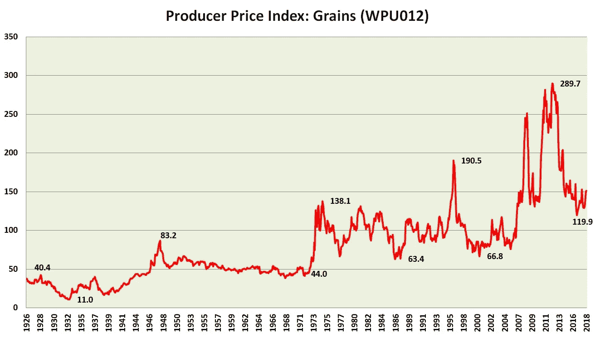
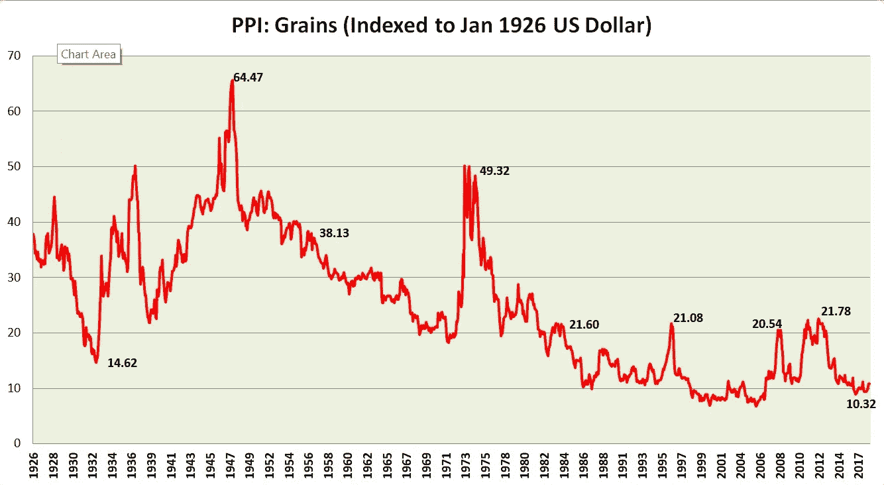
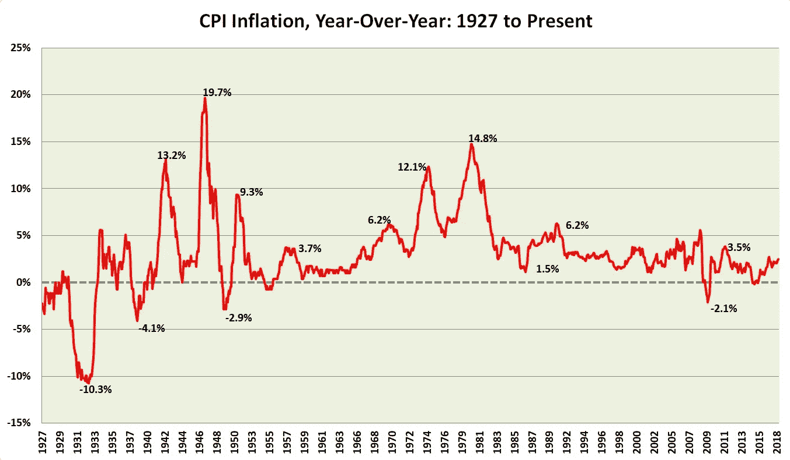

# 调整 Python 与熊猫合并的价格以适应通货膨胀

> 原文：<https://towardsdatascience.com/adjusting-prices-for-inflation-in-pandas-daaaa782cd89?source=collection_archive---------5----------------------->

几年来，我管理着一家小型初创投资基金。虽然华尔街分析师在分析公司时通常只回顾一两年，但我经常会追溯到 20 年或 30 年前。我甚至会偶尔翻阅上世纪 50 年代、20 年代或罕见的 19 世纪的经济和价格数据，以便更好地理解市场周期。然而，当你进行这种深度长期历史分析时，你会遇到一个问题: ***名义价格可能非常具有欺骗性*** 。

以谷物价格为例。我们有[谷物生产者价格指数](https://fred.stlouisfed.org/series/WPU012)追溯到 1926 年 1 月，当时该指数在 20 世纪 20 年代的繁荣时期为 37.9。2018 年 4 月，同一指数为 151.5。因此，在 92 年的时间框架内，谷物价格上涨了 4 倍。如果我们从 1933 年大萧条的底部开始衡量(当时指数为 11.0)，价格已经上涨了 15 倍！



这是一张非常容易误导人的图片，仅仅从上面的图表很难看出这一点。一旦我们对通货膨胀进行调整，我们就会得到下面这张看起来完全不同的图表。



随着时间的推移，谷物价格不仅没有上涨，实际上还在下跌。经 CPI 通胀调整后，如今的谷物价格比 1926 年低了 71%。今天的价格甚至比大萧条时期的低点低 24%。

随着时间的推移，谷物变得越来越便宜，实际农产品价格的下降缓解了世界大部分地区的贫困状况。你可能从来没有通过简单地看顶部图表中的名义价格而获得这种洞察力。你必须根据通胀进行调整，才能获得这种视角。

美国的通货膨胀

在过去的一个世纪里，美国的通货膨胀出现了戏剧性的循环。在第二次世界大战中，通货膨胀率飙升至 10.5%。到 1953 年，通货膨胀率一路下降到 0.8%。1980 年，通货膨胀率高达 13.5%，之后美联储对其进行了打击。2005 年，官方 CPI 通胀率为 3.4%，但美国最大的 20 个大都市区的房价却上涨了 14%！2017 年，通胀相对温和，为 2.0%(但随着劳动力和投入成本继续上升，通胀开始再次回升)。



通货膨胀调整让你对实际价格有更好的理解。这个分析可以很有见地。事实上，我最成功的投资论文之一围绕着考察日本资产泡沫期间经通胀调整的铜价，并将其与 2000 年代末/2000 年代初的铜价泡沫进行比较。

然而，如果你在一个[熊猫数据框架](https://pandas.pydata.org/pandas-docs/stable/generated/pandas.DataFrame.html)中工作，通货膨胀调整在 Python 中似乎是一个棘手的问题。您可能有数千行“数据点”,其日期分散在数据框的整个范围内。然而，通货膨胀数据往往是连续月度数据的形式。你如何将两者联系起来？

**寻找你的消息来源**

首先要说的是来源。你用什么数据来调整通货膨胀？你在哪里找到通货膨胀的数据？

并不总是有一个“正确”的答案，但是如果你住在美国或者正在处理美国的价格数据，那么[美联储经济数据](https://fred.stlouisfed.org/)(通常缩写为“FRED”)应该是你的首选来源之一。有几十种通货膨胀衡量方法，但我最常用的一种叫做“ [CPIAUCNS](https://fred.stlouisfed.org/series/CPIAUCNS) ”。这个通胀数据集可以一直追溯到 1913 年，这就是为什么它往往是我最喜欢的长期分析。

还有许多其他数据集。例如，如果你正在查看明尼阿波利斯的房价数据，你可能更喜欢查看房价指数，如[全交易房价指数](https://fred.stlouisfed.org/series/ATNHPIUS33460Q)或 [Case-Shiller 明尼阿波利斯房价指数](https://fred.stlouisfed.org/series/MNXRSA)。然而，通常情况下，CPI 的某个变量就是你要用的指数。

**设置您的索引**

CPI 通胀指数和房价指数已经以某种方式进行了指数化，但是你可能需要重新对数据进行指数化以适应你自己的目的。例如，如果您的通货膨胀数据在 1982 年 1 月的指数为 100，而您的数据集处理的是 2004 年到 2017 年的数据，您可能希望根据 2004 年的价格(开始)或 2017 年的价格(结束)来索引您的数据。

我们可以用 Excel 或者 Python 来做这个。诚然，我发现在 Excel 中调整数据通常更容易，但如果我们有一个特别大的数据集，Python 可能是一个更好的选择。

在 Python 中，我们可以通过加载通胀数据并为“指数乘数”创建一个新列来实现这一点。然后，我们只需将名义价格乘以“指数乘数”。

```
# load inflation data
inflation = pd.read_excel(‘inflation_data.xls’, sheetname=’Data’)# create index multiplier
inflation[‘CPI_Multiplier’] = inflation[‘CPI’].iloc[-1] / inflation[‘CPI’]
```

注意在这个例子中，我使用最后一个数据值来创建指数，因此价格将被索引到今天的价格。如果我们使用第一个数据点基于开始的起始点进行索引，我们将选择第一个值而不是最后一个值。

现在我们有了一个调整价格的指数。我们需要合并两个数据集来执行操作。

**匹配日期**

然而，在我们合并之前，我们必须处理这个练习中最棘手的部分:日期。日期可能是编程中的一大难题。有几种方法可以处理它们。

在最近的数据集中，我发现月份和年份在不同的列中，如下例所示。

```
Month Year
01    2008
04    2012
09    2016
```

同时，我的通货膨胀数据上的日期被识别为 yyyy/mm/dd 格式，如下所示:

```
Date          CPI_Multiplier
2008/01/01    1.000
2008/02/01    1.003
2008/03/01    1.005
2008/04/01    1.011
```

两者如何对齐？

答案有很多，但我创建了一个“日”列，并将其赋值为 1(以匹配通货膨胀数据中的日期)，并使用 [pd.to_datetime](https://pandas.pydata.org/pandas-docs/stable/generated/pandas.to_datetime.html) 在原始数据集中创建一个“日期”列。

```
# load data set
df = pd.read_excel('training_data.xlsx')# create new day column for 'day'
df['day'] = 1#create new dataframe to store date info
new_df = df[['year', 'month', 'day']]# create new column 'Date' in original data w/ datetime conversion
df['Date'] = pd.to_datetime(new_df)
```

在 Pandas 中，pd.to_datetime()是一个强大的工具，但是您必须让您的数据恰到好处地工作。

**合并数据**

最后，我们加载膨胀数据，并使用 [pd.merge](https://pandas.pydata.org/pandas-docs/stable/generated/pandas.DataFrame.merge.html) 来合并两个数据帧。“how”参数指定联接的类型。在这种情况下，我将“df”(我的主数据集)设置为第一个参数，将“inflation”(通货膨胀数据)设置为第二个参数，并使用“left”连接在“Date”进行合并。

```
# merge dataframe
df = pd.merge(df, inflation, how='left', on='Date')
```

现在，有了合并的数据框架，创建索引就很容易了。

```
df[‘CPIAdjPrice’] = df[‘SalePrice’] * df[‘CPI_Multiplier’] 
```

维奥拉。我们现在可以看到实际价格了！

**结论**

在长期数据序列中，通货膨胀调整对理解数据至关重要。通过使用名义价格，它也可以使预测变得更加棘手。

通货膨胀调整可以用于观察商品价格或零售价格，但也可以与住房价格指数一起使用，以调整动荡市场中的住房价格。这样，我们可以将“市场波动”和“通货膨胀”作为预测模型的一部分。