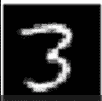
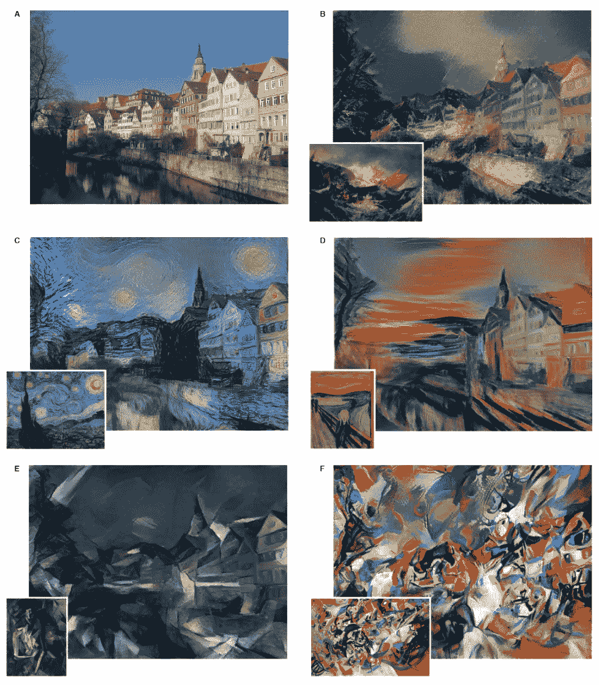
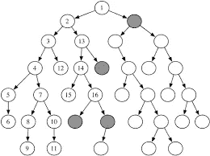

# 高级数据扩充策略

> 原文：<https://towardsdatascience.com/advanced-data-augmentation-strategies-383226cd11ba?source=collection_archive---------14----------------------->

深度学习模型热爱数据。除了向深度学习模型添加更多的训练数据，没有更好的方法来快速提升你的深度学习模型的性能。

然而，收集和标注数据可能非常耗时且昂贵。因此，许多深度学习研究人员对数据增强技术感兴趣，以便为这些庞大的数据饥渴模型综合添加训练数据。

对于图像数据，有许多经典的/易于实现的数据扩充方法。最流行的方法之一是水平翻转图像。水平翻转图像、裁剪图像同时保留图像中的感兴趣对象以及增加颜色空间是最常用的经典数据扩充方法，这些方法很可能会提高最终模型的性能。

许多图像处理功能，如平移、剪切、旋转等。可用作经典的数据扩充功能。您还可以使用随机区域锐化、弹性变换、随机擦除图像的补丁等等来增加数据和创建新的训练实例。

在许多研究中，这些经典增强已被证明能够提高图像数据的性能。也有新的方法正在研究，似乎很有前途。这些方法包括对抗训练、生成对抗网络、风格转移以及使用强化学习来搜索增强可能性的空间。

# 对抗训练

对抗性训练是深度学习中一个非常令人兴奋的话题。对抗训练是生成对抗网络的基础，但它们也可以用于学习噪声增强，这可能有助于模型表现得更好。在对抗训练中，一个模型对实例进行分类，另一个模型获取实例并向其添加噪声，以试图欺骗另一个分类器。然后，分类模型为这个对立模型提供损失函数，使得它可以优化自身以产生更好的噪声。添加通过对抗性训练产生的图像可能有助于模型学习更强大的不受噪声失真影响的特征。

# 生成对抗网络

生成对抗网络是深度学习中最热门的话题之一。通过使用生成器网络将噪声向量映射到宽度 x 高度 x 颜色通道图像张量，该模型能够生成看起来像原始训练图像的图像。这种方法的主要问题是很难用 GANs 产生高分辨率的输出图像。在 MNIST(28 x 28 x 1)、CIFAR-10 (32x32x3)数据和 DCGAN(添加到生成器网络的深度卷积层)上，使用 GANs 进行数据扩充已被证明是有效的，并产生了(64x64x3)图像。产生比这更高分辨率的输出需要非常复杂的网络和技术。

MNIST ‘3’ I was able to make using a DCGAN with Python/Keras

# 神经类型转移

神经类型转移是深度学习中另一个令人难以置信的令人兴奋的话题。通过卷积神经网络的过程，这些网络能够惊人地将风格与内容分开。样式表示被格式化为“gram matrix ”,并且由此导出损失函数，以将一个图像的样式转移到另一个图像，同时保留内容。这可以产生诸如使普通图片看起来像是文森特·范·高夫所画的效果。风格增强在数据增强中是一个相当新的主题，但是我希望随着对这个主题的研究越来越多，它会做得越来越好。

Neural Style Transfer

# 离散空间搜索的强化学习

对于所有这些进行数据扩充的潜在方法，很难找到最佳组合。传统上，这种可能性树可以通过深度或广度优先搜索来天真地探索，一旦达到期望的性能就停止。然而，随着围绕深度强化学习的所有兴奋，已经有一些研究探索学习增强策略的可能性。这样做也是希望这些数据扩充策略能够在图像数据域中推广。

Discrete Space Search Illustration

# 结论

总之，所有这些的目的是尝试向我们的训练集添加数据，从而产生更好的深度学习模型。在深度学习研究的广度中，存在许多进行数据增强的创造性方法。数据扩充的研究对于构建更好的模型和创建系统非常重要，这样您就不必收集大量的训练数据来获得可靠的统计模型。感谢您的阅读！

# [CShorten](https://medium.com/@connorshorten300)

Connor Shorten 是佛罗里达大西洋大学计算机科学专业的学生。对计算机视觉、深度学习和软件工程感兴趣。