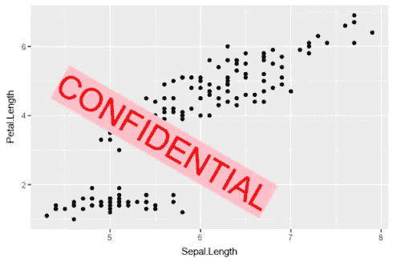

# R 中的高级图像处理

> 原文：<https://towardsdatascience.com/advanced-image-processing-in-r-210618ab128a?source=collection_archive---------2----------------------->


**‘ImageMagick’**是著名的开源库之一，可用于编辑和操作不同类型的图像(光栅&矢量图像)。是一个绑定到“ImageMagick”的 R 包，用于在 R 中进行高级图像处理，作者是耶鲁安·奥姆斯。

**magick** 支持 png、jpeg、tiff 等多种常见图像格式，以及旋转、缩放、裁剪、修剪、模糊、翻转、注释等操作。

这篇文章旨在帮助你开始使用`magick`来处理、编辑和操作 R 中的图像，这些图像可以是从文件格式转换(例如，png 到 jpeg)到注释 R 图形输出的任何内容。

`magick`可用在[曲柄](https://cran.r-project.org/web/packages/magick/magick.pdf)上，也可用在 [ropensci 的 github](https://github.com/ropensci/magick) 上。

```
#installing magick package from CRAN
install.packages('magick') 
#from Github ropensci library - note: requires RTools
devtools::install_github('ropensci/magick')
```

让我们加载库，用`image_read()`从互联网上读取我们的第一张图片

```
#Loading magick package
library(magick)#reading a png image frink image
frink <- image_read("https://jeroen.github.io/images/frink.png")
#reading a jpg image ex-President Barack Obama from Wikipedia
obama <- image_read('https://upload.wikimedia.org/wikipedia/commons/thumb/8/8d/President_Barack_Obama.jpg/800px-President_Barack_Obama.jpg')
```

确保你已经安装了一个更新版本的`curl`包，可以成功读取上面提到的图像。

我们可以通过`image_info()`获得读取图像的基本细节

```
#image details
image_info(obama)
image_info(frink)
image_info(obama)
  format width height colorspace filesize
1   JPEG   800    999       sRGB   151770image_info(frink)
format width height colorspace filesize
1    PNG   220    445       sRGB    73494
```

与 RStudio 通信，`magick`允许您在 RStudio 查看器窗格中打印/显示图像。

```
#displaying the image
print(obama)
```

无论你是一名网络开发人员，还是正在制作一套幻灯片，图像文件格式转换都是我们最终要做的操作之一，这实际上是使用`magick`的`image_write()`的一行程序。

```
#Rendering JPG image into SVG
image_write(obama, path = 'obama.svg', format = 'svg')
```

下面是我们从维基百科读到的奥巴马图片的 PNG 格式:


但是你可能会想，“嘿！这只是基本的图像处理。你没说这是高级的吗？”是的，随着好消息而来的是先进的东西，即`magick`支持管道`%>%`操作器。

这是我们将要做的:

```
#Applying Charcoal effect to Obama's image 
#and compositing it with frink's image
#and finally annotating it with a text
image_charcoal(obama) %>% 
  image_composite(frink)  %>%
  image_annotate("CONFIDENTIAL", size = 50, color = "red", boxcolor = "pink",
                 degrees = 30, location = "+100+100") %>%
  image_rotate(30) %>%
  image_write('obama_with_frink.png','png')
```

给出以下输出:


输出图像看起来如何？很有艺术感不是吗？)!

但这并不是科学家每天都想做的事情，相反，我们玩的是图，大多数时候想注释 R 图形输出，这里是你如何用`magick`的`image_annotate()`做到这一点

```
library(ggplot2)
img <- image_graph(600, 400, res = 96)
p <- ggplot(iris) + geom_point(aes(Sepal.Length,Petal.Length))
print(p)
dev.off()
img %>% image_annotate("CONFIDENTIAL", size = 50, color = "red", boxcolor = "pink",
                       degrees = 30, location = "+100+100")  %>%
  image_write('conf_ggplot.png','png')
```

给出此输出图像:



这只是对`magick`所能做的事情的一瞥。从字面上看，在 magick 中还有很多*魔法*。亲自尝试一下，并在评论中分享你的想法。这里使用的代码可以在[我的 github](https://github.com/amrrs/datascienceplus_codes/blob/master/magick_r.R) 上找到。如果你对用 Python 建立深度学习的专业知识感兴趣，可以看看这个 [Datacamp 课程](https://www.datacamp.com/courses/deep-learning-in-python?tap_a=5644-dce66f&tap_s=210728-e54afe)。

**参考文献**:

1.[Magick Ropensci](https://github.com/ropensci/magick)2。 [Magick CRAN 文档](https://cran.r-project.org/web/packages/magick/magick.pdf)
3。[奥巴马形象功劳](https://en.wikipedia.org/wiki/Barack_Obama#/media/File:President_Barack_Obama.jpg)
4。 [Frink Image Credit](https://jeroen.github.io/images/frink.png)