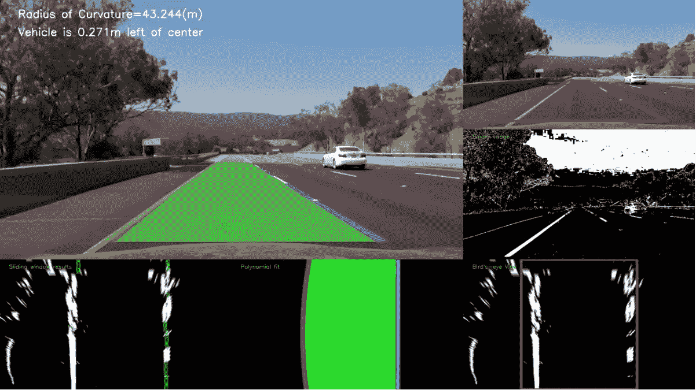
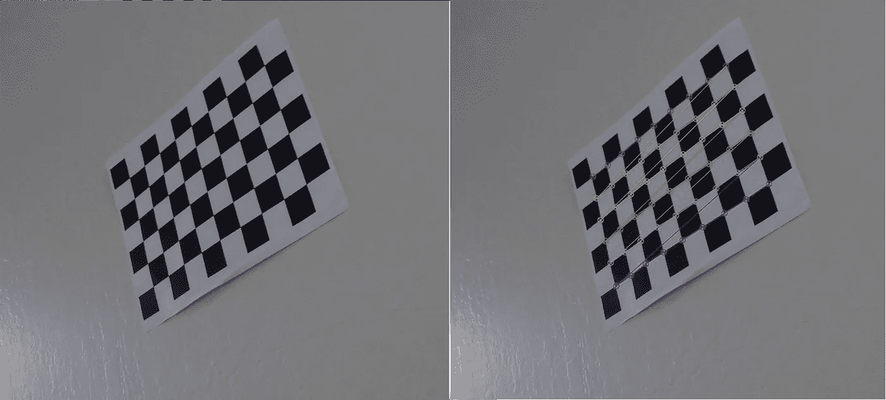
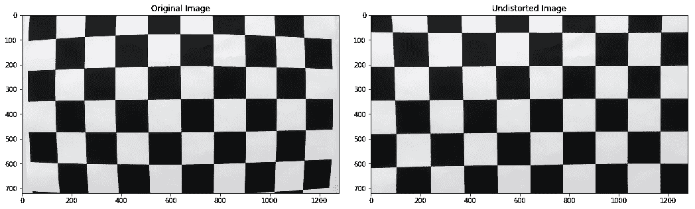
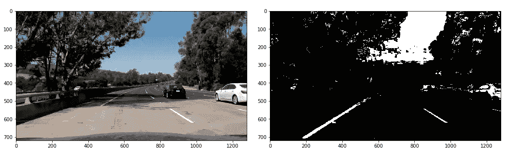
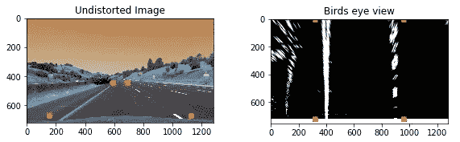
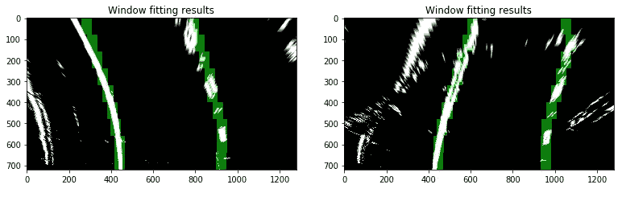
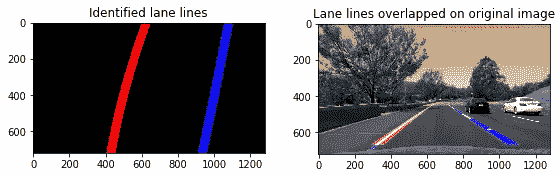
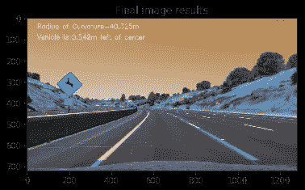

# 使用计算机视觉技术的自动车辆的高级车道检测

> 原文：<https://towardsdatascience.com/advanced-lane-detection-for-autonomous-vehicles-using-computer-vision-techniques-f229e4245e41?source=collection_archive---------2----------------------->

在早期的 [*项目*](https://medium.com/@techreigns/how-does-a-self-driving-car-detect-lanes-on-the-road-fc516c789984) 中，我使用 Canny 和 Hough 变换分别检测颜色强度和置信度的变化，以检测车道线。该项目使用基于早期技术的高级技术，通过使用不同颜色空间和梯度的阈值、滑动窗口技术、扭曲透视变换和多项式拟合来检测车道线。如果你只对最终结果感兴趣，请跳转至 [*视频*](https://youtu.be/t6AbiXpMWXI) 。关于详细的讨论，请继续阅读。

实现本项目目标的一系列步骤如下:

1.  计算摄像机校准矩阵和失真系数。

2.对原始图像应用失真校正。

3.使用颜色变换、渐变等。，以创建阈值化的二进制图像。

4.应用透视变换生成图像的“鸟瞰图”。

5.检测车道像素并拟合以找到车道边界。

6.确定车道的曲率和车辆相对于中心的位置。

7.将检测到的车道边界扭曲回原始图像，并显示车道曲率和车辆位置的数值估计。

让我们更深入地研究上面的每一个步骤，以详细理解这个过程。

1.  **计算摄像机校准矩阵和失真系数。**

所有的相机都使用镜头，镜头的一个问题是它们有一些径向失真。为了消除这种失真，我在棋盘图像上使用 OpenCV 函数来计算正确的相机矩阵和失真系数。这可以通过找到图像内的内角并使用该信息来消除图像失真来实现。图 1 显示了左边的棋盘图像和右边检测到的该图像内的内角。

Fig 1\. Calculating the camera matrix and distortion coefficients by detecting inside corners in a chessboard image (Source: Udacity)

失真矩阵用于消除校准图像的失真，并证明校准是正确的。图 2 中所示的示例显示了应用校准以消除棋盘图像失真后的前/后结果。

Fig 2\. Before and after results of un-distorting a chessboard image (Source: Udacity)

**2。对原始图像应用失真校正。**

在步骤 1 中收集的相机校准数据可以应用于原始图像，以应用失真校正。图 3 中显示了一个示例图像。与棋盘图像相比，可能更难看出对原始图像应用扭曲校正的效果，但是如果您更靠近图像的右侧进行比较，当您查看应用扭曲校正时沿着树木轻微裁剪的白色汽车时，这种效果会变得更加明显。

Fig 3\. Before and after results of un-distorting an example image (Source: Udacity)

**3。使用颜色变换、渐变等。，以创建阈值化的二进制图像。**

这一步骤背后的想法是创建一个图像处理管道，其中车道线可以被算法清楚地识别。通过尝试不同的渐变、阈值和色彩空间，有许多不同的方法可以找到解决方案。我在几幅不同的图像上试验了这些技术，并结合使用了阈值、色彩空间和渐变。我决定采用以下组合来创建我的图像处理管道:HLS 颜色空间中的 S 通道阈值和 HSV 颜色空间中的 V 通道阈值，以及检测车道线的梯度。图 4 示出了最终二进制阈值图像的例子，其中车道线清晰可见。

Fig 4\. Before and after results of applying gradients and thresholds to generate a binary thresholded image (Source: Udacity)

**4。应用透视变换生成图像的“鸟瞰图”。**

图像具有透视性，这使得图像中的车道线看起来像是在远处会聚，即使它们彼此平行。当该透视被移除时，更容易检测车道线的曲率。这可以通过将图像转换为 2D 鸟瞰图来实现，其中车道线总是彼此平行。由于我们只对车道线感兴趣，我在原始未失真的图像上选择了四个点，并将透视转换为鸟瞰图，如下图 5 所示。

Fig 5\. Region of interest perspective warped to generate a Bird’s-eye view (Source: Udacity)

**5。检测车道像素并拟合以找到车道边界。**

要检测车道线，有多种不同的方法。我使用了卷积，它是两个独立信号的乘积之和:窗口模板和像素图像的垂直切片。我使用了一个滑动窗口的方法来应用卷积，这将最大化每个窗口中的热点像素的数量。窗口模板在图像上从左向右滑动，任何重叠值相加在一起，产生卷积信号。卷积信号的峰值是像素重叠最高的地方，并且是车道标志最可能的位置。已经使用了多种方法来识别经矫正的二进制图像中的车道线像素。左线和右线已经被识别并用曲线多项式函数拟合。图 6 中示出了具有用滑动窗口方法和多项式拟合重叠识别的线像素的示例图像。

Fig 6\. Sliding window fit results (Source: Udacity)

**6。确定车道的曲率和车辆相对于汽车中心的位置。**

我测量了车道线的位置，并估计了道路弯曲的程度，以及车辆相对于车道中心的位置。我假设摄像机安装在汽车的中央。

7 .**。将检测到的车道边界扭曲回原始图像，并显示车道曲率和车辆位置的数值估计。**

来自校正图像的拟合已经被扭曲回到原始图像上，并且被标绘以识别车道边界。图 7 展示了车道边界被正确识别并扭曲回到原始图像。图 8 中示出了具有车道、曲率和距中心的位置的示例图像。

Fig 7\. Lane line boundaries warped back onto original image (Source: Udacity)

Fig 8\. Detected lane lines overlapped on to the original image along with curvature radius and position of the car (Source: Udacity)

上述过程应用于视频的每一帧，关键步骤的最终结果显示在不同的帧中:

**概要:**

这种解决方案在正常照明条件下工作良好。然而，它需要改进以解决不同的用例。可以改进的一个例子是车道的一部分是新铺设的，而车道的另一部分是旧铺设的道路，颜色不同。在由于阳光直射而导致摄像机出现眩光的情况下，以及在车道线看起来被冲刷而使其更难检测的其他高对比度情况下，该算法也需要改进。这些类型的情况可以通过动态调整图像的对比度来解决，以确保图像中的车道线不会被洗掉，并确保该算法在所有照明条件下都具有良好的动态范围。在道路弯曲且有坡度的情况下，很难正确地扭曲图像，这可能会给算法带来问题。这个问题也可以通过为每个图像帧创建动态感兴趣区域来解决。这些是我以后需要探索的一些事情，以现有算法为基础，使其对于不同的用例都是健壮的。

如果你对技术细节感兴趣，可以查看我的 [Github](https://github.com/uppala75/CarND-Advanced-Lane-Lines/blob/master/AdvancedLaneLines.md) 资源库。

参考:所有的图片和视频都来自 Udacity，作为他们 SD 汽车纳米学位项目的一部分。原始图像上的增强信息是由我生成的，这是我开发的代码的输出。