# 超越 DQN/A3C:高级强化学习综述

> 原文：<https://towardsdatascience.com/advanced-reinforcement-learning-6d769f529eb3?source=collection_archive---------3----------------------->

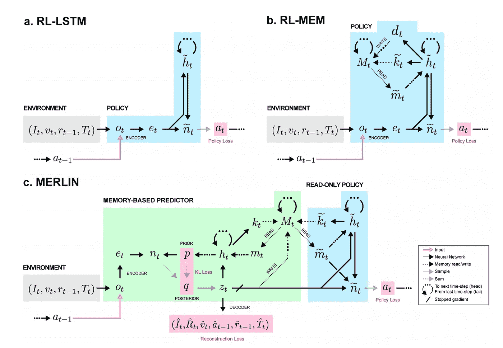

我最喜欢深度强化学习的一点是，与监督学习不同，它真的*真的*不想工作。用神经网络解决计算机视觉问题可能会让你达到 80%的目标。在 RL 问题上扔一个神经网络可能会[在你面前炸掉](https://www.alexirpan.com/2018/02/14/rl-hard.html)一些东西——而且每次你尝试的时候它都会以不同的方式炸掉。

RL 中的许多最大挑战围绕着两个问题:我们如何有效地与*环境*互动(例如**探索与开发，样本效率**)，以及我们如何有效地从*经验*中学习(例如**长期信用分配，稀疏的奖励信号**)。在这篇文章中，我想探索深度 RL 研究中试图解决这些挑战的几个最新方向，并与人类认知进行特别优雅的类比。我特别想谈谈:

*   分层 RL，
*   记忆和预测建模，以及
*   结合无模型和基于模型的方法。

这篇文章将首先快速回顾两个典型的深度 RL 算法——DQN 和 A3C——为我们提供一些直观的参考，然后深入研究一些最近的论文和上述类别中的突破。

# 审查:DQN 和 A3C/A2C

*免责声明:我假设你对 RL 有一些基本的了解(因此不会提供关于这两种算法的深入教程)，但是即使你不是 100%了解它们是如何工作的，这篇文章的其余部分仍然是可以访问的。*

DeepMind 的 **DQN (deep Q-network)** 是将深度学习应用于 RL 的首批突破性成功之一。它使用神经网络来学习经典 Atari 游戏(如 Pong 和 Breakout)的 Q 函数，允许模型直接从原始像素输入到动作。

在算法上，DQN 直接借鉴了经典的 Q 学习技术。在 Q 学习中，状态-动作对的 Q 值或“质量”是通过基于经验的迭代更新来估计的。本质上，随着我们在一个状态中采取的每一个动作，我们可以使用我们收到的即时奖励和我们的*新*状态的价值估计来更新我们的原始状态-动作对的价值估计:

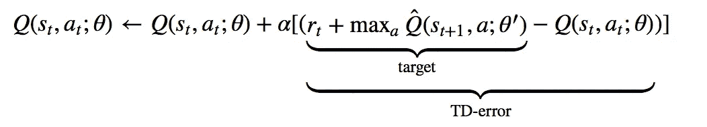

训练 DQN 包括最小化时间差异误差或 TD 误差的 MSE(均方误差),如上所示。DQN 为深度神经网络调整 Q 学习所采用的两个关键策略是:

*   体验重放，其中每个状态/动作转换元组(s，a，r，s’)被存储在存储器“重放”缓冲器中，并被随机采样以训练网络，允许训练数据的重复使用和连续轨迹样本的去相关；和
*   使用单独的目标网络(上述等式中的 Q_hat 部分)来稳定训练，因此 TD 误差不是根据训练网络中不断变化的目标来计算的，而是根据由大部分固定的网络生成的稳定目标来计算的。

随后，DeepMind 的 **A3C(异步优势演员评论家)**和 OpenAI 的同步变体 A2C，推广了一种非常成功的基于深度学习的方法*演员评论家方法*。

行动者-批评家方法结合了**政策梯度方法**和**学习价值函数**。对于 DQN，我们只有学习价值函数——Q 函数——我们遵循的“政策”只是在每一步采取最大化 Q 值的行动。对于 A3C，就像其他的 actor-critic 方法一样，我们学习两种不同的功能:策略(或“actor”)和价值(即“critic”)。该策略基于采取该行动的当前估计的*优势*来调整行动概率，并且价值函数基于通过遵循该策略收集的经验和奖励来更新该优势:

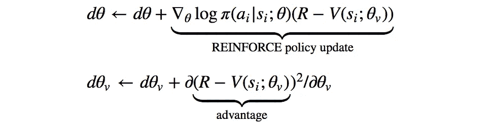

从上面的更新中我们可以看到，价值网络学习了一个*基线*状态值*V(s _ I；θ_v)* 我们可以用它来比较我们当前的回报估计 R，以获得“优势”，策略网络通过经典的增强算法基于该优势来调整行动的对数概率。

A3C 的真正贡献来自它的并行和异步架构:多个参与者-学习者被分派到环境的不同实例中；它们都与环境交互并收集经验，并将它们的梯度更新异步地推送到一个中心“目标网络”(一个从 DQN 借鉴来的想法)。后来，OpenAI 向 A2C 展示了异步性实际上并不会提高性能，事实上还会降低采样效率。不幸的是，这些架构的细节超出了本文的范围，但是如果分布式代理让你兴奋，就像它们让我兴奋一样，请确保你查看了 DeepMind 的[IMPALA](https://arxiv.org/abs/1802.01561)——对于扩大学习非常有用的设计范例。

DQN 和 A3C/A2C 都可以是强大的基线代理，但当面对更复杂的任务、严重的部分可观测性和/或行动与相关奖励信号之间的长时间延迟时，他们往往会受到影响。因此，RL 研究的整个子领域已经出现来解决这些问题。让我们进入一些好的东西:)。

# 分层强化学习

分层 RL 是一类强化学习方法，它从**多层策略**中学习，每层策略负责在不同的时间和行为抽象级别进行控制。最低级别的策略负责输出环境动作，而较高级别的策略可以自由地操作更抽象的目标和更长的时间范围。

为什么这如此吸引人？首先，在认知方面，[研究](https://www.ncbi.nlm.nih.gov/pmc/articles/PMC2783353/)长期以来认为人类和动物的行为是由等级结构支撑的。这在日常生活中是很直观的:当我决定做饭时(顺便说一下，基本上从来没有，但为了便于讨论，让我们假设我是一个负责任的人)，我能够将这项任务分成更简单的子任务:切菜、煮意大利面等。没有忘记我做饭的首要目标；我甚至能够交换子任务，例如煮饭而不是做意大利面，来完成同样的目标。这暗示了现实世界任务中固有的*层级*和*组合性*，其中简单的原子动作可以被串在一起、重复和组合以完成复杂的工作。近年来，研究甚至发现了 HRL 成分和前额叶皮层内特定神经结构之间的直接联系。

在技术研发方面，HRL 特别有吸引力，因为它有助于解决我在第二个问题中提到的两个最大的挑战，即如何有效地从经验中学习:**长期信用分配**和**稀疏的奖励信号**。在 HRL，因为低级策略根据高级策略分配的任务从*内在奖励*中学习，所以尽管奖励很少，原子任务仍然可以被学习。此外，由高级策略开发的时间抽象使我们的模型能够处理时间扩展体验上的信用分配。

那么它是如何工作的呢？有许多不同的方法来实现 HRL。Google Brain 最近的一篇论文采用了一种特别干净简单的方法，并为数据高效训练引入了一些不错的非政策修正。他们的模型叫做 HIRO。

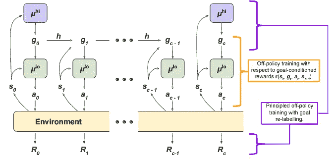

μ_hi is the high-level policy, which outputs “goal states” for the low-level policy to reach. μ_lo, the low-level policy, outputs environment actions in an attempt to reach that goal state observation.

想法是这样的:我们有两层政策。高级策略被训练以最大化环境回报 r。每 *c* 时间步，高级策略采样一个新的动作，这是低级策略要达到的“目标状态”。低级策略被训练来采取环境动作，这些环境动作将*产生类似于给定目标状态*的状态观察。

考虑一个简单的例子:假设我们正在训练一个机器人按照一定的顺序堆叠彩色立方体。如果任务成功完成，我们最终只能获得一个+1 的奖励，而在所有其他时间点，奖励为 0。直觉上，高层策略负责提出需要完成的子目标:也许它输出的第一个目标状态是“观察你面前的红色立方体；下一个可能是“观察红色立方体旁边的蓝色立方体；然后“观察红色立方体上的蓝色立方体。”低级策略在环境中摸索，直到它提出产生这些观察所必需的动作序列，例如，拿起蓝色立方体并将其移动到红色立方体之上。

HIRO 使用 **DDPG** (深度确定性策略梯度)训练目标的变体来训练低级策略，其内在回报被参数化为当前观察和目标观察之间的距离:

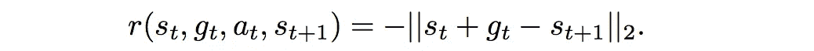

DDPG 是另一个开创性的深度 RL 算法，它将 DQN 的思想扩展到了连续的动作空间。这是另一种行动者-批评者方法，它使用政策梯度来优化政策，但不是像 A3C 那样根据优势来优化政策，而是根据 Q 值来优化政策。因此，在 HIRO，最小化的 DDPG 邻近误差变成:

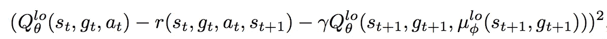

同时，为了使用非策略经验，用**非策略修正**训练高级策略。想法是这样的:为了提高样本效率，我们希望使用某种形式的重放缓冲区，比如 DQN。然而，旧的经验不能直接用于训练高层政策。这是因为低级策略在不断学习和变化，所以即使我们以与旧经验相同的目标为条件，我们的低级策略现在也可能表现出不同的动作/转换。HIRO 提出的政策外纠正是追溯性地*改变*政策外经验中的目标，以最大化观察到的行动顺序的可能性。换句话说，如果重放经验表明旧代理采取了动作( *x，y，z* )以达到目标 *g* ，我们发现目标 *g̃* 将使*当前*代理最有可能采取那些相同的动作( *x，y，z* )，即最大化动作序列的对数概率:

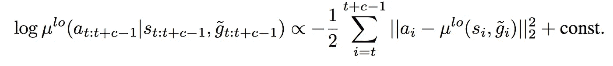

高层次的政策随后被训练成 DDPG 版本的行动、新目标和环境回报。

HIRO 当然不是接近 HRL 的唯一途径。[封建网络](https://arxiv.org/pdf/1703.01161.pdf)是一个更早的相关工作，它使用一个习得的“目标”表示，而不是原始的状态观察。事实上，研究中的许多变化源于学习有用的低级子政策的不同方法；许多论文使用了辅助或“代理”奖励，还有一些论文尝试了预训练或多任务训练。与 HIRO 不同，这些方法中的许多需要一定程度的手工工程或领域知识，这固有地限制了通用性。另一个最近探索的选择是使用[基于人口的训练(PBT)](https://arxiv.org/abs/1711.09846) ，另一个我个人很喜欢的算法。本质上，内部奖励被视为额外的超参数，PBT 在训练过程中学习这些超参数在“进化”人群中的最优进化。

HRL 现在是一个非常受欢迎的研究领域，很容易与其他技术相结合(查看[这篇论文](https://arxiv.org/pdf/1803.00590.pdf)结合 HRL 和模仿学习)。然而，就其核心而言，这只是一个真正直观的想法。它是可扩展的，具有神经解剖学的相似性，并解决了 RL 中的一系列基本问题。就像其他优秀的 RL 一样，训练起来会很棘手。

# 记忆和注意力

现在让我们谈谈解决长期信用分配和稀疏奖励信号问题的其他一些方法。具体来说，我们来说说最明显的方式:*让代理人真正擅长记忆事物*。

深度学习中的记忆总是很有趣，因为尽管研究人员可能会尝试(事实上，他们也确实在尝试)，但很少有架构能打败一个调整良好的 LSTM。然而，人类的记忆并不像 LSTM 那样工作；当我们处理日常生活中的任务时，我们回忆并关注特定的、与环境相关的记忆，除此之外别无其他。当我回到家，开车去当地的杂货店时，我用的是过去 100 次驾驶这条路线的记忆，而不是如何从卡姆登镇到伦敦皮卡迪利广场的记忆——即使这些记忆在最近的经历中是新鲜的。从这个意义上来说，我们的记忆看起来几乎可以通过上下文来查询:根据我在哪里和我在做什么，我的大脑知道哪些记忆对我有用。

在深度学习中，这是**外部的、基于键值的内存**存储背后的驱动论点。这个想法并不新鲜；[神经图灵机](https://arxiv.org/pdf/1410.5401.pdf)，我读过的第一篇也是最喜欢的论文之一，用一个可微分的外部存储器来增强神经网络，可通过向量值的“读”和“写”头访问特定位置。我们可以很容易地想象这被扩展到 RL，在任何给定的时间步，一个代理被给予与其当前状态相关的环境观察*和*记忆。这正是最近的 [MERLIN](https://arxiv.org/pdf/1803.10760.pdf) 架构的延伸。

**MERLIN** 有两个组件:一个**基于记忆的预测器(MBP)** 和一个策略网络。MBP 负责将观察值压缩成有用的低维“状态变量”，直接存储到键值存储矩阵中。它还负责将相关内存传递给策略，策略使用这些内存和当前状态来输出操作。

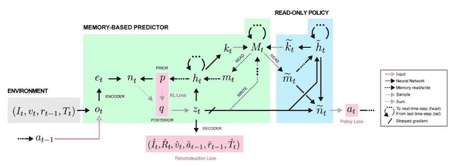

这个架构看起来可能有点复杂，但是请记住，策略只是一个经常性的净输出操作，MBP 实际上只做 3 件事:

*   将观察结果压缩成有用的状态变量 z_t 以传递给策略，
*   将 z_t 写入存储矩阵，以及
*   获取其他有用的记忆传递给政策。

流水线看起来像这样:输入观察首先被编码，然后通过 MLP 馈送，其输出被添加到下一个状态变量上的*先验分布*，以产生*后验分布*。这个后验分布以所有先前的动作/观察以及这个新的观察为条件，然后被采样以产生状态变量 z_t。接下来，z_t 被馈入 MBP 的 LSTM，其输出用于更新先验，并通过向量值“读密钥”和“写密钥”从存储器读取/写入，这两者都是作为 LSTM 隐藏状态的线性函数产生的。最后，在下游，策略网利用来自内存的 z_t 和 read 输出来产生一个动作。

一个关键的细节是，为了确保状态表示是*有用的*，MBP 也被训练来从当前状态 z_t 预测*奖励*，因此学习到的表示与手头的任务相关。

梅林的训练有点复杂；由于 MBP 的目的是作为一个有用的“世界模型”，一个棘手的目标，它被训练来优化变分下限(VLB)损失。(如果你对 VLB 不熟悉，我发现[这篇文章](https://xyang35.github.io/2017/04/14/variational-lower-bound/)相当有用，但你真的不需要它来理解梅林)。VLB 的损失有两个组成部分:

1.  下一个状态变量的先验概率分布和后验概率分布之间的**KL-散度**，其中后验概率还取决于新的观测值。最小化这个 KL 确保这个新的状态变量与先前的观察/动作一致。
2.  状态变量的**重建损失**，其中我们试图重现输入观察(如图像、先前动作等。)并基于状态变量预测奖励*。如果这种损失很小，我们已经找到了一个状态变量，它是观察的精确表示，并且对于产生给予高回报的行动是有用的。*

这是我们最后的 VLB 损失，第一项是重建，第二项是 KL 散度:

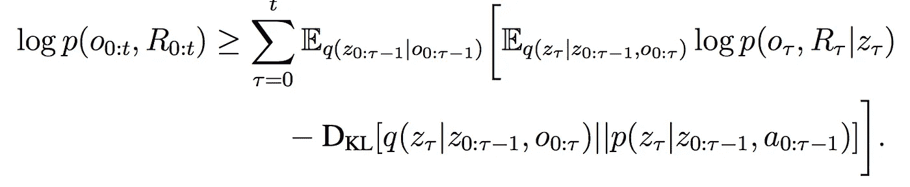

政策网络的损失是我们上面讨论的 A3C 的政策梯度损失的一个稍微花哨的版本；它使用一种称为广义优势估计算法的算法，其细节超出了本文的范围(但可以在 MERLIN 论文的附录的第 4.4 节中找到)，但它看起来类似于下面显示的标准政策梯度更新:

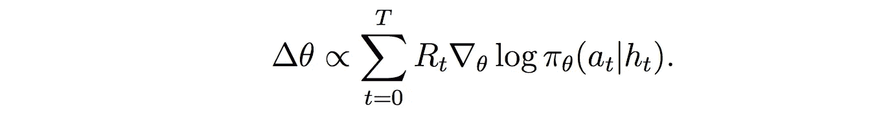

一旦经过训练，MERLIN 应该能够通过状态表示和记忆对世界进行预测建模，并且它的策略应该能够利用这些预测来采取有用的行动。

梅林并不是唯一一个使用外部记忆存储的深度 RL 作品——早在 2016 年，研究人员就已经在 MQN 或记忆 Q 网络中应用这一想法，以解决《我的世界》的迷宫——但这种使用记忆作为世界预测模型的概念有一些独特的神经科学牵引力。[另一个 Medium post](https://medium.com/intuitionmachine/controlled-hallucinations-in-deep-learning-architecture-fd617150d677) 在探索这个想法方面做了很好的工作，所以我不会在这里重复，但关键的论点是，我们的大脑很可能不像大多数神经网络所解释的那样，充当“输入-输出”机器。相反，它的功能是预测引擎，我们对世界的感知实际上只是大脑对我们感官输入原因的最佳猜测。神经科学家阿米尔·塞斯[很好地总结了](https://aeon.co/essays/the-hard-problem-of-consciousness-is-a-distraction-from-the-real-one)赫尔曼·赫尔姆霍茨 19 世纪的理论:

> 大脑被锁在一个骨质头骨里。它接收到的都是模棱两可、嘈杂的感官信号，只与世界上的物体间接相关。因此，感知必须是一个推理过程，在这个过程中，不确定的感官信号与之前对世界的期望或“信念”相结合，形成大脑对这些感官信号原因的最佳假设。

梅林基于记忆的预测器旨在实现*预测推理*的这一目的。它对观察结果进行编码，并将它们与内部先验结合起来，以生成一个“状态变量”，该变量捕获输入的一些表示(或原因)，并将这些状态存储在长期记忆中，以便代理可以在以后对它们采取行动。

# 代理人、世界模型和想象力

有趣的是，大脑作为预测引擎的概念实际上将我们带回了我们想要探索的第一个 RL 问题:我们如何有效地从环境中学习？毕竟，如果我们不直接从观察到行动，我们应该如何最好地与我们周围的世界互动和学习？

传统上在 RL 中，我们既可以进行*无模型*学习，也可以进行*基于模型的*学习。在无模型 RL 中，我们学习将原始环境观察直接映射到值或动作。在基于模型的 RL 中，我们首先学习基于原始观察的环境的转换模型，然后使用该模型来选择动作。

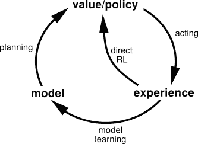

The outside circle depicts model-based RL; the “direct RL” loop depicts model-free RL

能够基于一个模型进行计划比在无模型学习中必须从纯粹的试错中工作要高效得多。然而，学习一个好的模型通常是非常困难的，并且由于模型的不完善而产生的复合误差通常会导致代理的不良性能。出于这个原因，deep RL 的很多早期成功(比如 DQN 和 A3C)都是无模型的。

也就是说，早在 1990 年的 [Dyna 算法](https://www.cs.cmu.edu/afs/cs/project/jair/pub/volume4/kaelbling96a-html/node29.html)中，无模型和基于模型的 RL 之间的界限就已经模糊了，在该算法中，学习的模型被用来生成模拟的经验，以帮助训练无模型策略。现在在 2018 年，一种新的“想象力增强的代理”算法被引入，直接结合了这两种方法。

在**想象增强代理(I2A)** 中，最终策略是无模型组件和基于模型组件的函数。基于模型的组件被称为代理对世界的“想象”，由代理内部学习的模型推出的**想象轨迹**组成。然而，关键是基于模型的组件在末端也有一个编码器，它聚集想象的轨迹并由*解释*，使代理能够在必要时学会*忽略它的想象*。从这个意义上说，如果代理发现它的内部模型正在投射无用和不准确的轨迹，它可以学习忽略该模型，继续使用它的无模型手臂。

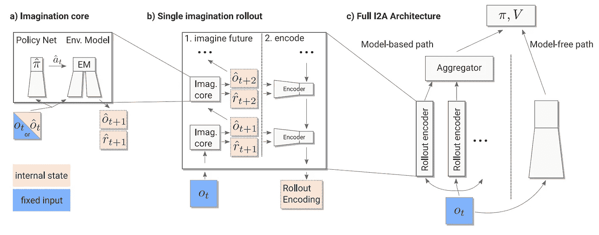

上图描述了 I2A 的工作方式。观察首先被传递给无模型和基于模型的组件。在基于模型的组件中， *n* 不同的轨迹是基于在当前状态下可能采取的 *n* 种可能的动作而“想象”出来的。这些轨迹是通过将动作和状态输入到内部环境模型中，转换到新的想象状态，在该状态下采取最大的下一个动作等等而获得的。经过提炼的想象策略(通过交叉熵损失与最终策略保持相似)选择下一步行动。在一些固定的 *k* 步骤之后，这些轨迹被编码和聚集在一起，并与无模型组件的输出一起被馈送到策略网络中。至关重要的是，编码允许政策以最有用的方式解释想象的轨迹——适当时忽略它们，提取可用的非奖励相关信息，等等。

该策略通过标准策略梯度损失与优势进行训练，类似于 A3C 和 MERLIN，因此现在看起来应该很熟悉:

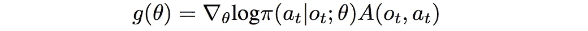

此外，在实际策略和内部模型的假想策略之间添加了策略提取损失，以确保假想策略选择与当前代理类似的动作:

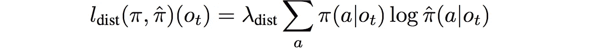

I2A 优于许多基准，包括 MCTS(蒙特卡罗树搜索)规划算法。它还能够在实验中表现良好，其中其基于模型的组件被有意限制为做出较差的预测，这表明它能够在必要时权衡模型的使用以支持无模型方法。有趣的是，具有较差内部模型的 I2A 实际上最终略微优于具有良好模型的 I2A，作者将其归因于随机初始化或最终提供某种形式的正则化的嘈杂内部模型，但这肯定是进一步研究的领域。

无论如何，I2A 是迷人的，因为在某些方面，它也正是我们在这个世界上的行为方式。我们*总是*根据我们所处环境的一些心理模型来规划和预测未来，但我们也倾向于意识到我们的心理模型可能完全不准确——尤其是当我们处于我们从未见过的新环境或情况下。在这种情况下，我们通过试错法进行，就像无模型方法一样，但我们也使用这种新的体验来更新我们的内部心理模型。

现在有很多工作在结合基于模型和无模型的方法。Berkeley AI 提出了一个[时间差异模型(TDM)](https://bair.berkeley.edu/blog/2018/04/26/tdm/) ，它也有一个非常有趣的前提。这个想法是让代理设置更多的时间抽象目标，即“在 *k* 时间步骤中处于 *X* 状态”，并学习那些长期模型转换，同时最大化每个 *k* 步骤中收集的奖励。这让我们在行动的无模型探索和基于模型的高层次目标规划之间实现了平稳过渡——如果你仔细想想，这有点让我们回到了分层 RL 中的直觉。

所有这些研究论文都专注于同一个目标:实现与无模型方法相同(或更好)的性能，并具有与基于模型的方法相同的样本效率。

# 结论

深度 RL 模型真的很难训练。但由于这一困难，我们被迫提出了一系列令人难以置信的策略、方法和算法，以利用深度学习的力量解决经典(和一些非经典)控制问题。

这篇文章是对 deep RL 的一个非常、*非常*不完整的调查——有很多研究我还没有涉及，还有更多我甚至不知道。然而，希望这种在记忆、层次和想象力方面的零星研究方向提供了一瞥，让我们可以开始解决该领域中一些反复出现的挑战和瓶颈。如果你认为我错过了一些重要的东西，我可能是——让我在评论中知道是什么吧。:)同时，祝 RL 黑客快乐！