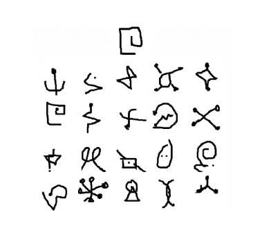
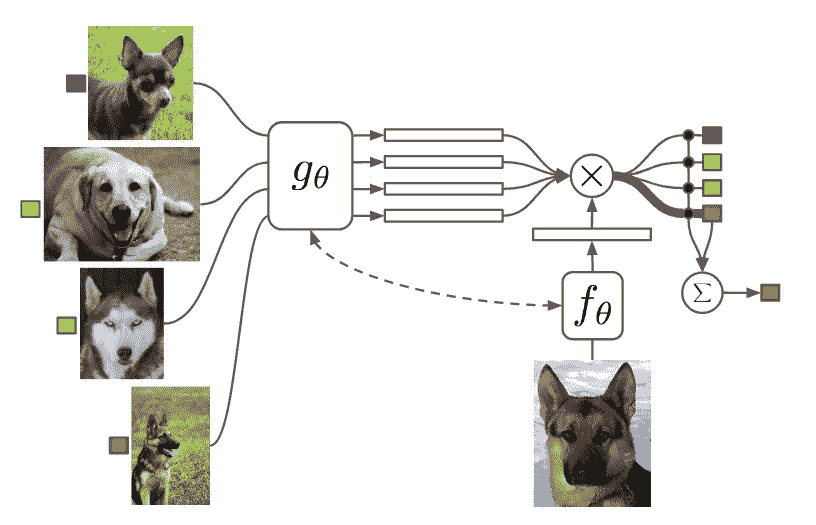
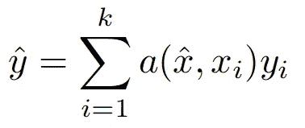
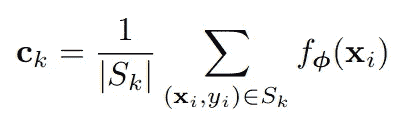
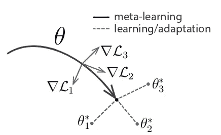
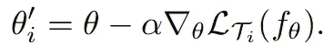
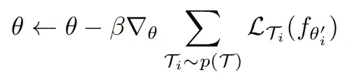
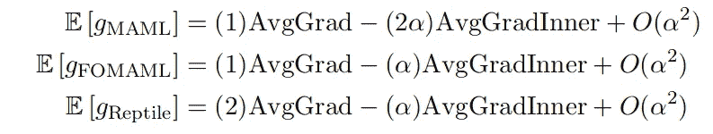

# 少数镜头学习的进展:一次有指导的旅行

> 原文：<https://towardsdatascience.com/advances-in-few-shot-learning-a-guided-tour-36bc10a68b77?source=collection_archive---------3----------------------->

Source: [https://worldarchery.org/sites/default/files/news/images/main/Arrows-in-Target-Gator-Cup.jpg](https://worldarchery.org/sites/default/files/news/images/main/Arrows-in-Target-Gator-Cup.jpg)

少数镜头学习是目前机器学习的一个令人兴奋的领域。深度神经网络从大量数据集中提取复杂统计数据和学习高级特征的能力已经得到证明。然而，当前的深度学习方法存在样本效率低下的问题，这与人类的感知形成了鲜明对比——即使是孩子也能在看到一张图片后认出长颈鹿。微调预先训练的模型是实现高采样效率的一种流行策略，但这是一种事后手段。机器学习能做得更好吗？

少投学习旨在解决这些问题。在这篇文章中，我将通过深入研究三篇前沿论文来探索一些近期在少投学习方面的进展:

1.  [匹配网络](https://arxiv.org/pdf/1606.04080.pdf):可微分的最近邻分类器
2.  [原型网络](https://arxiv.org/pdf/1703.05175.pdf):学习原型表征
3.  [模型不可知的元学习](https://arxiv.org/pdf/1703.03400.pdf):学习微调

我将从简单解释 n-shot，k-way 分类任务开始，这些任务是少投学习的事实上的基准。

*我已经在一个 Github* [*资源库*](https://github.com/oscarknagg/few-shot) *中转载了这些论文的主要结果。你可以查看* [***这篇文章***](https://medium.com/@oknagg/advances-in-few-shot-learning-reproducing-results-in-pytorch-aba70dee541d) *来了解我实施这项研究的经历。*

# n 镜头，k 路任务

一个算法执行少镜头学习的能力通常通过它在 n 镜头、k 路任务上的性能来衡量。它们的运行方式如下:

1.  给模型一个查询样本，该样本属于一个新的、以前未见过的类
2.  也给出了一个支持集， *S* ，由 *n* 个例子组成，每个例子来自 *k* 个不同的看不见的类
3.  然后，该算法必须确定查询样本属于哪个支持集类

A 1-shot, 20-way task from the [Omniglot](https://github.com/brendenlake/omniglot) dataset. The query sample is in top-center.

# 匹配网络

Vinyals et al.

虽然之前有很多关于深度学习的少量方法的研究，但 Matching Networks 是第一个对 n-shot，k-way 任务进行训练和测试的*。这种方法的吸引力很简单——对相同的任务进行训练和评估，让我们以端到端的方式优化目标任务。诸如暹罗网络的早期方法使用成对验证损失来执行度量学习，然后在单独的阶段使用学习的度量空间来执行最近邻分类。这不是最佳的，因为初始嵌入函数被训练成在不同的任务上最大化性能！然而，匹配网络将嵌入和分类结合起来，形成端到端的**可微分最近邻** **分类器。***

匹配网络首先将高维样本嵌入到低维空间中，然后执行由下面的等式描述的最近邻分类的一般化形式。

Equation (1) from Matching Networks

这意味着模型的预测 *y^* 是支持集的标签 *y_i* 的加权和，其中权重是查询示例 x^和支持集样本 *x_i* 之间的成对相似性函数 *a(x^，x_i】。该等式中的标签 *y_i* 是独热编码的标签向量。*

注意，如果我们选择 *a(x^，x_i)* 作为与查询样本最接近的 *k 个*样本的 *1/k* ，否则我们恢复 k 最近邻算法。需要注意的关键点是，如果注意函数 *a(x^，x_i)* 是可微的，那么匹配网络是端到端可微的。

作者选择嵌入空间中简单的 softmax over cosine 相似度作为他们的注意函数 *a(x，x_i)。他们用于少数镜头图像分类问题的嵌入函数是 CNN，它当然是可微分的，因此使得注意力和匹配网络完全可微分！这意味着用典型方法(如随机梯度下降法)端到端地拟合整个模型是很简单的。*

Attention function used in the Matching Networks paper

在上面的等式*中，c* 表示余弦相似度，函数 *f* 和 *g* 分别是查询和支持集样本的嵌入函数。对该等式的另一种解释是，支持集是一种记忆形式，并且在看到新样本时，网络通过从该记忆中检索具有相似内容的样本的标签来生成预测。

有趣的是，支持集和查询集嵌入函数 *f* 和 *g* 不同的可能性是开放的，以便给予模型更多的灵活性。事实上，Vinyals 等人正是这样做的，并引入了**全语境嵌入**或简称为 FCE 的概念。

他们认为嵌入函数的短视本质是一个弱点，因为支持集 *x_i* 的每个元素被 *g(x_i)* 以独立于其余支持集和查询样本的方式嵌入。他们建议嵌入函数 *f(x^)* 和 *g(x_i)* 应该采用更一般的形式 *f(x^，S)* 和 *g(x_i，S)* 其中 *S* 是支撑集。这背后的原因是，如果两个支持集项目非常接近，例如，我们正在执行狗品种之间的细粒度分类，我们应该改变样本嵌入的方式，以增加这些样本的可分辨性。

在实践中，作者使用 LSTM 来计算支持的 FCE，然后注意使用另一个 LSTM 来修改查询样本的嵌入。这带来了可观的性能提升，但代价是引入了更多的计算，并且对支持集的任意排序也稍显乏味。

总之，这是一篇非常新颖的论文，它发展了完全可微神经邻居算法的思想。

# 原型网络

Class prototypes c_i and query sample x.

在原型网络中，Snell 等人以类原型的形式应用了引人注目的归纳偏差，以实现令人印象深刻的少数镜头性能——在没有 FCE 复杂性的情况下超过了匹配网络。作出的关键假设是存在嵌入，其中来自每个类别的样本围绕单个**原型表示**聚集，该原型表示简单地是单个样本的平均值。这个想法简化了 n > 1 的情况下的 n 镜头分类，因为分类是通过取最接近的类原型的标签来简单地执行的。

Equation (1) from Prototypical Networks — calculating class prototypes. S_k is the support set belonging to class k and f_phi is the embedding function.

本文的另一个贡献是在度量学习中使用欧几里德距离超过余弦距离的有说服力的理论论证，这也证明了使用类均值作为原型表示的合理性。关键是要认识到平方欧几里得距离(而不是余弦距离)是一种特殊的距离函数，称为 **Bregman 散度**。

考虑寻找一簇点的质心的聚类问题，使得质心和所有其他点之间的总距离最小化。[已经证明](http://www.jmlr.org/papers/volume6/banerjee05b/banerjee05b.pdf)如果你的距离函数是一个 Bregman 散度(比如平方欧几里德距离)，那么满足这个条件的质心就是聚类的平均值——然而余弦距离不是这种情况！当将一组点表示为单个点时，该质心是使信息损失最小的点。

这种直觉得到了实验的支持，因为作者发现，通过从余弦到欧几里德距离的交换，质子和他们自己的匹配网络的实现都得到了全面的改善。

原型网络也服从于**零触发学习，**人们可以简单地直接从类的高级描述中学习类原型，比如带标签的属性或自然语言描述。一旦你做到了这一点，你就有可能把新的图片归类为一个特定的类别，而不必看那个类别的图片。在他们的实验中，他们只根据颜色、形状和羽毛图案等属性对鸟类图像进行零拍摄物种分类。

我非常喜欢这篇文章，因为它在本文中所有方法的典型基准测试中实现了最高的性能，同时也非常优雅，最容易复制。干得好斯内尔等人！

# 模型不可知的元学习(MAML)

芬恩等人采取了一种非常不同的方法来进行少量学习，通过学习一种可以快速适应新任务的网络初始化——这是一种形式的**元学习**或学习到学习。这种元学习的最终结果是一个模型，它可以在一个新任务上达到高性能，只需一个简单的常规梯度下降步骤。这种方法的高明之处在于，它不仅可以用于监督回归和分类问题，还可以用于使用任何可微分模型的强化学习！

Figure 1 from [Model-Agnostic Meta-Learning](https://arxiv.org/pdf/1703.03400.pdf). Theta represents the weights of the meta-learner. Gradient L_i are the losses for tasks, i, in a meta-batch and the starred theta_i are the optimal weights for each task.

MAML 不像大多数深度学习算法那样在批量样本上学习，而是在批量任务上学习，也称为元批量。对于元批处理中的每个任务，我们首先使用基本元学习者的权重初始化一个新的“快速模型”。然后，我们计算梯度，从而根据从该任务中抽取的样本更新参数，并更新快速模型的权重，即，对快速模型的权重执行典型的小批量随机梯度下降。

The weight update due to a single task T_i. Alpha is a learning rate hyperparameter.

在参数更新之后，我们从相同的任务中采样一些更多的看不见的样本，并计算元学习者的*更新权重*(又名快速模型)在任务中的损失。最后一步是通过从*更新后的权重中获取损失总和的梯度来更新元学习器的权重。*这个实际上是取梯度的梯度，因此是二阶更新——MAML 算法通过展开的训练过程进行微分。

Weight update for meta-learner. Beta is a learning rate hyperparameter and p(T) is the distribution of tasks.

这是关键的一步，因为这意味着我们在梯度步骤后优化基础车型*的性能，也就是说，我们在优化快速简单的梯度下降。这样做的结果是，元学习者可以通过梯度下降在小至每类一个例子的数据集上进行训练，而不会过度拟合。*

来自 OpenAI 的一篇[后续论文](https://arxiv.org/pdf/1803.02999.pdf)提供了一些有价值的直觉，解释了为什么使用梯度更新的泰勒展开可以工作。他们得出的结论是，MAML 不仅最小化了任务分布的期望损失，而且最大化了同一任务的梯度更新之间的期望内积。因此，它是**优化批次之间的一般化**。

Results of a Taylor expansion analysis from “On First-Order Meta-Learning Algorithms” by Nichol et al.

上述方程组显示了 MAML 梯度的期望，一阶简化的 MAML (FOMAML)和爬虫，一阶元学习算法在同一篇论文中介绍。 *AvgGrad* 项代表任务损失，而 *AvgGradInner* 项代表概括项。注意，对于学习速率中的领先顺序*α*，所有算法都执行非常相似的更新，其中二阶 MAML 将最高权重放在一般化项上。

也许 MAML 的唯一缺点是二阶更新，因为计算损失的二阶导数是非常内存和计算密集型的。然而，一阶简化(例如 FOMAML 和爬虫)产生非常相似的性能，这暗示二阶更新可以用更新权重上的梯度来近似。

然而，高计算要求与模型不可知的元学习是一篇出色的论文，为机器学习开辟了令人兴奋的新道路这一事实无关。

少数镜头学习领域正在取得快速进展，尽管仍有许多有待学习，但我相信该领域的研究人员将继续缩小机器和人类在少数镜头学习这一挑战性任务上的表现之间的差距。我希望你喜欢阅读这篇文章。

*我已经在一个 Github* [*资源库*](https://github.com/oscarknagg/few-shot) *中转载了这些论文的主要成果。如果你已经有了足够的概念，并且想要一些有趣的技术细节和代码，你可以查看* [***这篇文章***](https://medium.com/@oknagg/advances-in-few-shot-learning-reproducing-results-in-pytorch-aba70dee541d) *来了解我实施这项研究的经验。*