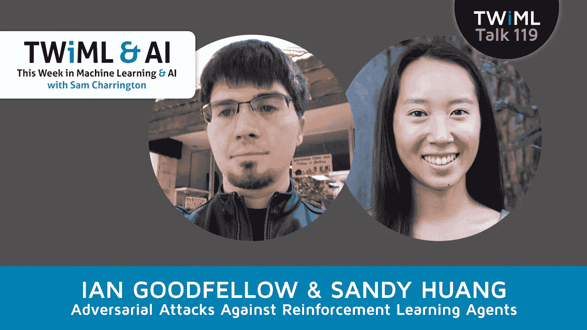

# 针对强化学习代理的对抗性攻击

> 原文：<https://towardsdatascience.com/adversarial-attacks-against-reinforcement-learning-agents-512f7703ad0f?source=collection_archive---------17----------------------->

## TWiML Talk 119

在这一集里，我和谷歌大脑的研究人员科学家伊恩·古德菲勒以及加州大学伯克利分校 EECS 系的博士生黄裕景一起讨论他们在《对神经网络政策的对抗性攻击》一文中的工作。

## 订阅:[iTunes](https://itunes.apple.com/us/podcast/this-week-in-machine-learning/id1116303051?mt=2)/[SoundCloud](https://soundcloud.com/twiml)/[Google Play](https://goo.gl/app/playmusic?ibi=com.google.PlayMusic&isi=691797987&ius=googleplaymusic&link=https://play.google.com/music/m/Ihs3mamzsef2akrfycfkq3sspti?t%3DThis_Week_in_Machine_Learning_%2526_AI_Podcast)/[Stitcher](http://www.stitcher.com/s?fid=92079&refid=stpr)/[RSS](https://twimlai.com/feed)

如果你是这里的一名普通听众，你可能听说过敌对攻击，并见过基于深度学习的物体检测器的例子，例如，通过向图像中注入一些察觉不到的噪声，长颈鹿实际上是一辆校车。嗯，桑迪和伊恩的论文位于对抗性攻击和强化学习的交汇点，这是我们在播客中讨论了很多的另一个领域。在他们的论文中，他们描述了对抗性攻击如何在强化学习中有效地针对神经网络策略。Sandy 向我们概述了这篇论文，包括改变单个像素值如何影响训练来玩 Atari 游戏的模型的性能。我们还涵盖了许多有趣的主题，分别涉及对抗性攻击和学习力，以及一些相关领域，如等级奖励函数和迁移学习。这是一次很棒的谈话，我真的很高兴能带给你！

# TWiML 在线会议更新

我想向本周早些时候参加 TWiML 在线聚会的每一个人大声欢呼。在我们的社区部分，我们就冷冻大脑(如果你错过了那家初创公司的公告，你可能不知道我在说什么)、医疗保健领域的 ML 和 AI 等问题进行了非常有趣和广泛的讨论。社区成员尼古拉斯·teague,‏在 twitter 上使用了 [@_NicT_](https://twitter.com/_nict_) ，他也简要介绍了他的文章[“一个蹒跚学步的孩子学会说话”](https://medium.com/@_NicT_/a-toddler-learns-to-speak-cdae422fe365)，在这篇文章中，他探索了机器学习中不同模式之间的联系。最后，衷心感谢 Sean Devlin，他对深度强化学习和 Google DeepMind 在该领域的开创性论文进行了深入探讨。查看下个月在 twimlai.com/meetup[聚会的视频记录和细节。](http://twimlai.com/meetup)

# 和我一起参加人工智能峰会

你是一名需要在企业中广泛的机器学习和人工智能机会上变得聪明的 IT、技术或业务领导者吗？或者，也许你组织中的某个人可以从这方面的提升中受益？(或者，也许你会从他们的升级中受益！)如果这听起来像你或你认识的人，你可能会对我即将举行的人工智能峰会感兴趣。

把这个活动想象成一个为期两天的机器学习和人工智能的技术 MBA。你会清楚地了解:

机器学习和深度学习如何工作(不需要数学知识)
如何在您的组织中识别机器学习和深度学习机会
如何理解和利用计算机视觉和自然语言处理等技术
如何管理和标记数据以利用 ML 和 AI
以及如何建立 AI 优先的文化，并在您的业务中实施 AI。

你将对整个人工智能和人工智能领域正在发生的事情有一个知情的观点，并将能够自信地与你的同事、客户和合作伙伴讨论机器学习和人工智能。我对这次活动和演讲者感到非常兴奋，你们将有机会向他们学习。欲了解更多信息，请访问[twimlai.com/aisummit](https://twimlai.com/aisummit)，如有疑问，请随时[联系](http://twimlai.com/contact)我。

# 关于伊恩

*   [伊恩在 LinkedIn 上](https://www.linkedin.com/in/ian-goodfellow-b7187213/)
*   [伊恩在推特上](https://twitter.com/goodfellow_ian?lang=en)
*   [伊恩的个人主页](http://www.iangoodfellow.com/)

# 关于桑迪

*   [桑迪在领英上](https://www.linkedin.com/in/sandy-huang-490a7919/)
*   [加州大学伯克利分校的桑迪](https://people.eecs.berkeley.edu/~shhuang/)

# 采访中提到

*   [论文——对神经网络策略的对抗性攻击](https://arxiv.org/abs/1702.02284)
*   [论文——探究可转移的示例](https://arxiv.org/abs/1611.02770)
*   [VGGNet](https://www.pyimagesearch.com/2017/03/20/imagenet-vggnet-resnet-inception-xception-keras/)
*   [纸— BADnet](https://arxiv.org/abs/1708.06733)
*   [NPM 图书馆的故事](https://www.theregister.co.uk/2016/03/23/npm_left_pad_chaos/)
*   [悬赏黑客](https://www.computerworld.com/article/3087328/emerging-technology/google-concerned-about-curious-but-destructive-cleaning-robots-that-hack-reward-systems.html)
*   [黑斑羚— DeepMind](https://deepmind.com/blog/impala-scalable-distributed-deeprl-dmlab-30/)
*   [论文—等级奖励—深度思维](https://arxiv.org/pdf/1703.01161)
*   [论文—鲁棒对抗性强化学习](https://arxiv.org/abs/1703.02702)
*   [古德哈特定律](https://en.wikipedia.org/wiki/Goodhart%27s_law)
*   [在这里报名参加人工智能大会！](https://twimlai.com/ainy2018)
*   查看@ShirinGlander 的伟大 TWiML 草图！
*   [TWiML 呈现:系列页面](https://twimlai.com/series)
*   [TWiML 事件页面](https://twimlai.com/events)
*   [TWiML Meetup](https://twimlai.com/meetup)
*   [TWiML 简讯](https://twimlai.com/newsletter)

[“稍后再谈”作者 Lee Rosevere](http://freemusicarchive.org/music/Lee_Rosevere/Music_for_Podcasts_4/Lee_Rosevere_-_Music_for_Podcasts_4_-_08_More_On_That_Later) 经 CC 4.0 授权

*原载于 2018 年 3 月 15 日*[*【twimlai.com*](http://twimlai.com/talk/119)*。*