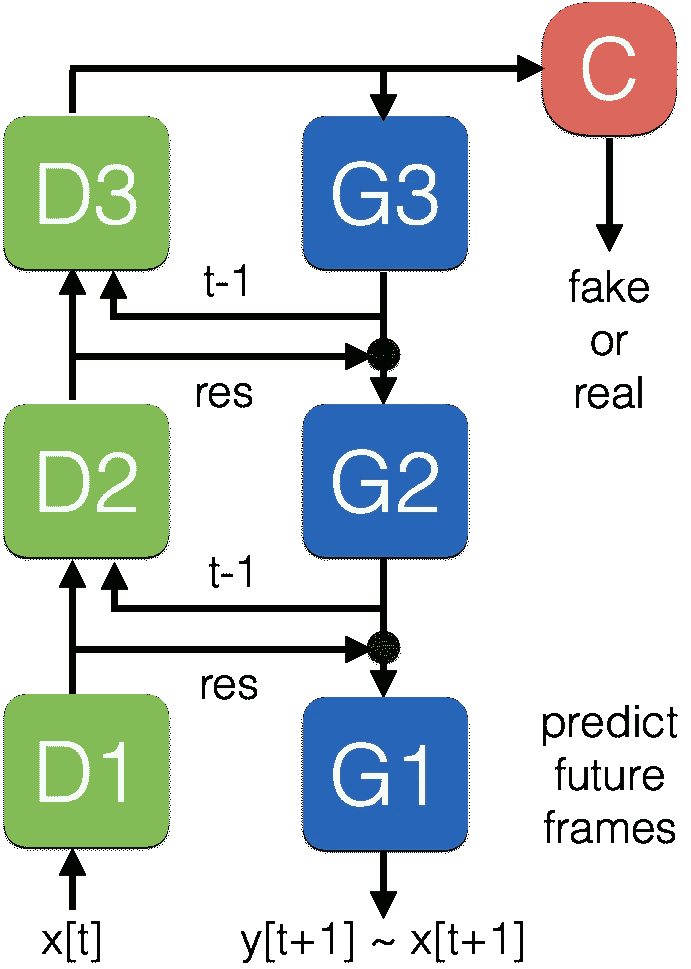
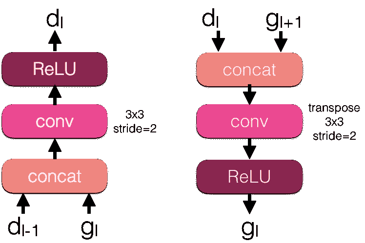
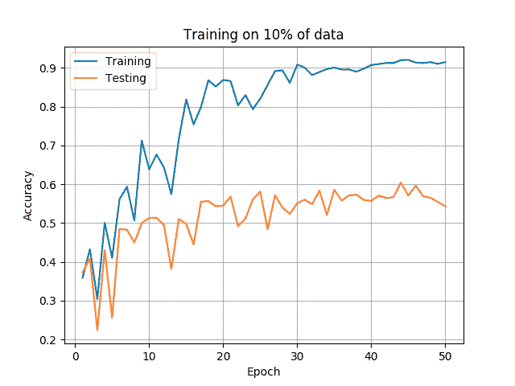
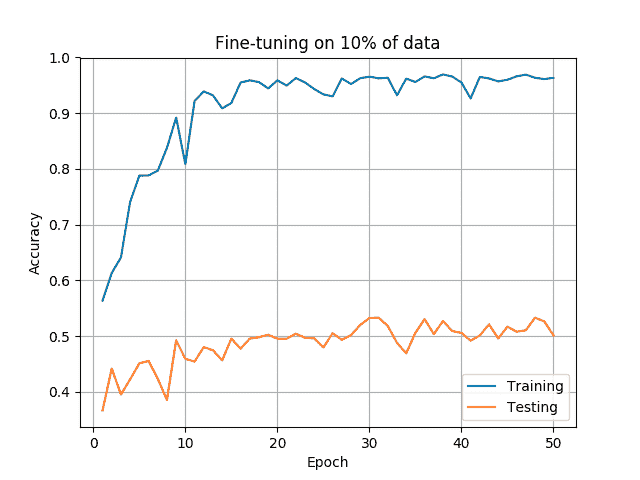
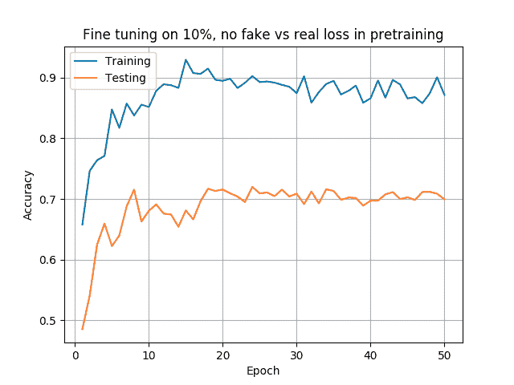

# 敌对预测网络

> 原文：<https://towardsdatascience.com/adversarial-predictive-networks-3aa7026d53d2?source=collection_archive---------3----------------------->

*作者:Lukasz Burzawa、Abhishek Chaurasia 和 Eugenio culrciello*

我们想测试像 [CortexNet](https://engineering.purdue.edu/elab/CortexNet/\) 这样的预测性神经网络将从同时训练中受益的想法:

1-预测视频中的未来帧

2-使用对抗性训练来区分视频中的真实帧和网络生成的帧

我们称之为*对抗性预测训练*。这个想法是改进 CortexNet 的能力，在更多的未标记数据上进行预训练，然后只使用少量的标记数据。

我们以这种方式修改了我们的[新型神经网络](https://medium.com/towards-data-science/a-new-kind-of-deep-neural-networks-749bcde19108):

我们添加了一个分类器 *C* 来预测伪生成帧和真实生成帧。我们的网络鉴别器或编码器 D 类似于标准的多层神经网络，因此我们将分类器 C 放置在所有绿色层之后。蓝色生成层或解码器层对于重建未来的图像或表示是有用的。更详细的是[这里](https://medium.com/towards-data-science/a-new-kind-of-deep-neural-networks-749bcde19108)。

为了进行培训，我们采用以下步骤:

1-我们训练网络来预测下一帧，就像在常规的 [CortexNet](https://engineering.purdue.edu/elab/CortexNet/\) 中一样

2-一旦网络可以生成合适的未来帧，我们训练分类器 C 来预测输入是真实的下一帧还是生成的下一帧

我们在每个训练步骤中按顺序运行步骤 1、2。

这些是 G 和 D 模块的详细信息:

D, G blocks in detail

我们在 conv 和 ReLU 之间使用批量标准化。

**结果:**使用 [KTH 数据集](http://www.nada.kth.se/cvap/actions/)，我们用上述对抗性预测方法对网络进行预训练，然后通过冻结生成器的网络，使用 10%的数据来训练分类器 C。

CASE 1

CASE 2

案例 1 :我们用 10%的数据训练整个网络。我们得到了 60.43%的最高测试准确率

**案例 2** :我们对 100%的数据使用了对抗性预测训练(假/真，也预测下一帧)，然后对 10%的数据进行了网络微调。我们得到了 53.33%的最高测试准确率

CASE 3

**案例 3** :我们只对 100%的数据使用预测训练(预测下一帧，作为原始 CortexNet)，然后对 10%的数据微调网络。我们得到了最高 71.98%的测试准确率

**结论**:如你所见，我们期望**案例 2** 比**案例 3** 更好。*但这并没有发生:* (53 对 71% —案例 2 对 3)。我们的结论是，对抗性预测训练在训练关于假/真分类的分类器和整个网络的预测能力之间产生冲突。

对 33%(62%对 79% —案例 2 对 3)和 50% (71%对 81% —案例 2 对 3)的数据进行预训练，而不是只对 10%的数据进行预训练，并没有改变这种情况，而且使用更多的数据无论如何都无法达到对未标记数据进行预训练的目的…

# 关于作者

我在硬件和软件方面都有将近 20 年的神经网络经验(一个罕见的组合)。在这里看关于我:[媒介](https://medium.com/@culurciello/)、[网页](https://e-lab.github.io/html/contact-eugenio-culurciello.html)、[学者](https://scholar.google.com/citations?user=SeGmqkIAAAAJ)、 [LinkedIn](https://www.linkedin.com/in/eugenioculurciello/) 等等…

# 捐款

如果你觉得这篇文章有用，请考虑捐赠[来支持更多的教程和博客。任何贡献都能有所作为！](https://www.paypal.com/cgi-bin/webscr?cmd=_s-xclick&hosted_button_id=Q3FHE3BWSC72W)