# ART + AI —使用(Tensorflow 和 TPUs)生成非洲面具

> 原文：<https://towardsdatascience.com/african-masks-gans-tpu-9a6b0cf3105c?source=collection_archive---------11----------------------->

## 容易吗？需要多少数据？数据质量会影响结果吗？甘人学到了什么？

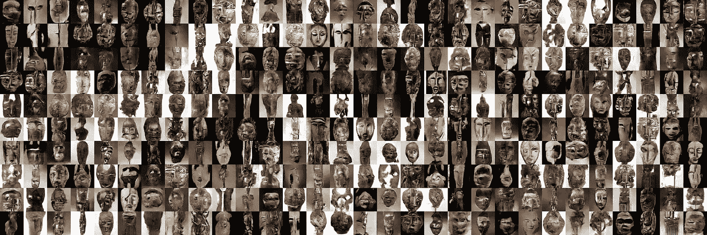

African Masks generated using a DCGAN model.

2018 年 8 月，我有机会参加了 [2018 深度学习 Indaba](https://medium.com/@victor.dibia/6-reasons-i-loved-the-2018-deep-learning-indaba-e01d0ff5009) ，在这里 Google 慷慨地向所有参与者提供了 TPUs (v2)的访问权限！我最终花了一些时间来熟悉在 TPUs 上运行 ML 实验，并开始训练 GAN 基于我一直在管理的自定义数据集生成图像——非洲掩模数据集。TPUs 提供了一些强大的计算能力(与[高端 GPU](https://blog.riseml.com/benchmarking-googles-new-tpuv2-121c03b71384)不相上下)，能够快速完成训练实验。访问 TPU 使我能够探索一些与训练 gan 相关的问题——例如，多少数据是足够的数据？图像大小如何影响生成的输出？数据质量有多重要(例如，整理数据集的努力？)生成的样本有多新颖？等等。在这篇文章中，我提供了我训练 GAN 的步骤、结果和有趣的观察。

想尝试使用生成的图像进行交互式演示，并探索它们与训练数据集中的图像的相似性吗？[试玩在这里](https://victordibia.github.io/cocoafrica/#masks)。有机会使用 TPU，并希望根据您的客户数据培训 GAN？本项目使用的代码在 [GitHub](https://github.com/victordibia/tpuDCGAN) 上，包括[训练好的模型](https://github.com/victordibia/tpuDCGAN/tree/master/models/)用于生成遮罩。

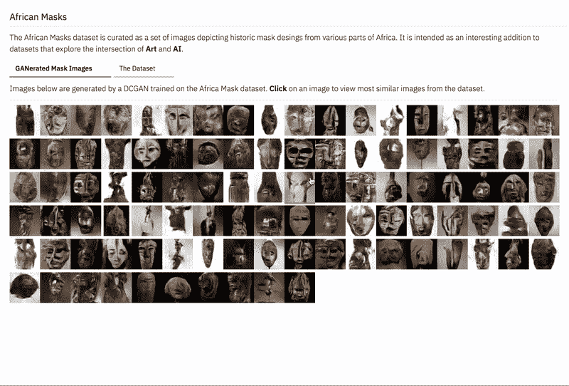

Web [demo interface](https://victordibia.github.io/cocoafrica/#masks) allows you view generated images and most similar from the dataset based on features extracted from a VGG network (block1_pool and block5_pool).

# TPUs 上的张量流

要在 TPUs 上运行 [TensorFlow](https://medium.com/u/b1d410cb9700?source=post_page-----9a6b0cf3105c--------------------------------) 代码，最重要的部分是使用 TPU 版本的设计相当好的[估算器](https://www.tensorflow.org/guide/estimators) API。估计器封装了训练循环的以下方面:训练、评估、预测、服务输出。在很大程度上，使用该 API 编写的 Tensorflow 代码(顺便说一句，keras 模型可以很容易地[转换为估算器 API](https://www.tensorflow.org/api_docs/python/tf/keras/estimator/model_to_estimator))可以通过用 [TPU 估算器](https://www.tensorflow.org/api_docs/python/tf/contrib/tpu/TPUEstimator)替换常规估算器在 TPU 上运行。更好的是，tpuEstimator 将在 CPU 和 GPU 上工作(您应该设置 *use_tpu* 标志)，允许在部署到 TPU 集群之前在本地机器上进行简单的测试。

> TPUEstimator 处理在 TPU 设备上运行的许多细节，比如为每个内核复制输入和模型，以及定期返回主机运行钩子。

幸运的是，我不必从头开始实现 DCGANs，因为 Tensorflow 确实提供了一些[样本代码](https://github.com/tensorflow/tpu/tree/master/models/experimental/dcgan)。然而，该示例支持 32px 图像(cifar 数据集)的生成，我的主要任务是扩展该模型以支持大图像尺寸(64px，128px)，类似于使用 [artDCGAN](https://github.com/robbiebarrat/art-DCGAN) 所做的工作。这主要是通过扩展(增加层)DCGAN 模型中的生成器和鉴别器来实现的。这里最棘手的部分是确保大小的一致性，即确保每一层或功能的输入/输出与预期的形状和大小相匹配。

# 生成对抗网络

GANs 是深度神经网络的一种形式，对于密度估计特别有用。gan 是*生成性的*，因为它们学习一个分布(训练图像数据集)并且能够*生成位于该分布内的*“新颖”样本。它们是*对抗性的*，因为它们被构造为一个游戏，其中两个神经网络(生成器 ***G*** 和鉴别器 ***D*** )竞争——***G***学习生成假图像(通过估计图像数据分布)，而 ***D*** 学习区分真实和假图像(图像来自分布或来自**的概率**

随着游戏的进行， ***G*** 学会创造 ***D*** 无法从真实图像中分辨出来的“令人信服”的图像。期望 ***G*** 学习数据中的所有显著“模式”,并在生成新图像时涵盖所有这些模式。例如，在 Cifar10 数据集上训练的 GAN 应生成所有 10 个类别(汽车、卡车、飞机等)的图像。该研究领域的进展集中在为两个网络寻找良好的自我评估标准(损失函数)、解决几个已知问题的更好的架构(例如，一个网络压倒另一个网络、[无法学习数据分布的所有“模式】](http://aiden.nibali.org/blog/2017-01-18-mode-collapse-gans/))、生成逼真/高分辨率图像等。

对于这个项目，使用无条件 DCGAN[1]或深度卷积 GAN 架构，其架构选择使其在训练期间保持稳定。Tensorflow 提供了使用 TPUs 训练 DCGAN (CIFAR，MNIST)的[示例代码，该代码针对本实验进行了扩展。](https://github.com/tensorflow/tpu/tree/master/models/experimental/dcgan)

# 数据准备和培训

对于这个项目，我使用了非洲面具数据集——一组手动管理的描绘非洲面具的 **~9300** 图像(我仍在管理这个数据集，但计划很快发布)。

> 这个数据集的目标是为探索人工智能和非洲艺术的交集提供额外的资源。

需要注意的一点是，该数据集包含不同“模式”的图像(即许多不同形状、纹理等的遮罩)，而不是像 [CelebA](http://mmlab.ie.cuhk.edu.hk/projects/CelebA.html) 这样定义良好的数据集，它只包含有限变化的人脸。看看 GAN 如何尝试从这个数据集学习模式以及它对这些模式的*解释*将会很有趣。我们的目标不是生成一个完美逼真的面具(这是最近 GAN 作品的一个共同目标)，而是更多地观察编码在生成的 GAN 中的任何创造性或艺术性的元素。

## TPU 培训

对于训练，第一步是*调整*、*裁剪*每张图像，然后转换为 [TFrecords](https://www.tensorflow.org/tutorials/load_data/tf-records) 。用于此的脚本在[项目的 Github repo](https://github.com/victordibia/tpuDCGAN/blob/master/convert_to_tfrecords.py) 中提供。虽然我们不关心无条件 gan 的标签，但是脚本使用目录名作为标签(类似于 torch vision[image folder](https://pytorch.org/docs/stable/torchvision/datasets.html#imagefolder))。

两个版本的 DCGAN 模型被训练以分别生成 64px 和 128px 图像。这包括更改输入函数以反映新的输入大小，然后扩展模型(向 D 和 G 添加层)以匹配 [64px](https://github.com/victordibia/tpuDCGAN/blob/master/dcgan64_model.py) 和 [128px](https://github.com/victordibia/tpuDCGAN/blob/master/dcgan64_model.py) 代。两个模型的其他参数基本相似——训练步数:15k，批量:1024，固定噪声维数:100，学习率:0.0002(对于 D 和 G)。

# 一些有趣的观察

## 64px 与 128px 一代

与 128 像素模式相比，在 64px 模式下生成的图像提供了更好的多样性。虽然 128px 图像的质量明显更高，但它们似乎存在部分模型崩溃的问题。这可能是由于数据集不足以训练如此大的模型(我也为 128px 模型试验了更长的训练时间，但这没有帮助)。

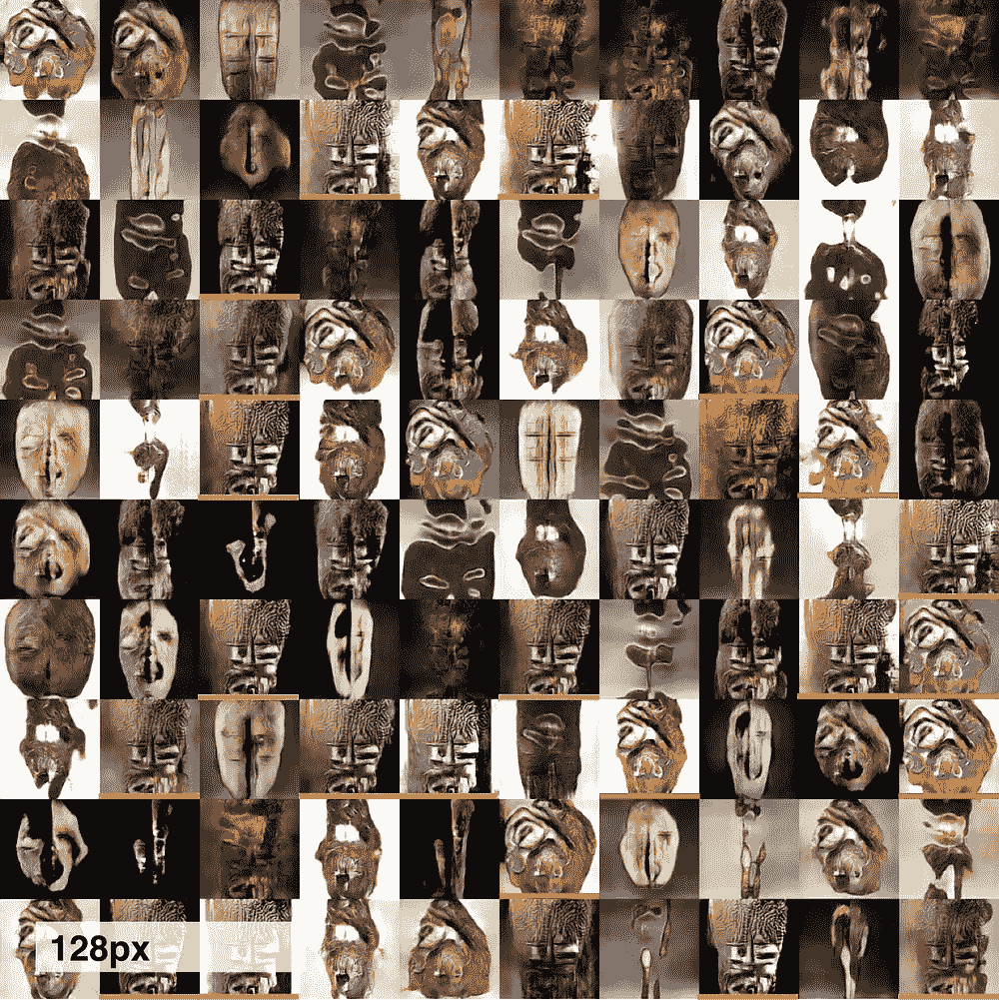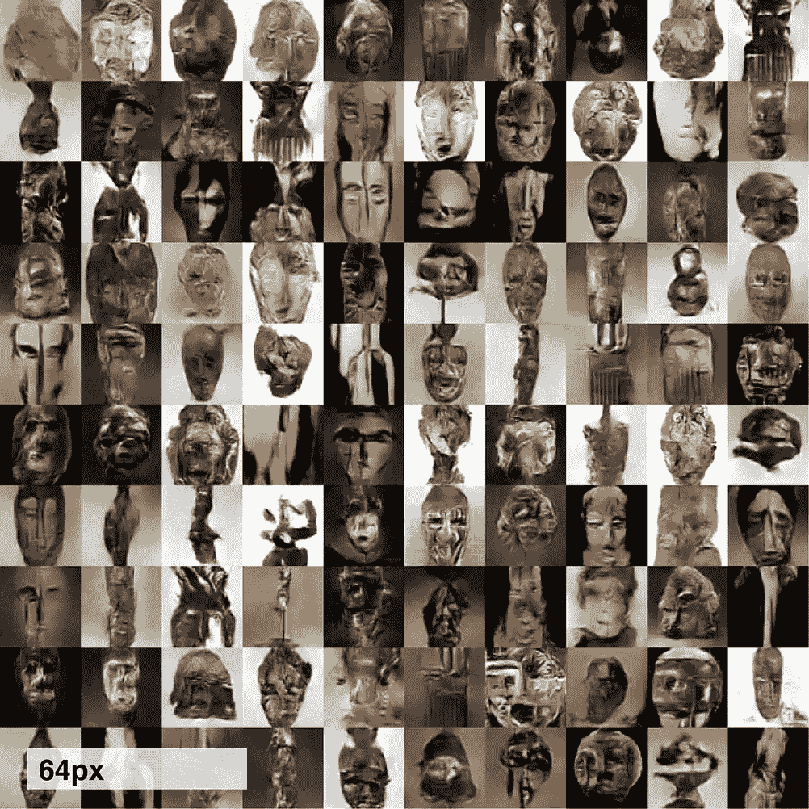

**LEFT:** 128px images generated using a DCGAN, fixed noise vector (dim=100), 15k steps, batch size 1024\. Notice how several “modes” appear to emerge within the generated masks (highlighted with same color). While this may be as a result of the sample size. However this does not occur to the same degree when generating 64px images using similar training parameters. **RIGHT**: 64px images generated using a fixed noise vector (dim=100) 15k steps, batch size 1024\. These results show **more** diversity compared to the 128px images.

## 多少数据才算足够的数据？

我发现在实践中，一个低至 2k -3k 图像的数据集会生成某种形式的“结果”。为了进一步探索数据集大小如何影响生成的结果，我提取了掩膜数据集(3k 图像，64px)的随机样本，并训练了一个模型。这里的主要观察结果是，局部“模式崩溃”(这个问题在[这里](http://aiden.nibali.org/blog/2017-01-18-mode-collapse-gans/)有很好的解释)的发生率更高，并且生成的图像的多样性降低。下面的屏幕截图包含从使用相同参数训练的两个模型生成的图像，但是使用 3k 数据集和完整的 9k 数据集。其他研究项目(见[这里](https://ajolicoeur.wordpress.com/cats/))似乎训练 GANs 在 6k 和 9k 图像之间有不错的结果。到目前为止，我的直觉是，对于具有某种程度相关性的数据集，GAN 能够从大约 6k-9k 图像开始学习有趣的模式。随着我进行更多的实验，我将更新这一部分。

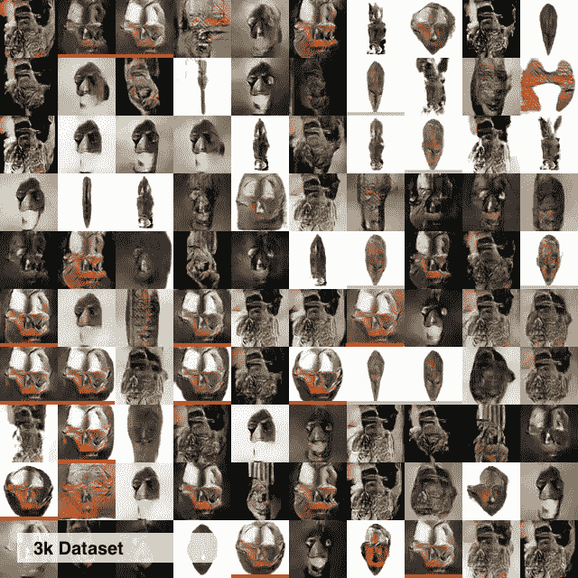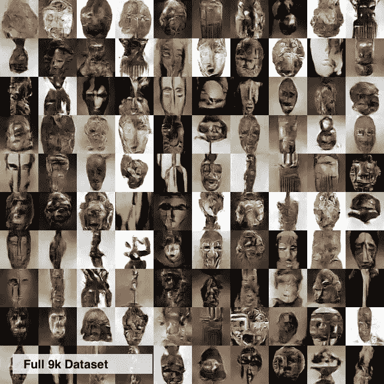

64px images generated with similar models but left uses a 3k dataset and right uses the full 9k images in the dataset. Images generated using the 3k image dataset shows lower diversity with several similar/repeated images (highlighted).

## 有噪声的数据集重要吗？

管理数据集可能很乏味。初始图像搜索结果可能包含不可用的数据(例如，图片的图片、草图、2D 图像、标记为遮罩的无关图像等)。这就提出了一些相关问题——噪声图像的存在如何影响 GAN 产生的图像质量。为了探索这一点，我使用 13k 图像(来自网络搜索的未整理结果)训练了一个模型，并将结果与我手动整理的 9k 图像进行了视觉比较。

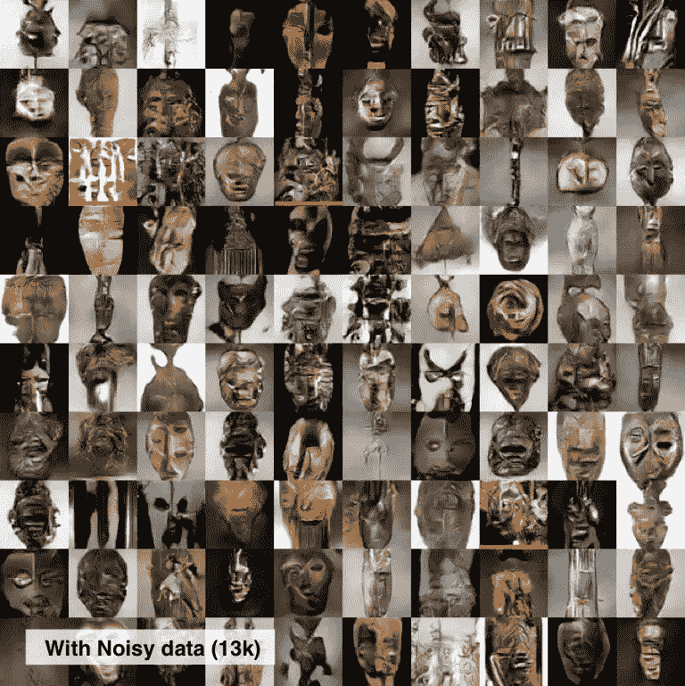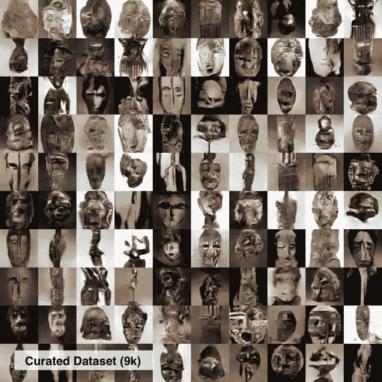

64px images generated with similar models but left uses a 3k dataset and right uses the full 9k images in the dataset. Images generated using the 3k image dataset shows lower diversity with several similar/repeated images (highlighted).

在我的例子中，似乎有额外的图像(大约 3k，整个数据集的 20%)没有被策划，并没有完全阻止生成器探索数据中有趣的模式(左上图)。然而，有一些随机的图像(用红色突出显示)明显没有非洲面具的预期纹理或图案。为了进一步探索这个问题，我收集了 29k 张“茶杯”图片的数据集，并训练了一个模型。下图显示了结果(训练至 25k 步和 32k 步)。虽然有一些看起来特别有趣的图像，但仍然不清楚我们是否会通过管理数据集做得更好。

> 思考:如果你的目标不是“完美”地表示数据集中的模式，那么手工处理图像不会给你带来更多的价值。

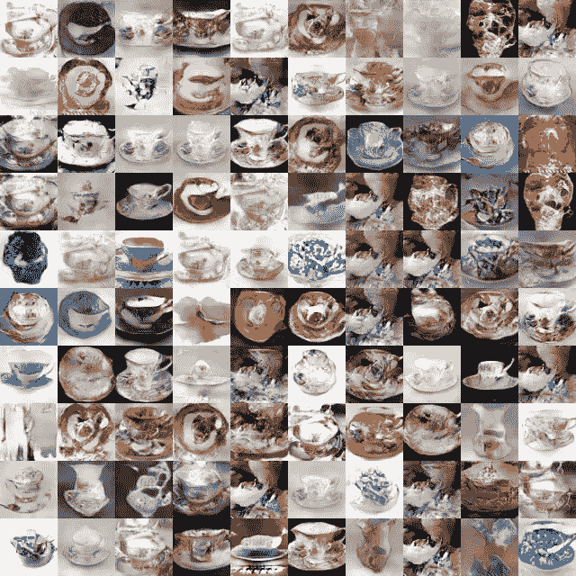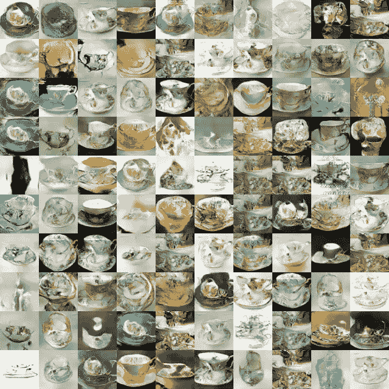

Teacups generated from an “uncurated” dataset (29k) of teacups. **LEFT**: Trained to 25k steps. **RIGHT**: Trained to 32k steps.

## 甘人学到了什么？

这可能是这个实验中最有趣的方面。它聚焦于一个经过充分研究的问题“GAN 实际上学习什么？”，但更多的是从定性的角度。一种方法是观察生成的图像和数据集中的图像之间的相似性。在他们的论文中，Karras 等人[2]使用这些图像之间的像素的 L1 距离来计算这一点。这种方法被批评为过于简单(没有利用任何图像内容的知识)。为了计算相似性，使用预训练的 CNN ( [VGG16](http://<strong> <a href="https://arxiv.org/pdf/1409.1556.pdf">VGG16</a>) ，Simonyan 和 Zisserman 2016)作为特征提取器。然后计算相似性，作为生成的图像和训练数据集中的图像之间的余弦距离的度量。

```
def compute_cosine_distance_matrix(feat, feat_matrix): cosine_dist_matrix = scipy.spatial.distance.cdist( feat_matrix, feat.reshape(1, -1), 'cosine').reshape(-1, 1) return 1 - cosine_dist_matrix
```

我尝试使用 VGG 的各种`maxpool`图层提取特征进行相似性计算，发现早期和后期图层在识别视觉上看起来相似的图像方面表现最佳。我创建了一个[演示](https://victordibia.github.io/cocoafrica/#masks)，它根据 VGG 网络中两个层(早期层和后期层(block5_pool))的特征，显示了每个生成图像的数据集中前 24 个最相似的图像。


An interface that displays images similar to the generated images from the GAN. Similarity is computed as cosine distance of features extracted from layers of a pretrained CNN (VGG). Qualitative inspection suggests using an features from an early layer (block1_pool) finds images with similar low level features (color, pixels, texture), while later layers find images with similar high level features (shapes and and objects) etc. Check out the demo on this here — [https://victordibia.github.io/cocoafrica/#masks](https://victordibia.github.io/cocoafrica/#masks)

初步结果显示，GAN 生成的图像与数据集中它们最近的亲戚非常不同。没有明显的副本。这种解释是主观的，受限于生成图像的模糊性质，鼓励读者[观看演示](https://victordibia.github.io/cocoafrica/#masks)以形成更好的意见。

对生成图像的交互式检查还提供了查看数据集中一些有趣模式的机会。一些包括具有特定侧向取向的面具、具有毛发或毛发状突起的面具、长方形面具。相似性信息也可以是一种(弱监督的)技术，用于管理图像数据集，启用数据集的特定“模式”并发现*异常值*即坏图像。

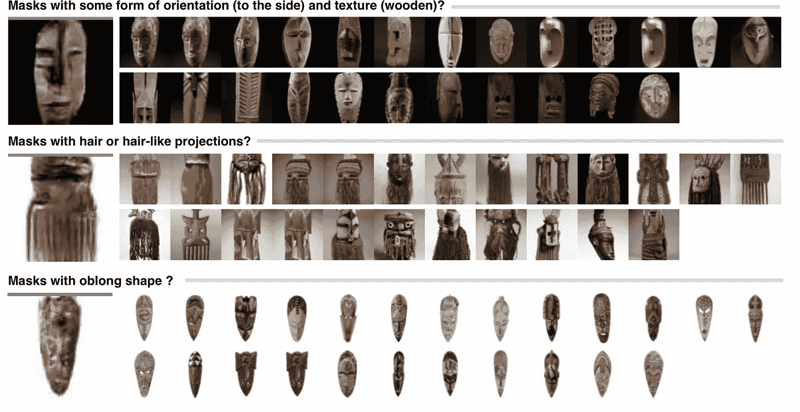

Some of the images generated by the GAN are similar to some observable “modes” within the mask dataset. Some of these modes might reflect artistic style and origins of the masks themselves (yet to be explored).

# 摘要

*   与 TPU 一起工作比我最初想象的要容易。Estimator API 设计得非常好(封装了训练循环)；已阅读并遵循现有评估程序 API 代码。对于已经熟悉估计器(或其他支持标准化训练 NN 训练循环的框架)的个人来说，完成工作将会很容易。
*   在这个项目中，一个麻烦的部分是对我的数据转换脚本(从原始图像到训练中摄取的 TFrecords)进行故障排除。我扩展了示例 DCGAN 代码，它碰巧期望一个形状为**【通道，高度，宽度】**的图像张量，而不是我更习惯的**【高度，宽度，通道】**。这并没有抛出任何错误——只是意味着我运行的前 30 个左右的实验产生了绝对嘈杂的废话。TFrecords 非常优秀有很多原因——然而，如果 Tensorflow 能够更好地标准化这一过程，它将会非常有用(不确定 TF 是否已经有了类似 torchvision [imageFolder](https://pytorch.org/docs/stable/torchvision/datasets.html#imagefolder) 的东西)。

> 提示:为了确保万无一失，要经常检查你的 TFrecords 中进出的东西。

*   组装一个干净的数据集是实际使用 GANs 进行有意义的艺术探索的一个非常重要的部分。这为支持数据集管理的工具提供了一个案例——可能以半监督的方式，我们标记一个小样本，在这个样本上训练一个模型，并使用它来“管理”其余的数据。
*   甘斯可以用于艺术探索。在这种情况下，虽然一些生成的图像不是完整的蒙版，但它们擅长捕捉非洲艺术的*纹理*或*感觉*。例如，我给一位同事看，他们提到生成的图像具有“部落感觉”。
*   GANs 领域的许多现有工作集中于生成“真实”图像。虽然这非常有用(事实上，这是 GANs 等应用程序所希望的，因为[超分辨率](https://arxiv.org/abs/1809.00219))，但了解 ***有多少来自训练数据的*** 信息被合并， ***它们如何被组合*** 以生成新图像，以及这些图像是否真的新颖也很重要。定性*检验*实验(真实世界数据集)可以提供这方面的见解。
*   预训练模型作为这些检查/相似性实验的特征提取器工作良好(与像素中的简单 L1 距离相反 Karras 等人 2017 年[2])。早期的图层允许我们根据线条和纹理等低级特征来检查相似性，而后期的图层则侧重于形状等高级特征。

# 后续步骤

在做这个项目的时候，我确实对 GANs 有所了解；非常感谢谷歌使 TPU 可用。一如既往，未来工作的机会数不胜数。我正在考虑的一些方法包括——扩展非洲面具数据集，用条件化的 GANs 做实验(学到的特征如何与艺术属性相对应？)和其他用于真实/更高分辨率图像生成的架构。

知道下一步该做什么吗？你可以随时联系 Twitter、T2、Github 或 T4 的 Linkedin。

# 参考

[1] A .拉德福德，l .梅斯，s .钦塔拉，“深度卷积生成对抗网络的无监督表示学习”，*arxiv 1511.06434【cs】*，第 1–16 页，2016。

[2] T. Karras、T. Aila、S. Laine 和 J. Lehtinen，“为提高质量、稳定性和变化性而逐步种植 gan”， *CoRR* ，第 abs/1710.1 卷，2017 年 10 月。