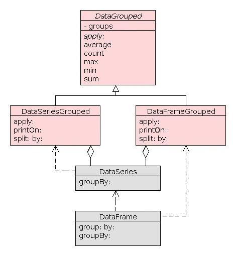

# 聚合和分组

> 原文：<https://towardsdatascience.com/aggregation-and-grouping-66396f26dd95?source=collection_archive---------6----------------------->

## GSoC:在 Pharo 中实现数据框架

这是 Pharo `DataFrame`中聚合和分组的第一个实现。它仅涵盖基本功能，例如按相应大小的另一个系列的值对数据框或系列进行分组，然后将聚合函数应用于分组的数据结构。

在接下来的迭代中，该功能将根据目标用户场景进行扩展。实现也很有可能发展成更加优化的东西。

## 什么是 DataFrame？

数据框是一种类似电子表格的表格数据结构，它提供了一个用于切割、清理和分析数据的 API。在 [Pharo](http://pharo.org/) 中实现数据帧是我今年[谷歌代码之夏](https://summerofcode.withgoogle.com/about/)项目的一部分。您可以在这个库中找到代码:[https://github.com/PolyMathOrg/DataFrame](https://github.com/PolyMathOrg/DataFrame)，并使用下面的 Metacello 脚本将其加载到您的映像中:

```
Metacello new
  baseline: 'DataFrame';
  repository: 'github://PolyMathOrg/DataFrame';
  load.
```

如果您想了解更多关于 DataFrame 项目的信息，请查阅文档并遵循您可以在资源库中找到的教程。文档仍在开发中，所以如果你找不到问题的答案，请随时给我写信:*olk.zaytsev@gmail.com*。

## 拆分-应用-合并

> 分割-应用-组合是一种策略，你把一个大问题分解成可管理的小块，独立地处理每一块，然后把所有的小块组合起来。

数据聚合和分组允许我们为显示或分析创建汇总，例如，在计算平均值或创建计数或总和表时。这是一个遵循分割-应用-组合策略的过程:

1.  根据某些标准将数据分组
2.  将该函数独立应用于每个组
3.  将结果组合成一个数据结构

# 履行

在这一节中，我将解释聚合和分组功能目前是如何实现的。如果您对这些细节不感兴趣，可以跳过这一部分，跳到下一部分。

考虑以下发送到`firstSeries`对象的消息:

```
firstSeries groupBy: secondSeries.
```

收到这个消息后，`firstSeries`创建了一个对象`DataSeriesGrouped`，它根据`secondSeries`的值将`firstSeries`分割成一系列子序列。然后，子系列的集合被存储为`DataSeries`(名为`groups`的实例变量)的对象，其键等于`secondSeries`的唯一值，值存储`firstSeries`的子系列，对应于这些唯一值中的每一个。



当一个`groupBy:`消息的接收者是一个`DataFrame`时，它创建一个`DataFrameGrouped`的实例，该实例以类似于`DataSeriesGroup`的方式分割数据，除了`groups`系列的值是子数据帧，而不是子系列。换句话说，`groups`是一个`DataSeries`，其关键字对应于数据帧分组所依据的系列的唯一值(`secondSeries`)，并且`groups`的每个值存储一个较小的数据帧，该数据帧具有由数字指定的行，其中`secondSeries`的值等于`groups`的对应关键字。如果数据框按其中一列进行分组，则在分组之前，该列将从数据框中排除。这样我们避免了数据重复，因为相同的值将作为`groups`变量的关键字存储。

在`DataSeriesGrouped`的情况下，每个子序列将被聚合成一个标量，所有这些标量将被组合成一个新的`DataSeries`。至于`DataFrameGrouped`，它会将块应用于每个子数据帧的每一列，并将结果标量矩阵作为新的`DataFrame`返回。

聚合是通过`apply:`消息完成的。它将一个块作为参数，并将其应用于 groups 系列的每个值，并将结果组合成一个新的数据结构。对于一些常用的聚合函数，如`max`、`min`、`average`等。，`DataGrouped`提供更短的消息。在这个迭代中，所有这些消息都只是方便的快捷方式

```
average
   ^ self apply: [ :each | each average ].
```

但是在将来，这些消息将包含相应聚合的优化实现，因为这些函数的时间和内存效率非常重要。

# 用法示例

在这一节中，我将提供一些简单的示例，例如按另一个系列的值对一个系列进行分组，按一个系列的值对一个数据框进行分组，最后我将展示如何将聚合函数应用于分组后的数据。

## 餐馆小费数据集

我将把我的例子建立在餐馆小费的数据集上。它最初出现在 Bryant & Smith 1995 年关于商业统计的文章中。您可以在这个 GitHub 资源库中获得一个带有 tipping 数据集的 CSV 文件:[https://GitHub . com/wesm/pydata-book/blob/master/ch08/tips . CSV](https://github.com/wesm/pydata-book/blob/master/ch08/tips.csv)。

让我们使用`fromCSV:`方法将数据读入`DataFrame`

```
tips := DataFrame fromCSV: '/path/to/tips.csv'.
```

快速了解存储在数据框中的数据集的最简单的方法是查看其标题-前 5 行(`tips head`)

```
 |  total_bill  tip    sex     smoker  day  time    size
--+------------------------------------------------------
1 |  16.99       1.01   Female  No      Sun  Dinner  2
2 |  10.34       1.66   Male    No      Sun  Dinner  3
3 |  21.01       3.5    Male    No      Sun  Dinner  3
4 |  23.68       3.31   Male    No      Sun  Dinner  2
5 |  24.59       3.61   Female  No      Sun  Dinner  4
```

我们可以看到，tipping 数据集有 2 个定量变量:`total_bill`和`tip`，5 个分类变量:`sex`、`smoker`、`day`、`time`和`size`。在下面提供的例子中，我们将只根据分类变量对数据结构进行分组。从技术上来说，也可以通过数量变量进行分组，但在大多数情况下，这种分组不是很有用(更不用说它在教程中看起来不太好)。

## 分组系列

应用`groupBy`操作符的最简单的例子是将一个系列的值按照另一个相同大小的值进行分组。

```
bill := tips column: #total_bill.
sex := tips column: #sex.bill groupBy: sex.
```

这个查询的结果将是一个对象`DataSeriesGrouped`，它将`bill`分成两个系列，映射到`sex`系列的`‘Male’`和`‘Female’`值。

```
Female  (16.99 24.59 35.26 14.83 ... 18.78)
Male    (10.34 21.01 23.68 25.29 ... 17.82)
```

由于大多数情况下我们需要对属于单个数据框的两列序列进行分组，因此有一个方便的快捷方式:

```
tips group: #total_bill by: #sex.
```

## 分组数据框

除了上面演示的对其列进行分组的快捷方式之外，`DataFrame`还提供了一种通过其中一列对自身进行分组的方法。

```
tips groupBy: #smoker
```

该查询的结果将是一个对象`DataFrameGrouped`，存储两个独立的数据帧——一个针对所有吸烟者，一个针对非吸烟者。`smoker`列将从这些数据框中排除，因为它的值将作为键存储在`DataFrameGrouped`对象中，吸烟者和非吸烟者的单独分组将允许我们在需要时完全重建`smoker`列。

## 聚集分组数据

聚合函数将一个序列作为输入，并返回一个汇总该序列值的标量值。这些是统计函数:`min`、`max`、`average`、`stdev`等。，像`sum`、`count`等很多功能。

一旦数据被分组，我们就可以对组成的组应用聚合函数，并接收汇总初始数据的组合数据结构

```
grouped := tips group: #total_bill by: #day.
grouped apply: [ :each | each average round: 2].
```

因为我们是按照另一列对`DataFrame`的一列进行分组，所以结果将是一个`DataSeries`的对象

```
a DataSeries
Sun   21.41
Sat   20.44
Thur  17.68
Fri   17.15
```

如前所述，`DataGrouped`提供了一些常用聚合函数的快捷方式，如`min`、`max`、`average`、`sum`、`count`等。目前它们只是快捷方式，但以后它们将实现应用速度更快的优化聚合(对于像 *tipping* 这样的小数据集，速度不是一个严重的问题)

```
grouped min.
grouped max.
grouped average.
```

一旦数据帧被分组到一个对象`DataFrameGrouped`中，我们也可以对这个对象应用一个聚合函数。DataFrameGrouped 实现 apply:消息的方式是将函数应用于每个子数据帧的每一列，从而产生标量值。这些标量然后被组合成一个新的数据帧。

```
(tips groupBy: #sex) count.
```

此查询的结果将是一个数据框，其中包含每一列的非空单元格的数量，对应于“男性”和“女性”行

```
 | total_bill  tip  smoker  day  time  size
-------+-----------------------------------------
Female | 87          87   87      87   87    87
Male   | 157         157  157     157  157   157
```

# 资源

1.  McKinney Wes，用于数据分析的 Python，O'Reilly Media，Inc .，2012 年
2.  哈德利·威克姆(2011)。数据分析的分离-应用-组合策略。统计软件杂志，40(1)，1–29。网址 http://www.jstatsoft.org/v40/i01/。
3.  [https://pandas.pydata.org/pandas-docs/stable/groupby.html](https://pandas.pydata.org/pandas-docs/stable/groupby.html)
4.  [https://www . PostgreSQL . org/docs/9.5/static/tutorial-agg . html](https://www.postgresql.org/docs/9.5/static/tutorial-agg.html)
5.  [https://github . com/wesm/pydata-book/blob/master/ch08/tips . CSV](https://github.com/wesm/pydata-book/blob/master/ch08/tips.csv)