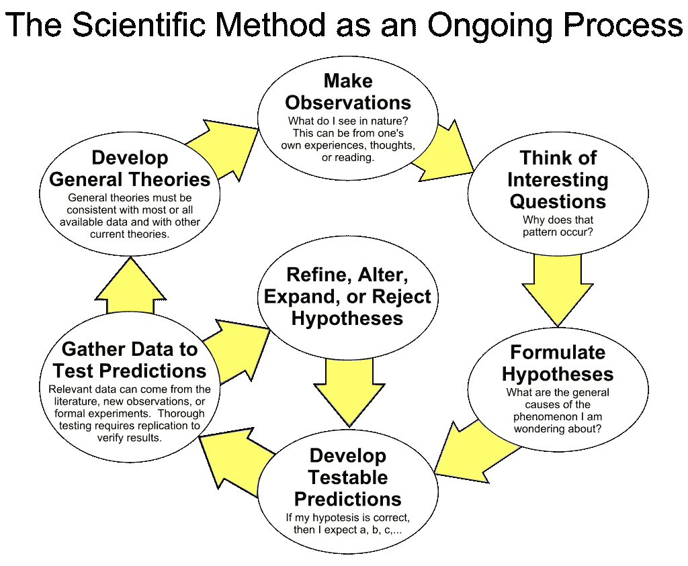

# 敏捷数据科学——反思

> 原文：<https://towardsdatascience.com/agile-data-science-rethink-d57c4d70f382?source=collection_archive---------30----------------------->

## 重新审视数据科学团队内部的敏捷实践

Agile to Success within Data Science

如今，敏捷在软件开发中变得非常有名。数据科学是另一个趋势学科，越来越多的公司试图建立并从中受益。

Scrum as 方法论试图以小增量的方式帮助构建一个好的软件。将敏捷软件方法应用于数据科学的尝试很多，但结果大多不尽如人意。

基于我的经验、阅读和最近参加麦吉尔大学的 SCRUM 培训，我试图讨论:

*   为什么敏捷的 scrum 框架不适合数据科学项目
*   遵循数据科学原则的敏捷**概念**
*   来自框架的**改编**
*   数据产品环境中的最小可行产品

# 为什么敏捷过程(特别是 Scrum)不适用于数据科学？

敏捷软件的目标是交付*生产软件*，而数据科学则是提供**可操作的见解**。

为了提供可操作的见解，作为数据科学家，我们需要根据假设进行**迭代实验**，这是由上次实验产生的不确定性结果，而工程使用**已知的科学和工程技术**来构建线性时间表。

因此，在数据科学项目中，我们通常在发现上比在工程上花费更多的时间，并且由于科学/数据的性质，花费的时间总是不确定的。

# 敏捷概念仍然适用于数据科学项目

敏捷软件开发的好处:迭代/增量，*可交付的*产品，持续的重新评估(客户/开发)。

《敏捷数据科学 2.0》的作者 Russell Jurney 简短地说:

> *敏捷数据科学流程的目标是记录、促进和指导探索性数据分析，以发现并遵循通往引人注目的分析产品的关键路径。*

在此，我尝试对数据科学学科的敏捷宣言做一个分析:

*   **个人和互动**流程和工具:**分享**是强制性的，因为团队是由不同的学科(DS、DE、Business)组成的，我们需要在团队内部以及与客户之间进行有效的沟通。
*   **工作软件**综合文档:全栈数据科学家应该能够同时创建并交付**概念验证应用**以发布见解并收集反馈。
*   **客户协作**合同谈判:作为数据科学团队，我们需要**定期和频繁地**沟通，在整个项目过程中与客户讨论发现，而不是交付一次就有好的结果。因此问题是`How can we make the intermediate discovery understandable by customers?`。
*   **根据计划应对变化**:这已经在数据科学中发生，随着我们进一步揭示数据本身，进一步分析的计划将在试错的基础上相应地改变。

在分析了敏捷宣言之后，事实上数据科学可以让敏捷的概念受益:

> 为了在不确定和动荡的环境中取得成功，创造和应对变化的能力。

# 打破规则并适应

数据科学项目有可能继承敏捷软件开发。我们需要勇敢地打破规则来解决第一部分的问题。

总的来说，我们应该牢记敏捷的概念(迭代、增量和持续)，由于研究的不确定性，我们无法将这些直接转化为**时间约束**冲刺和**基于点的**任务。

但是，由于不确定性，数据准备是唯一的例外。因此，我们应该将数据准备部分从 SCRUM sprint 中分离出来，特别是我们知道我们非常依赖其他资源或者数据非常脏，并且预处理可能涉及团队外部的交互。

然后，Scrum 方法论应该作为管理数据科学项目的项目管理框架。实际上:

*   Sprint:一个灵活的 2-4 周的时间盒，当我们应该重新排序时，根据最新的发现重新安排未来的优先次序。
*   冲刺规划:我们评估已知的数据发现，并在需要时对冲刺级规划进行适当的更改(例如切换方法、调整完成的预计时间、更改范围等)。
*   每日 Scrum(站立):我们应该分享团队基于数据的最新发现的知识，并利用这些时间对短期任务进行快速调整(如切换数据源、请求领域知识专家、更改算法等)。
*   冲刺评审:我们应该在与团队一起进行项目期间放弃评审，除非我们达到了某个里程碑。我们使用评估来展示业务/产品并与之同步，但仅限于领导层。
*   冲刺回顾:我们应该在项目期间放弃回顾，除了当我们完成项目的时候。

# 最小可行产品(MVP)

敏捷还有一个 MVP 的概念。那么什么是数据科学项目环境中的 MVP 呢？

看情况。在团队内部，MVP 可以作为第一次尝试的**基线**模型，或者在`jupyter notebook`或`rmarkdown notebook`中展示的见解。但是对于业务或工程，它应该是一个**的中等性能**模型，能够工作并提供可接受的结果(例如，推荐系统应该提供不会损害最终用户体验的推荐)，或者显示在仪表板中的洞察力需要与业务保持一致。

*原载于 2018 年 12 月 31 日*[*https://Ricky king . github . io*](https://rickyking.github.io/2018/12/Agile-Data-Science/)*。*