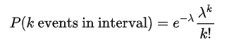
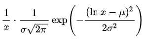
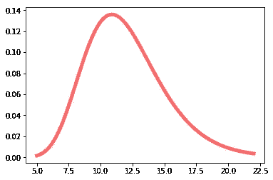
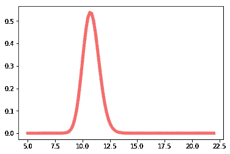

# 敏捷评估:第二部分

> 原文：<https://towardsdatascience.com/agile-estimation-part-ii-80bba09b9fc1?source=collection_archive---------13----------------------->

在我的[前一个笔记本](https://medium.com/@michaellarionov/using-statistics-in-agile-estimation-ead56236de64)中，我建议使用泊松分布来估计每次迭代的故事点数，即项目速度。这是一个相当简单的分布，它有一个突出的性质:泊松分布的随机变量之和的分布也遵循泊松分布，其中一个参数是各个参数之和。这意味着项目速度是单个开发人员速度的总和，就像你直觉上假设的那样！

但是，泊松分布存在问题。如果你看它的 PDF，



PMF of Poisson Distribution

你看，它只有一个参数 **λ** 。而且方差也是 **λ** ，等于均值。这就产生了一个问题，我如何区分好的估计量和差的估计量。例如，如果我使用随机数量的故事点来估计每个用户故事，最终我将得到与一个人相同的方差，这个人的估计是准确的。

另一个问题是泊松分布假设故事点的持续时间服从指数分布，其众数为 0。所以这意味着一个用户故事很可能需要 0 小时来完成？我相信项目经理听到这个会很高兴的。

但是，如果您从估计每个故事点的持续时间开始，您将不得不选择一个众数大于零的分布。我曾经使用正态分布来估计一个故事点的持续时间，但是我注意到，对于一些开发人员来说，方差是如此之高，以至于左边的尾巴将会进入负的区域(任务将会花费负的时间来完成！).所以我必须选择一个支持 x∈[0，∞]的分布。

我可以选择一个非常流行的伽马分布，但是更好的选择是[对数正态分布](https://en.wikipedia.org/wiki/Log-normal_distribution)。



PDF of log-normal distribution

这种分布的最佳特性是逆分布也是对数正态分布，具有相同的参数 **σ** 和反向参数**μ**。这意味着，如果故事持续时间是对数正态分布，那么项目速度也是对数正态分布！

我们将使用与上一个笔记本中相同的示例

```
**import** **numpy** **as** **np**
**from** **scipy.stats** **import** lognorm
data=np.array([14, 12,  7, 14, 13])
shape, loc, scale = lognorm.fit(data, floc=0)
fitted = lognorm(shape, loc, scale)
print(f'Mean: {fitted.mean()}')
print(f'Standard deviation {fitted.std()}')
print(f'95**% c**onfidence: {fitted.ppf(0.05)}')Mean: 12.046405137951629
Standard deviation 3.195066701596986
95% confidence: 7.582961342994959*#Let's plot it*
%**matplotlib** inline
**import** **matplotlib.pyplot** **as** **plt**
**def** plot_dist(frozen):
    fig, ax = plt.subplots(1, 1)
    x = np.linspace(5, 22, 100)
    ax.plot(x, frozen.pdf(x), 'r-', lw=5, alpha=0.6, label='lognorm pdf')
plot_dist(fitted);
```



所以答案接近泊松分布给出的答案。让我们试着找另一个团队，他们可能有更低的速度，但是更可靠的估计:

```
data=np.array([10, 11,  12, 10, 11])
shape, loc, scale = lognorm.fit(data, floc=0)
fitted = lognorm(shape, loc, scale)
print(f'Mean: {fitted.mean()}')
print(f'Standard deviation {fitted.std()}')
print(f'95**% c**onfidence: {fitted.ppf(0.05)}')Mean: 10.799871930716652
Standard deviation 0.7427443647589952
95% confidence: 9.62328932436764plot_dist(fitted);
```



我们看到，即使这个团队的速度低于第一个团队，如果经理要求你有 95%的信心，你可以选择第二个团队，因为它可以在迭代中可靠地完成更多的故事点。

这里可以找到笔记本[。](https://github.com/mlarionov/machine_learning_POC/blob/master/agile_estimation/agile_estimation_2.ipynb)