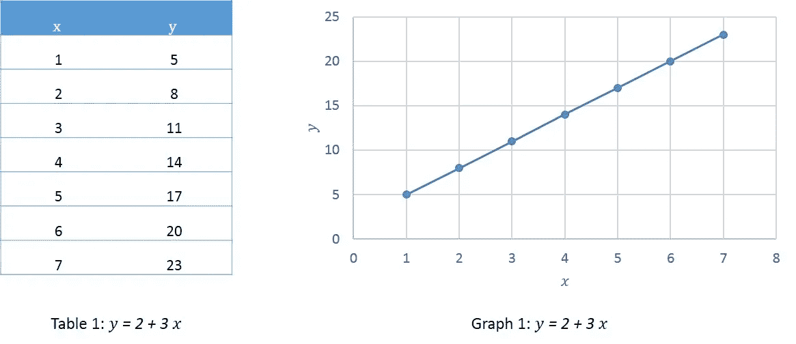
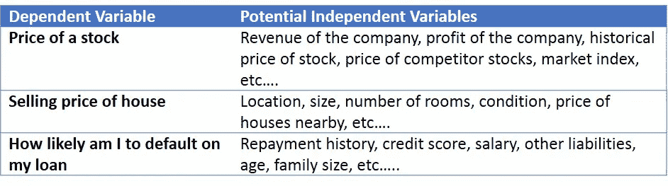

# AI 101:揭开预测数据分析的神秘面纱

> 原文：<https://towardsdatascience.com/ai-101-demystifying-predictive-data-analytics-c4ecc50f6662?source=collection_archive---------12----------------------->

除非你在过去几年一直生活在岩石下，否则你很有可能会经常遇到预测分析。这是每个人都在谈论的水晶球。虽然谈话中充斥着老生常谈，但当有人稍微深入一点，迫使一个人后退时，这可能会有点令人生畏。即使不是每个人都可以成为数据科学家，了解数据分析领域的关键概念是如何工作的也很重要，只要能够确保我们能够利用它们来满足我们的个人或业务目标。相信我的话，没那么复杂！

## **什么是预测分析？**

简单来说就是利用历史数据来预测一个未来状态的过程。这种未来状态可能指的是趋势之类的东西(“某只股票可能会走向哪里？”)和行为属性(“特定客户可能会购买什么？”).换句话说，预测分析是用来预测在给定环境下可能发生的事情。

## **“预测”是如何工作的？**

预测分析的基础是可以对大多数事物进行“建模”的想法。这种想法的基础是假设数据参数之间存在因果关系，即当一些数据参数改变时(原因)，其他数据参数也会相应改变(效果)。

让我们回到一些基础数学来进一步理解这一点。你会回想起自变量和因变量函数的使用。在上面的陈述中,“原因”是自变量,“结果”是因变量。最简单的形式是:

我们举个简单的例子，说我们的函数是: ***y = 2 + 3 x***

所以对于每一个 *x* 的值，我们都会有一个由函数定义的对应的值 *y* 。

有了上面的信息，当 *x* 的值改变时，很容易“预测”y*y**的未来值——我们的简单函数类似于预测模型！*

## ***让我们介绍一些复杂性***

*底线是，所有的预测模型本质上都是一个类似于上图的函数。然而，并不是所有的功能都如此简单。复杂之处在于函数本身。实际上，我们的预测模型的功能更可能是这样的:*

**

*上面的函数说明了什么？我们的因变量(即 *y* )基于多个自变量(即 *a、b、c、d、e、…* )。*

*让我们举一些使用案例来让这更真实一点:*

**

*上述所有例子中的共同线索——实际上是所有预测建模问题陈述中的共同线索——是通过因变量和多个自变量之间的函数建立因果关系。*

## ***预测的类型***

*虽然预测函数中的变量可以有多种形式，但了解这三大类别对于理解预测分析的可能性是很有用的。让我们以贷款违约为例来理解可以做出的不同类型的预测:*

*   ***预测非量化结果**:客户会违约吗(是/否)？*
*   ***预测发生的可能性**:客户违约的概率有多大？*
*   ***预测有形价值**:客户违约的实际金额是多少？*

*再次，冒着重复我自己的风险，以上三个问题都可以通过不同类型的函数来回答，因变量随着预测的类型而变化。*

## ***简单介绍一下预测建模方法***

*正如我上面所说的，任何预测模型的核心是识别与自变量和因变量相关的函数。这样做的过程、方法、途径就是专家介入的地方。这些功能通常非常复杂，需要统计和数据科学方面的复杂知识。*

*无需深入建模技术的所有细节，了解另一个方面是很有用的——预测分析技术分为两大类:*

*   ***回归技术**:回归模型的重点是尝试使用不同的方法建立因变量和自变量之间的函数，然后使用该函数预测值。*
*   ***机器学习技术** : ML 技术用在钉住底层数学方程或函数非常复杂的地方。相反，机器被用来查看大型数据集(训练数据)，并使用它们来预测值。基本的螺母和螺栓保持不变(即，机器确实为自己创建了某种函数，即使是模糊的)，只是它不太适合函数方程。*

*预测分析如今无处不在，企业正利用它来销售更多产品、制造更好的产品、降低风险、了解客户行为等。我们更有效、更准确地做这件事的能力在不断提高，尽管基本前提没有改变。*